# Docker for Starter
## 서비스 정의


- input에 입력하면 list에서 확인할 수 있는 서비스
## 스펙
- `back`: Python 언어로 된 Flask 프레임워크

	(front와 REST-API로 데이터 주고받기)

- `front`: Svelte로 작성 + build 결과물을 Node.js의 http-server에 올림

	(html, css, js 파일을 브라우저에서 사이트로 볼 수 있도록 웹 서버 돌리기)

- `db`: MySQL
## 개발
- 개발용 컴퓨터에서 개발, 테스트 → 서버용 컴퓨터에 배포

	

- 개발용/서버용 컴퓨터 모두 어플리케이션을 돌릴 수 있는 환경이 필요
- 즉, 동일한 버전의 node.js, python, mysql이 두 컴퓨터에 깔려 있어야 함

	

## 하나의 컴퓨터에 여러 어플리케이션을 개발하는 경우
- 예를 들어, 여러 버전의 node.js가 깔린 경우, 관리가 번거로움
## 위 문제에 대한 해결책
### 🧩 VM = 가상 환경? 


- OS 안에 또 다른 OS를 설치해서 여러 개의 서비스를 개발하는 방식

	⇒ 집 안에 집을 또 짓는 것과 같음

	

	⇒ 하지만 컴퓨터 자원/OS 기능들이 한정적이므로 성능 면에서 불리

	

### 🧩 도커 컨테이너 활용
- 집 안에 업무 공간으로 활용할 수 있는 컨테이너가 들어가는 것과 같음
- `다수 + 1컨테이너`를 함께 사용하거나 or `1인 + 1컨테이너`들이 서로 연결될 수도 있음
- 필요한 공간만 차지하므로 컴퓨터 자원 낭비가 적고, 공간이 확실히 분리되어 버전 충돌 혼란이 적음

	

## 기존 방식의 또 다른 문제: 서버 배포
- 여러 근무자들이 함께하는 복잡한 서버일수록 서버환경 = 개발환경을 동일하게 맞추는 게 번거로움

	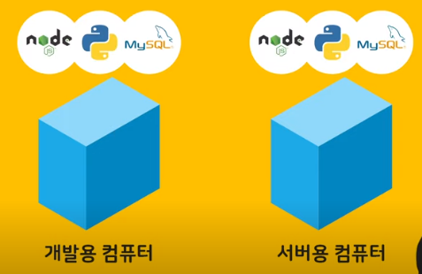

	⇒ 도커 컨테이너로 해결

- 개발자는 각 컨테이너들이 어떻게 설계/설치/서로 연결/업무를 수행할지 설계도에 명시해 놓을 수 있음
- 작성한 설계도만 보내면 동일한 개발환경 구성 가능

	

## 실습
- Docker 데스크탑 설치
- shell에서 버전 확인
	```javascript
	auswo@DESKTOP-LBOABJ3 MINGW64 /bin
	$ docker -v
	Docker version 19.03.5, build 633a0ea
	```

- 필요한 소프트웨어

	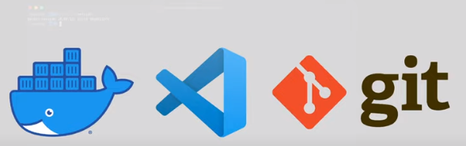

- git 리포지토리 clone
	```javascript
	git clone https://gitlab.com/yalco/practice-docker.git
	```

- front: build 결과물은 /public/build에 들어 있음
	- node.js로 돌아가는 http-server 프로그램으로 웹 서버 실행, 이 파일을 웹사이트에 띄울 예정

	> 💡 node.js
	>
	> - 브라우저가 아닌 내 컴퓨터에서 자바스크립트를 사용할 수 있게 해 줌

	- 현재는 node.js 가 설치되어 있지 않다고 가정(해당 상태에서 http-server, 자바스크립트 코드 실행 불가)
### 내 컴퓨터에서 node.js를 깔지 않고 자바스크립트를 실행하는 방법
- 터미널에 입력
	```javascript
	PS C:\Users\auswo\Downloads\test\docker-for-starter> docker run -it node // permission 오류 시 앞에 sudo 붙이기
	```

- 오류: [issue](https://github.com/abarthdew/docker-run/issues/1) 참고
- node.js가 컴퓨터에 깔린 것처럼 입력 콘솔이 나타남
	```javascript
	PS C:\Users\auswo\Downloads\test\docker-for-starter> docker run -it node
	Unable to find image 'node:latest' locally
	latest: Pulling from library/node
	d52e4f012db1: Pull complete
	7dd206bea61f: Pull complete
	2320f9be4a9c: Pull complete
	6e5565e0ba8d: Pull complete
	5f1526a28cf9: Pull complete
	b9c7405b482f: Pull complete
	9db0bc99587b: Pull complete
	8e1c8c1907a5: Pull complete
	Digest: sha256:b3ca7d32f0c12291df6e45a914d4ee60011a3fce4a978df5e609e356a4a2cb88
	Status: Downloaded newer image for node:latest
	Welcome to Node.js v20.4.0.
	Type ".help" for more information.
	> console.log("hello world!") // 자바스크립트 코드 실행 가능
	hello world!
	undefined
	> // 입력 콘솔
	```

	- 이 node.js 환경은 DockerHub에서 이미지로 존재
- 도커 이미지: 리눅스 컴퓨터의 특정 상태를 캡쳐해서 박제해놓은 것

	

	⇒ node 이미지: 리눅스에 node.js가 설치된 상태를 그대로 급속 냉동해서 클라우드에 올려놓은 것

- 도커는 이미지를 내 컴퓨터에서 찾아본 뒤, 없으면 Docker Hub로부터 해당 이름으로 등록된 이미지를 다운받음
- `run`: 이미지를 내 컴퓨터에서 해동, 컨테이너로 만드는 명령어
	- 한 번 받은 이미지로 몇 개든 컨테이너 생성 가능
	- 즉, 이미지: 컨테이너를 찍어내는 틀 또는 조립 키트
- `-it`: 해당 컨테이너를 연 다음 그 환경 안에서 CLI를 사용
	- 컨테이너를 만든 다음, 그 안에 있는 근무자와 컨테이너 창문으로 대화를 하겠다는 뜻 ⇒ `위 node 예제에서` 자바스크립트 콘솔을 사용할 수 있는 이유
	- 해당 이미지는 컨테이너가 만들어져 설치되면, 바로 node 명령어가 실행되도록 설계됨 ⇒ 컨테이너가 만들어지자 마자,  \> 입력창이 뜨는 이유
### 도커 이미지 상태 살펴보기
- `docker images`
	```shell
	PS C:\Users\auswo\Downloads\test\docker-for-starter> docker images
	REPOSITORY   TAG       IMAGE ID       CREATED      SIZE 
	node         latest    b098c9ebef91   8 days ago   1.1GB
	```

	- node라는 이미지가 다운 받아 진 것을 확인할 수 있음
	- 이때, `docker run -it node` 를 실행하면, 이미지를 새로 받을 필요 없이 바로 콘솔이 실행됨
- `docker ps`
	```shell
	PS C:\Users\auswo\Downloads\test\docker-for-starter> docker ps
	CONTAINER ID   IMAGE     COMMAND                  CREATED          STATUS          PORTS     NAMES
	0ced7dcabd9b   node      "docker-entrypoint.s…"   14 minutes ago   Up 14 minutes             hopeful_kilby
	```

	- CONTAINER ID: 컨테이너 고유 아이디
	- CREATED, STATUS: 생성해서, 얼마나 일을 하고 있는가
	- NAMES: 임의로 지어진 컨테이너 이름
- `docker exec -it hopeful_kilby bash`
	```shell
	PS C:\Users\auswo\Downloads\test\docker-for-starter> docker exec -it hopeful_kilby bash
	root@0ced7dcabd9b:/#
	```

	- 해당 컨테이너 내에서 bash shell을 실행

		⇒ windows 에서 powershell로 CLI 명령어를 입력할 수 있듯이, 맥이나 리눅스 등에는 bash shell이 있음

		

		⇒ 컨테이너 내부를 통해 가상의 리눅스 환경으로 들어간 것

		```shell
		root@0ced7dcabd9b:/# ls
		# 리눅스 환경의 기본 디렉토리 확인 가능
		bin   dev  home  lib32  libx32  mnt  proc  run   srv  tmp  var
		boot  etc  lib   lib64  media   opt  root  sbin  sys  usr
		```

		⇒ 컨테이너마다 각각 이 파일 시스템과 네트워크가 있음

	> 💡 주의: 컨테이너 안에 리눅스가 전부 들어있는 것은 아님
	>
	> 
	>
	> - 이 리눅스 환경은 도커 데스크탑 프로그램으로 구현되고 있음
	> - 어떤 OS에서 도커를 돌리든, 도커의 컨테이너들은 리눅스 가상환경의 형태로 돌아감

- `ctrl + c`: node 컨테이너 종료
	```shell
	(To exit, press Ctrl+C again or Ctrl+D or type .exit)
	>
	PS C:\WINDOWS\system32> ^C
	```

	- 컨테이너 안의 node.js와 회의를 끝마치는 것
- `docker ps`는 현재 작업중인 컨테이너만 표시됨
	```shell
	# 컨테이너 조회 -> 없음
	PS C:\WINDOWS\system32> docker ps
	CONTAINER ID   IMAGE     COMMAND   CREATED   STATUS    PORTS     NAMES
	```

- `docker ps -a`: 모든 컨테이너 표시
	```shell
	PS C:\WINDOWS\system32> docker ps -a
	CONTAINER ID   IMAGE     COMMAND                  CREATED          STATUS                          PORTS     NAMES
	0ced7dcabd9b   node      "docker-entrypoint.s…"   25 minutes ago   Exited (0) About a minute ago             hopeful_kilby
	```

	- 작업 중이 아닌, 중지되어 있는 컨테이너도 표시

		⇒ 모두 Docker에 의해 관리되는 사항들임

- `docker stop $(docker ps -aq)`
- `docker system prune -a`
	```shell
	PS C:\WINDOWS\system32> docker stop $(docker ps -aq)
	0ced7dcabd9b
	PS C:\WINDOWS\system32> docker system prune -a
	WARNING! This will remove:
	  - all stopped containers
	  - all networks not used by at least one container
	  - all images without at least one container associated to them
	  - all build cache

	Are you sure you want to continue? [y/N] y
	Deleted Containers:
	0ced7dcabd9bbf22b76844cf498dcd4e0dbf057aacf0efa4615c491ce620b408

	Deleted Images:
	untagged: node:latest
	untagged: node@sha256:b3ca7d32f0c12291df6e45a914d4ee60011a3fce4a978df5e609e356a4a2cb88
	deleted: sha256:b098c9ebef91eecac0c61865ac2f8fc639a6dc91662be1a8000ebdaa510ec836
	deleted: sha256:e8840ab92bc1be371c69f8ee95d93ecb651af8207a5d121b3b5755e0f32780e5
	deleted: sha256:0b913c268a7df316cfceadd048c5211a8e6f162f268de0fa2866cf60730b2242
	deleted: sha256:f135101824f8568c43b8b7f3e3af3a6a1ccbb35d2cb40f901c8b03de41721141
	deleted: sha256:c3767412dc7a4b61d34c21949c7b277c007d7ee979170ae088b30604b394916d
	deleted: sha256:47be7118de812a5e4dd0c80738586f76c4171587359b70e862b1760e93d0b18b
	deleted: sha256:b80181f01d740ba89ac4b6ce18ec3ef3f374f14d972c2f874813c33990687e22
	deleted: sha256:8faba640c5ba02612700e22f88797a571828443075845780f431d956aa72c456
	deleted: sha256:61581d479298c795fa3cfe95419a5cec510085ec0d040306f69e491a598e7707

	Total reclaimed space: 1.095GB
	PS C:\WINDOWS\system32> docker ps -a
	CONTAINER ID   IMAGE     COMMAND   CREATED   STATUS    PORTS     NAMES
	```

	- 도커 컨테이너 일괄 정지 및 삭제
## 실제 사용
- 컨테이너를 생성한 다음, 그 안의 근로자에게, 창문을 통해서, 할 일들을 구두로 알려주는 것 만으로는 복잡한 작업이 어려움

	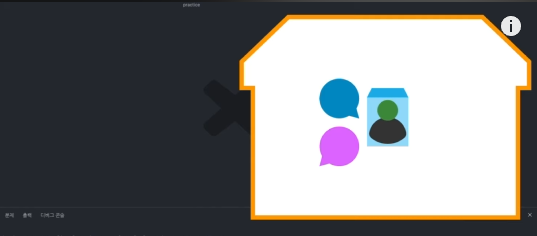

- 보다 섬세한 컨테이너 활용을 위해, `Dockerfile`이 사용됨

	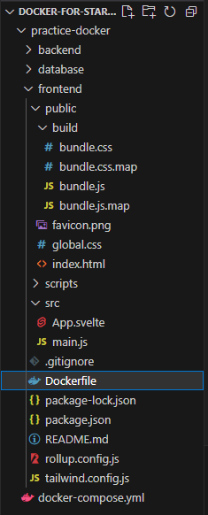

	- front, back, db 디렉토리 모두 `Dockerfile` 하나 씩 가지고 있음
- Dockerfile: 나만의 이미지를 만들기 위한 설계도
- node 이미지가 이미 있는데 왜 나만의 이미지를 만듦?

	⇒ 컴퓨터에서 http-server 프로그램을 돌리려면 node.js 뿐만 아니라, npm 등으로 http-server가 전역으로 깔려 있어야 함

	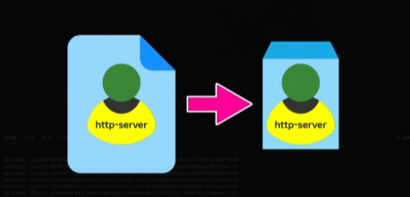

	⇒ 즉, node.js에 http-server까지 깔린 상태가 이미지로 있어야 컨테이너로 서비스를 실행하기 수월함
### Dockerfile 살펴보기
1. frontend/Dockerfile 이미지를 만들기
	- 파일 내용
		```shell
		FROM node:12.18.4 # 이 버전의 node 이미지에 무언가를 덧붙여서 튜닝 이미지를 만듦

		RUN npm install -g http-server # 이미지를 생성하는 과정에서 RUN 명령어 실행(node의 경우, npm)
		# 이 단계에서 http-server를 설치해 줌

		WORKDIR /home/node/app # 이 안에서 명령어를 실행할 위치 설정

		CMD ["http-server", "-p", "8080", "./public"] # 배열로 나열된 문자열들이 WORKDIR 위치에서 실행됨

		# RUN / CMD 차이
		# RUN: 이미지를 생성하는 과정에서 실행되는 것.
		#     (즉, 이미지에서 컨테이너를 실행하는 시점에서는 이미 http-server가 설치되어 있도록 하는 것.)
		# CMD: 이미지로부터 컨테이너가 만들어져 가동될 때 기본적으로 바로 실행되는 명령어
		```

	- 명령어
		```shell
		PS C:\Users\auswo\Downloads\test\docker-for-starter\practice-docker\frontend> docker build -t frontend-img .
		```

	- 해당 Dockerfile이 있는 경로로 진입, Dockerfile로의 상대 경로를 적어 줌

		(파일 명이 Dockerfile이면 따로 명시할 필요 없음)

		```shell
		[+] Building 271.2s (8/8) FINISHED
		 => [internal] load build definition from Dockerfile           0.2s 
		 => => transferring dockerfile: 599B                           0.0s 
		 => [internal] load .dockerignore                              0.2s 
		 => => transferring context: 2B                                0.0s 
		 => [internal] load metadata for docker.io/library/node:12.18  3.2s 
		 => [auth] library/node:pull token for registry-1.docker.io    0.0s 
		 => [1/3] FROM docker.io/library/node:12.18.4@sha256:8cfe7e  255.9s 
		 => => resolve docker.io/library/node:12.18.4@sha256:8cfe7e8d  0.0s 
		 => => sha256:4f250268ed6a0b777b9a3d9e0659 45.37MB / 45.37MB  86.5s 
		 => => sha256:c159512f4cc2a5f8c64890a32b7766e 4.34MB / 4.34MB  3.9s 
		 => => sha256:8cfe7e8dc60095a4f9d25a3f0f208503559 776B / 776B  0.0s 
		 => => sha256:28faf336034dcc856cb4e5b222d6d0a 7.81kB / 7.81kB  0.0s 
		 => => sha256:1b49aa113642e1d83773ca83de88 10.75MB / 10.75MB  13.4s 
		 => => sha256:7f35eaf7c26a25056a43777fff187fd 2.21kB / 2.21kB  0.0s 
		 => => sha256:8439168fd8dcb35b71c06211b4c2 50.11MB / 50.11MB  86.6s 
		 => => sha256:55abbc6cc15820e59f3f9effd 214.25MB / 214.25MB  243.7s 
		 => => sha256:e5c5821cd8891e4cb78b57e9718823 4.17kB / 4.17kB  90.0s 
		 => => extracting sha256:4f250268ed6a0b777b9a3d9e0659754a8c97  2.1s 
		 => => sha256:fe68f8ffb64fb9dde55ccdb7c7d 23.80MB / 23.80MB  109.9s 
		 => => extracting sha256:1b49aa113642e1d83773ca83de882e12c498  0.4s 
		 => => extracting sha256:c159512f4cc2a5f8c64890a32b7766e2662b  0.2s 
		 => => extracting sha256:8439168fd8dcb35b71c06211b4c23c02bd84  2.9s 
		 => => sha256:310e01487093987330b8a0a67310a0 2.36MB / 2.36MB  93.5s 
		 => => sha256:3d7627cf0abe7e1a221e2ed41f66accbf5 293B / 293B  95.3s 
		 => => extracting sha256:55abbc6cc15820e59f3f9effd6987da17f80  9.0s 
		 => => extracting sha256:e5c5821cd8891e4cb78b57e971882385cf3d  0.1s 
		 => => extracting sha256:fe68f8ffb64fb9dde55ccdb7c7d1389139e0  1.5s 
		 => => extracting sha256:310e01487093987330b8a0a67310a0ebde6b  0.1s 
		 => => extracting sha256:3d7627cf0abe7e1a221e2ed41f66accbf575  0.0s 
		 => [2/3] RUN npm install -g http-server                      11.3s 
		 => [3/3] WORKDIR /home/node/app                               0.1s 
		 => exporting to image                                         0.4s 
		 => => exporting layers                                        0.3s 
		 => => writing image sha256:ceb9ecd1a83a7f6ee5c34de78a5d22344  0.0s 
		 => => naming to docker.io/library/frontend-img                0.0s
		```

	- 실행 하면, node 컨테이너를 다운 받은 다음, 지정한 명령어들을 실행하는 것을 확인할 수 있음
		```shell
		PS C:\Users\auswo\Downloads\test\docker-for-starter\practice-docker\frontend> docker images # 이미지 목록 조회
		REPOSITORY     TAG       IMAGE ID       CREATED          SIZE
		frontend-img   latest    ceb9ecd1a83a   25 minutes ago   924MB      
		node           latest    250e9c100ea2   2 days ago       1.1GB
		```

	- node 이미지와, 이를 기반으로 한 Dockerfile과 build 명령어로 만든 `frontend-img` 이미지가 만들어진 것을 확인할 수 있음
	- `frontend-img` 이미지에는 이미 http-server가 깔려 있음
2. `frontend-img` 이미지를 컨테이너로 run, 실행해 보기
	- 명령어
		```shell
		PS C:\Users\auswo\Downloads\test\docker-for-starter\practice-docker\frontend> docker run --name frontend-con -v ${pwd}:/home/node/app -p 8080:8080 frontend-img
		Starting up http-server, serving ./public

		http-server version: 14.1.1

		http-server settings:
		CORS: disabled
		Cache: 3600 seconds
		Connection Timeout: 120 seconds
		Directory Listings: visible
		AutoIndex: visible
		Serve GZIP Files: false
		Serve Brotli Files: false
		Default File Extension: none

		# 8080 번으로 서버가 열렸다는 표시가 뜸
		Available on:
		  http://127.0.0.1:8080
		  http://172.17.0.2:8080
		Hit CTRL-C to stop the server
		```

	- 생성될 컨테이너 이름 지정
	- `-v`: Volumn의 약자며, 컨테이너와 특정 폴더를 공유하는 것을 뜻함

		⇒ 코드는 내 컴퓨터에서 짜는 거니까 이 컴퓨터, 즉 집에 있음

		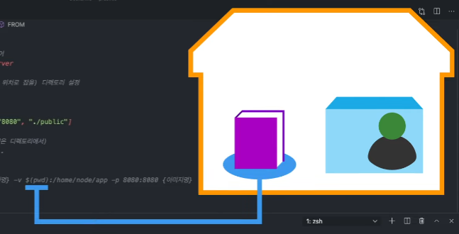

		⇒ 집에서 코드를 짜서 그 파일을 거실 탁자에 놓으면, 

		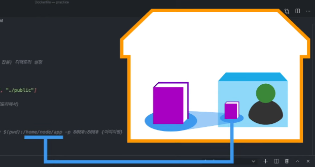

		⇒ 그 거실 탁자는 node.js가 일하는 컨테이너의 home 칸 node 책상의 app 서랍과 연결되어 있는 것

		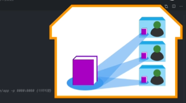

		⇒ 그럼 컨테이너가 언제, 몇 개가 만들어지든 각 컨테이너의 app 서랍에는 거실에 둔 파일들로 얼마든지 서비스를 실행할 수 있음

	- `pwd`: 현 위치 출력. 지금 위치한 이 폴더 안의 내용들이 컨테이너의 home/node/app 폴더에 들어간다는 의미.

		⇒ 때문에, 컨테이너에서 `CMD ["http-server", "-p", "8080", "./public"]` 명령어로 파일들을 실행할 수 있음

	- `-p`: 포트. 집의 내선번호를 컨테이너의 것과 연결하는 것.

		⇒ 이미지 단에서 `CMD ["http-server", "-p", "8080", "./public"]`로 미리 설정해 둔 것처럼, 컨테이너는 실행 시 이 사이트를 8080번으로 송출할 거니까,

		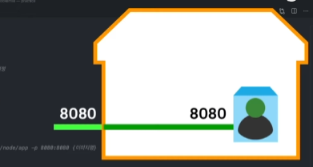

		⇒ 그게 집에서도 같은 번호로 송출될 거면, 이처럼 집의 8080번을 컨테이너의 8080번과 연결한다고 명시

		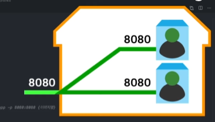

		⇒ 만약 컨테이너를 두 개 이상 만든다면, 집의 내선번호를 공유할 수 없으므로 충돌이 남

		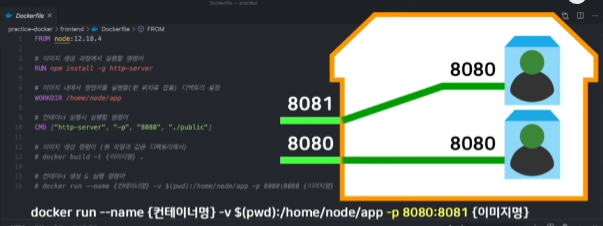

		⇒ 그래서 같은 이미지의 다른 컨테이너를 실행할 때는 집의 8081번을 컨테이너의 8080번과 연결한다고 변화를 주면 됨

3. 2번의 컨테이너 실행 시, 결과
	- [localhost:8080](http://localhost:8080) 접속

		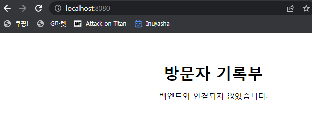

4. `frontend` 컨테이너와 이미지 전부 삭제
5. backend, database의 Dockerfile도 실행
	- database/Dockerfile
		```shell
		FROM mysql:5.7 # mysql 5.7 버전을 담은 이미지를 다운받아 개조하기

		# ENV 명령어로 생성될 컨테이너 안의 환경변수 미리 지정
		#  (실제 개발에서는 작성X, 따로 파일로 관리)
		# 컨테이너는 아래 내용이 적힌 채로 만들어짐
		ENV MYSQL_USER mysql_user # 사용자명
		ENV MYSQL_PASSWORD mysql_password # 비밀번호
		ENV MYSQL_ROOT_PASSWORD mysql_root_password
		ENV MYSQL_DATABASE visitlog

		# 이 scripts 디렉토리에 있는 파일들을 이미지 내부의 /docker-entrypoint-initdb.d/ 폴더로 복사
		COPY ./scripts/ /docker-entrypoint-initdb.d/
		```

		- `mysql:5.7` 이미지는 컨테이너로 실행이 될 때,
		- `/docker-entrypoint-initdb.d/` 폴더 안의 sql 파일들에 적힌 쿼리 명령어들을 실행하도록 설계됨

			⇒ scripts 폴더 내 파일들은 컨테이너 초기화 과정에 필요한 것이므로 COPY로 이미지 안에 미리 넣어 둠

	- COPY와 VOLUMN 차이
		- COPY: RUN 처럼 이미지를 생성하는 과정에서 미리 해당 이미지 안에 특정 파일을 넣어둠
		- VOLUMN: CMD 처럼, 컨테이너가 생성되어 실행될 때 그 내부의 폴더를 외부의 것과 연결
6. database/Dockerfile 이미지 만들기
	- 명령어
		```shell
		PS C:\Users\auswo\Downloads\test\docker-for-starter\practice-docker\database> docker build -t database-img .
		[+] Building 114.7s (8/8) FINISHED
		 => [internal] load build definition from Dockerfile                  0.0s 
		 => => transferring dockerfile: 888B                                  0.0s 
		 => [internal] load .dockerignore                                     0.1s 
		 => => transferring context: 2B                                       0.0s 
		 => [internal] load metadata for docker.io/library/mysql:5.7          2.8s 
		 => [auth] library/mysql:pull token for registry-1.docker.io          0.0s 
		 => [internal] load build context                                     0.1s 
		 => => transferring context: 400B                                     0.0s 
		 => [1/2] FROM docker.io/library/mysql:5.7@sha256:bd873931ef20f30a  105.0s 
		 => => resolve docker.io/library/mysql:5.7@sha256:bd873931ef20f30a5a  0.1s 
		 => => sha256:bd873931ef20f30a5a9bf71498ce4e02c88cf48b2e 320B / 320B  0.0s 
		 => => sha256:03b6dcedf5a2754da00e119e2cc6094ed3c884 2.62kB / 2.62kB  0.0s 
		 => => sha256:2be84dd575ee2ecdb186dc43a9cd951890a764 7.92kB / 7.92kB  0.0s 
		 => => sha256:70e9ff4420fbc58483e68c13199a06c24b1 50.48MB / 50.48MB  76.2s 
		 => => sha256:7ca4383b183f283dc0ac1a0351f5cb31f75dbd244b 872B / 872B  0.8s 
		 => => sha256:3e282e7651b1612ff17f6246e0847dad69 983.71kB / 983.71kB  2.7s 
		 => => sha256:1ffa0e0ca7078cd2e1abcaa6847bc545576fd2 4.60MB / 4.60MB  3.3s 
		 => => sha256:6eb790cf638212f7a95cd187ed8515ff749c06 2.66kB / 2.66kB  3.2s 
		 => => sha256:2b7ffc37d8e9c1691a3e04e9fcdf2409484ca22e3b 336B / 336B  4.0s 
		 => => sha256:4393c12228b9628c8d3a8c421e92080b206 25.53MB / 25.53MB  59.9s 
		 => => sha256:389d2c130d520b0e7953b08faa0ad308866e0cb139 315B / 315B  4.4s 
		 => => sha256:e5df3caef94cc41376f0f14fd6db2c5e224 87.66MB / 87.66MB  97.8s 
		 => => sha256:5c6aa409290d0f55131bc8d7d406e767576e8 5.39kB / 5.39kB  60.7s 
		 => => sha256:faa350980ea9f8455483b598af47fcb9e6d96f5d4 121B / 121B  61.0s 
		 => => extracting sha256:70e9ff4420fbc58483e68c13199a06c24b14013b254  3.1s 
		 => => extracting sha256:7ca4383b183f283dc0ac1a0351f5cb31f75dbd244be  0.0s 
		 => => extracting sha256:3e282e7651b1612ff17f6246e0847dad6996add9403  0.1s 
		 => => extracting sha256:1ffa0e0ca7078cd2e1abcaa6847bc545576fd23586b  0.2s 
		 => => extracting sha256:6eb790cf638212f7a95cd187ed8515ff749c06d616b  0.0s 
		 => => extracting sha256:2b7ffc37d8e9c1691a3e04e9fcdf2409484ca22e3b8  0.0s 
		 => => extracting sha256:4393c12228b9628c8d3a8c421e92080b206ee944595  1.0s 
		 => => extracting sha256:389d2c130d520b0e7953b08faa0ad308866e0cb139c  0.0s 
		 => => extracting sha256:e5df3caef94cc41376f0f14fd6db2c5e224ad013a80  5.8s 
		 => => extracting sha256:5c6aa409290d0f55131bc8d7d406e767576e88c510c  0.0s 
		 => => extracting sha256:faa350980ea9f8455483b598af47fcb9e6d96f5d4b2  0.0s 
		 => [2/2] COPY ./scripts/ /docker-entrypoint-initdb.d/                6.4s 
		 => exporting to image                                                0.2s 
		 => => exporting layers                                               0.1s 
		 => => writing image sha256:5b206ea4b6d041ab90be8a7db40846db922e3c6a  0.0s 
		 => => naming to docker.io/library/database-img                       0.0
		```

7. docker run 명령어로 실행
	- 이번 컨테이너는 컨테이너명과 포트만 지정
		```shell
		PS C:\Users\auswo\Downloads\test\docker-for-starter\practice-docker\database> docker run --name database-con -it -p 3306:3306 database-img
		2023-07-24 12:10:48+00:00 [Note] [Entrypoint]: Entrypoint script for MySQL 
		Server 5.7.42-1.el7 started.
		2023-07-24 12:10:48+00:00 [Note] [Entrypoint]: Switching to dedicated user 
		'mysql'
		2023-07-24 12:10:48+00:00 [Note] [Entrypoint]: Entrypoint script for MySQL 
		Server 5.7.42-1.el7 started.
		2023-07-24 12:10:48+00:00 [Note] [Entrypoint]: Initializing database files
		2023-07-24T12:10:48.441662Z 0 [Warning] TIMESTAMP with implicit DEFAULT value is deprecated. Please use --explicit_defaults_for_timestamp server option (see documentation for more details).
		2023-07-24T12:10:48.628791Z 0 [Warning] InnoDB: New log files created, LSN=45790
		2023-07-24T12:10:48.703144Z 0 [Warning] InnoDB: Creating foreign key constraint system tables.
		2023-07-24T12:10:48.782815Z 0 [Warning] No existing UUID has been found, so we assume that this is the first time that this server has been started. Generating a new UUID: 2034065e-2a1b-11ee-91fc-0242ac110003.
		2023-07-24T12:10:48.789902Z 0 [Warning] Gtid table is not ready to be used. Table 'mysql.gtid_executed' cannot be opened.
		2023-07-24T12:10:48.975921Z 0 [Warning] A deprecated TLS version TLSv1 is enabled. Please use TLSv1.2 or higher.
		2023-07-24T12:10:48.975955Z 0 [Warning] A deprecated TLS version TLSv1.1 is enabled. Please use TLSv1.2 or higher.
		2023-07-24T12:10:48.976358Z 0 [Warning] CA certificate ca.pem is self signed.
		2023-07-24T12:10:49.049346Z 1 [Warning] root@localhost is created with an empty password ! Please consider switching off the --initialize-insecure option.
		```

		- 실전에서는 데이터를 유지해야 하므로 데이터 폴더를 -v 옵션으로 집의 데이터 창고랑 볼륨 공유를 할 것
		- mysql은 3306 포트가 기본이므로, 집에도 3306으로 연결
	- db 프로그램으로 접속하면 database 정보를 볼 수 있음

		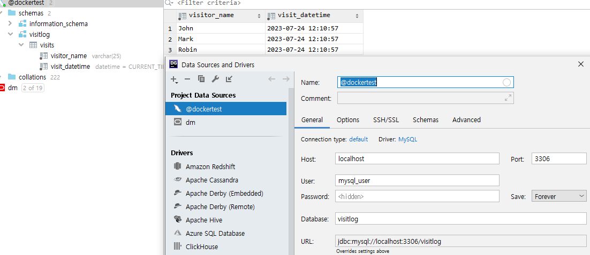

	- 하지만, 이 컨테이너가 돌아가는 동안 터미널을 못 씀

		⇒ 현재는 내가 보는 앞에서만, 근무자들이 컨테이너에서 일을 할 수 있도록 되어있음

		⇒ 현재 실행되는 컨테이너는 명령어를 받지 않음

	- 터미널을 새로 열어 컨테이너를 중지, 삭제
		```shell
		PS C:\Users\auswo\Downloads\test\docker-for-starter> docker stop $(docker ps -aq)
		d7ba34ef1f3b
		247e4e315918
		19f6c51d663e
		```

		→ run 명령어 + `-d` 옵션

		```shell
		PS C:\Users\auswo\Downloads\test\docker-for-starter> docker run --name database-con2 -p 3306:3306 -d database-img
		9cff39a633c1cbeb2e326fcd18ea8f20330e3c213ff9d5cfdc04f3a34145776d
		PS C:\Users\auswo\Downloads\test\docker-for-starter> docker ps
		CONTAINER ID   IMAGE          COMMAND                  CREATED         STATUS         PORTS                               NAMES
		9cff39a633c1   database-img   "docker-entrypoint.s…"   4 seconds ago   Up 3 seconds   0.0.0.0:3306->3306/tcp, 33060/tcp   database-con2
		```

		- `-d`: deamon의 줄임말이며, 안 보이는 곳에서 알아서 컨테이너 깔고 돌라는 뜻

			⇒ 생성되는 컨테이너의 ID만 표시됨, 터미널은 그대로 사용 가능

	- 컨테이너 로그 살펴보기
		```shell
		docker logs -f database-con2
		```

		- 실시간 로그 확인 가능, ctrl + c로 빠져나오기 가능
8. backend/Dockerfile
	- 파이선 flask로 api 서버 돌리기
	- backend.py 파일을 실행, 서버 가동
		```shell
		FROM python:3.8.5 # 파이썬이 깔려있는 이미지를 가져다가,

		RUN pip3 install flask flask-cors flask-mysql # flask 관련 라이브러리들이 추가로 깔리도록 개조

		WORKDIR /usr/src/app # 이 폴더에 위치해서, 컨테이너 실행 시에 

		CMD ["python3", "backend.py"] # 이 명령오로 백엔드 서버 실행
		```

9. 이처럼, 서비스를 구성하는 3가지 요소가 각각 폴더에 Dockerfile이란 ‘미시적’ 설계도로 도커에서 어떻게 실행될지 설정이 되어있음
10. 그런데, 서비스 실행 시 매번 이런 식으로 요소들 하나하나 이미지를 다운받고, 적절한 명령어로 컨테이너를 실행하는 건 여전히 번거로움
	- front, back, db 각각의 네트워크가 분리되어 있기 때문에, 백엔드와 데이터베이스는 데이터를 주고받지 못함

		⇒ 이 요소들을 연결해서 서비스를 간편하게 실행할 수는 없을까?

		⇒ 이를 위해, ‘거시적’ 설계도인 docker-compose가 사용됨
### docker-compose
1. 실습을 위해, 모든 컨테이너와 이미지 삭제
	```shell
	PS C:\Users\auswo\Downloads\test\docker-for-starter> docker stop $(docker ps -aq)
	9cff39a633c1
	247e4e315918
	19f6c51d663e
	PS C:\Users\auswo\Downloads\test\docker-for-starter> docker rm $(docker ps 
	-aq)
	9cff39a633c1
	d7ba34ef1f3b
	247e4e315918
	19f6c51d663e
	PS C:\Users\auswo\Downloads\test\docker-for-starter> docker image prune -a 
	WARNING! This will remove all images without at least one container associated to them.
	Are you sure you want to continue? [y/N] y
	Deleted Images:
	untagged: frontend-img:latest
	deleted: sha256:ceb9ecd1a83a7f6ee5c34de78a5d223441e9ad31c5b9f4ff8a73498aa868ae3f
	untagged: node:latest
	untagged: node@sha256:32ec50b65ac9572eda92baa6004a04dbbfc8021ea806fa62d37336183cad04e6
	deleted: sha256:250e9c100ea2ad5745b8c69edef0c3dcf9b2cbb055fb7dbd4fe7fb3f9fa45bae
	deleted: sha256:04dd0e8deabd9682c940b748c65c764203cb42fbce9cff7322dd5493a69f2ab0
	deleted: sha256:7826dd14ff4e14bdc7101e15a1ac3ac6ac3432c2f646fcda9e58cf818dc3a1df
	deleted: sha256:fad884c2212c6ec32a2aee7acbbc2bbfa669d3883a130974dce411551e714933
	deleted: sha256:c3767412dc7a4b61d34c21949c7b277c007d7ee979170ae088b30604b394916d
	deleted: sha256:47be7118de812a5e4dd0c80738586f76c4171587359b70e862b1760e93d0b18b
	deleted: sha256:b80181f01d740ba89ac4b6ce18ec3ef3f374f14d972c2f874813c33990687e22
	2c456
	e7707
	untagged: database-img:latest
	deleted: sha256:5b206ea4b6d041ab90be8a7db40846db922e3c6af27405dc98cb79db614f3a6c

	Total reclaimed space: 1.096GB
	PS C:\Users\auswo\Downloads\test\docker-for-starter> docker ps
	CONTAINER ID   IMAGE     COMMAND   CREATED   STATUS    PORTS     NAMES     
	PS C:\Users\auswo\Downloads\test\docker-for-starter> docker images
	REPOSITORY   TAG       IMAGE ID   CREATED   SIZE
	```

2. 프로젝트 폴더 내 docker-compose.yml 파일 살펴보기
	- front, back, db의 Dockerfile에 있었던 요소들 → docker-compose.yml 에서는 `services` 항목에 각각 들어감
	```shell
	version: '3'
	services:
	  database: # 각 서비스들의 이름 1 (이들간의 네트워크에서는 각각의 호스트명이 됨)
	    build: ./database # Dockerfile이 있는 위치
	    ports:
	      - "3306:3306" # 외부에 개방할 포트 명시(RUN 명령어를 실행할 때마다 줘야 했던 옵션들을 미리 작성해둘 수 있음)
	  backend: # 각 서비스들의 이름 2
	    build: ./backend
	    volumes:
	      - ./backend:/usr/src/app
	    ports:
	      - "5000:5000"
	    environment: # 환경변수 설정
	      - DBHOST=database
	  frontend: # 각 서비스들의 이름 3
	    build: ./frontend
	    volumes:
	      - ./frontend:/home/node/app
	    ports:
	      - "8080:8080"
	```

	- [backend.py](http://backend.py) 코드에 해당 환경변수가 들어감
		```shell
		environment: # backend 환경변수 설정
		      - DBHOST=database
		```

		```shell
		app.config['MYSQL_DATABASE_HOST'] = os.getenv('DBHOST', 'localhost')
		```

	- compose로 구성될 이 컨테이너들 간의 네트워크에서, 

		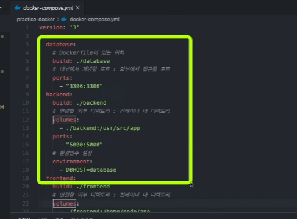

	- 데이터베이스에 접속할 때 이 호스트명을 사용해서 데이터베이스 컨테이너의 mysql에 접속

		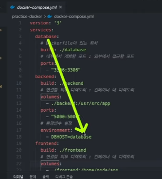

		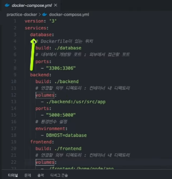

3. 거시적 설계대로 서비스 실행
	- docker-compose.yml 파일이 있는 위치에서 명령어 실행
		```shell
		PS C:\Users\auswo\Downloads\test\docker-for-starter\practice-docker> docker-compose up
		```

		- 각 이미지 빌드 → 컨테이너로 실행됨
	- localhost:8080으로 접속

		

		- back, front, db 세 모듈이 연동되어 성공적으로 서비스 화면이 보여지는 걸 확인할 수 있음
		- 입력, 저장, 조회 전부 가능
	- 이미지 생성 후 뒤에서 알아서 일하도록 하기
		```shell
		PS C:\Users\auswo\Downloads\test\docker-for-starter\practice-docker> docker-compose up -d
		```

4. 어느 서버에서든 도커 환경만 설치되어 있으면, 도커를 실행해서 이 컴퓨터와 똑같은 환경을 조성하고, 문제없이 서비스를 돌릴 수 있음
	- node, python, 등의 라이브러리들을 일일이 설치하고 설정할 필요가 없어짐
### 리눅스 환경에서 도커 설치하고 테스트하기
- 구름 IDE와 같은 도커 기반 서비스들은 그 자체가 도커 내에서 도는 컨테이너므로, 그 안에 또 도커를 설치하는 게 불가능함
- 맥: VirtualBox, 패러랠즈에 리눅스 설치 가능
- 윈도우: WSL로 실습 가능, 그러나 대응해야 하는 오류들이 잦음
- AWS와 같은 클라우드로도 도커 실습 가능
- 리눅스: 도커를 설치한 다음, docker-compose도 따로 설치해야 함
# Reference
- 얄팍한 코딩사전
	- [https://youtu.be/tPjpcsgxgWc](https://youtu.be/tPjpcsgxgWc)
	- [https://www.youtube.com/watch?v=hWPv9LMlme8](https://www.youtube.com/watch?v=hWPv9LMlme8)

