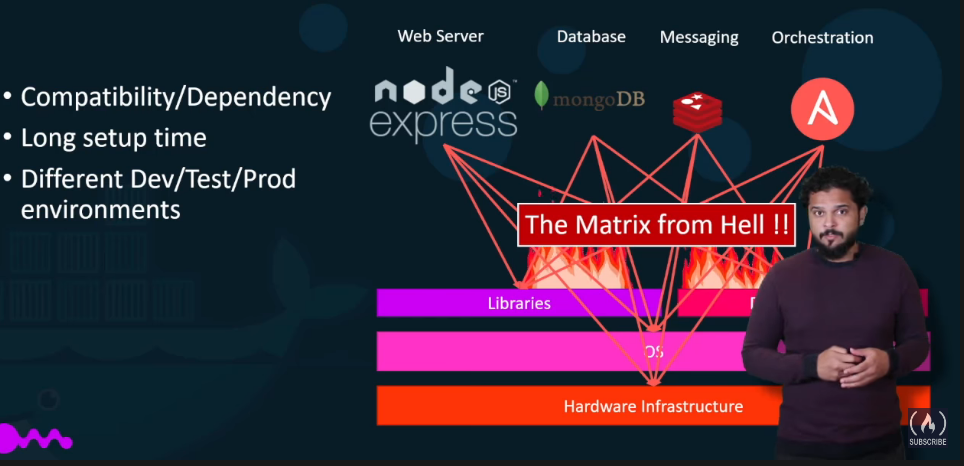
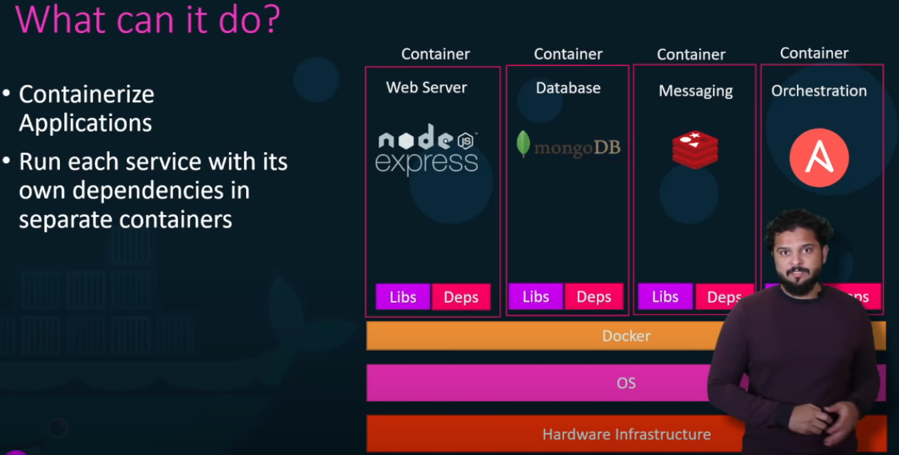
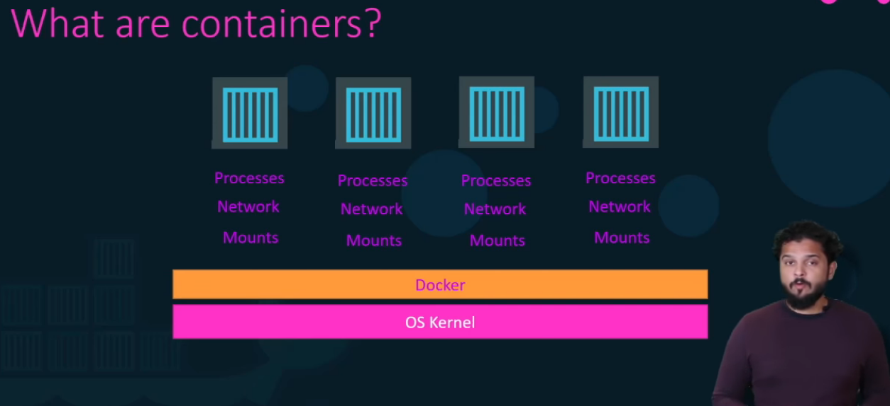
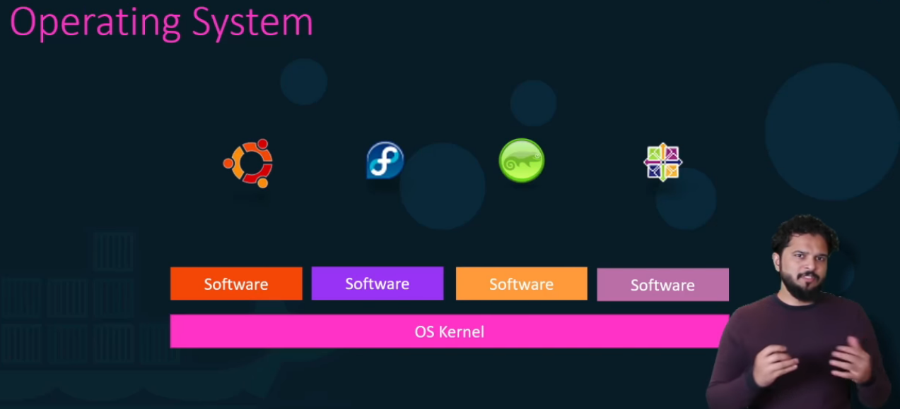

# Docker Overview
## Why do you need docker?

- We couldn't guarantee that the application that we were building would run the same way in different environments.
- And so all of this made our life in developing, building, and shipping the application really difficult.

- With Docker, It was able to run each component in a separate container with its own dependencies, and its own libraries, all on the same VM and the OS, but within separate environments or containers.
- We just had to build the Docker configuration once and all our developers could now get started with a simple Docker run command.
## What are containers?

- Containers are completely isolated environments.
- They can have their own processes or services, their own network interfaces, their own mounts, just like VM, except they all share the same OS kernel.

- If you look at operating systems like Ubentu, Fedora, Susi or CentOS, they all consist of two things, an OS kernel and a set of software.
- The OS kernel is responsible for interacting with the underlying hardware, while the OS kernel remains the same, which is Linux.
- In this case, it's the software above it hat makes these operating systems different.
- This software may consist of a different user interface drivers, compilers, file managers, developer tools, etc.
- Docker Containers share the underlying kernel.
## Sharing the Kernel
- Docker can run any flavor of OS on top of it, as long as they're all based on the same Kernel.
# 색인과 출처
- [https://www.youtube.com/watch?v=fqMOX6JJhGo](https://www.youtube.com/watch?v=fqMOX6JJhGo)

