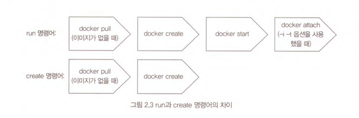
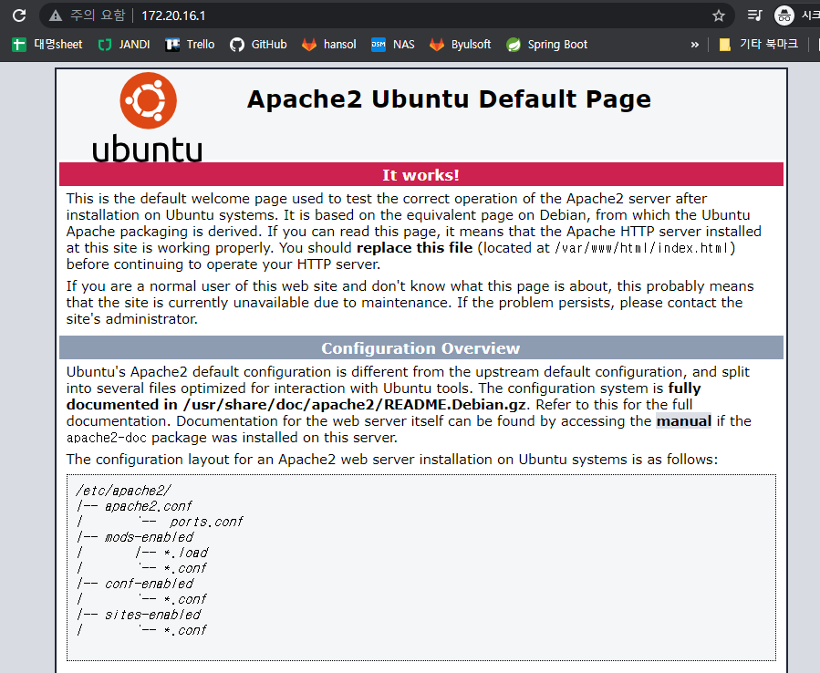
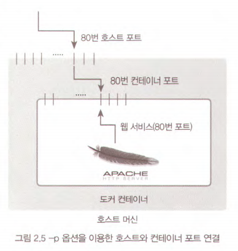
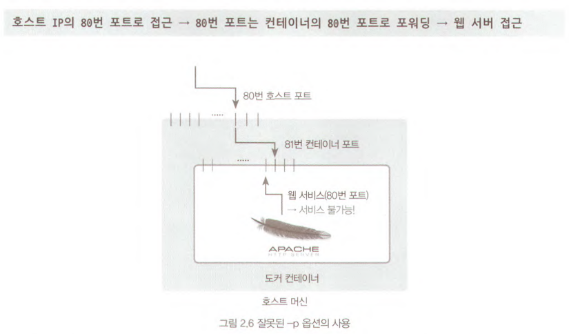
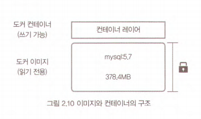

# 2.1. 도커 이미지와 컨테이너
- 이미지, 컨테이너 : 도커 엔진에서 사용하는 기본 단위, 도커 엔진의 핵심
## 2.1.1. 도커 이미지
- 컨테이너를 생성할 때 필요한 요소
- 가상 머신을 생성할 때 사용하는 iso 파일과 비슷한 개념
- 여러 개의 계층으로 된 바이너리 파일로 존재
- 컨테이너를 생성하고 실행할 때 읽기 전용으로 사용됨
- 도커 명령으로 내려받을 수 있으므로 별도 설치할 필요 없음
- `[저장소 이름]/[이미지 이름]:[태그]`의 형태로 구성
## 2.1.2. 도커 컨테이너
- 우분투, CentOS등 이미지로 컨테이너를 생성 → 해당 이미지의 목적에 맞는 파일이 들어 있는 파일 시스템과 격리된 시스템 자원 및 네트워크를 사용할 수 있는 독립된 공간 생성 → `도커 컨테이너`
- 생성될 때 사용된 도커 이미지의 종류에 따라 알맞은 설정과 파일을 가지고 있으므로, 도커 이미지의 목적에 맞도록 사용됨
- 예를 들어, 웹 서버 도커 이미지로부터 여러 개의 컨테이너를 생성하면 생성된 컨테이너의 개수만큼 웹 서버가 생성되고, 이 컨테이너들은 외부에 웹 서비스를 제공하는 데 사용됨
- 이미지를 읽기 전용으로 사용, 이미지의 변경된 사항만 컨테이너 계층에 저장 → 원래 이미지는 영향을 받지 않음
- 각 컨테이너는 각기 독립된 파일 시스템을 제공받음, 호스트와 분리됨 → 다른 컨테이너와 호스트에 영향을 미치지 않음
- 예를 들어, 우분투 도커 이미지로 두 개의 컨테이너 생성 후, A 컨테이너에 MySQL, B컨테이너에 아파치 웹 서버를 설치 → 각 컨테이너는 서로 영향을 주지 않고, 호스트에도 아무런 영향 없음
# 2.2. 도커 컨테이너 다루기
## 2.2.1. 컨테이너 생성
### 도커 엔진 버전 확인
```javascript
docker -v
```
### docker run
```javascript
docker run -i -t ubuntu:14.04
// -i : 상호 입출력
// -t : tty 활성화, bash 셸을 사용하도록 설정
```
- ubuntu:14.04 이미지가 로컬 도커 엔진에 존재하지 않을 시, 도커 허브(도커 중앙 이미지 저장소)에서 자동으로 이미지를 내려받음
- 이미지가 존재한다면 명령어 실행과 동시에 컨테이너 내부로 진입
### ls
```javascript
root@f21dc522f403:/# ls
bin  boot  dev  etc  home  lib  lib64  media  mnt  opt  proc  root  run  sbin  srv  sys  tmp  usr  var
```
### exit, ctrl + P, Q
- exit : 컨테이너 내부에서 빠져나오면서 동시에 컨테이너 정지
- Ctrl + P, Q : 컨테이너 셸에서만 빠져나옴
### docker pull
```shell
C:\Users\auswo>docker pull centos:7
7: Pulling from library/centos
Digest: sha256:0f4ec88e21daf75124b8a9e5ca03c37a5e937e0e108a255d890492430789b60e
Status: Image is up to date for centos:7
docker.io/library/centos:7
```
### docker images
```shell
C:\Users\auswo>docker images
REPOSITORY                         TAG       IMAGE ID       CREATED        SIZE
wordpress                          latest    0adda6ed742f   9 days ago     551MB
mysql                              5.7       2c9028880e58   3 weeks ago    447MB
15.165.251.109:8082/kskim2-nginx   2         34a19290666a   7 weeks ago    133MB
15.165.251.109:8082/kskim-nginx    latest    34a19290666a   7 weeks ago    133MB
ubuntu                             14.04     13b66b487594   2 months ago   197MB
centos                             7         8652b9f0cb4c   6 months ago   204MB
```
### create, run
- 컨테이너 생성 시 run이 아닌 create 명령어를 사용할 수 있음
```shell
C:\Users\auswo>docker create -i -t --name mycentos centos:7
29b2df03f19f1cf653231b5a6bd9ed52fcfae4d8045e528746c5af96430ab620
// --name 옵션에는 컨테이너 이름 설정(mycentos)
```
- create 명령어는 컨테이너 내부로 들어가지 않고, 컨테이너를 생성하기만 함
### docker start, docker attach
- 컨테이너를 시작하고, 내부로 들어가는 명령
```shell
C:\Users\auswo>docker start mycentos
mycentos

C:\Users\auswo>docker attach mycentos
[root@29b2df03f19f /]#
```

### docker ps
- 정지되지 않은 컨테이너만 출력
```shell
C:\Users\auswo>docker start mycentos
mycentos

C:\Users\auswo>docker ps
CONTAINER ID   IMAGE      COMMAND       CREATED         STATUS         PORTS     NAMES
29b2df03f19f   centos:7   "/bin/bash"   4 minutes ago   Up 2 seconds             mycentos
```
### docker ps -a
- 정지된 컨테이너를 포함한 모든 컨테이너 출력
```shell
C:\Users\auswo>docker ps -a
CONTAINER ID   IMAGE          COMMAND       CREATED          STATUS                       PORTS     NAMES
29b2df03f19f   centos:7       "/bin/bash"   5 minutes ago    Up About a minute                      mycentos
f21dc522f403   ubuntu:14.04   "/bin/bash"   12 minutes ago   Exited (127) 8 minutes ago             priceless_khorana
dd3426433e22   ubuntu:14.04   "/bin/bash"   2 days ago       Exited (0) 2 days ago                  detach_test
c9b1a35d7429   ubuntu:14.04   "/bin/bash"   3 days ago       Exited (127) 2 days ago                mywebserver
```
### docker rm
- 더 이상 사용하지 않는 컨테이너 삭제
```shell
docker rm 
```
- 실행중인 컨테이너 삭제 시, 컨테이너를 정지하거나, -f 옵션을 추가해 강제 삭제
```shell
docker stop mycentos
docker rm mycentos

docker rm -f mycentos
```
### docker container prune
- 모든 컨테이너 삭제
```shell
C:\Users\auswo>docker container prune
WARNING! This will remove all stopped containers.
Are you sure you want to continue? [y/N] y
Total reclaimed space: 0B
```
- docker ps -a -q를 사용하는 방법
```shell
docker stop $(docker ps -a -q)
docker rm $(docker ps -a -q)
```
## 2.2.4. 컨테이너를 외부에 노출
- 컨테이너는 가상 머신과 마찬가지로 가상 IP 주소를 할당받음
- 기본적으로, 도커는 컨테이너에 172.17.0.X의 IP를 순차적으로 할당함
- 컨테이너를 새로 생성한 후 ifconfig 명령어로 컨테이너의 네트워크 인터페이스 확인
```shell
C:\Users\auswo>docker run -i -t --name network_test ubuntu:14.04
root@573a8a6d1bdf:/# ifconfig
eth0      Link encap:Ethernet  HWaddr 02:42:ac:11:00:02
          inet addr:172.17.0.2  Bcast:172.17.255.255  Mask:255.255.0.0
          UP BROADCAST RUNNING MULTICAST  MTU:1500  Metric:1
          RX packets:8 errors:0 dropped:0 overruns:0 frame:0
          TX packets:0 errors:0 dropped:0 overruns:0 carrier:0
          collisions:0 txqueuelen:0
          RX bytes:696 (696.0 B)  TX bytes:0 (0.0 B)

lo        Link encap:Local Loopback
          inet addr:127.0.0.1  Mask:255.0.0.0
          UP LOOPBACK RUNNING  MTU:65536  Metric:1
          RX packets:0 errors:0 dropped:0 overruns:0 frame:0
          TX packets:0 errors:0 dropped:0 overruns:0 carrier:0
          collisions:0 txqueuelen:1000
          RX bytes:0 (0.0 B)  TX bytes:0 (0.0 B)

root@573a8a6d1bdf:/#
```
- 도커의 NAT IP인 172.17.0.2할당받은 eth0 인터페이스, 로컬 호스트 lo인터페이스 존재
- 아무런 설정 없이 외부에서 컨테이너로 접근할 수 없으며, 도커가 설치된 호스트에서만 접근 가능
- 외부 컨테이너의 애플리케이션을 노출하기 위해 eth0의 IP와 포트를 호스트의 IP와 포트에 바인딩해야 함
- 컨테이너에서 호스트로 빠져나온 뒤 다음 명령어를 입력해 컨테이너에 아파치 웹 서버를 설치, 외부에 노출
```shell
docker run -i -t --name mywebserver -p 80:80 ubuntu:14.04
// -p : 컨테이너의 포트를 호스트의 포트와 바인딩해 연결할 수 있게 함
```
- 컨테이너 진입 후 아파치 웹 서버 설치
```shell
apt-get update
apt-get install apache2 -y
service apache2 start
```
- 아파치 웹 서버 설치 및 실행 후, `[도커 엔진 호스트의 IP]:80`으로 접근
```shell
C:\Users\auswo>ipconfig

Windows IP 구성

이더넷 어댑터 이더넷:

   미디어 상태 . . . . . . . . : 미디어 연결 끊김
   연결별 DNS 접미사. . . . :

이더넷 어댑터 VirtualBox Host-Only Network:

   연결별 DNS 접미사. . . . :
   링크-로컬 IPv6 주소 . . . . : fe80::298c:f146:2b2b:f424%14
   IPv4 주소 . . . . . . . . . : 192.168.56.1
   서브넷 마스크 . . . . . . . : 255.255.255.0
   기본 게이트웨이 . . . . . . :

무선 LAN 어댑터 로컬 영역 연결* 1:

   미디어 상태 . . . . . . . . : 미디어 연결 끊김
   연결별 DNS 접미사. . . . :

무선 LAN 어댑터 로컬 영역 연결* 10:

   미디어 상태 . . . . . . . . : 미디어 연결 끊김
   연결별 DNS 접미사. . . . :

무선 LAN 어댑터 Wi-Fi:

   연결별 DNS 접미사. . . . :
   링크-로컬 IPv6 주소 . . . . : fe80::f8e2:68ba:490f:bd56%23
   IPv4 주소 . . . . . . . . . : 192.168.1.36
   서브넷 마스크 . . . . . . . : 255.255.255.0
   기본 게이트웨이 . . . . . . : 192.168.1.1

이더넷 어댑터 Bluetooth 네트워크 연결:

   미디어 상태 . . . . . . . . : 미디어 연결 끊김
   연결별 DNS 접미사. . . . :

이더넷 어댑터 vEthernet (WSL):

   연결별 DNS 접미사. . . . :
   링크-로컬 IPv6 주소 . . . . : fe80::21a4:73cd:ea3a:ee12%58
   IPv4 주소 . . . . . . . . . : 172.20.16.1
   서브넷 마스크 . . . . . . . : 255.255.240.0
   기본 게이트웨이 . . . . . . :
```

- 192.168.56.1, 192.168.1.36, 172.20.16.1 다 됨
- 실제 아파치 서버가 설치된 것은 컨테이너 내부이므로, 호스트에는 어떠한 영향도 주지 않음
### 호스트의 IP와 포트를 컨테이너의 IP와 포트로 연결한다는 개념


- 아파치 웹 서버는 172 대역을 가진 컨테이너의 NAT IP와 80번 포트로 서비스
- 여기 접근하려면 172.17.0.X:80의 주소로 접근해야 함
- 도커의 포트 포워딩 옵션 -p를 사용해 호스트와 컨테이너 연결, 호스트의 IP와 포트를 통해 172.17.0.X:80으로 접근 가능
### 잘못된 -p 옵션의 사용

- -p 옵션의 값으로 80:81과 같이 입력한 경우, 외부에서 웹 서버에 접근하지 못함
- 호스트의 80번 포트와 연결된 컨테이너의 포트는 81번이 될 것이고, 81번 포트는 어떠한 서비스도 제공하도록 설정되어 있지 않음
## 2.2.5. 컨테이너 애플리케이션 구축
- 대부분 서비스는 단일 프로그램으로 동작하지 않음
- 여러 에이전트, 데이터베이스 등과 연결되어 완전한 서비스로써 동작함
- 이런 서비스를 `컨테이너화`라고 하며, 여러 개의 애플리케이션을 한 컨테이너에 설치할 수도 있음
- 컨테이너에 애플리케이션을 하나만 동작시키면 컨테이너 간 독립성을 보장하며, 애플리케이션의 버전 관리, 소스코드 모듈화 등이 더욱 쉬워짐

### 데이터베이스와 워드프레스 웹 서버 컨테이너를 연동해 워드프레스 기반 블로그 서비스를 만들어 보자
- mysql 이미지를 사용해 데이터베이스 컨테이너 생성
```shell
C:\Users\auswo>docker run -d --name wordpressdb -e MYSQL_ROOT_PASSWORD=password -e MYSQL_DATABASE=wordpress mysql:5.7
d3b7f1cf705892f06463a65b962e7b43e281deb62084691efce92d193132f2c4
```
- 미리 준비된 워드프레스 이미지를 이용해 워드프레스 웹 서버 컨테이너 생성
- 워드프레스 웹 서버 컨테이너의 -p 옵션에서 80을 입력했으므로 호스트의 포트 중 하나와 컨테이너의 80번 포트가 연결됨
```shell
C:\Users\auswo>docker run -d -e WORDPRESS_DB_PASSWORD=password --name wordpress --link wordpressdb:mysql -p 80 wordpress
0d9afae84b2cace93c7743f35b3b210aec47305959f74cd18559b6b1de6c1e54
```
- 목록 출력
```shell
C:\Users\auswo>docker ps
CONTAINER ID   IMAGE       COMMAND                  CREATED              STATUS              PORTS                   NAMES
0d9afae84b2c   wordpress   "docker-entrypoint.s…"   About a minute ago   Up About a minute   0.0.0.0:53910->80/tcp   wordpress
d3b7f1cf7058   mysql:5.7   "docker-entrypoint.s…"   2 minutes ago        Up 2 minutes        3306/tcp, 33060/tcp     wordpressdb
```
- 호스트와 바인딩된 포트 확인
```shell
C:\Users\auswo>docker port wordpress
80/tcp -> 0.0.0.0:53910
// 0.0.0.0 : 호스트의 활용 가능한 모든 네트워크 인터페이스에 바인딩함을 뜻함
```
## 2.2.6. 도커 볼륨
- 도커 이미지로 컨테이너 생성 시, 이미지는 읽기 전용이 됨
- 컨테이너 변경 사항만 별도로 저장해서 각 컨테이너 정보 보존
- 예를 들어, 위에서 생성했던 mysql 컨테이너는 mysql:5.7이라는 이미지로 생성됐지만, 워드프레스 블로그를 위한 데이터베이스 등의 정보는 컨테이너가 가지고 있음
- 즉, 다음과 같은 구조를 띔
	
- 이미 생성된 이미지는 어떠한 경우로도 변경되지 않음
- 컨테이너 계층에 원래 이미지에서 변경된 파일 시스템 등을 저장하기만 함
- 이미지에 mysql을 실행하는 데 필요한 애플리케이션 파일이 들어있다면,
- 컨테이너 계층에는 워드프레스에서 쓴 로그인 정보나 게시글 등과 같이 데이터베이스를 운용하면서 쌓이는 데이터 저장
- 단점 : mysql 컨테이너를 삭제하면 컨테이너 계층에 저장돼 있던 데이터베이스의 정보도 삭제됨
- 컨테이너의 데이터를 영속적 데이터로 활용할 수 있는 방법 → 볼륨
# 색인과 출처
- [https://yunbk.tistory.com/19](https://yunbk.tistory.com/19)
- [https://velog.io/@king/private-docker-registry](https://velog.io/@king/private-docker-registry)

