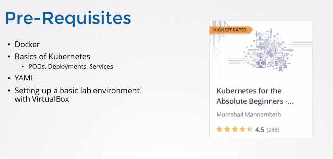

<table_of_contents color="gray"/>
# \[Section1\]: Introdection
# 1. Course Introduction

# 2. Certification
- 생략
# 3. Certification Details
**Note!**
In the video, I said the exam is 3 hours. With the latest version of the exam, it is now only 2 hours. The contents of this course has been updated with the changes required for the latest version of the exam.
**Below are some references:**
Certified Kubernetes Administrator: [https://www.cncf.io/certification/cka/](https://www.cncf.io/certification/cka/)
Exam Curriculum (Topics): [https://github.com/cncf/curriculum](https://github.com/cncf/curriculum)
Candidate Handbook: [https://www.cncf.io/certification/candidate-handbook](https://www.cncf.io/certification/candidate-handbook)
Exam Tips: [http://training.linuxfoundation.org/go//Important-Tips-CKA-CKAD](http://training.linuxfoundation.org/go//Important-Tips-CKA-CKAD)
> Use the code - DEVOPS15 - while registering for the CKA or CKAD exams at Linux Foundation to get a 15% discount.
# 4. The Kubernetes Trilogy
- 생략
# 5. Join our Slack Channel for support and interaction
Join our slack channel for support and discussions.
If you run into issues while working with Coding Exercises the best way to reach us is through the slack channel.
The slack channel is a collaborative learning and sharing environment for all students enrolled in this course. Feel free to ask your doubts here and request any assistance related to the topic. For those who have completed the exam: please remember to adhere to your NDA agreement. Others, please respect the NDA agreement of others and refrain from asking questions about the exam. Have Fun!
Here are some simple Do's and Don'ts.
### Do's:
- Ask questions and get your doubts cleared about topics discussed in the course
- Get help on solving lab activities
- Connect with other students and study as a group
### Don'ts:
- Ask questions about the exam and questions in the exam, such as:
	- What are the questions in the real exam?
	- Is there a question on a specific topic in the exam?
	- What kind of questions come in the exam on a specific topic?
	- What is the answer to a question in the exam?
	- How are the exams scored? Is there partial scoring or full scoring?
- Questions about the exam environment that is not given in the [CNCF FAQ](https://www.cncf.io/certification/cka/faq/)
	- Is a particular tool/utility available within the environment?
	- Are we asked to perform a specific action during the exam?
	These questions violate Non-Disclosure Agreement of the exam and of those who already took the exam. In case you are not sure what information can be shared, refer to the [FAQ](https://www.cncf.io/certification/cka/faq/) here. Anything that's not here shouldn't be shared.
**Slack Group URL:**
[https://join.slack.com/t/kodekloud/shared_invite/zt-ppjkof7q-zXdvu8hfS\~eSnAUvdDNLDg](https://join.slack.com/t/kodekloud/shared_invite/zt-ppjkof7q-zXdvu8hfS~eSnAUvdDNLDg)
# 6. A note on the Course Curriculum
**One of the questions we frequently get asked is:**
*"Is this course sufficient to prepare for the CKA exam? Do we need to go through any other materials."*
**The answer is:**
Yes! This course is sufficient to prepare and clear the CKA exam. We have carefully crafted this course with just the topics required for the CKA exam and any pre-requisite knowledge you may need to understand them. And we have practice tests after each concept so you don't just learn theory, but gain enough practice to appear for the exam. In addition, we have multiple mock exams that will help you test your skills, so you shouldn't have to rely on any additional training materials elsewhere. This is all you need!
As I said, our first priority is to cover all the concepts part of the CKA exam curriculum. However, we plan to cover additional topics that are not part of the CKA exam curriculum around the following very soon:
- Auto scaling a cluster
- Horizontal POD autoscalers
- Stateful Sets
- Kubernetes Federation
- Admission Controllers
If you'd like any other topics to be covered please raise an issue here and tag it "Lecture Request" and "CKA":
[https://github.com/mmumshad/kubernetes-the-hard-way](https://github.com/mmumshad/kubernetes-the-hard-way)
# 7. Reference Notes for lectures and labs
We have created a repository with notes, links to documentation and answers to practice questions here. Please make sure to go through these as you progress through the course:
[**https://github.com/kodekloudhub/certified-kubernetes-administrator-course**](https://github.com/kodekloudhub/certified-kubernetes-administrator-course)
[https://www.udemy.com/course/certified-kubernetes-administrator-with-practice-tests/learn/lecture/14298578?start=15#content](https://www.udemy.com/course/certified-kubernetes-administrator-with-practice-tests/learn/lecture/14298578?start=15#content)
