<table_of_contents color="gray"/>
# \[Section2\]: Core COncepts
# 8. Core Concepts Section Introduction
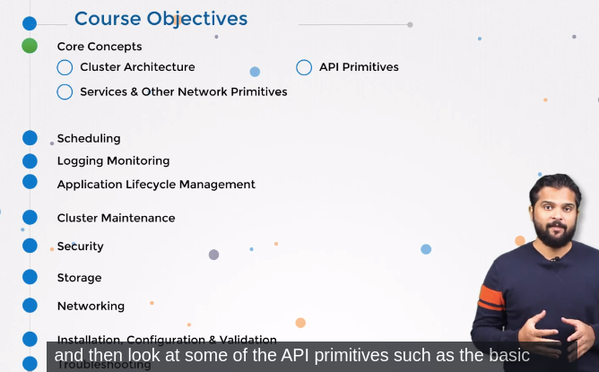
- In the first section we start with the core concepts.
- We look at the cluster architecture at a high level, and then look at some of the API primitives such as the basic concepts like Pods, Replica Sets, Deployments followed by services.
# 9. Download Presentation Deck for this section
Please note that some slides are animated so content may not have exported correctly. Kindly use the slides as a reference for commands.
### 이 강의 자료
<file src=""></file>
<file src=""></file>
<file src=""></file>
# 10. Cluster Architecture
## Goal
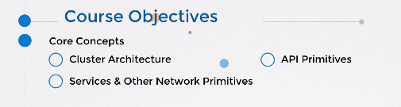
- We start with a basic overview of the Kubernetes cluster architecture.
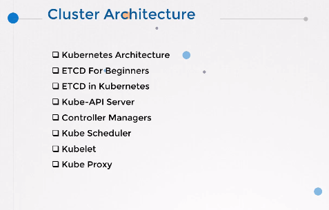
- We first look at the architecture at a high level and then we drill down into each of these components.
- We see what their roles and responsibilities are and how they are configured.
- And finally, you go through a practice test where you look at an existing cluster and are asked to identify various detail with respect to these components in the cluster.
# 11. Cluster Architecture
### 🔰 To use an analogy of ships to understand the architecture of Kubernetes
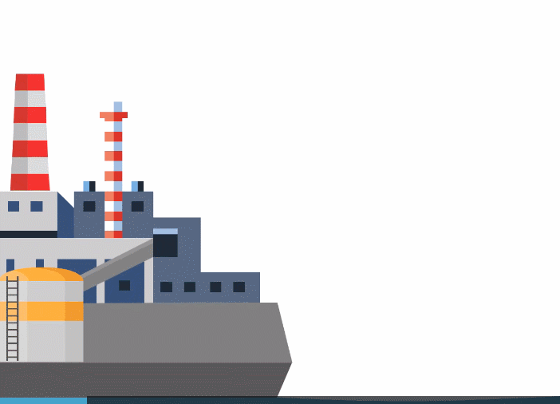
- The purpose of kubernetes is to host your applications in the form of containers in an automated fashion.
- So that you can easily deploy as many instances of your application as required and easily enable communication between different services within your application.
- So there are many things involved that work together to make this possible.
### 🔰 Let's take a 10000 feet look at the Kubernetes architecture

- We have two kinds of ships.
- In this example `cargo ships` that does the actual work of carrying containers across to sea and control ships that are responsible for monitoring and managing the cargo ships.
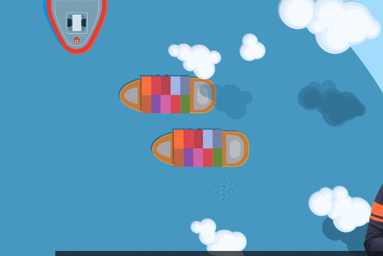
- The `Kubernetes cluster` consists of a set of nodes which may be physical or virtual on-premise or on cloud that host applications in the form of containers.
- These relate to the cargo ships in this analogy.
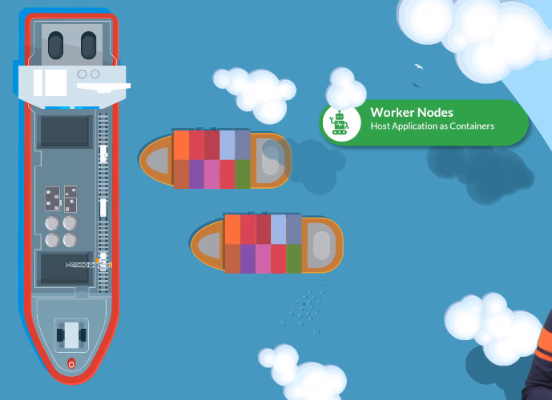
- The worker nodes in the cluster are ships that can load containers.
- But somebody needs to load the containers on the ships and not just load, plan how to load identify the right ships. (Store information about the ships, Monitor and Track the location of containers on the ships, Manage the whole loading process, etc)
- This is done by the control ships that host different offices and departments monitoring equipments, communication equipments, cranes for moving containers between ships etc.
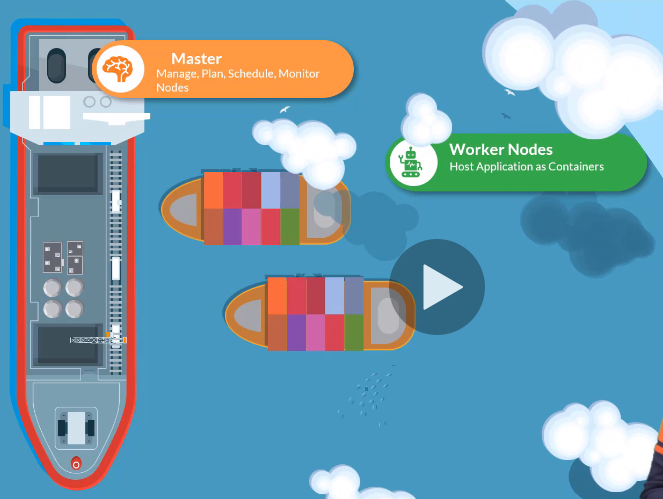
- The control ships relate to the master node in the Kubernetes cluster.
- The master node is responsible for managing the Kubernetes cluster, storing information regarding the different nodes, planning which containers cause where monitoring the nodes and containers on them etc.
- The master node does all of these using a set of components together known as the control plane components.
### 🔰 Each of these components
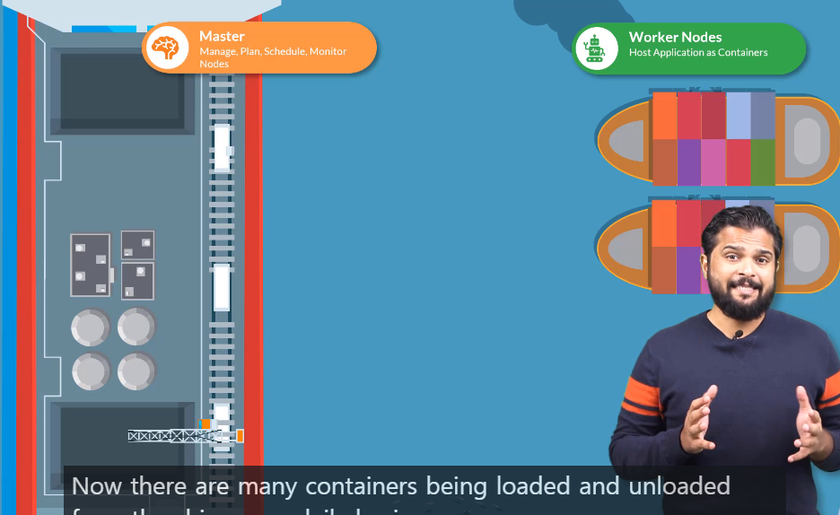
- Now there are many containers being loaded and unloaded from the ships on a daily basis.
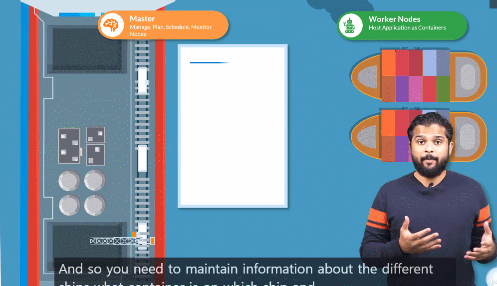
- And so you need to maintain information about the different ships what container is on which ship and what time it was loaded etc.
- All of these are stored in a highly available key value store known as ETCD.
- ETCD is a database that stores information in a key-value format.
- We will look more into what ETCD cluster actually is what data is stored in it and how it stores the data in one of the upcoming lectures.
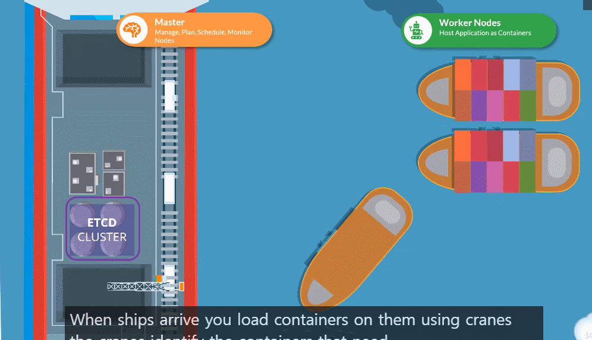
- When ships arrive you load containers on them using cranes.
- The cranes identify the containers that need to be placed on ships. It identifies the right ship based on its size, capacity, the number of containers already on the ship, and any other conditions such as the destination of the ship, the type of containers it is allowed to carry etc.
- So those are schedulers in a Kubernetes cluster.
- As scheduler identifies the right node to place a container on based on the containers.
- Resource requirements the worker nodes capacity or any other policies or constaints such as Taints or Tolerations or node affinity rules that are on them. 
- There are different offices in the dock that are assigned to special tasks or departments.
- For example the operations team takes care of ship handling traffic control etc.
- They deal with issues related to damages, the routes the different ship state etc.
- The cargo team takes care of containers when containers are damaged or destroyed, the make sure new containers are made available.
- We have these services office that takes care of the IT and communications between different ships.
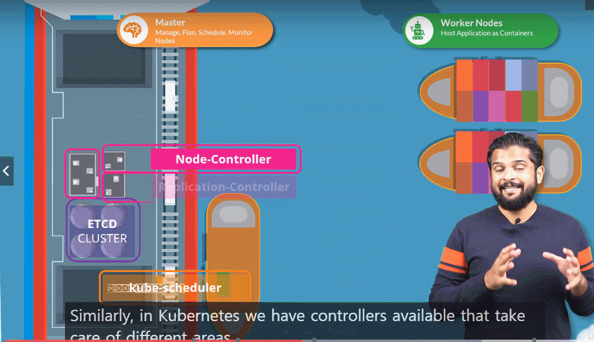
- Similarly, in Kubernetes we have controllers available that take care of different areas.
	- `Node-Controller`: Takes care of nodes. They're responsible for on boarding new nodes to the cluster handling situations where nodes become unavailable or get destroyed.
	- `Replication-Controller`: Ensures that the desired number of containers are running at all times in your replication group.
### 🔰 How do these communicate with each other?
- We have seen different components like the different offices, the different ships, the data store, the cranes.
- How does on office reach the other office and who manages them all at a high level.
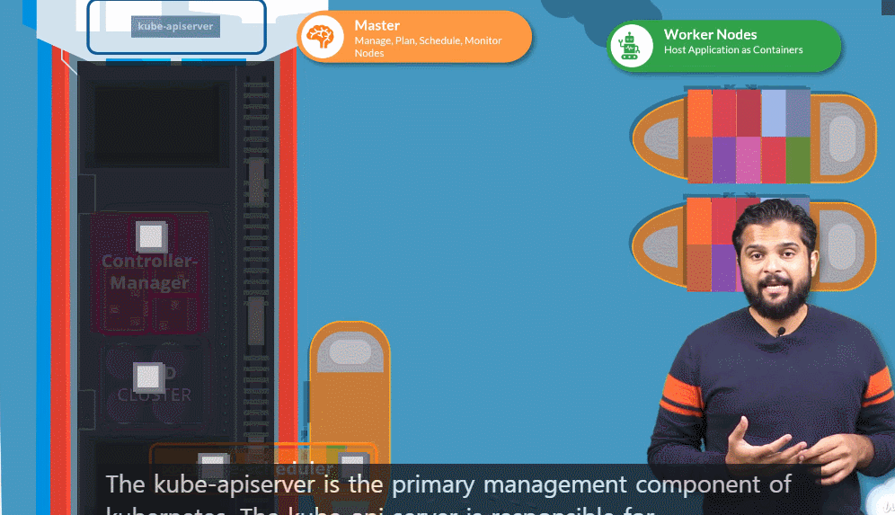
- The `Kube-apiServer` is the primary management component of Kubernetes.
- The Kube-api Server is responsible for orchestrating all operations within the cluster.
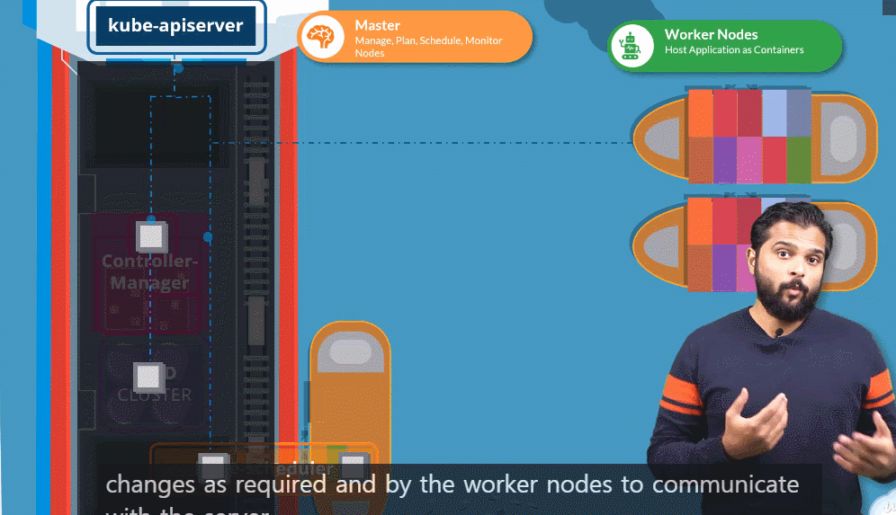
- It exposes the Kubernetes API which is used by externals users to perform management operations on the cluster as well as the various controllers to monitor the state of the cluster and make the necessary changes as required and by the worker nodes to communicate with the server.
### 🔰 Now, we are working with containers here
- Containers are everywhere so we need everything to be container compatible.
- Our applications are in the form of containers. The different components that form the entire management system on the master nodes could be hosted in the form of containers.
- The DNS service networking solution can all be deployed in the form of containers.
- So we need these software that can run containers and that's the container runtime engine. A popular one being Docker.
- So we need Docker or it'w supported equivalent installed on all the nodes in the cluster including the master nodes, if you wish to host the control plane components as containers.
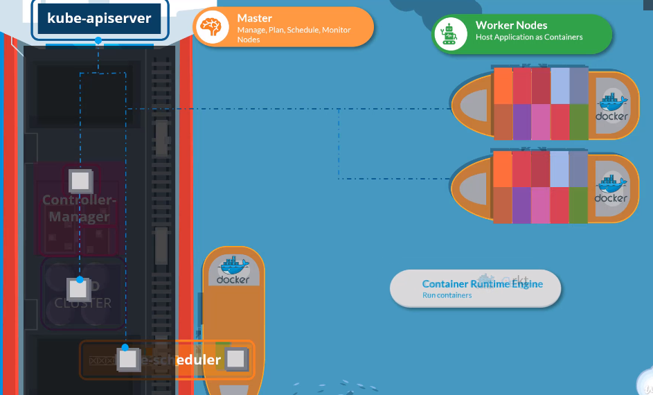
- Now it doesn't always have to be Docker. Kubernetes supports other run time engines as well like Container D or Rocket.
### 🔰 Turn our focus onto the cago ships
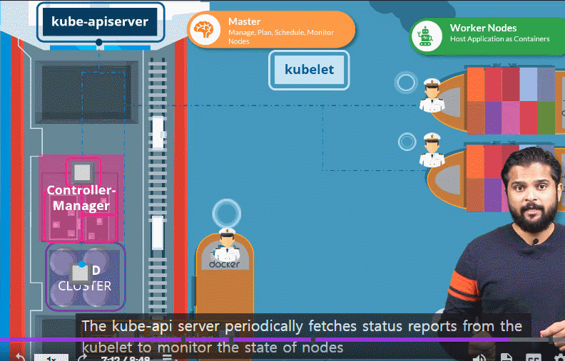
- Every ship has a captain. The captain is responsible for managing all activities on these ships.
- The captain is responsible for liaising with the master ships starting with letting the master ship know that they are interested in
	1. Joining the group, receiving information about the containers to be loaded on the ship
	2. Loading the appropriate containers as required,
	3. Sending reports back to the master about the status of this ship,
	4. And the status of the containers on the ship, etc.
- Now the captain of the ship is the Kublet in Kubernetes. A Kublet is an agent that runs on each node in a cluster.
- It listens for instructions from the Kube-apiServer and deploys or destroys containers on the nodes as required.
- The Kube-apiServer periodicall fetches status reports from the kublet to monitor the state of nodes and containers on them.
- The Kublet was more of a captain on the ship that manages containers on the ship.
- But the applications running on the worker nodes need to be able to communicate with each other.
- For example, you might have a web server running in one container on one of the nodes, and a database server running on another container on another node.
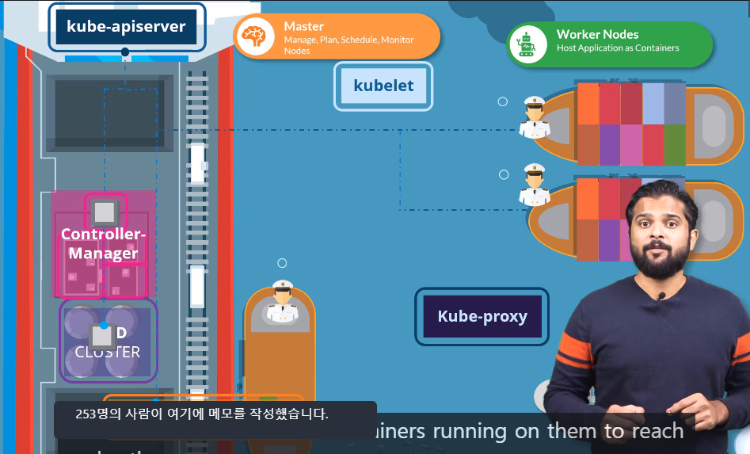
- How would the Web Server reach the database server on the other node communication between worker nodes are enabled by another component that runs on the worker node known as the Kube-proxy service. the Kube-proxy service ensures that the neccesary rules are in place on the worker nodes to allow the containers running on them to reach each other. 
## Summarize
- We have master and worker nodes.
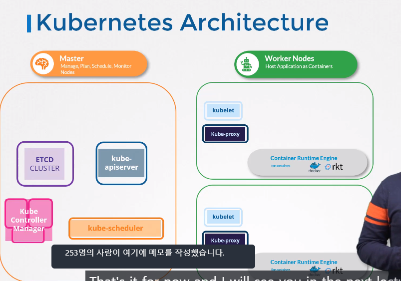
- On the master, we have the `ETCD cluster` which stores information about the cluster.
- We have the `Kube-scheduler` that is responsible for scheduling applications or containers on nodes.
- We have different `Controllers` that take care of different functions like the Node Controller, Replication Controller, etc.
- We have the `Kube-apiServer` that is responsible for orchestrating all operations within the cluster.
- On the worker node, we have the `Kublet` that listens for instructions from the Kube-apiServer and manages containers.
- The `Kube-Proxy`, that helps in enabling communication between services within the cluster.
- ⇒ So, that's a high level overview of the various components.
# 12. ETCD For Beginners
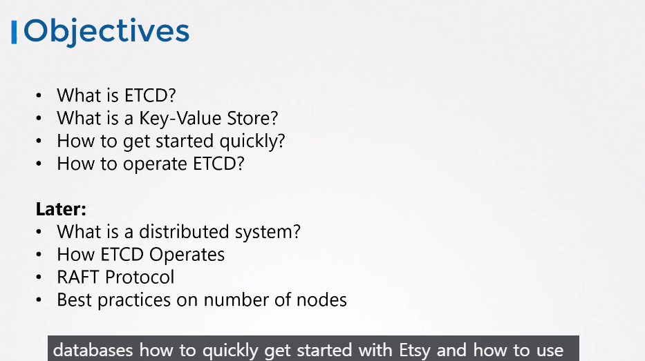
- We start with a basic introduction to what a key value stores and how it is different from traditional databases.
- How to quickly get started with ETCD and how to use the client tool to operate ETCD.
### 🔰 What is ETCD?
- It is distributed, reliable, key value store, that is simple, secure and fast.
### 🔰 What is a key-value store?
<columns>
	<column ratio="50">
		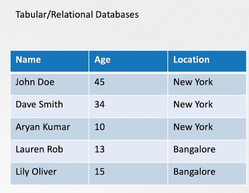
		- Traditional : the stored data in the form of rows and columns.
	</column>
	<column ratio="50">
		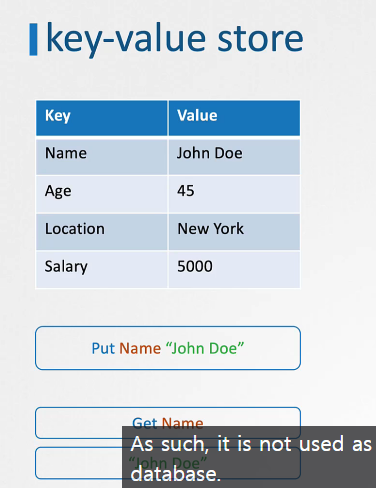
	</column>
</columns>
- key-value : A key value store stores information in a key and a value format.
	- You put a key and a value and it saves that in the database.
	- And then you get the key and it returns the value and you cannot have duplicate keys.
	- As such, it is not used as a replacement for a regular tablet database.
### 🔰 Install ETCD
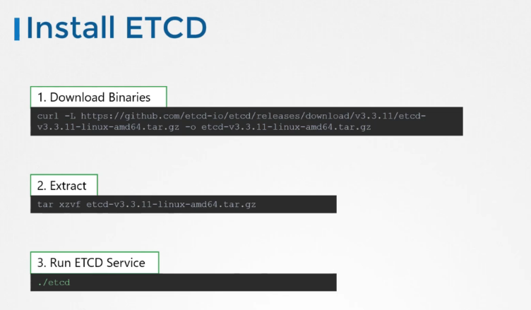
- Download the binary extracted and run.
- Download the relevant binary for your operating system from the GitHub release pages extracted and run.
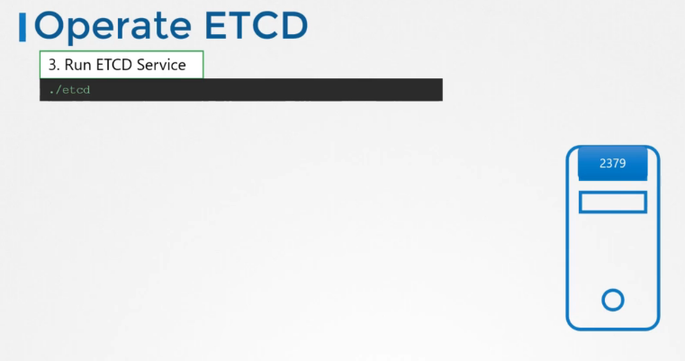
- When you run ETCD, It starts a service that listens on port 2379 by default.
- you can then attach any clients to the service to store and retrieve information.
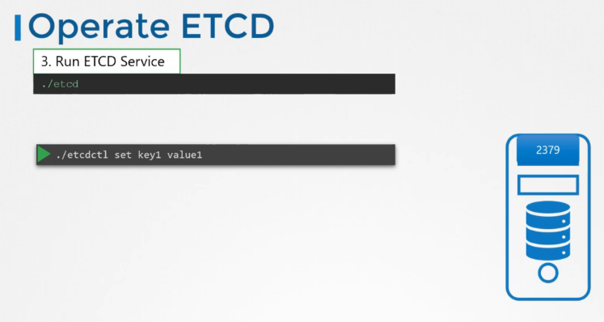
- A default client that comes with ETCD is the ETCD control client. The ETCD control client is a command line client for ETCD.
- You can use it to store and retrieve key value pairs to store a key value pair, run the ETCD control set key one command followed by the value - value1.
- This creates an entry in the database with the information.
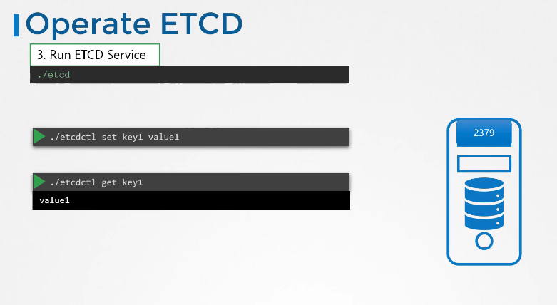
- To retrieve the stored data, run the ETCD control, get key one command.
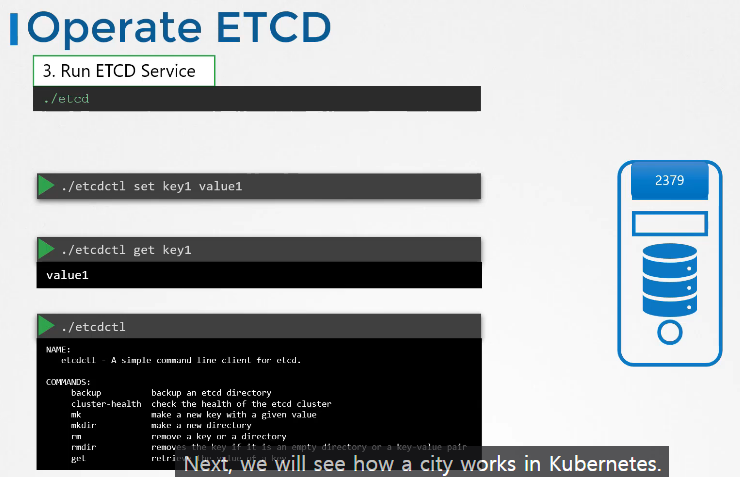
- To view more options on the ETCD control command without any argument.
# 13. ETCD in Kubernetes
### 🔰 ETCD’s role in Kubernetes
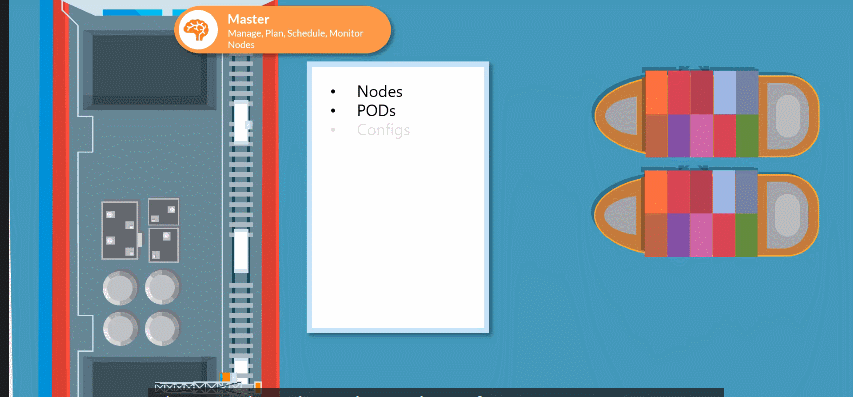
- The ETCD datastore stores information regarding the cluster such as the nodes, pods, configs, secrets, accounts, roles, bindings and others.
- Every information you see when you run the Kubectl get command is form the ETCD server.
- Every change you make to your cluster, such as adding additional nodes, deploying pods or replica sets are updated in the ETCD server.
- Only once it is updated in the ETCD server, is the change considered to be complete.
- Depending on how you setup your cluster, ETCD is deployed differently.
### 🔰 Two types of Kubernetes deployment : deployed from scratch and other using Kubeadm tool
1. URL that should be configured on the kube-api server when it tries to reach the ETCD server.
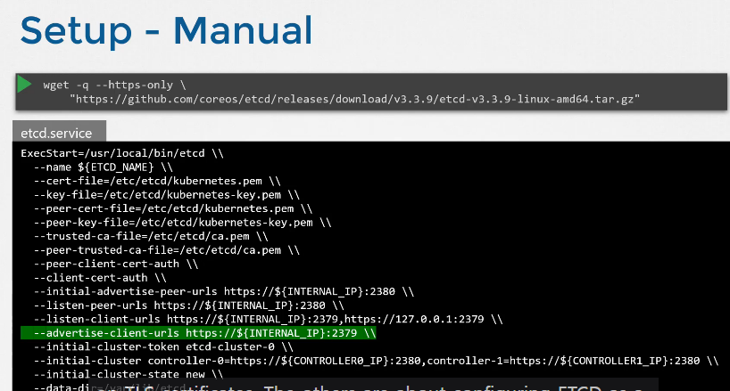
- If you set up your cluster from scratch then you deploy ETCD by downloading the ETCD binaries yourself, installing the binaries and configuring ETCD as a service in your master node yourself.
1. If you setup your cluster using kubeadm then kubeadm deploys the ETCD server for you as a POD in the kube-system namespace.
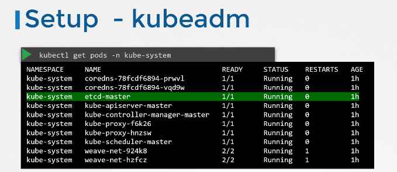
- You can explore the ETCD database using the ETCD control utility within this pod.
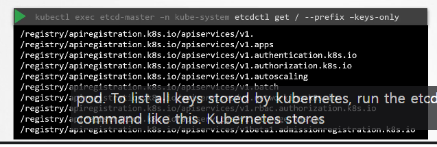
- To list all keys stored by kubernetes, run the ETCD control get command like this.
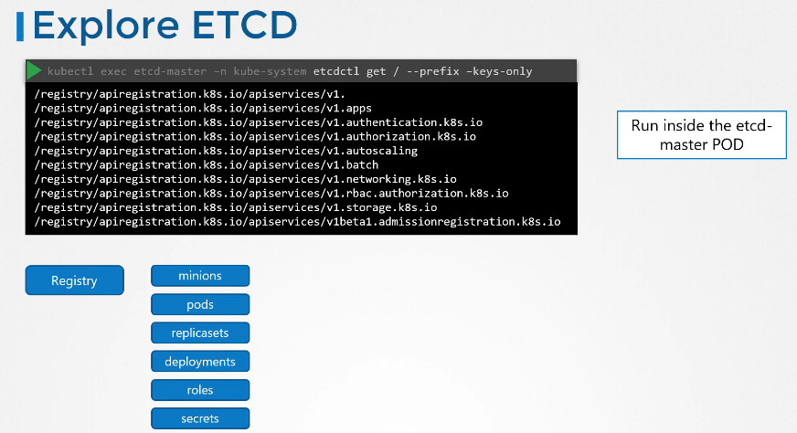
- Kubernetes data in the specific directory structure the root directory is a registry and under that you have the various Kubernetes constructs such as minions or nodes, pods, replicasets, deployments etc.
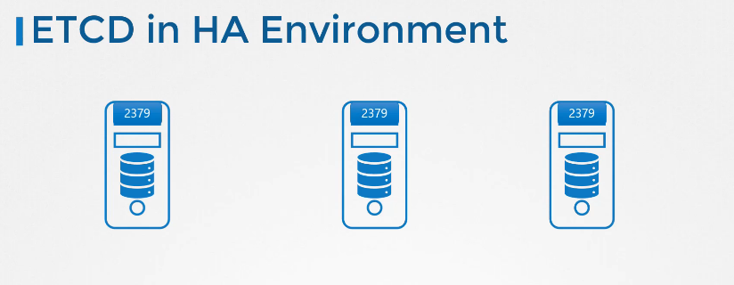
- In a high availability environment you will have multiple master nodes in your cluster then you will have multiple ETCD instances spread across the master nodes.
- In that case, make sure to specify the ETCD instances know about each other by setting the right parameter in the ETCD service configuration.
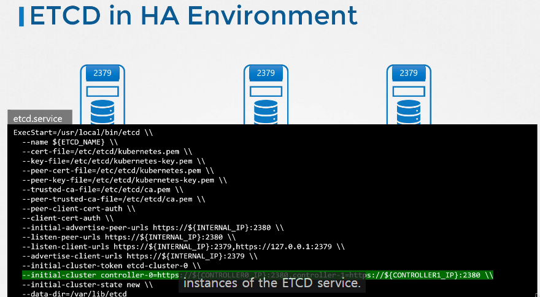
- The initial-cluster option is where you must specify the different instances of the ETCD service.
# 14. ETCD - Commands(Optional)
(Optional) Additional information about ETCDCTL UtilityETCDCTL is the CLI tool used to interact with ETCD.ETCDCTL can interact with ETCD Server using 2 API versions - Version 2 and Version 3.  By default its set to use Version 2. Each version has different sets of commands.
For example ETCDCTL version 2 supports the following commands:
`1. etcdctl backup<br>2. etcdctl cluster-health<br>3. etcdctl mk<br>4. etcdctl mkdir<br>5. etcdctl set`
Whereas the commands are different in version 3
`1. etcdctl snapshot save <br>2. etcdctl endpoint health<br>3. etcdctl get<br>4. etcdctl put`
To set the right version of API set the environment variable ETCDCTL_API command
`export ETCDCTL_API=3`
When API version is not set, it is assumed to be set to version 2. And version 3 commands listed above don't work. When API version is set to version 3, version 2 commands listed above don't work.
Apart from that, you must also specify path to certificate files so that ETCDCTL can authenticate to the ETCD API Server. The certificate files are available in the etcd-master at the following path. We discuss more about certificates in the security section of this course. So don't worry if this looks complex:
- `-cacert /etc/kubernetes/pki/etcd/ca.crt ``-cert /etc/kubernetes/pki/etcd/server.crt ``-key /etc/kubernetes/pki/etcd/server.key`
So for the commands I showed in the previous video to work you must specify the ETCDCTL API version and path to certificate files. Below is the final form:
`1. kubectl exec etcd-master -n kube-system -- sh -c "ETCDCTL_API=3 etcdctl get / --prefix --keys-only --limit=10 --cacert /etc/kubernetes/pki/etcd/ca.crt --cert /etc/kubernetes/pki/etcd/server.crt  --key /etc/kubernetes/pki/etcd/server.key"`
# 15. Kube-API Server
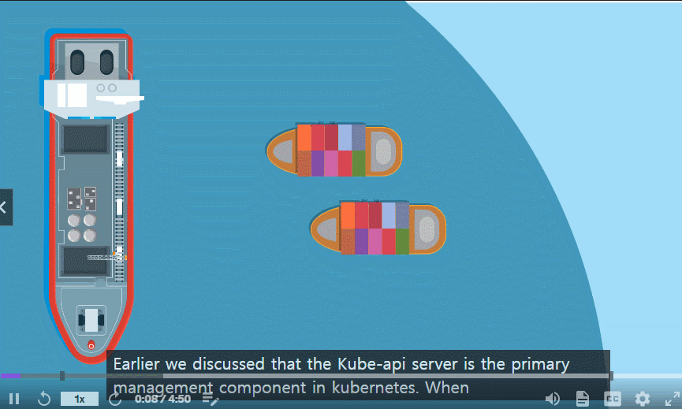
- Earlier we discussed that the kube-api server is the primary management component in kubernetes.
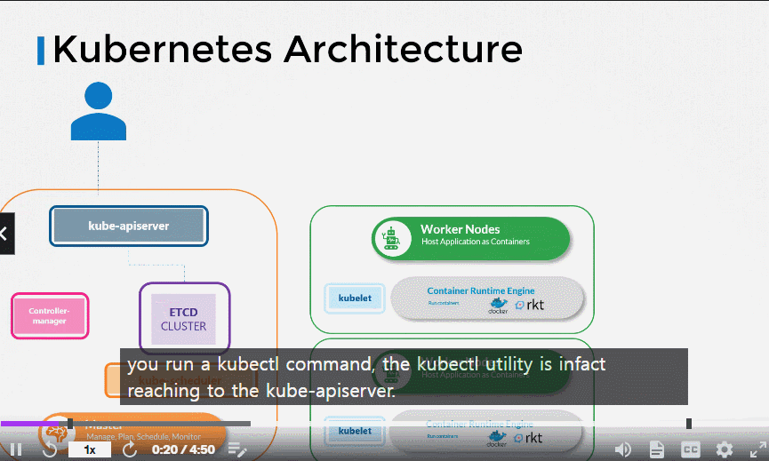
- When you run a kubectl command, the kubectl utility is infact reaching to the Kube-apiserver.
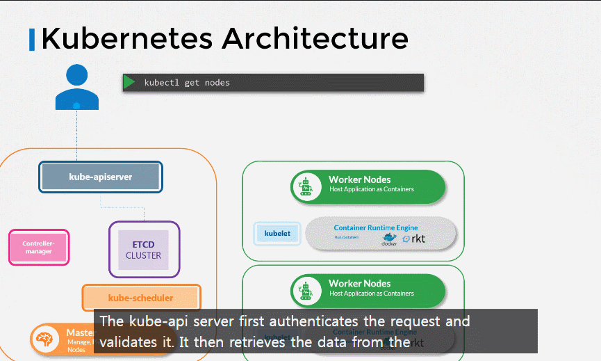
- The kube-api server first authenticates the request and validates it.
- It then retrieves the data from the ETCD cluster and responds back with the requested information.
- You don’t really need to use the kubectl command line.
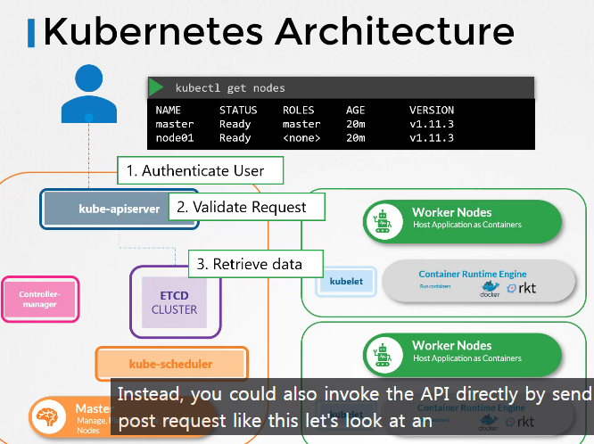
- Instead, you could also invoke the API directly by sending a post request like this(1, 2, 3).
- Let’s do that example of creating a pod when you do that as before the request is authenticated first and then validated.
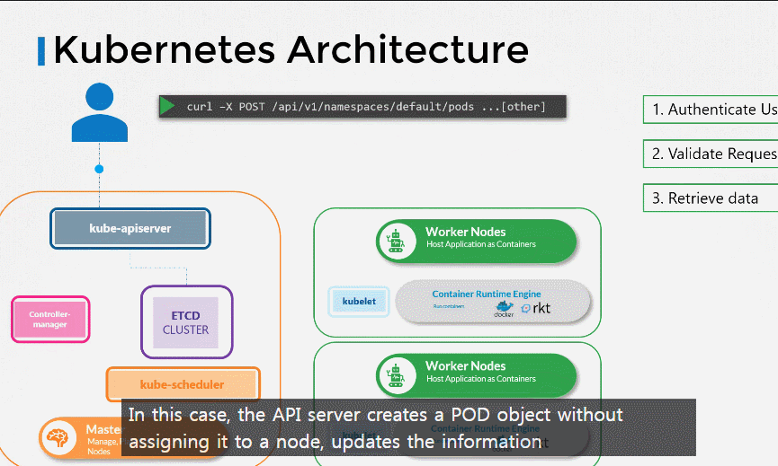
- In this case, the API server creates a POD object without assigning it to a node, updates the information in the ETCD server updates the user that the POD has been created.
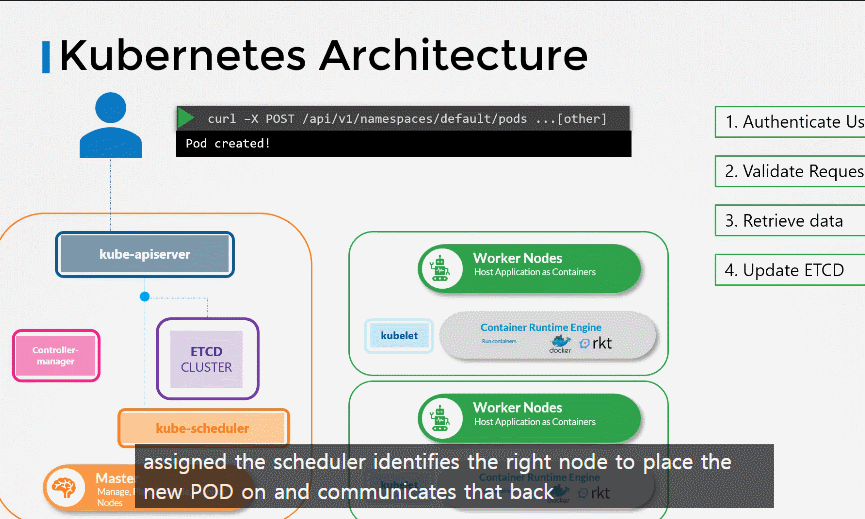
- The scheduler continuously monitors the API server and realizes that there is a new POD with no node assigned.
- The scheduler identifies the right node to place the new POD on and communicates that back to the kube-api server.
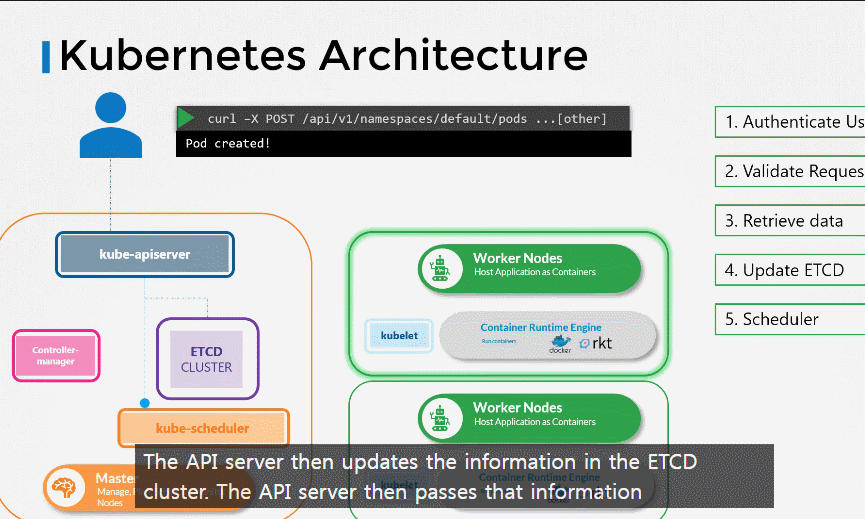
- The API server then updates the information in the ETCD cluster.
- The API server then passed that information to the kublet in appropriate worker node.
- The Kublet then creates the POD on the node and instructs the container runtime engine to deploy the application image.
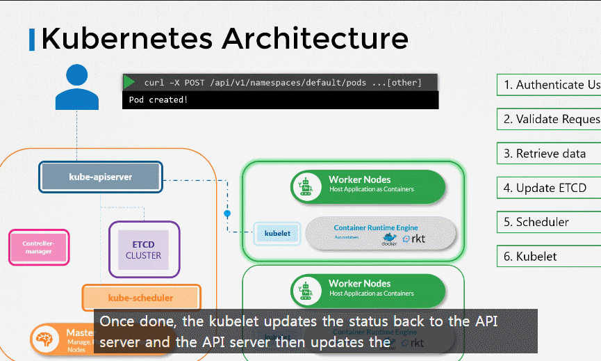
- Once done, the Kublet updates the status back to the API server and the API server then updates the data back in the ETCD cluster.
- A similar pattern is followed every time a change is requested.
- The Kube-api server is at the center of all the different tasks that needs to be performed to make a change in the cluster.
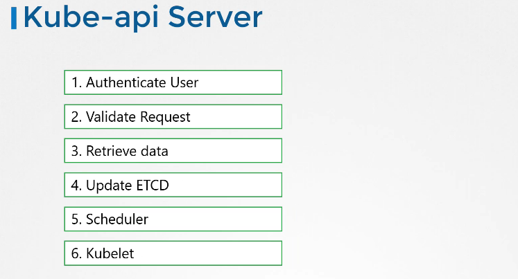
- To summarize, the Kube-api server is responsible for authenticating and validating requests, retrieving and updating data in ETCD data store, in fact, Kube-api server is the only component that interacts directly with the ETCD datastore.
- The other components such as the scheduler, kube-controller-manager and Kubelet  uses the API server to perform updates in the cluster in their respective areas.
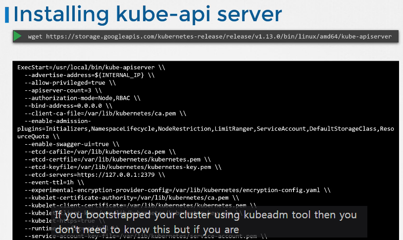
- If you bootstrapped your cluster using Kubeadm tool then you don’t need to know this but if you are setting up the hard way, then Kube-api server is avaliable as a binary in the Kubernetes realease page.
- Download it and configure it to run as a service on your kubernetes master node.
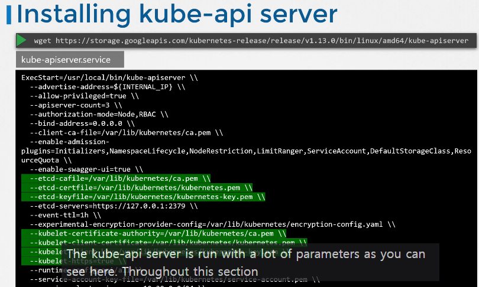
- The Kube-api server is run with a lot of parameters as you can see here.
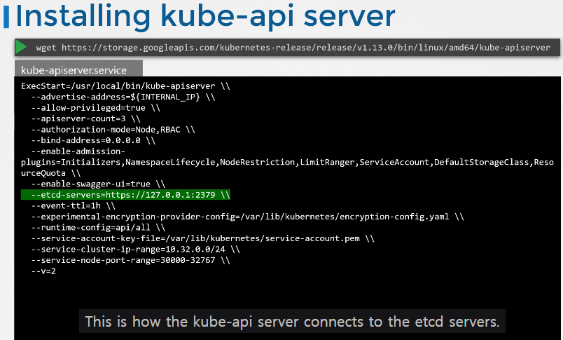
- The option ETCD-servers is where you specify the location of the ETCD servers.
- This is how the Kube-api server connects to the ETCD servers.
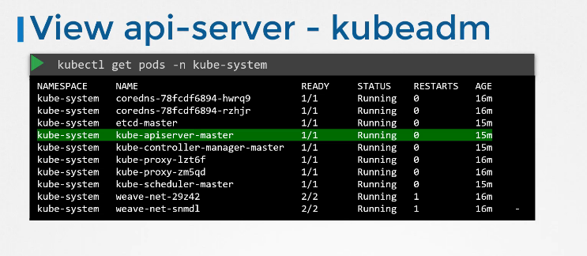
- So how do you view the Kube-api server options in an existing cluster. It depends on how you set up your cluster. If you set it up with Kubeadm tool, kubeadm deploys the Kube-api server as a pod in the Kube system namespave on the master node.
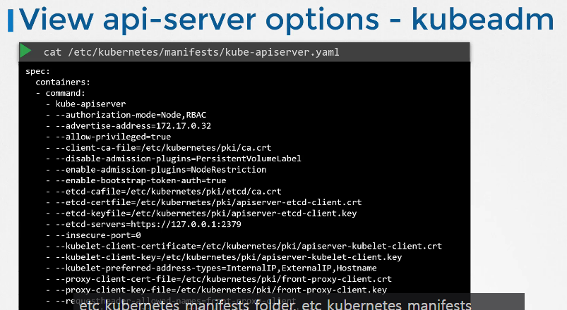
- You can see the options within the pod definition file located at this folder.
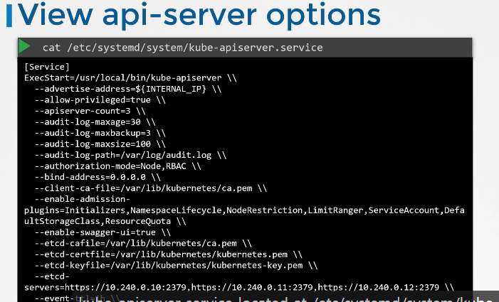
- If you none Kubeadm set up, you can insfact the option by viewing the Kube-api server service, located that above.
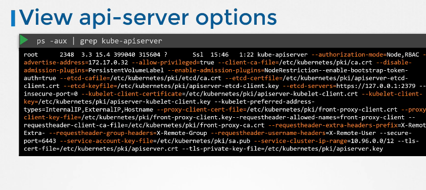
- You can alse see the running process and the effective options by listing the process on the master node and searching for Kube-api server.
# 16. Kube Controller Manager
- As we doscissed earlier, the Kube controller manager manages various controllers in Kubernetes.
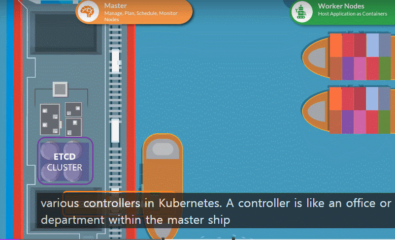
- A controller is like an office or department within the master ship that have their own set of responsibilities. Such as an office for the ships would be responsible for monitoring and taking necessary actions about the ships.
- Whenever a new ship arrives or when a ship leaves or gets destroyed. Another office could be one that containers on the ships. 
- They take care of containers that are damaged or full of ships.
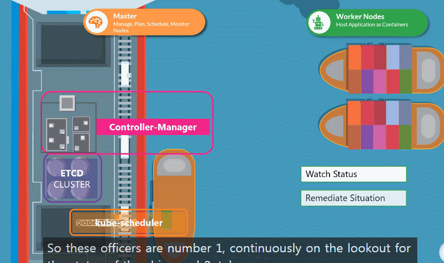
- So these officers are number 1, continuously on the lookout for the status of the ships.
- And 2, take necessary actions to remediate the situation.

- In the kubernetes terms, a controller is a process that continuously monitors the state of various components within the system and works towards bringing the whole system to the desired functioning state.

- For example, the node controller is responsible for monitoring the status of the nodes and taking necessary actions to keep the application running.

- It does that through the Kube-api server.

- Thee node controller checks the status of the nodes every 5 seconds.
- That way the node controller can monitor the health of the nodes

- If it stops receiving heartbeat from a node, the node is marked as unreachable but it waits for 40 seconds before making it unreachable.

- After a node is marked unreachable, it gives it five minutes to come back up.
- If it doesn’t, it removes the PODs assigned to that node and provisions them on the healthy ones. If the Pods are part of a Replica set.

- The next controller is Replication-Controller. It is responsible for monitoring the status of Replica sets and ensuring that the desired number of Pods are available at all times within the set.
- If a Pod dies, it creates another one.
### 🔰 Now those were just two examples of Controllers

- There are many more such controllers available within kubernetes.

- Whatever concepts we have seen so far in Kubernetes such as deployments, Services, namespaces, persistent volumes and persistent volumes and whatever intelligence is built into these construct. It is implemented through these various controllers.
- As you can imagine, this is kind of the brain behind a lot of things in Kubernetes.
- Now how do you see these controllers and where are they located in your cluster.

- They’re all packaged into a single process known as Kubernetes controller manager.
- When you install the Kubernetes controller manager, the different controller get installed as well.
- So, how do you install and view the Kubernetes controller manager.

- Download the Kube-controller-manager from the Kubernetes release page.
- Extract it and run it as a service.

- When you run it as you can see there are a list of options provided.
- This is where you provide additional options to customize your controller.

- Remember, some of the default settings for node controller we discussed earlier such as the node monitor period the grace period and the eviction timeout. These go in here as options.

- There is an additional option called controllers that you can use to specify which controller to enable. By default.
- All of them are enabled but you can choose to enable a select few.

- So in case any of your controllers, don’t seem to work or exist. This would be a good starting point to look at.
- So, How do you view the Kube-controller-manager server options?

- Again it depends on how you set up your cluster.

- If you set it up with Kubeadm tool, Kubeadm depoys the Kube-controller-manager as a Pod in the Kube system namespace on the master node.

- You can see the options within the Pod definition file located at Above. 

- In a non-kubeadm setup, you can inspect the options by viewing the kube-controller-manager service located at the services directory.

- You can also see the running process and the effective options by listing the process on the master node and searching for kube-controller-manager.
# 17. Kube Scheduler
- Earlier we discussed that the Kubernetes Scheduler is responsible for scheduling Pods on nodes.
- Remember, the Scheduler is only responsible for deciding which Pod goes on which node. 
- It doesn’t actually place the Pod on the nodes. That’s the job of the Kubelet. The Kubelet or the captain on the ship is who creates the Pod on the ships.
- The Scheduler only decides which Pod goes where.
### 🔰 Why do you need a Scheduler?

- When there are many ships and many containers, you want to make sure that the right container ends up on the right ship.

- For example, there could be different sizes of ships and containers.
- You want to make sure the ship has sufficient capacity to accommodate those container.
- Different ships maybe going to different destinations.

- You want to make sure your containers are placed on the right ships so they end up in the right destination.

- In Kubernetes, the Scheduler decides which nodes the Pods are placed on depending on certain criteria.
- You may have Pods with different resource requirements, you can have nodes in the cluster dedicated to certain applications.
- So how does the scheduler assign these Pods? The Scheduler looks at each Pod and tries to find the best node for it.

- For Example, Let’s take one of these Pods. The big blue one.
- It has a set of CPU and Memory requirements.
- The Scheduler goes through two phases to identify the best node for the pod.

- In the first phase, The Scheduler tries to filter out the nodes that do not fit the profile for this Pod.

- For example, the nodes that do not have sufficient CPU and memory resources requested by the Pod. So the first two small nodes are filtered out.
- So we are now left with two nodes on which the Pod can be placed.

- Now how does the Scheduler pick one from the two. The Scheduler ranks the node to identify the best fit for the Pod.
- It uses a priority function to assign a score to the nodes on a scale of 0 to 10.

- For example, the Scheduler calculates the amount of resources that would be free on the nodes after placing the Pod on them.

- In this case, the one on the right would have 6 CPUs free if the Pod was placed on it. Which is 4 more than the other one. So it gets a better rank. And so it wins. So that’s how a Scheduler works at a high level. And of course these can be customized and you can write your own Scheduler as well.

- There are many more topics to look at such as resource requirements, limit, taints, and tolerations, nodes selectors, affinity rules etc.

- Which is why we have an entire section dedicated to scheduling coming up in this course. Where we will discuss each of these in much more detail.
- For now, we will continue to focus on the Scheduler as a process at a high level.
### 🔰 How do you install the kube-scheduler?

- Download the kube-scheduler from the Kubernetes release page. Extract it and run it as a service. When you run it as a service, you specify the scheduler configuration file.
### 🔰 How do you view the kube-scheduler server options?

- Again, if you set it up with kubeadm tool, kubeadm deploys the kube-scheduler as a Pod in the kube-system namespace on the master node. You can see the options within the Pod definition file located at Above.

- You can also see the running process and the effective options by listing the process on the master node and searching for kube-scheduler.
# 18. Kubelet
- Earlier we discussed that the Kubelet is like the captain on the ship. They lead all activities on a ship.

- They’re the ones responsible for doing all the paperwork necessary to become part of the cluster, They’re the sole point of contact from the master ship. They load or unload containers on the ship as instructed by the scheduler on the master.
- They also send back reports at regular intervals on the status of the ship and the containers on them.

- The Kubelet in the Kubernetes worker node, registers the node with the Kubernetes cluster.

- When it receives instructions to load a container or a Pod on the node, it requests the container run time engine, which may be Docker, to pull the required image and run an instance.

- The Kubelet then continues to monitor the state of the Pod and the containers in it and reports to the kube-api server on a timely basis.
### 🔰 How do you install the Kubelet?

- If you use Kubeadm tool to deploy your cluster, it does not automatically deploy the Kubelet.
- Now that’s the different from the other components. You must always manually install the Kubelet on your worker nodes. Download the installer, extract it and run it as a service.

- You can view the running Kubelet process and the effective options by listing the process on the worker node and searching for Kubelet.
- We will look more into Kubelets, how to configure Kublets, generate cerificates, and finally how to TLS bootstrap Kublets later in this course. 
# 19. Kube Proxy

- With in Kubernetes cluster, every Pod can reach every other Pod.
- This is accomplished by deploying a Pod networking solution to the cluster.
- A Pod network is an internal virtual network that spans across all the nodes in the cluster to which all the Pods connect to.

- Through this network are able to communicate with each other. There are many solutions available for deploying such a network.
- In this case I have a web application deployed on the first node and a database application deployed on the second.
- The web app can reach the database, simply by using the IP of the database Pod.
- But there is no guarantee that the IP of the database part will always remain the same.
- If you’ve gone through the lecture on services as discussed in the beginners course, you must know that a better way for the web application to access the database is using a service.

- So we create a service to expose the database application across the cluster.

- The web application can now access the database using the name of the service DB.
- The service also gets an IP address assigned to it whenever a Pod tries to reach the service using its IP or name it forwards the traffic to the back end Pod. In this case the database.
- But what is this service and how does it get an IP? Does the service join the same Pod Network?
- The service cannot join the Pod network because the service is not an actual thing.
- It is not a container like Pod so it doesn’t have any interfaces or an actively listening process.
- It is a virtual component that only lives in the cabinet as memory.
- But then we also said that the service should be accessible across the cluster from any not.

- So, how is that achieved? That’s where kube-proxy comes in.

- Kube-proxy is a process that runs on each node in the Kubernetes cluster.
- Its job is to look for new services and every time a new service is created it, It creates the appropriate rules on each node to forward traffic to those services to the backend Pods.

- One way it does this is using IP tables rules. In this case, it creates an IP tables rule on each node in the cluster to forward traffic heading to the IP of the service which is 10.96.0.12 to the IP of the actual Pod which is 10.32.0.15.
- So that’s how kube-proxy configure the service. We discuss a lot more about networking and services kube-proxy and Pod networking.
### 🔰 How to install kube-proxy

- Download the kube-proxy binary from the Kubernetes release page. Extract it and run it as a service.

- The Kubeadm tool deploys kube-proxy as Pods on each node.

- In fact it is deployed as a deamon set, so a single Pod is always deployed on each node in the cluster.
- If you don’t know about deamon set yet, don’t worry we have a lecture on that coming up in this course. We have now covered a high-level overview of the various components in the Kubernetes control plane.
# 20. Recap - PODs

- Before we head int understanding pods, we would like to assume that the following have been set up already. At this point, we assume that the application is already developed and built into Docker images and it is available on a Docker repository like Docker Hub. So Kubernetes can pull it down.
- We also assume that the Kubernetes cluster has already been set up and is working.
- This could be a single node setup or a multi node setup. Doesn’t matter. All the services need to be in a running state.

- As we discussed before with Kubernetes, our ultimate aim is to deploy our application in the form of containers on a set of machines that are configured as worker nodes in a cluster.
- However, Kubernetes does not deploy containers directly on the worker nodes.

- The containers are encapsulated into a Kubernetes object known as Pods.
- A Pod is a single instance of an application. A Pod is the smallest object that you can create in Kubernetes.

- Here we see the simplest of simplest cases where you have a single node, Kubernetes cluster with a single instance of your application running in a single Docher container encapsulated in a Pod.

- What if the number of users accessing your application increase and you need to scale your application, you need to add additional instances of your web application to share the load.
<columns>
	<column ratio="50">
		
	</column>
	<column ratio="50">
		
	</column>
</columns>
- Now, where would you spin up additional instances? Do we bring up new container instance within the same Pod? ⇒ No, we create new Pod altogether with a new instance of the same application.

- As you can see, we now have two instances of our web application running on two separate Pods on the same Kubernetes system or node.

- What if the user base further increase and your current node has no sufficient capacity?

- Well, then you can always deploy additional Pods on a new node in the cluster. You will have a new node added to the cluster to expand the clusters physical capacity.
- So what I’m trying to illustrate in this slide is that Pods usually have a 1 to 1 relationship with containers running your application.
- To scale up, you create new Pods and to scale down, you delete existing Pod. You don’t add additional containers to an existing Pod to scale your application.
- Also, If you’re wondering how we implement all of this and how we achieve load balancing between the containers, etc, we will get into all of that in a later lecture.

- But are we restricted to having a single container in a single Pod? ⇒ No. A single Pod can have multiple containers except for the fact that they are usually not multiple containers of the same kind.
- As we discussed in the previous slide, if our intention was to scale our application, then we would need to create additional Pods.

- But sometimes you might have a scenario where you have a helper container that might be doing some kind of supporting task for our web application, such as processing a user, enter data, processing a file, uploaded by the user, etc.
- And you want these helper containers to live alongside your application container.
- In that case, you can have both of these containers part of the same Pod, so that when a new application container is created, the helper is also created, and when it dies, the helper also dies since they are part of the same Pod.
- The two containers can also communicate with each other directly by referring to each other as local host since they share the same network space.
- Plus they can easily share the same storage space as well.

- Let’s for a moment keep Kubernetes out of our discussion and talk about simple Docker containers. Let’s assume we were developing a process or a script to deploy our application on a Docker host.
- Then we would first simply deploy our application using a simple Docker run, Python App Command, and the application runs fine and our users are able to access it.

- When the load increases, we deploy more instances of our application by running the Docker run commands many more times.
- This works fine and we’re all happy now sometime in the future. But our application is further developed, undergoes architectural changes and grows and gets complex. We now have a new helper container that helps our web application by processing or fetching data from elsewhere.

- These helper containers maintain a 1 to 1 relationship with our application container and thus need to communicate with the application containers directly and access data from those containers.
- For this, we need to maintain a map of what app and help our containers are connected to each other.

- We would need to establish network connectivity between these containers ourselves using links and custom networks, we would need to create shareable volumes and share it among the containers. We would need to maintain a map of that as well.
- And most importantly, we would need to monitor the state of the application container and when it dies, manually kill the helper container as well as it’s no longer required.

- When a new container is deployed, we would need to deploy the new helper container as well. With Pods Kubernetes does all of this for us automatically, we just need to define what containers a Pods consist of, and the containers in a Pod by default will have access to the same storage, the same network namespace and same fate as in they will be created together and destroyed together.
- Even if our application didn’t happen to be so complex and we could live with a single container, Kubernetes still requires you to create Pods, but this is good in the long run, as your application is now equipped for architectural changes and scale in the future.
- However, also note that multi Pod containers are a rare use case and we’re going to stick to single containers per Pod in this course.
### 🔰 How to deploy Pods

- Earlier, we learned about the kube control run command.
- What this command really does is it deploys a Docker container by creating a Pod. It first creates a Pod automatically and deploys an instance of the Nginx Docker image.
- But where does it get the application image from?

- For that, you need to specify the image name using the image parameter.
- The application image, in this case, the Nginx image is downloaded from the Docker Hub repository.
- Docker Hub, as we discussed, is a public repository where latest Docker images of various applications are stored.
- You could configure Kubernetes to pull the image from the public Docker Hub or a private repository within the organization.
- Now that we have a Pod created, how do we wee the list of Pods available?

- The kube control get Pod command helps us see the list of Pods in our cluster.
- In this case, wee see the Pod is in a container creating state and soon changes to a running state when it is actually running.

- Also remember that we haven’t really talked about the concepts on how a user can access the Nginx Web Server. And so in the current state, we haven’t made the web server accessible to external users, you can access it internally from the node, but for now we will just see how to deploy a Pod.
- And later, in a later lecture, once we learn about networking and services, we will get to know how to make this service accessible to end users.
# 21. PODs with YAML
- Kubernetes uses YML files as input for the creation of objects such as Pods, Replicas, Deployments, Services, etc. All of these follow a similar structure.

- A Kubernetes definition file always contains for top level fields the API version, kind, metadata and spec. These are the top level or root level properties.
- These are also required fields, so you must have them in your configuration file.
- `apiVersion` : This is the version of the Kubernetes API we are using to create the object. Depending on what we are trying to create, we must use the right API version.

- For now, since we are working on parts, we will set the API version as we one few other possible values for this field are ‘apps/v1’ etc.

- `kind` : The kind refers to the type of object we are trying to create, which in this case happens to be a Pod. So we will set it as Pod. Some other possible values here could be Replica Set or Deployment or Service, which is what you see in the kind field in the table on the right.

- `metadata` : The metadata is data about the object like its name, labels, etc.

- As you can see, unlike the first two where you have specified a String value, this is in the form of a Dictionary.

- So everything under metadata is intended to the right a little bit. And so names and labels are children of metadata.

- The number of spaces before the two properties, name and labels doesn’t matter, but they should be the same as they are siblings.

- In this case, labels has more spaces on the left than name, and so it is now a child of the name property instead of a sibling, which is incorrect.

- Also, the two properties must have more spaces than its parent, which is metadata, so that it’s intended to the right a little bit. In this case, all three of them have the same number of spaces before them, and so they are all siblings, which is not correct. 

- Under the metadata, the name is a String value. So you can name your Pod. ‘my app’ Pod. 
- And a labels is a dictionary within the metadata dictionary. And it can have any key and value pairs, as you wish. For now I have added a label app with the value ‘my app’.
- Similarly, you could add other labels as you see fit, which will help you identify these objects at a later point in time. For Example, there are hundreds of Pods running a Frontend application and hundreds of Pods running a Backend application or a Database. It will be difficult for you to group these Pods once they are deployed.

- If you label them now as Frontend, Backend or Database, you will be able to filter the Pods based on this label at a later point in time.
- It’s important to note that under metadata, you can only specify name or labels or anything else that Kubernetes expects to be under metadata. You cannot add any other property as you wish under this. However, under labels, you can have any kind of key or value pairs as you see fit. So It’s important to understand what each of these parameters expect.
- So far, we have only mentioned the type and name of the object we need to create, which happens to be a Pod with a name ‘my app’ Pod. But we haven’t really specified the container or image we need in the Pod.
- The last section in the configuration file is the specification section, which is written as spec depending on the object we are going to create. This is where we would provide additional information to Kubernetes pertaining to that object. This is going to be different for different objects.
- Since we are only creating a Pod with a single container in it, it is easy.

- `spec` : is a dictionary, so add a property under it called containers. Container is a list or an array. The reason this property is a list is because the Pod can have multiple containers within them, as we learned in the lecture earlier.
- In this case, though, we will only add a single item in the list since we plan to have only a single container in the Pod.

- The dash right before the name indicates that this is the first item in the list. The item in the list is a dictionary, so add a name and image property.
- The value for image is ‘nginx’, which is the name of the Docker Image in the Docker repository.

- Once the file is created from the command kubectl, create that ‘-f’ followed by the file name, which is ‘pod-definition.yml’ and Kubernetes creates the Pod.
- So to summarize, remember the four top level properties API version, kind, metadata and spec. Then start by adding values to those depending on the object you are going to create.

- Once we create the Pod, How do you see it? Use the kubectl, get Pods command to see a list of Pods available.

- In this case, it’s just one to see detailed information about the Pod, run the kubectl describe Pod command.
- This will tell you information about the Pod when it was created, what labels are assigned to it, what Docker containers are a part of it, and the events associated with the Pod.
# 22. Demo - PODs with YAML
- Our goal is to create a YML file with the Pod specifications in it. You could just create one in any text editor, so if you’re on windows you could just use notepad, or if you’re on Linux as I am, just use a native editor like VI or VIM, an editor with support for YML language would be very helpful in getting the syntax right.
- For now, let’s take with the very basic form of creating a YML file using VI editor on my Linux system.

- So here I am on my Linux terminal and I’m going to make use of Vim text based editor to create this Pod definition file.

```shell
apiVersion: v1
kind: Pod
metadata:
	name: nginx
	labels: # labels is also a dictionary and it can have as many labels as you want under it.
		app: nginx
		tier: frontend
spec: # spec is also a dictionary and it has an object called Containers.
	containers:
```
- So before we move on to that, we have to make sure that we get the indentation right. For example, the app and tire are children of the labels properties, so it has to be in the same kind of vertical line here. And similarly, under metadata, you have name and labels which are the children of metadata. So they both have to be within the same vertical line. So you have to make sure that the spacing is correct. Not recommend using Tab, But always stick to two space.

```shell
apiVersion: v1
kind: Pod
metadata:
	name: nginx
	labels: # labels is also a dictionary and it can have as many labels as you want under it.
		app: nginx
		tier: frontend
spec: # spec is also a dictionary and it has an object called Containers.
	containers: # A container is a list of objects.
	- name: nginx #1
	  image: nginx #2
```
- container: Now we first give it a name, note that his is the name of the container within the Pod and there could be multiple containers and each can have a different name.
	- #1: So one container could be named app and another container could be named helper.
	- #2: Any name that makes sense to you, we’re going to use the same name as that of the container image, so we will just name it nginx. And the second object that we’re going to add here is the image name, which is the Docker hub image name of the container that we’re going to create.
- The Image named nginx - If you’re using other registries than Docker Hub, then make sure to specify the full path to that image repository here.

```shell
apiVersion: v1
kind: Pod
metadata:
	name: nginx
	labels: 
		app: nginx
		tier: frontend
spec: 
	containers: 
	- name: nginx 
	  image: nginx 
	- name: busybox
		image: buxybox
```
- Now, remember that we can add additional containers to the Pod as well. So if you have to do that, we have to declare the secondary element to the list, which would be the second object in the list.

- So in this case, we’re going to stick to one single container. So I’m going to just delete that. And I’m going to hit escape `:wq!` to save this file.

- And we will just use the `cat` command to make sure that the file was created with the expected contents.

- So we can make use of the `kubectl create` command or `kubectl apply` command, so the create and apply command kind of works the same. If you’re creating a new object. And we pass in the file name using the -f option and here we can see that the Pod has been created.

- So let’s check the status real quick. And you can see that it’s in container creating state. And then when we check again, we see that it’s in a running state.


- And as before, If you want to get more details about the Pod, you can always run the `kubectl describe` command and specify the name of the Pod. And you should get a much more in-depth information about the Pod.
- In the next section, we will learn some tips and tricks of developing YML files and easily using IDEs.
# 23. Practice Test Introduction
- [https://kodekloud.com/topic/practice-test-pods-2/](https://kodekloud.com/topic/practice-test-pods-2/)
# 24. Demo: Accessing Labs
All hands-on labs are hosted on KodeKloud. Use this link to register for the labs associated with this course.  Please make sure to use the same name as your profile in Udemy. That's how we know you are our Udemy student.
Note: You don't have to make any additional payment.
**Link:** [https://uklabs.kodekloud.com/courses/labs-certified-kubernetes-administrator-with-practice-tests/](https://uklabs.kodekloud.com/courses/labs-certified-kubernetes-administrator-with-practice-tests/)
Apply the coupon code **udemystudent151113**
# 25. Accessing the Labs
- Link to the practical test: [https://uklabs.kodekloud.com/topic/practice-test-pods-2/](https://uklabs.kodekloud.com/topic/practice-test-pods-2/)
# 26. Practice Test - Pods
- 생략
# 27. Practice Test - Solution(Optional)
- 생략
# 28. Recap - ReplicaSets
- Controllers are the brain behind Kubernetes. They are the process that monitor Kubernetes objects and respond accordingly.
- In this lecture, we will discuss about one controller on particular, and that is the replication controller.
### 🔰 what is a Replica and why do we need a replication controller?
- Let’s go back to our first scenario where we had a single Pod running our application. 

- What if for some reason our application crashes and the Pod fails, users will no longer be able to access our application. To prevent users from losing access to our application, we would like to have more than on instance or Pod running at the same time. That way, if one fails, we still have our application running on the other one.

- The Replication Controller helps us run multiple instances of a single Pod in the Kubernetes cluster, thus providing high availability.

- So does that mean you can’t use a Replication Controller if you plan to have a single Pod? ⇒ No.

- Even if you have a single Pod, the Replication Controller can help by automatically bringing up a new Pod when the existing one fails.
- Thus the Replication Controller ensures that the specified number of Pods are running at all times, even if it’s just one or 100.
- Another reason we need a Replication Controller is to create multiple Pod to share the load across them.

- For example, in this simple scenario, we have a single Pod serving a set of users. When the number of users increase, we deploy additional Pod to balance the load across the two Pods.

- If the demand further increase and if we were to run out of resources on the first node, we could deploy additional Pods across the other nodes in the cluster. As you can see, the Replication Controller spans across multiple nodes in the cluster. It helps us balance the load across multiple Pods on different nodes as well as scale our application when the demand increases.

- It’s important to note that there are two similar terms Replication Controller and Replica Set. Both have the same purpose, but they are not the same.
- Replication controller is the older technology that is being replaced by Replica Set. Replica Set is the new recommended way to set up replication.
- However, whatever we discussed in the previous few slides remain applicable to both these technologies. There are minor differences in the way each works and we will look at that in a bit.
- As such, we sill try to stick to Replica Sets in all of our demos and implementation going forward.
### 🔰 How we create a Relocation Controller

- As with the previous lecture, we start by creating a Replication Controller definition file. We will name it rc-definition.yml. As with any Kubernetes definition file, we have four sections the apiVersion, kind, metadata, spec.
- The apiVersion is specific to what we are creating. In this case, Replication Controller is supported in Kubernetes apiVersion v1, so we will set it as v1.
- The kind as we know is Replication Controller.

- Under metadata, we will add a name and we will call it ‘myapp-rc’ and we will also add a few labels app and type and assign values to them.
- So far it has been very similar to how we created a Pod in the previous section.
- The next is the most crucial part of the definition file and that is the specification written as spec. For any Kubernetes definition file, the spec section defines what’s inside the object we are creating. In this case, we know that the Replication Controller creates multiple instances of a Pod. But what Pod?

- We create a template section under spec to provide a Pod template to be used by the Replication Controller to create replicas.
- Now, how do we defined the Pod template? It’s not that hard because we have already done that in the previous exercise.

- Remember, we created a pod-definition file in the precious exercise. We could re-use the contents of the file to populate the template section.

- Move all the contents of the pod-definition file into the template section of the Replication Controller. Except for the first few lines which are apiVersion and kind.

- Remember, whatever we move must be under the template section meaning they should be intended to the right and have more spaces before them than the template line itself. They should be children of the template section.
<columns>
	<column ratio="50">
		
	</column>
	<column ratio="50">
		
	</column>
</columns>
- Looking at our file now, we now have two metadata sections, one is for the Replication Controller and another for the Pod. And we have two aspects sections one for each.
- We have nested two definition files together. The Replication Controller being the parent and the pod-definition being the child. Now there is something still missing. We haven;t mentioned how many replicas we need in the Replication Controller.

- For that, add another property to the spec called replicas and input the number of replicas you need under it. Remember that the template and replicas are direct children of spec sections, so they are siblings and must be on the same vertical line, which means having equal number of spaces before them.

- Once the file is ready, run the kubectl create command and input the file using the -f parameter. The Replication controller is created when the Replication Controller is created. It first creates the Pods using the pod-definition template as many as required, which is 3 in this case.

- To view the list of create Replication Controllers, run the kubectl get replication controller command and you will see the Replication Controller listed. We can also see the desired number of replicas or Pods, the current number of replicas, and how many of them are already in the output.

- If you would like to see the Pods that were created by the Replication Controller, run the kubectl get pods command and you will see 3 Pods running. Note that all of them are starting with the name of the Replication Controller, which is ’myapp-rc’ indication that they are all created automatically by the Replication Controller.
- What we just saw was the Replication Controller. Let us now look at Replica Set. It is very similar to Replication Controller.
- As usual, first we have apiVersion, kind, metadata, and spec. The apiVersion though is a bit different. It is ‘apps/v1’, which is different from w hat we had before for application controller, which was just ‘v1’.

- If you get this wrong, you are likely to get an error that looks like this. It would say no match for kind Replica Set because the specified Kubernetes apiVersion has no support for Replica Set.

- The kind would be Replica Set and we add name and labels in the metadata.

- The specification section looks very similar to Replication Controller. It has a template section where we provide pod-definition as before.

- So I’m going to copy contents over from pod-definition file and we have number of replicas, which is set to 3.
- However, there is one major difference between Replication Controller and Replica Set. Replica Set requires a selector definition. The selector section helps the Replica Set identify what Pods fall under it.
- But why would you have to specify what Pods fall under it? If you have provided the contents of the pod-definition file itself in the template. It’s because Replica Set can also manage Pods that were not created as part of the Replica Set creation. Say, for example, the reports created before the creation of the Replica Set that match labels specified in the selector, the Replica Set will also take those Pods into consideration when creating the replicas. I will elaborate this in the next slide.
- But before we get into that, I would like to mention that the selector is one of the major differences between Replication Controller and Replica Set. The selector is not a required field in case of a Replication Controller, but it is still available when you skip it, as we did in the previous slide, It assumes it to be the same as the labels provided in the pod-definition file.

- In case of Replica Set, a user input is required for this property and it has to be written in the form of match labels as shown here.
- The match labels selector simply matches the labels specified under it to the labels on the Pod. The Replica Set selector also provides many other options for matching labels that were not available in a Replication Controller.

- And as always, to create a Replica Set, run the kubectl create command, providing the definition file as input.


- And to see the created replicas, run the kubectl get replica set command to get list of Pods, simply run the kubectl get pod command.

- Why do we label our Pods and objects in Kubernetes? Let us look at a simple scenario. Say we deployed three instances of our front end web application as 3 Pods. We would like to create a Replication Controller or Replica Set to ensure that we have 3 active Pods at any time. And yes, that is one of the use cases of Replica Sets. You can use it to monitor existing Pods if you have them already created assets in this example, in case they were not created, the Replica Set will create them for you. The role of the Replica Set is to monitor the Pods and if any of them were to fail, deploy new ones. The Replica Set is in fact a process that monitors the Pods.
### 🔰 How does the Replica Set know what Pods to monitor?

- There could be hundreds of other Pods in the cluster running different applications. This is where labeling our Pods during creation comes in handy.

- We could now provide these labels as a filter for Replica Set.

- Under the selector section we use the match labels filter and provide the same label that we used while creating the Pods. This way the Replica Set knows which Pods to monitor. The same concept of labels and selectors is used in many other places throughout Kubernetes.

- Now, let me ask you a question along the same lines. If the Replica Set specification section, we learn that there are 3 sections template replicas and the selector. We need 3 replicas and we have updated our selector based on our discussion in the previous slide.
- Say, for instance, we have the same scenario as in the previous slide where we have 3 existing Pods that were created already and we need to create a Replica Set to monitor the Pods to ensure there are a minimum of 3 running at all times. When the Replication Controller is created, it is not going to deploy a new instance of Pods as 3 of them with matching labels are already created.

- In that case, do we really need to provide a template section in the Replica Set specification since we are not expecting the Replica Set to create a new Pods on deployment? ⇒ Yes. because in case one of the Pods were to fail in the future, the Replica Set needs to create a new one to maintain the desired number of Pods and for the Replica Set to create a new Pod, the template definition section is required.
### 🔰 How we scale the Replica Set

- Say we started with 3 replicas. In the future, we decided to scale to 6. How do we update our Replica Set to scale to 6 replicas?

- The first is to update the number of replicas in the definition file to 6. Then run the kubectl replace command to specify the same file using the -f parameter and that will update the Replica Set to have 6 replicas.

- The second way to do it is to run the kubectl control scale command, use the replicas parameter to provide the new number of replicas and specify the same file as input.

- You may either input the definition file or provide the Replica Set name in the type name format.
- However, remember that using the file name as input will not result in the number of replicas being updated automatically in the file. In other words, the number of replicas in the Replica Set definition file will still be there. Even though you scaled your Replica Set to have 6 replicas using the kubectl scale command and the file as input.
- There are also options available for automatically scaling the Replica Set based on load, but that is an advanced topic and we will discuss it at a later time.
### 🔰 Review the commands real quick

- The kubectl create command, as we know, is used to create a Replica Set or basically any object in Kubernetes, depending on the file we are providing as input. You must provide the input file using the -f parameter.

- Use the kubectl get command to see a list of Replica Set created.

- Use the kubectl delete Replica Set command followed by the name of the Replica Set to delete the Replica Set.

- Then we have the kubectl replace command to replace or update the Replica Set.
```shell
> kubectl scale -replicas=6 -f replicaset-definition.yml
```
- The kubectl scale command scale Replica Set simply from the command line without having to modify the file.
# 29. Practice Test - ReplicaSets
## Note: All questions target the default namespace, unless specified otherwise.
Practice Test Link: [https://uklabs.kodekloud.com/topic/practice-test-replicasets-2/](https://uklabs.kodekloud.com/topic/practice-test-replicasets-2/)
# 30. Practice Test - ReplicaSets - Solution(Optional)
- 생략
# 31. Deployments

- For example, you have a web server that needs to be deployed in a production environment.

- You need not one, but many such instances of the web server running for obvious reasons.

- Secondly, whenever newer versions of application builds become available on the Docker registry you would like to upgrade your Docker instances seamlessly.
- However when you upgrade your instances you do not want to upgrade all of them at once at we just did.

- This may impact users accessing our applications, so you might want to upgrade them one after the other. And that kind of upgrade is known as rolling updates.

- Suppose one of the upgrades you performed resulted in an unexpected error and you’re asked to undo the recent change, you would like to be able to roll back the changes that were recently carried out.
- Finally, say for example you would like to make multiple changes to your environment such as upgrading the underlying web server versions, as well as scaling your environment and also modifying the resource allocations etc.

- You do not want to apply each change immediately after the command is run instead, you would like to apply a pause to your environment, make the changes and then resume so that all changes are rolled-out together.
- All of these capabilities are available with the Kubernetes Deployments.

- So far in this course, we discussed about Pods, which deploy single instances of our application such as the web application in this case. Each container is encapsulated in Pods. 

- Multiple such Pods are deployed using Replication Controller or Replica Sets. 

- And then comes Deployment which is a Kubernetes object that comes higher in the hierarchy. The deployment provides us with the capability to upgrade the underlying instances seamlessly using rolling updates, undo changes, and pause and resume changes as required.
### 🔰 How do we create a Deployment?
<columns>
	<column ratio="50">
		
	</column>
	<column ratio="50">
		
	</column>
</columns>
- We first create a deployment definition file. The contents of the deployment definition file are exactly similar to the Replica Set definition file, except for the kind, which is now going to be Deployment.
- If we walk through the contents of the file it has an apiVersion which is ‘apps/v1’, metadata which has name and labels and a spec that has template, replicas and selector.

- The template has a pod definition inside it. Once the file is ready run the kubectl create command and specify the Deployment definition file. 
- Then run the kubectl get deployments command to see the newly created Deployment. The Deployment automatically creates a Replica Set. 
- So If you run the kubectl get replicaset command, you will be able to see a new Replica Set in the name of the deployment. 
- The Replica Set ultimately create Pods, So If you run the kubectl get pods command, you will be able to see the Pods with the name of the Deployment and the Replica Set.
- So far there hasn’t been much of a difference between Replica Set and Deployments except for the fact that Deployments created a new Kubernetes object called Deployments.
- We will see how to take advantage of the deployment using the use cases we discussed in the previous slide in the upcoming lectures. 
### 🔰 Commands

- All the created objects at once run the kubectl get all command and in this case we can see that the Deployment was created and then we have the Replica Set followed by three Pods that were created as part of the Deployment.
# 32. Certification Tip!
Here's a tip!
As you might have seen already, it is a bit difficult to create and edit YAML files. Especially in the CLI. During the exam, you might find it difficult to copy and paste YAML files from browser to terminal. Using the `kubectl run `command can help in generating a YAML template. And sometimes, you can even get away with just the `kubectl run` command without having to create a YAML file at all. For example, if you were asked to create a pod or deployment with specific name and image you can simply run the `kubectl run` command.
Use the below set of commands and try the previous practice tests again, but this time try to use the below commands instead of YAML files. Try to use these as much as you can going forward in all exercises
Reference (Bookmark this page for exam. It will be very handy):
[https://kubernetes.io/docs/reference/kubectl/conventions/](https://kubernetes.io/docs/reference/kubectl/conventions/)
**Create an NGINX Pod**
`kubectl run nginx --image=nginx`
**Generate POD Manifest YAML file (-o yaml). Don't create it(--dry-run)**
`kubectl run nginx --image=nginx --dry-run=client -o yaml`
**Create a deployment**
`kubectl create deployment --image=nginx nginx`
**Generate Deployment YAML file (-o yaml). Don't create it(--dry-run)**
`kubectl create deployment --image=nginx nginx --dry-run=client -o yaml`
**Generate Deployment YAML file (-o yaml). Don't create it(--dry-run) with 4 Replicas (--replicas=4)**
`kubectl create deployment --image=nginx nginx --dry-run=client -o yaml > nginx-deployment.yaml`
**Save it to a file, make necessary changes to the file (for example, adding more replicas) and then create the deployment.**
`kubectl create -f nginx-deployment.yaml`
**OR**
**In k8s version 1.19+, we can specify the --replicas option to create a deployment with 4 replicas.**
`kubectl create deployment --image=nginx nginx --replicas=4 --dry-run=client -o yaml > nginx-deployment.yaml`
# 33. Practice Test - Deployments
### Note: All questions target the default namespace, unless specified otherwise.
Link to the practical test: [https://uklabs.kodekloud.com/topic/practice-tests-deployments-2/](https://uklabs.kodekloud.com/topic/practice-tests-deployments-2/)
# 34. Solution - Deployment(Optional)
- 생략
# 35. Services

- Kubernetes Services enable communication between various components within and outside of the application. Kubernetes Services helps us connect applications together with other application or users.
- For Example, our application has groups of Pods running various sections such as a group for serving Frontend load to users and other group for running Backend process and a third group connecting to an external data source.

- It is services that enable connectivity between these groups of Pods services enable the Frontend application to be made available to end users, It helps communication between Backend and Frontend Pods and helps in establishing connectivity to and external data source.
- Thus services enable loose coupling between MicroServices in out application.
### 🔰 One use case of Services

- So far we talked about how Pods communicate with each other through internal networking. Let’s look at some other aspects of networking in this lecture. Let’s start with external communication. So, we deployed our Pod having a web application running on it.
- How do we as an external user access the web page. First of all, Let us look at the existing setup. The Kubernetes Node has an IP address and that is 192.168.1.2.

- My laptop is on the same network as well. So It has an IP address 192.168.1.10.

- The internal Pod  network is in the range 10.244.0.0. and the Pod has an IP 10.244.0.2.
- Clearly, I cannot ping or access the Pod at address 10.244.0.2. as its in a separate network. So what are the options to see the web page? 

- First, If we were to SSH into the Kubernetes node at 192.168.1.2 from the node, we would be able to access the Pod’s web page by doing a curl or If the node has a GUI, we could fire up a browser and see the web page in a browser following the address http://10.244.0.2.

- But this is from inside the Kubernetes Node and that’s not what I really want. I want to be able to access the web server from my own laptop without having to SSH into the node and simply by accessing the IP of the Kubernetes node.

- So we need something in the middle to help us map requests to the node from our laptop through the node to the Pod running the web container.

- This is where the Kubernetes service comes into play.
- The Kuberenetes Service is an object just like Pods, ReplicaSet, or Deployments that we worked with before, One of It’s use case is to listen to a port on the Node and forward requests on that Port to Port on the Pod running the Web Application.
- This type of service is known as a Node Port Service because the service listens to a port on the Node and forwards request to Pods.

- There are other kinds of services available which we will now discuss. The first one is what we discussed already. Node Port were the service makes an internal Pod accessible on a Port on the Node.

- The second is cluster IP. And in this case the service creates a virtual IP inside the cluster to enable communication between different services such as a set of Frontend servers to a set of Backend servers.

- The third type is a LoadBalancer, were it provisions a LoadBalancer for our service in supported cloud providers. A good example of that would be to distribute load across the different Web Servers in your Frontend tier.

- We will now look at each of these in a bit more detail along with some demos. In this lecture we will discuss about the Node Port Kubernetes Service. Getting back to Node Port, we discessed about external access to the Application.

- We said that a Service can help us by mapping a Port on the Node to a Port on the Pod. let’s take a  closer look at the Service. If you look at it, there are three Ports involved. The Port on the Pod were the actual Web Server is running is 80.

- And It is referred to as the Target Port because that is were the service forwards the requests to.

- The second Port is the Port on the service itself. It is simply referred to as the Port. Remember these terms are from the viewpoint of the service. The Service is in fact like a virtual server inside the node inside the Cluster.

- It has its own IP address and that IP address is called the cluster IP of the service.

- And finally we have the Port on the Node itself which we use to access the Web Server externally and that is known as the Node Port. As you can see It is 30008. 

- That is because Node Ports can only be in a valid range which by default is from 30000 to 32767.
### 🔰 How to create the Service

- Just like how we created a Deployment, Replica Set or Pod, in the past we will use a definition file to create a service. The high level structure of the file remains the same as before we have the apiVersion, kind, metadata, spec sections.

- The apiVersion is going to be ‘v1’. The kind is of course Service, the metadata will have a name and that will be the name of the Service. It can have labels but we don’t need that for now.
- Next we have spec and as always this is the most crucial part of the file and that is where we will be defining the actual Services, and this is the part of a definition file that differs between different objects.

- In the spec section of the Service, we have type and Port the type to the type of Service we are creating. As discussed before It could be Cluster IP Node Port or LoadBalancer. In this case, since we are creating a Node Port we will set it has Node Port.
-

- The next part of a spec is Ports. This is where we input information regarding what we discussed on the left side of the screen. The first type of port is the Target Port which we will set to 80. 

- The next one is simply port which is a port on the Service object and we will set that to 80 as well.

- The third is NodePort which we will set to 30008 or any number in the valid range.

- Remember, that out of these the only mandatory field is port, If we don’t provide a Target Port, It is assumed to be the same as port. And If you don’t provide a NodePort, a free port in the valid range between 30000 and 32767 is automatically allocated. Also note that ports is an array. So note the dash under the port section that indicate the first element in the array. You can have multiple such port mappings within a single service.
- So we have all the information in. But something is really missing. There is nothing here in the definition file that connects the service to the Pod. We have simply specified the Target Port, but we didn’t mention the Target Port on which Pod. There could be 100s of other Pods with Web Services running on port 80. So how do we do that as we did with the ReplicaSet previously and a technique that you will see very often in Kubernetes, we will use labels and selectors to link these together. We know that the Pod was created with a label, we need to bring that label into the service definition file.

- So we have a new property in the spec section and that is called selector. Just like in a ReplicaSet and Deployment definition files under the selector provide a list of labels to identify the Pod. For this, refer to the pod-definition file used to create the Pod.

- Pull the labels from the pod-definition file and place it under the selector section. This links the service to the Pod.

- Once done create the service using the kubectl command and input the service-definition file and there you have the service created.
- To see the created service, run the kubectl get services command that list the service the cluster IP and the map ports.
- The type is NodePort as we created and the port on the Node is set to 30008 because that’s the port that we specified in the definition file.
- We can now use this port to access the Web Service using curl or a web browser. So curl to 192.168.1.2 which is the IP of the Node and then use the port 30008 to access the Web Server.

- So far we talked about a service mapped to a single Pod. But that’s not the case all the time. What do you do when you have multiple Pods? In a production environment, you have multiple instances of your Web Application running for high availability and load balancing purposes.

- In this case, we have multiple similar Pods running our Web Application they all have the same labels with a key `app` and set to a value of ‘my app’ the same label is used as a selector during the creation of the Service.
- So when the Service is created it looks for a matching Pod with the label and finds 3 of them. The Service then automatically selects all the 3 Pods as endpoints to forward the external requests coming from the user.

- You don’t have to do any additional configuration to make this happen. And If you’re wondering what algorithm it uses to balance the load across the 3 different Pods, It uses a random algorithm does the service acts as a built in load balancer to distribute load across different Pods.

- And finally let us look at what happens when the Pods are distributed across multiple Nodes. In this case, we have the Web Application on Pods on separate Nodes in the Cluster. 

- When we create a service without us having to do any additional configuration Kubernetes automatically creates a service that spans across all the nodes in the cluster and maps the Target Port to the same NodePort on all the Nodes in the Cluster. 

- This way you can access your Application using the IP of any Node in the Cluster and using the same Port number which in this case is 30008 as you can see using the IP of any of these Nodes. And I’m trying to curl to the same Port and the same Port is made available on all the Nodes part of the Cluster.
- To summarize, in any case, whether It be a single Pod on a single Node, multiple Pods on a single Node, or multiple Pods on multiple Nodes - the Service is created exactly the same without you having to do any additional steps during the Service creation when Pods are removed or added. The Service is automatically updated making its highly flexible and adaptive. Once created, you won’t typically have to make any addition configuration changes.
# 36. Services Cluster IP

- A full stack Web Application typically has different kinds of Pods hosting different parts of an Application. You may have a number of Pods running a Frontend Web Server another set of Pods running Backend Server, a set of Pods running a key-value store like Redis, another set of Pods running a persistent database like MySQL.

- The Web Frontend Server needs to communicate to the Backend Servers and the Backend workers need to connect to database as well as the Redis Services etc.
- So what is the right way to establish connectivity between these services or tiers of my Application.
- The Pods all have an IP address assigned to them as we can see on the screen but these IP as we know are not static. These Pods can go down any time and new Pods are created all the time. And so you cannot rely on these IP addresses for internal communication between the Application.

- Also, what If the first Frontend Pod at 10.244.0.3. need to connect to a Backend Service? Which of the 3 would It go to and who makes that decision.
- A Kubernetes Service can help us group these Pods together and provide a single interface to access the Pods in a group.
- For example, a Service created for the Backend Pods will help group all the Backend Pods together and provide a single interface for other Pods to access this service. The requests are forwarded to one of the Pods under the service randomly. Similarly, create additional Services for Redis and allow the Backend Pods to access the Redis systems through the Service.
- This enables us to easily and effectively deploy a Microservices Based Application on Kubernetes Cluster. Each layer can now scale or move as required without impacting communication between the various services. Each Service gets an IP name assigned to it inside the Cluster and that is the name that should be used by other Pods to access the Service. This type of Service is known as Cluster IP.

- To create such a Service as always use a definition file in the service-definition file first used to default template which has apiVersion, kind, metadata, spec.
- The apiVersion is ‘v1’, kind is a ‘Service’ and we will give a name to our Service. We will call it Backend under specification we have type and ports the type is Cluster IP, In fact cluster is the default type. So even If you didn’t specify It will automatically assume the type to be Cluster IP.
- Under ports, we have a Target Port and port. The Target Port is the port where the Backend is exposed which in this case is 80. And the Port is where the Service is exposed which is 80 as well.

- To link the Service to a set of Pods, we use selector. 

- We will refer to the pod-definition file and copy the labels from it and remove it under selector and that should be it.

- We can now create the Service using the kubectl create comman and then check Its status using the kubectl get services command. The Service can be accessed by other Pods using the Cluster IP or the Service name.
# 37. Services - Loadbalancer

- Let us now look at another type of Service known as the LoadBalancer type.

- So we have seen the NodePort Service that helps us make an external facing application available on a port on the Worker Nodes. 

- So Let’s turn our focus to the FrontEnd Applications, which are the Voting App and the Result App.

- We know that these Pods are hosted on the Worker Nodes in a Cluster. So Let’s say we have a four Node Cluster.

- And to nake the Applications accessible to external users, we create the Services of type NodePort.

- Now the Services with type NodePort help in receiving traffic on the ports, on the Nodes and routing the traffic to the respective Pods.

- But what URL would you give your end users to access the Applications? You could access any of these two Applications using IP of any of the nodes and the high port the Service is exposed on.

- So that would be 4 IP and port combinations for the Voting App and 4 IP and port combination for the Result App.
- So note that even if your ports are only hosted on 2 of the nodes, they will still be accessible on the IP of all the nodes in the Cluster. Say the Pods for the Voting App are only deployed on the nodes with IP 70 and 71. They would still be accessible on the ports of all the nodes in the Cluster. So that’s how a service is configured.

- So you should share these URLs to your users to access the Application, but that’s not what the end users want. They need a single URL like ‘example-vote.com’ or the ‘example-result.com’ to access the Application. So how do you achieve that?

- Now, one way to achieve this is to create a new VM for LoadBalancer purpose and install and configure a suitable LoadBalancer on it like proxy or NginX, etc. Then configure the LoadBalancer to root traffic to the underlying Nodes.
- Now setting all of that external load balancing and then maintaining and managing that can be a tedious task. However, If we were on a supported Cloud Platform like Google Cloud or AWS or Azure, I could leverage the native LoadBalancer of that Cloud Platform.
- Kubernetes has support for integrating with the native LoadBalancers of certain Could porviders and configuring that for us.

- So all you need to do is set the Service type for the FrontEnd Services to `LoadBalancer` instead of `NodePort`. Now remember that his only works with supported Cloud Platform. So GCP, AWS, and Azure are definitely supported.
- So If you set the type of Service to LoadBalancer, In an unsupportive environment like VirtualBox or any other environments, then it would have the same effect as setting it to NodePort, where the Services are exposed on a high end port on the Nodes. There, It just won’t do any kind of external LoadBalancer configuration.
- So later on, when we walk through the demos of deploying our Application on Cloud Platforms, we will see this in action.
# 38. Practice Test - Services
Practice Test Link: [https://uklabs.kodekloud.com/topic/practice-test-services-2/](https://uklabs.kodekloud.com/topic/practice-test-services-2/)
# 39. Solution - Services(optional)
1. How many Endpoints are attached on the ‘kubernetes’ service?
	
- We have no idea of what the Service is since the service was already created. We’re kind of exploring and finding out more about it. But one thing If we want to look at right here and understand is how many Pods this is the service directory traffic to. So that’s what you can see here in the Endpoints section here. So Endpoints, is says there’s 1 IP in port. If there are multiple Pods that the Service is directing traffic to, then there would be multiple ports here.
### 🔰 Discuss about Endpoint

- 1 for Service(△), 3 for Pods(○)
- What we do usually is when we create a Pod, we know that it has a ‘label’ to it. And the way that we create a Service in order to direct traffic to these Pods is we provide the same ‘labels’ as ‘selector’ to the Service.

- And then what the Service does is it identifies all the Pods with the same label and then directs traffic to those Pods. So once It identifies the Pod with the labels, that’s when the Service has these Endpoints.

- So from the perspective of Service Endpoints are basically these. These Pods, that the Service has identified that is going to direct traffic to based on the selector specified on the Service and the labels on the Pod.

- Now when we create a service for a set of Pods and we might think that depending on the label and the selector specified, the service is going to direct traffic to those Pods. But It might be possible that we have another Pod which we accidentally created with the same kind of label.

- So, the Service is then going to direct traffic to that Pod as well. So and that’s when we look at the output of the queue describe command that we can identify the additional Endpoints apart from what we what we thought we had configured.

- But In fact, the our Application was a had a ReplicaSet perhaps that just had 3 Endpoints or 3 Pods. So that’s where this the Endpoint can help. 
### 🔰 Discuss about Endpoint - 2
- So Let’s say we create we have a single Pod and we create a Service. We set a `label` to ‘app:fe’, But we accidentally set the `selector` to say ‘app:fr’. That’s diferent.
	
- And then when we try to access the Service, we’re not able to get through to the Application. And that’s when you look at the description of the service and you realize that the Endpoints are zero. So that means the Service has not identified any Pods.
- So then that’s when we can look at the `labels` and `selectors` in more detail to identify the  root cause. So that’s what Endpoints are. It’s noting but It’s a specification of all the Pods. That particular Service was identified based on the `selectors` and the `labels` set on those Pods.
# 40. Namespaces

- There are 2 boys named Mark to differentiate them from each other.

- We call them by their last names. Smith and Williams they come from different houses.

- Of course the Smiths and the Williams there are other members in the house. The individuals within the house address each other simply by their first names.

- For example, the father addresses Mark simply as Mark. However if the father wishes to address the Mark in the other house, he would use the full name. Someone of these houses would also use the full name to refer to the boys or anyone within these houses.

- Each of these houses have their own set of rules that defines who does what.

- Each of these houses have their own set of resources that they can consume.
- Now, Let’s get back to Kubernetes these houses correspond to namespaces in Kubernetes.

- So far in this course we’ve created objects such as Pods, Deployments and Services in our Cluster.

- Whatever we have been doing, we have been doing within a namespace. We were inside a house all this while. 

- This namespace is known as the default namespace and it is created automatically Kubernetes when the Cluster is first set up. 

- Kubernetes creates a set of Pods and Services for its internal purpose such as those required by the networking solution, the DNS service etc.

- To isolate these from the user and to prevent you from accidentally deleting or modifying these Services Kubernetes creates them under another namespace created at Cluster startup named kube-System.

- A third namespace created by  Kubernetes automatically is called kube-public. This is where resources that should be made available to all users are created.
- If your environment is small or your learning and playing around with a small Cluster you shouldn’t really have to worry about namespaces. You could continue to work in the default namespace.

- However, as and when you grow and use a Kubernetes Cluster for enterprise or production purposes, you may want to consider the use of namespace. You can create your own namespaces as well.

- For example, If you wanted to use the same Cluster for both dev and production environment, but at the same time isolate the resources between them, you can create a different namespace for each of them. That way while working in the dev environment you don’t accidentally modify a resources in production.

- Each of these namespace can have its own set of policies that define who can do what.

- You can also assign quota of resources to each of these named spaces that we each namespace is guaranteed a certain amount and does not use more than it’s allowed limit.

- Going back to the default namespace that we have been working on - Just like how the members within the house refer to each other by their first names.

- The resources within a namespace can refer to each other simply by their names.

- In this case, the web app part can reach the db service simply using the hostname ‘db-service’. 

- If required, the web app Pod can reach a service in another namespace as well. For example for the web pod in the default namespace to connect to the database in the dev environment or namespace, use the ‘servicename.namespace.svc.cluster.local’ foramt that would be ‘db-service.dev.svc.cluster.local’. You’re able to do this because when the service is created a DNS entry is added automatically in this format.

- Looking closely at the DNS name of the service. The last part ‘cluster.local’ is default domain name of the Kubernetes Cluster. SVC is the sub domain for service followed by the namespace and then the name of the service itself.
### 🔰 Operational aspects of namespaces

- For example, this command is used to list all the Pods but it only lists the Pods in the default namespace.

- To list Pods in another namespace, user the namespace option in the command along with the name of the namespace. In this case, kube System.

- Here I have a pod-definition file when you create a Pod using this file. The Pod is created in the default namespace.

- To create another namespace, use the namespace option. If you want to make sure that this board gets created in the dev environment all the time.

- Even If you don’t specify the namespace in the command line, you can move the namespace definition into the pod-definition file like this under the metadata section.

- This is a good way to ensure your resouces are always 
### 🔰 How to create a new namespace like any other object

- Use an namespace-definition file the apiVersion is ‘v1’, kind is ‘Namespace’ and under metadata specify the name - In this case, ‘dev’.

- Run the kubectl create command to create the namespace.

- Another way to create a namespace is by simply running the command kubectl create namespace followed by the name of the namespace.

- Now say we’re working in 3 namespaces, as we discussed before, by default we are in the default namespace which is why we can see the resources inside the default namespace using the kubectl get pods command and to view those in the dev namespace we have to use the namespace option.

- But what if we want to switch to the dev namespace permanently so that we don’t have to specify the namespace option anymore. In that case, use the `kubectl config` command to set the namespace in the current context to dev. 

- You can then simply run the `kubectl get pods` command without the namespace option to list Pods in the dev environment. But you will need to specify the option for other environments such as default or prod.

- Similarly, you can switch to the prod namespace the same way. Finally, to view Pods in all namespace use the all namespace option in the command. This will list all the Pods in all of the namespaces.

- This command first identifies the current context and then sets the namespace to the desired one for that current context. Contexts are used to manage multiple cluster in multiple environments from the same management system. It is a totally separate topic to discuss and requires Its own lecture so we will discuss context in another lecture.


- To limit resources in a namespace, create a resource quota. To create one, start with a definition file for resource quota, specify the namespace for which you want to create the quota, and then under spec provide your limit such as 10 Pods 10 CPU units 10GB of memory etc.
# 41. Practice Test - Namespaces
> NOTE: Please use Google Chrome Browser for accessing the practice tests and the quiz portal.
Practice Test Link: [https://uklabs.kodekloud.com/topic/practice-test-namespaces-2/](https://uklabs.kodekloud.com/topic/practice-test-namespaces-2/)
# 42. Solution - Namespaces(Optional)
1. solution
	
	- How does the blue application access the DB service? We’ve learn that If it’s within the same namespace, an Application can access another service just by using Its name.
	
	- Test on Application ⇒ ‘db-service’ is correct. So, the answer is ‘db-service’.
2. solution
	
	- There are 2 same Services, but different namespace ‘dev’ and ‘marketing’. An Application ‘blue’ in the marketing namespace can access the Application or a Service in the ‘dev’ namespace, but for that you’ve got to use the full address of that Service that includes the namespace Service.
	
	- Test On Application.
# 43. Imperative vs Declarative

- In this lecture, we will discuss about imperative and declarative approaches in Kubernetes. So far, we have seen different ways of creating and managing objects in Kubernetes. We created objects directly by running commands as well as using object configuration files. Now, in the infrastructure as code world, there are different approaches in managing the infrastructure and they are classified into imperative and declarative approaches. 

- Let’s understand these with an analogy. Let’s say you want to visit a friend’s house located at 3D. 

- In the past, you would hire a taxi and give step by step instructions to the driver on how to reach the destination, like take right to Street B, then take a left to go to Street C and then take another left and then right to go to Street D and stop at the house specifying what to do and how to do more importantly, is the imperative approach.

- On the other hand, today, when you look a Cab, say, through Uber, you just specify the final destination, like drive to Tom’s house, and this is the declarative approach. In this case, we’re not giving step by step instructions. Instead, we’re just specifying the final destination.
- We’re declaring the final destination, and the system figures out the right path to reach the destination. Specifying what to do, not how to do is the declarative approach.
### 🔰 What’s that got to do with what we are learning?

- In the infrastructure as code world, an example of an imperative approach of provisioning infrastructure would be a set of instructions written step by step, such as provisioning a VM named a web server, installing the NginX software on it, editing configuration file to use port 8080, and setting the path to web files, downloading source code of repositories from Git and finally starting the NginX server. So, here we are saying what is required and also how to get things done.
- In the declarative approach, we declare our requirements. For instance, all we say is that we need a VM by the name web server with the NginX software on it, with a port side to 8080, and path to the web file’s defined and where the source code of the application is stored. And everything that’s needed to be done to get this infrastructure in place is done by the system or the software. You don’t have to provide step by step instructions, orchestration, tools like Ansible, Puppet or Chef or TerraForm fall into this category.
- And the imperative approach, what happens if the first time only half of the step were executed? What happens if you provide the same set of instructions again to complete the remaining steps?

- To handle such situations, there will be many additional steps involved, such as checks to see if something already exists and taking an action based on the results of that check. For instance, while provisioning VM what would happen if a VM by the name web server already exists? The same goes with creating a database or importing data. Should it fail or should it continue since the VM is already there? What if we decide to upgrade the version of software to say NginX 1.18 in the future? It should be as simple as updating the version of NginX in the configuration file, and the system should take care of the rest.
- Ideally, the system should be intelligent enough to know what has already been done and apply the necessary changes only. That’s the declarative way of doing things.

- In the Kubernetes world, the imperative way of managing infrastructure is using commands like the `kubectl run` command to create a Pod, the `kubectl create deployment` command to create a Deployment. The `kubectl expose` command to create a Service to expose the Deployment. And the `kubectl adit` command my be used to edit an existing object for scaling a Deployment or ReplicaSet. Use the `kubectl scale` command and updating the image on a Deployment, we use the `kubectl set image` command. We have also used object configuration files to manage objects such as creating an object using the `kubectl create` that -f command with the -f option to specify the obejct configuration file and editing an object, and `kubectl replace` command and deleting and object using the `kubeclt delete` command.
- All of these are imperative approaches to managing objects in Kubernetes, we’re saying exactly how to bring the infrastructure to our needs by creating, updating, or deleting objects.

- The declarative approach would be to create a set of files that defines the expected state of the applications and services on a Kubernetes Cluster and with a single `kubectl apply` command. Kubernetes should be able to read the configuration files and decide by itself what needs to be done to bring the infrastructure to the expected state. So in the declarative approach, you will run the `kubectl apply` command for creating, updating or deleting and obejct. The apply command will look at the existing configuration and figure out what changes need to be made to the system.
### 🔰 More detail
### 1. Imperative Commands

- Now, within the imperative approach, there are 2 ways. The first is using imperative commands such as the run, create or expose commands to create new objects. And the added scale and set command to update existing objects. Now, these commands help in quickly creating or modifying objects as we don’t have to deal with YAML files and these are helpful during the certification exams. However, they are limited in functionality and will require forming long and complex commands for advanced use cases such as creating a multi container Pod or Deployment.
- Secondly, these commands are run once and forgotten. They are only available in the session history of the user who run these commands. So It’s hard for another person to figure out how these objects were created. So It is hard to keep track of and so It’s difficult to work with these commands in large or complex environments. And that’s where managing objects with the object configuration files can help. 

- Creating object definition files or configuration files or manifest files, as It’s also called, can  help us write down exactly what we need the object to look like in a YAML format and use `kubectl create` command to create the object. We now have the YAML file with us always and it can be saved in a code repository like Git. We can put together a change review and approval process around these files so that a change made is reviewd and approved before it is applied to a production environment. 

- In the future, If it changes to be made, for instance, editing the image name to another version, there are different ways to go about it. One way is to use the `kubectl edit` command and specify the object name.

- So when this command is run, it opens a YAML definition file similar to the one you used to create the object, but with some additional fields, such as the status fields that you see here which are used to store the status of the Pod. This is not the file you used to create the object. This is a similar pod-definition file within the Kubernetes memory.

- You can make changes to this file and save and quit, and those changes will be applied to the live object.

- However, note that there is a difference between the live object and the definition file that you have locally. The change you made using the `kubectl edit` command is not really recorded anywhere. 

- After the change is applied, you’re only left with your local definition file, which in fact has the old image name in it.

- In the future, say you or a teammate decide to make a change to this object, unaware that a changes was made using the `kubectl edit` command, when the new change is applied, the previous change to the image is lost. So you can use the `kubectl edit` command if you are making a change and you’re sure that you’re not going to rely on the object configuration file in the future.

- But a better approach to that is to first edit the local version of the object configuration file with the required changes. By updating the image name here and then running the `kubectl replace` command to update the object. The changes made are recorded and can be tracked as part of the changes review process.

- So at times you may want to completely delete and recreate objects, you may run the same command, but with the -f option.
- Now, this is still the imperative approach because you’re still instructing Kubernetes how to create or update these objects. First, you run the `kubectl create` command, to create the object, and then you run the `replace` command to replace the object or `delete` command to delete the object. 

- And what if you run the create command If the object already exists, well then it would fail with an error that says the Pod already exists.

- When you update an object, you should always make sure that the object exists first before running the `replace` command. If an object does not exist, the replace command failed with an error message.
- So the imperative approach is very taxing for you as an administrator, as you must always be aware of the current configurations and perform check to make sure that things are in place before making a change.
### 2. Declarative

- The declarative approach is where you use the same object configuration files that you’ve been working on. But instead of the `create` or `replace` commands, we use the `apply` command to manage objects. The `kubectl apply` command is intelligent enough t create an object If it doesn’t already exist. 

- If there are multiple object configuration files, as you would usually, then you may specify a directory as the path instead of a single file. That way, all the objects are created at once.

- When changes are to be made, we simply update the object configuration file and run the `kubectl apply` command again. And this time, it knows that the object exists. And so it only updates the object with the new changes. So it never really  throws an error that says the object already exists or the updates cannot be applied. It will always figure out the right approach to updating the object.
- So going forward, any changes made on the Application, whether they are updating images or fields of existing configuration files or adding new configuration files altogether for new objects. All we do is simply update our local directory with the changes and then `kubectl apply` command take care of the rest.
### 🔰 Exam Tips

- So we will discuss more about how the `kubectl apply` command works exactly in the BackEnd in the next lecture. For new, Let me give you some tips as part of the exam. So from an exam perspective, you could use the imperative approach to save time as much as possible. For example, If the question is to just create a Pod or a Deployment with a given image, then one of these imperative commands can help you achieve that quickly. If you need to edit a property of an existing object, then using the `edit` command my be the quickest way. If you have a complex requirement. for example, that requires multiple containers, environment variables, commands, init containers, etc. Then using an object configuration file to create the object would be preferred.

- So for more details on the different approaches to managing a Kubernetes Cluster, get yourself familiarized with the Kubernetes documentation pages and in the upcoming Lab exercises, try to use imperative approach in solving questions.
# 44. Certification Tips - Imperative Commands with Kubectl
While you would be working mostly the declarative way - using definition files, imperative commands can help in getting one time tasks done quickly, as well as generate a definition template easily. This would help save considerable amount of time during your exams.
Before we begin, familiarize with the two options that can come in handy while working with the below commands:
- `-dry-run`: By default as soon as the command is run, the resource will be created. If you simply want to test your command , use the `-dry-run=client` option. This will not create the resource, instead, tell you whether the resource can be created and if your command is right.
- `o yaml`: This will output the resource definition in YAML format on screen.
Use the above two in combination to generate a resource definition file quickly, that you can then modify and create resources as required, instead of creating the files from scratch.
## POD
**Create an NGINX Pod**
`kubectl run nginx --image=nginx`
**Generate POD Manifest YAML file (-o yaml). Don't create it(--dry-run)**
`kubectl run nginx --image=nginx --dry-run=client -o yaml`
## Deployment
**Create a deployment**
`kubectl create deployment --image=nginx nginx`
**Generate Deployment YAML file (-o yaml). Don't create it(--dry-run)**
`kubectl create deployment --image=nginx nginx --dry-run=client -o yaml`
**Generate Deployment with 4 Replicas**
`kubectl create deployment nginx --image=nginx --replicas=4`
You can also scale a deployment using the `kubectl scale` command.
`kubectl scale deployment nginx --replicas=4`
**Another way to do this is to save the YAML definition to a file and modify**
`kubectl create deployment nginx --image=nginx --dry-run=client -o yaml > nginx-deployment.yaml`
You can then update the YAML file with the replicas or any other field before creating the deployment.
## Service
**Create a Service named redis-service of type ClusterIP to expose pod redis on port 6379**
`kubectl expose pod redis --port=6379 --name redis-service --dry-run=client -o yaml`
(This will automatically use the pod's labels as selectors)
Or
`kubectl create service clusterip redis --tcp=6379:6379 --dry-run=client -o yaml` (This will not use the pods labels as selectors, instead it will assume selectors as **app=redis. **[You cannot pass in selectors as an option.](https://github.com/kubernetes/kubernetes/issues/46191) So it does not work very well if your pod has a different label set. So generate the file and modify the selectors before creating the service)
**Create a Service named nginx of type NodePort to expose pod nginx's port 80 on port 30080 on the nodes:**
`kubectl expose pod nginx --type=NodePort --port=80 --name=nginx-service --dry-run=client -o yaml`
(This will automatically use the pod's labels as selectors, [but you cannot specify the node port](https://github.com/kubernetes/kubernetes/issues/25478). You have to generate a definition file and then add the node port in manually before creating the service with the pod.)
Or
`kubectl create service nodeport nginx --tcp=80:80 --node-port=30080 --dry-run=client -o yaml`
(This will not use the pods labels as selectors)
Both the above commands have their own challenges. While one of it cannot accept a selector the other cannot accept a node port. I would recommend going with the `kubectl expose` command. If you need to specify a node port, generate a definition file using the same command and manually input the nodeport before creating the service.
## **Reference:**
[https://kubernetes.io/docs/reference/generated/kubectl/kubectl-commands](https://kubernetes.io/docs/reference/generated/kubectl/kubectl-commands)
[https://kubernetes.io/docs/reference/kubectl/conventions/](https://kubernetes.io/docs/reference/kubectl/conventions/)
# 45. Practice Test - Imperative Commands
> NOTE: Please remember to use Google Chrome for opening the Quiz Portal. On other browsers it sometime freezes.
Practice Test Link: [https://uklabs.kodekloud.com/topic/practice-test-imperative-commands-3/](https://uklabs.kodekloud.com/topic/practice-test-imperative-commands-3/)
# 46. Solution - Imperative Commands(Optional)
- 생략
# 47. Kubectl Apply Command

- In the previous lecture, we saw how a `kubectl apply` command can be used to manage objects in a declarative way. We will see a bit more about how the command works internally.

- The apply command takes into consideration the local configuration file, the like object definition on Kubernetes. And the last applied configuration before making a decision on what changes are to be made.

- So when you run the apply command, If the object does not already exist, the object is created. 

- When the object created, an object configuration similar to what we created locally is created within Kubernetes, but with additional fields to store status of the object. This is the life configuration of the object on the Kubernetes Cluster. This is how Kubernetes internally stores information about an object, no matter what approach you use to create the object.

- But when you use the `kubectl apply` command to create an object, It does something a bit more. The YAML version of the local object configuration file we wrote is converted to a JSON format and it is then stored as the last applied configuration.

- Going forward for any updates to the object, all the 3 are compared to identify what changes are to be made on the live object. For example, say when the NginX image is updated to 1.19 in our local file and we run the `kubectl apply` command, this value is compared with the value in the live configuration. 

- And If there is a difference, the life configuration is updated with the new value. After any change, the last applied JSON format is always updated to the latest, so that it’s always up to date.

- So, why do we then really need the last applied configuration? If a field was deleted, for example, the type label was deleted. 

- And when we run the `kubectl apply` command, we see that the last applied configuration had a label, but It’s not present in the local configuration.

- This means that the field needs to be removed from the live configuration. If a field was present in the live configuration and not present in the local or the last applied configuration, then It will be left AS-IS. But If a field is missing from the local file and It is present in the last applied configuration, so that means that in the previous step or whenever the last time we ran the `kubectl apply` command, that particular field was there and It is now being removed.
- So the last applied configuration helps us figure out. What field? Fields have been removed from the local file. So that field is then removed from the actual live configuration.

- What we just discussed is available for your reference in detail in the Kubernetes document pages.

- So we saw the 3 sets of files and we know that the local file is what stored on our local system. The live object configuration is in the Kubernetes memory, but where is this JSON file that has the last applied configuration stored?

- It’s stored on the live object configuration on the Kubernetes Cluster itself as an annotation named ‘last-applied-configuration’. So remember that this is only done when you use the `kubectl apply` command.
- The `kubectl create` or `kubectl replace` commands, do not store the last applied configuration like this. So you must bear in mind not to mix the imperative and declarative approaches while managing the Kubernetes objects.
- So once you use the applied command going forward, whenever a change is made, the apply command compares all 3 sections - the local pod-definition file, the live object configuration and the last applied configuration stored within the life object configuration file.
- For deciding what changes are to be made to the live configuration, similar to what we saw in the previous slide.
# 48. Here's some inspiration to keep going

