# \[Section3\]: Scheduling
# 49. Scheduling Section Introduction
- We saw how to install and configure a scheduler briefly in the previous section. Here, we take a closer look at the various options available for customizing and configuring the way the scheduler behaves through a set of fun and challenging practice exercises.
- We will start manual scheduling and see how you can schedule a Pod manually. We then look at Demon sets, labels and selectors, how resource requests and limits play a role in scheduling.
# 50. Download Presentation Deck for this section
### **Download Presentation Deck for this section**
Please note that some slides are animated so content may not have exported correctly. Kindly use the slides as a reference for commands.

**이 강의 자료**

> ⚠️ 원본 첨부 파일 유실
>
> ⚠️ 원본 첨부 파일 유실
>
> ⚠️ 원본 첨부 파일 유실

# 51. Manual Scheduling
- In this lecture, we look at the different ways of manually Scheduling a Pod on a node.
- What do you do when you don’t have a Scheduler in you Cluster? You probably do not want to rely on the built in Scheduler and instead want to Schedule the Pods yourself.
### 🔰 How exactly does a Scheduler work in the Backend?

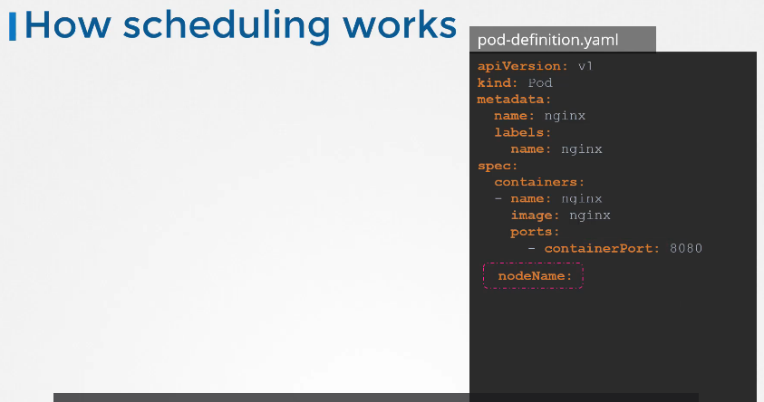

- Every Pod has a filed called `nodeName` that, by default, is not set. You don’t typically specify this field when you create the manifest file, Kubernetes adds it automatically.

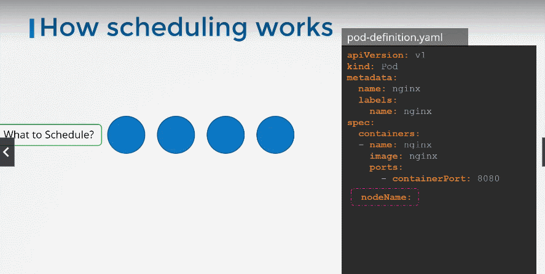

- The Scheduler goes through all the Pods and looks for those that do not have this property set. Those are the candidates for scheduling.

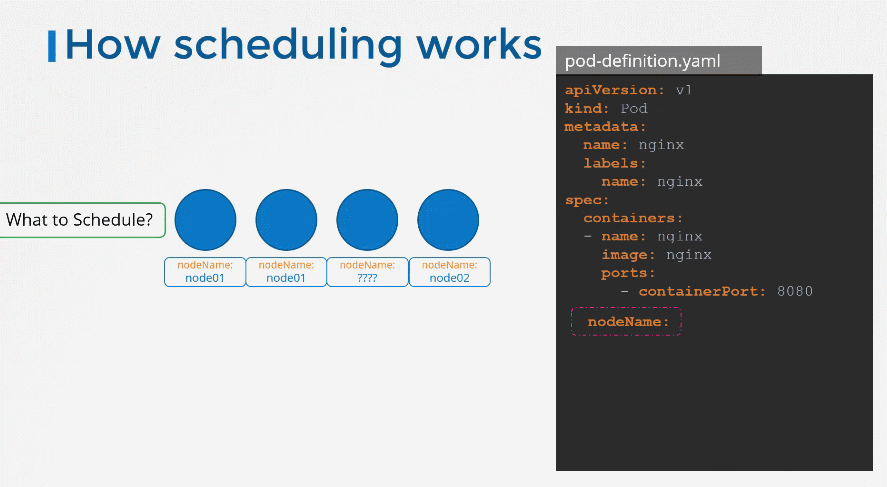

- It then identifies the right Node for the Pod, by running the Scheduling algorithm. 

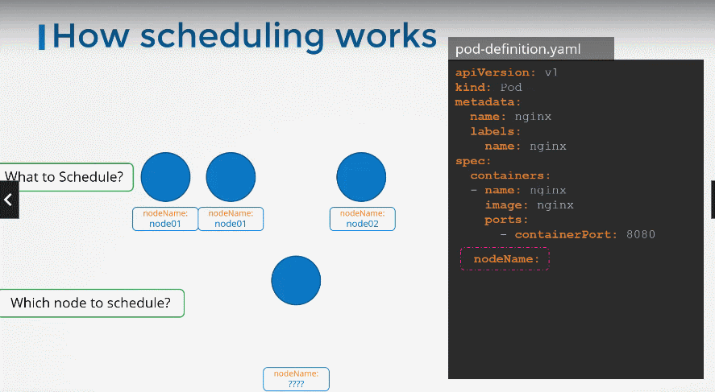

- Once identified it schedules the Pod on the Node by setting the `nodeName` property to the name of the node by creating a binding object.

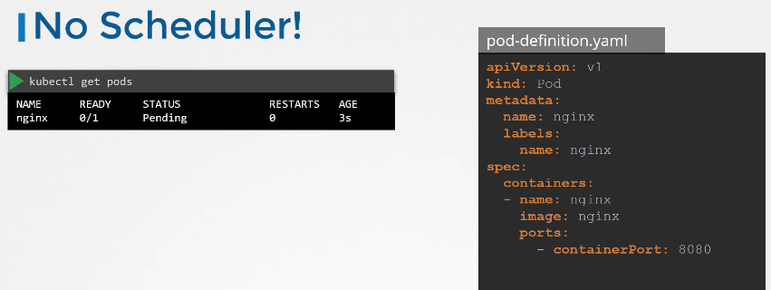

- So if there is no Scheduler to monitor and schedule nodes, what happens? The Pods continue to be in a pending state. You can manually assign Pods to node yourself.

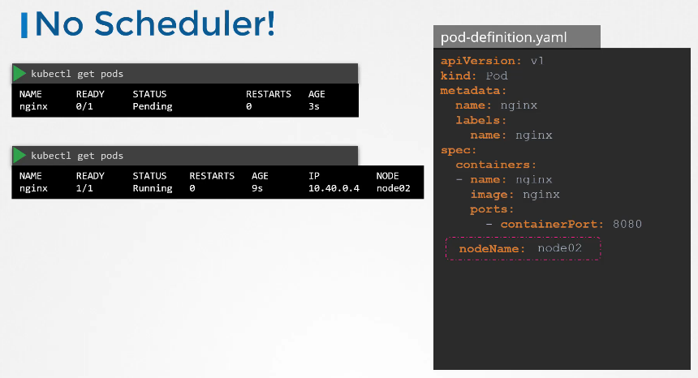

- Without a Scheduler, the easiest way to schedule a Pod is to simply set the `nodeName` field to the name of the node in your Pod specification file creating the Pod. The Pod then gets assigned to the specified Node.
- You can only specify the `nodeName` at creation time. What if the Pod is already created and you want to assign the Pod to a Node? Kubernetes won’t allow you to modify the `nodeName` property of a Pod.

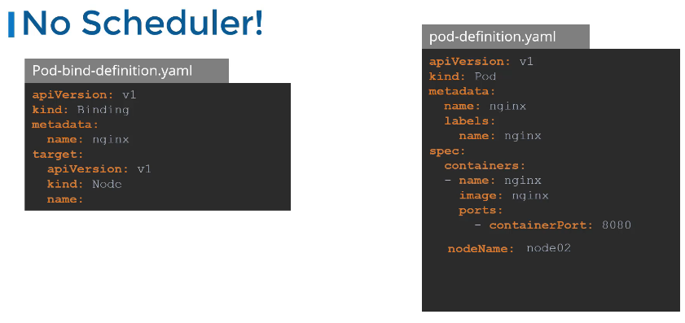

- So another way to assign a node to an existing Pod is to create a binding object and send a post request to the Pod binding API. Thus, we’re making what the actual Scheduler does. 

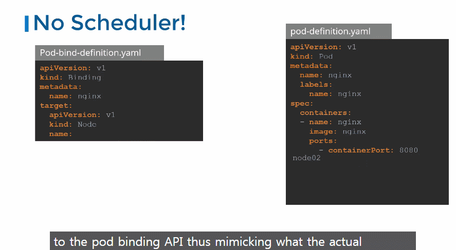

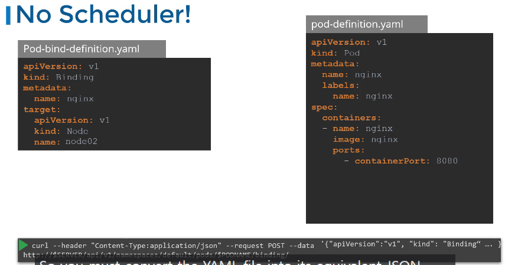

- In the binding object you specify a target node with the name of the node. Then send a post request to the Pods binding API with the data set to the binding object in a JSON format. So you must convert the YAML file into its equivalent JSON format.
# 52. Practice Test - Manual Scheduling
Practice Test: [https://uklabs.kodekloud.com/topic/practice-test-manual-scheduling-2/](https://uklabs.kodekloud.com/topic/practice-test-manual-scheduling-2/)
# 53. Solution - Manual Scheduling(Optional)
1. Why is the POD in a pending state? Inspect the environment for various kubernetes control plane components. ⇒ `No Scheduler Present`
```shell
Name:         nginx
Namespace:    default
Priority:     0
Node:         <none>
Labels:       <none>
Annotations:  <none>
Status:       Pending
IP:           
IPs:          <none>
Containers:
  nginx:
    Image:        nginx
    Port:         <none>
    Host Port:    <none>
    Environment:  <none>
    Mounts:
      /var/run/secrets/kubernetes.io/serviceaccount from kube-api-access-d27md (ro)
Volumes:
  kube-api-access-d27md:
    Type:                    Projected (a volume that contains injected data from multiple sources)
    TokenExpirationSeconds:  3607
    ConfigMapName:           kube-root-ca.crt
    ConfigMapOptional:       <nil>
    DownwardAPI:             true
QoS Class:                   BestEffort
Node-Selectors:              <none>
Tolerations:                 node.kubernetes.io/not-ready:NoExecute op=Exists for 300s
                             node.kubernetes.io/unreachable:NoExecute op=Exists for 300s
Events:                      <none>
```

-  We don’t see any additional details other than the fact that It’s in a pending state. That basically means the Scheduler has not done It’s job of scheduling the Pad on the node. (the node field is set to none.)
	```shell
	kubectl get pods -n kube-system
	```

	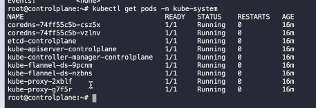

	⇒ There is no Scheduler running, so  that could be the reason why.

1. If you don’t want to run the same command multiple times to check the status, you could just add ‘watch’ option - It’s going to continue to monitor that pod and It’s going to update the status If something changes.

	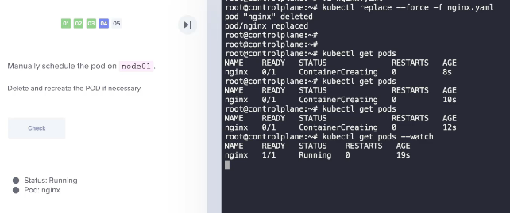

2. If you do a ‘wide’ option, then you will get to see which node is schedule so we can see that.

	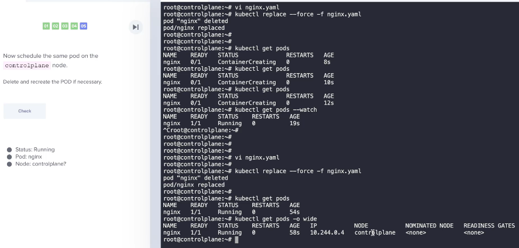

# 54. Labels and Selectors

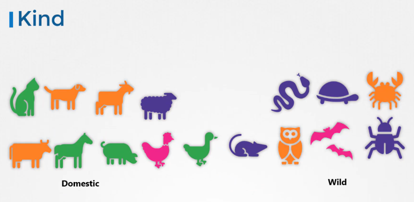

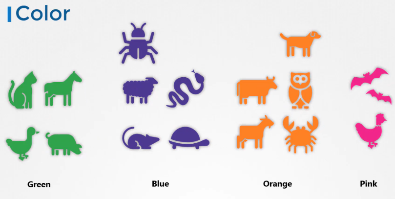

- Labels and Selectors are a standard method to group things together. Say you have a set of different species. A user want to be able to filter them based on different criteria such as based on their class or kind If they are domestic or wild or see by their color.

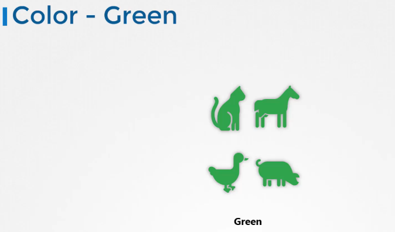

- And not just group, You want to be able to filter them based on a criteria such as all green animals, 

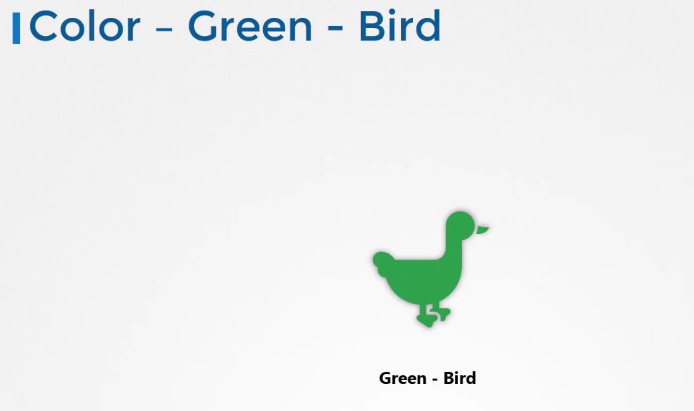

- Or with multiple criteria, such as everything green, That’s also a bird.

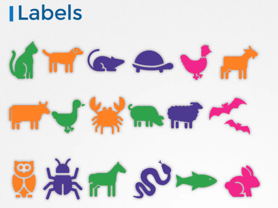

- Whatever that classification maybe you need the ability to group things together and filter them based on your needs and the best way to do that is with labels. Labels or properties attached to each item.

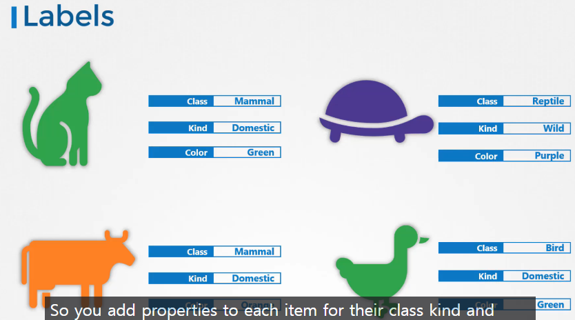

- So you add properties to each item for their class, kind, and color, selectors help you filter these items.

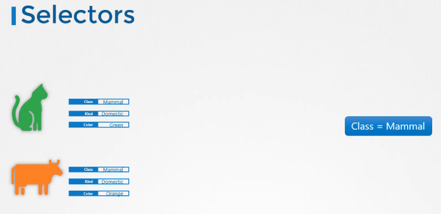

- For example, when you say class equals mammal, we get a list of mammals,

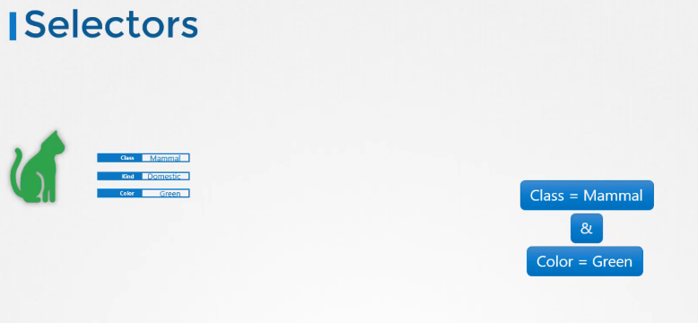

- and you say color equals green, we get the green mammals.

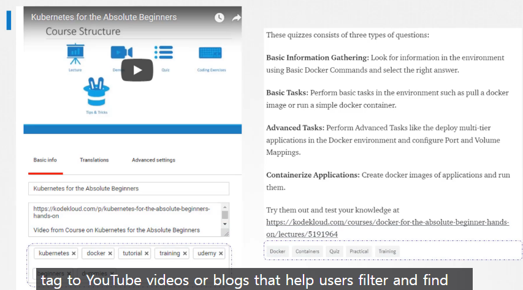

- We see labels and selectors used everywhere such as the keywords you tag to YouTube videos or blogs that help users filter and find the right content.


- We see labels added to items in an online store that help you add different kinds of filter to view your products.
### 🔰 How are labels and selectors used in Kubernetes?

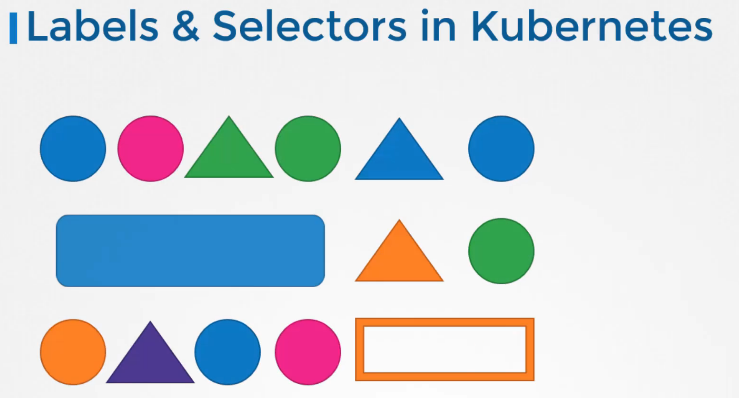

- We have created a lot of different types of Objects in Kubernetes. 

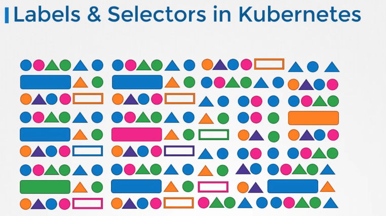

- Pods, Services, ReplicaSets and Deployments etc. For Kubernetes, all of these are different objects. Overtime you may end up having hundreds or thousnads of these objects in your Cluster.

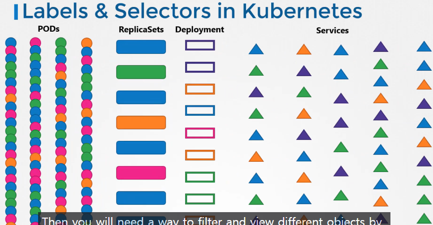

- Then you will need a way to filter and view different objects by different categories such as to group objects by their type.

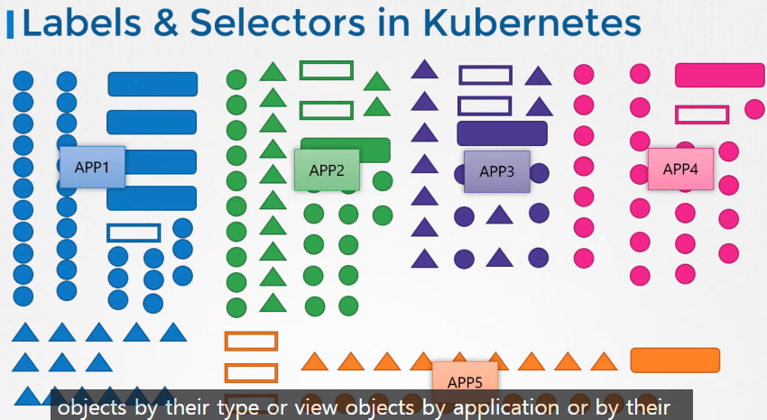

- Or view objects by application.

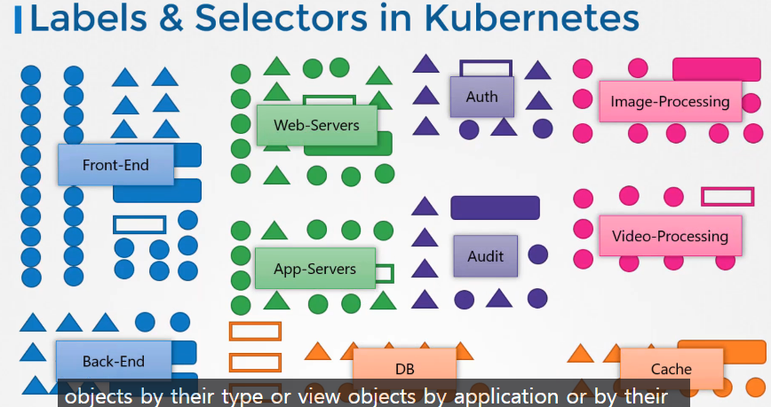

- Or by their functionality whatever It may be.

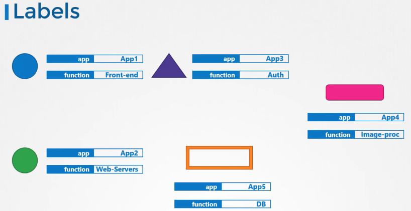

- You can group and select objects using labels and selectors for each object attach labels as per your needs, like app, function etc.

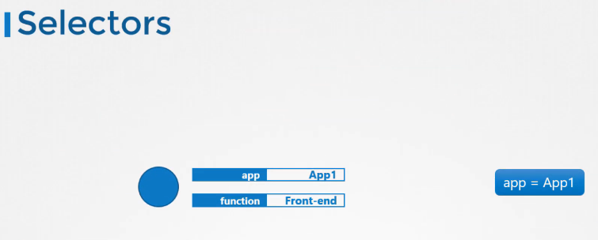

- Then while selecting specify a condition to filter specific objects. For example, app = ‘App1’.

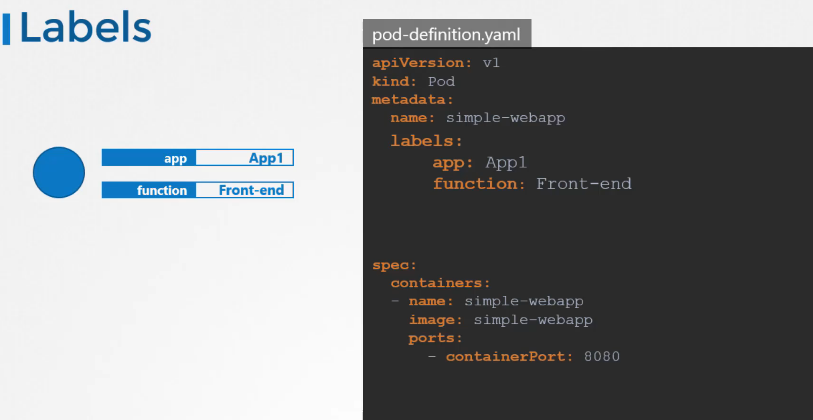

- So how exactly do you specify labels in Kubernetes? In a pod-definition file, under metadata, create a section called labels. Under that add the labels in a key value format like this. You can add as many labels as you like.

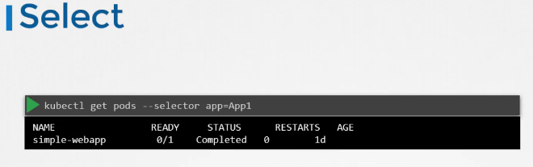

- Once the Pod is created, to select the Pod with the labels use the `kubectl get pods` command along with the selector option, and specify the condition like `app=App1`. Now this is one use case of labes and selectors. Kubernetes objects use labels and selectors internally to connect different objects together. 

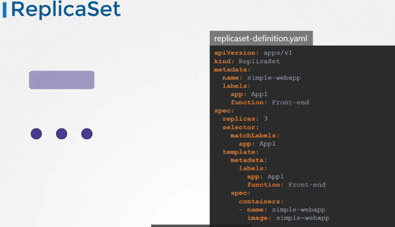

- For example to create a ReplicaSet consisting of 3 different Pods, we first label the pod-definition and use selector in a ReplicaSet to group the Pods. In the replicaset-definition file, You will see labels defined in two places. Note that this is an area where beginners attempt to make a mistake.

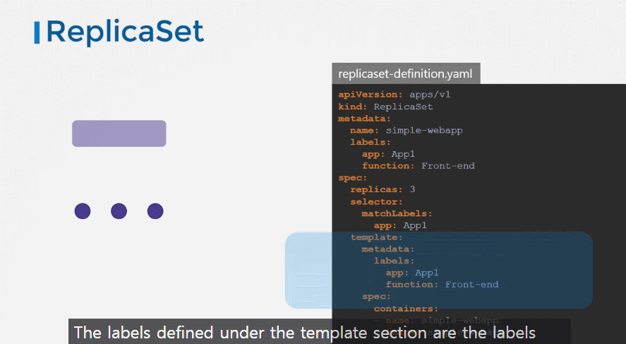

- The labels defined under the template section are the labels configured on the Pods.

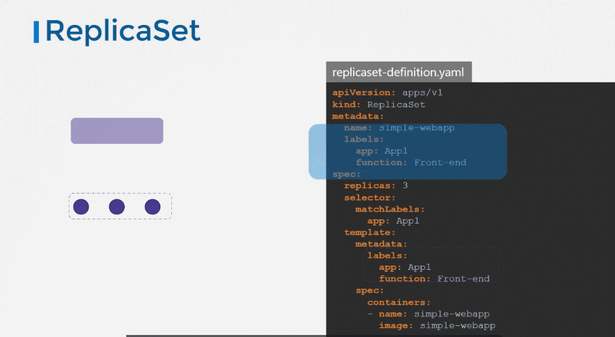

- The labels you see at the top are the labels of the ReplicaSet itself.
- We’re not really concerned about the labels of the ReplicaSet for now because we are trying to get the ReplicaSet to discover the Pods. The labels on the ReplicaSet will be used if you were to configure some other object to discover the ReplicaSet.

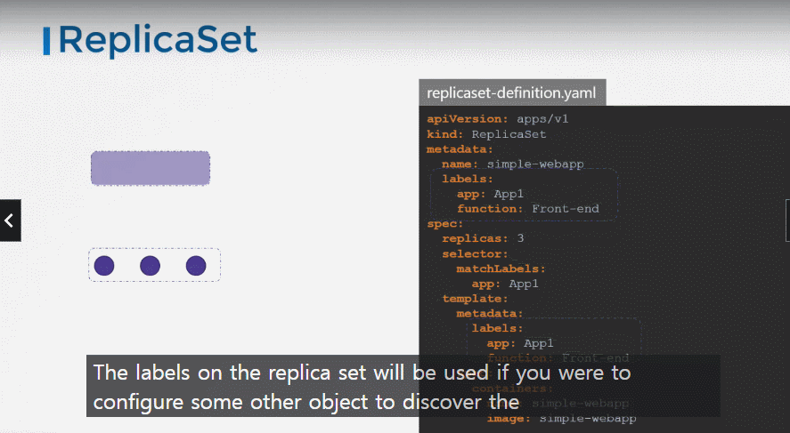

- In order to connect the ReplicaSet to the Pod, we configure the selector field under the ReplicaSet specification to match the labels defined on the Pod.

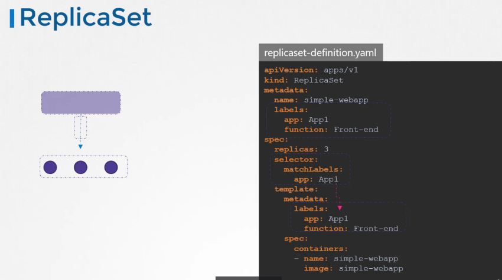

- A single label will do If it matches correctly. However If you feel there could be other Pods with the same label but with a different function, then you could specify both the labels to ensure that the right Pods are discovered by the ReplicaSet.

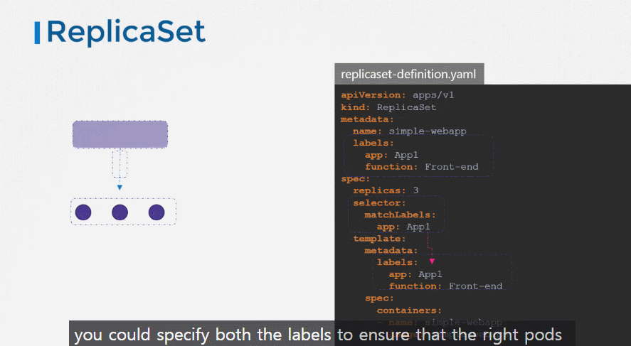

- On creation, If the labels match the ReplicaSet is created successfully. 

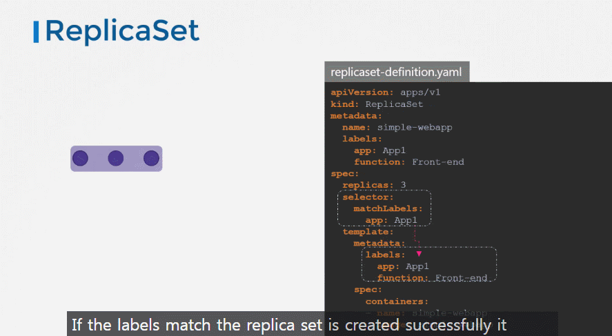

- It works the same for other object like a service when a service is created It uses the selector defined in the service-definition file to match the labels set on the Pods in the replicaset-definition file.
### 🔰 Annotation
- While labels and selectors are used to group and select objects, annotations are used to record other details for inflammatory purpose.

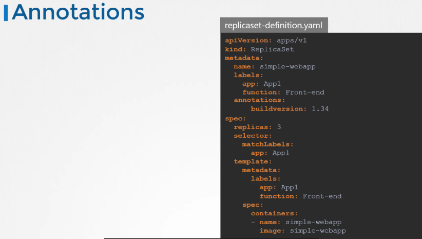

- For example, tool details like name, version build information etc, or contact details, phone numbers, email ids etc, that may  be used for some kind of integration purpose. Well, that’s It for this lecture on labels and selectors and annotations.
- Head over to the coding exercises section and practice working with labels and selectors.
# 55. Practice Test - Labels and Selectors
Access the practice test here: [https://uklabs.kodekloud.com/topic/practice-test-labels-and-selectors-2/](https://uklabs.kodekloud.com/topic/practice-test-labels-and-selectors-2/)
# 56. Solution: Labels and Selectors:(Optional)
# 57. Taints and Tolerations
- In this lecture we will discuss about the Pod to Node relationship and how you can restrict what Pods are placed on what Nodes. The concept of Taint and Toleration can be a bit confusing for beginners.
### 🔰 Analogy of a bug approaching a person


- To prevent the bug from landing on the person, we spray the person with a repellent spray or attained as we will call it. In this lecture, the bug is intolerant to the smell. 

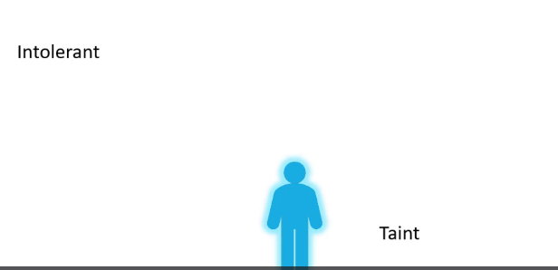

- So on approaching the person, detained applied on the person throw the bug off. 

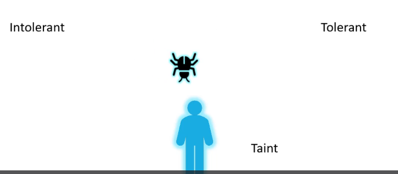

- However, they could be other bugs that are tolerant to the smell and so the taint doesn’t really affect them.

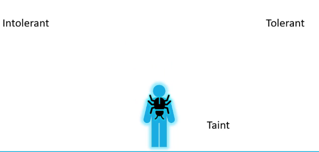

- And so they end up landing on the person.

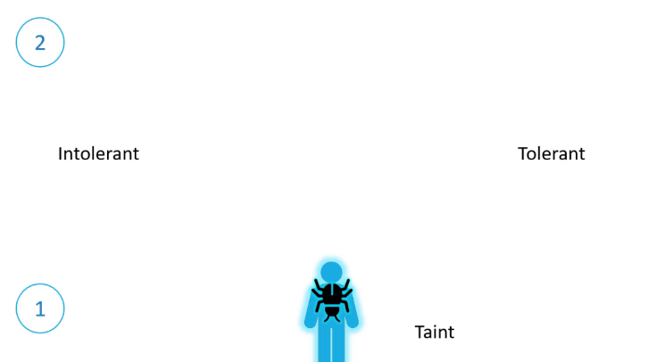

- So there are 2 things that decide If a bug can land on a person.
	1. The taint on the person.
	2. The bugs toleration level to that particular taint.

	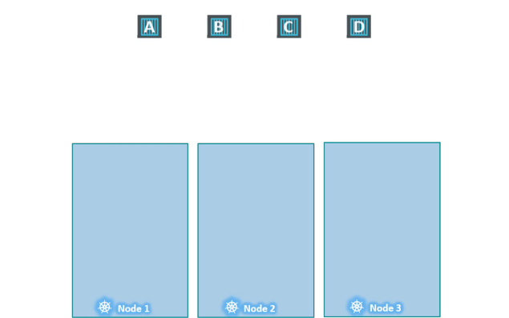

- Getting back to Kubernetes, the Person is a Node, and the Bugs are Pods. Now Taint and Toleration have nothing to do with security or intrusion on the Cluster. Taint and Toleration are used to set restrictions on what Pods can be scheduled on a Node.
- Let’s us start with a simple Cluster with 3 worker Nodes. The Nodes are named 1, 2, 3. We also have a set of Pods that are to be deployed on these Nodes. Let’s call them A, B, C, D.
- When the Pods are created, Kubernetes Scheduler tries to place these Pods on the available worker Nodes.

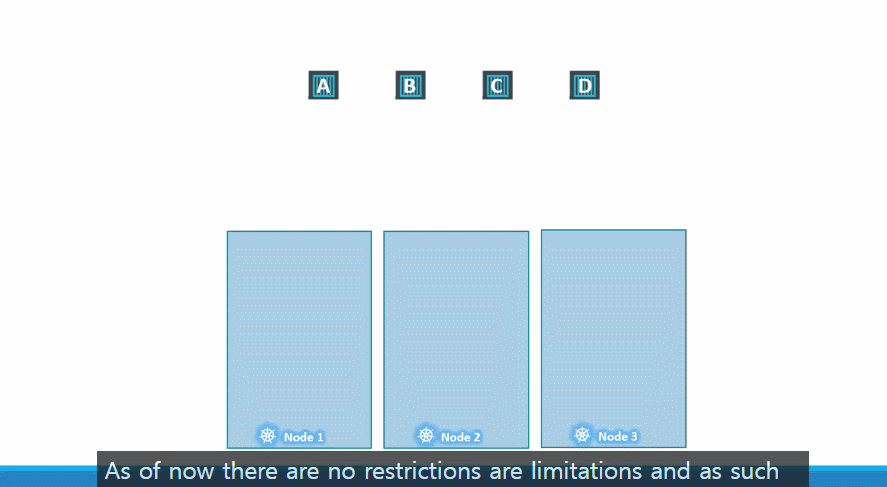

- As of now, there are no restrictions are limitations and as such the Scheduler places the Pods across all of the Nodes to balance them out equally.

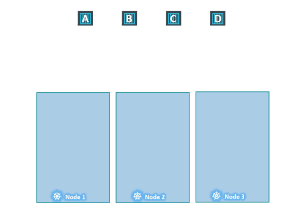

- Now let us assume that we have dedicated resources on Node 1 for a particular use case or application. So we would like only those Pods that belong to this application to be placed on Node 1.

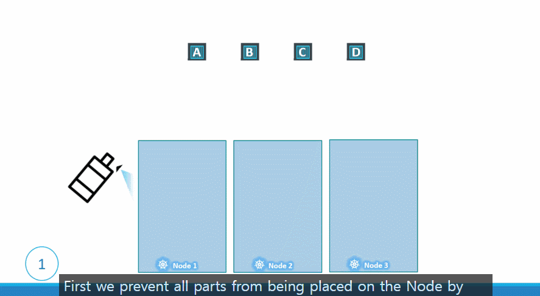

- First, we prevent all Pods from being placed on the Node by placing a taint on the Node. Let’s call it blue.

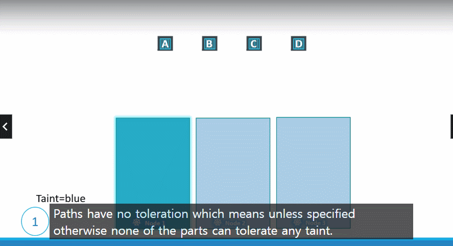

- By default, Pods have no toleration, which means, unless specified otherwise none of the Pods can tolerate any taint. So in this case, none of the Pods can be placed on Node 1, as none of them can tolerate the team Blue. This solves half of our requirement. No unwanted Pods are going to be placed on this Node. The other half is to enable certain Pods to be placed on this Node. 
- For this, we must specify which Pods are tolerant to this particular attempt. In our case we would like to allow only Pod D to be placed on this Node.  

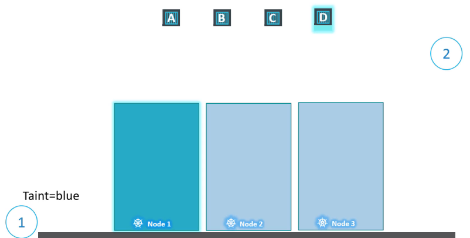

- So we add a toleration to Pod D. 

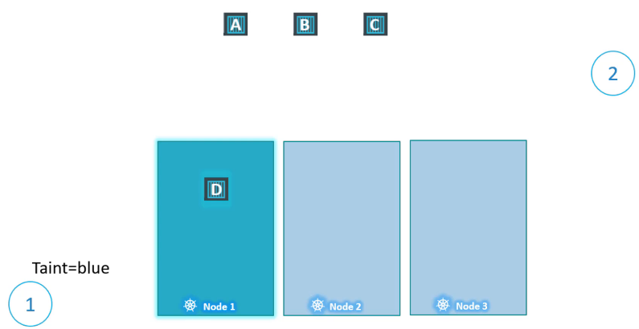

- Pod D is now tolerant to blue so when the Scheduler tries to place this Pod on Node 1, It goes through Node 1 can now only accept Pods, that can tolerate the taint Blue.

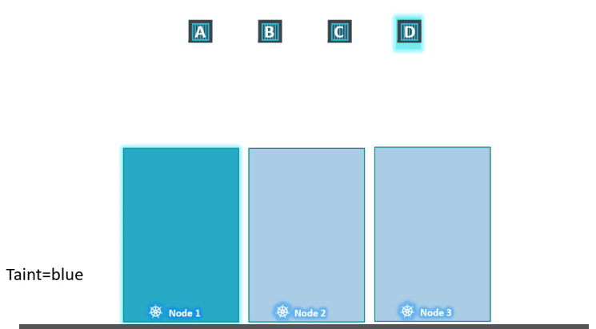

- So with all the taint and toleration in place, this is how the Pods would be scheduled.


- The Scheduler tries to place Pod A on not one, but due to the team, It is thrown off and It goes to Node 2, the Scheduler then tries to place Pod B on not one, but due to the taint, It is thrown off and is placed on Node 3, which happens to be the next free Node.

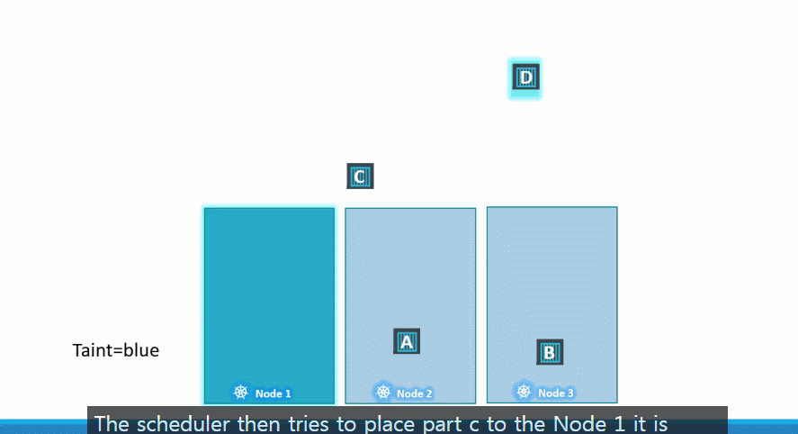

- The Scheduler then tries to place Pod C to the Node 1, It is thrown off again and ends up on Node 2. Finally the Scheduler tries to place Pod D on the Node 1 since the Pod is tolerant to Node 1, It goes through.
- Remember, Taints are set on Nodes and Tolerations are set on Pods.

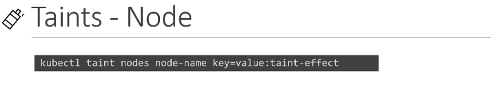

- User the `kubectl taint nodes` command to taint in Node specify the name of the Node to taint followed by the taint itself which is a key-value pair. 

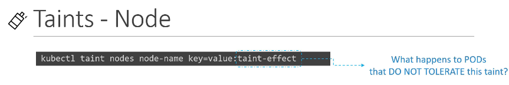

- For example, If you would like to dedicate the Node 2 Pods in application Blue then the key-value pair would be `app=blue`. The taint effect defines what would happen to the Pods, If they do not tolerate the taint. 

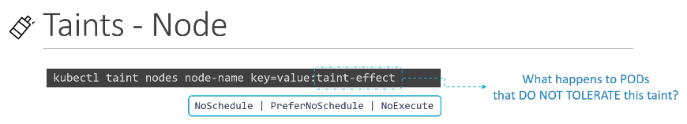

- There are 3 taint effects. ‘No schedule’ which means the Pods will not be scheduled on the Node which is what we have been discussing. ‘Prefer no schedule’ which means the system will try to avoid placing a Pod on the Node, but that is not guaranteed. And third is ‘No execute’. Which means that new Pods will not be scheduled on the Node and existing Pods on the Node If any will be evicted If they do not tolerate the taint. These Pods may have been scheduled on Node before the 10th was applied to the Node.

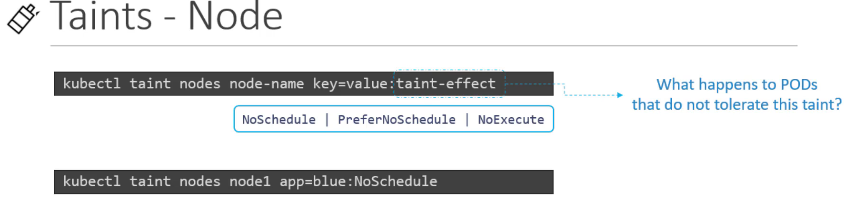

- An example command would be detained node node1 with the key-value pair ‘app=blue’ and an effect of no schedule.

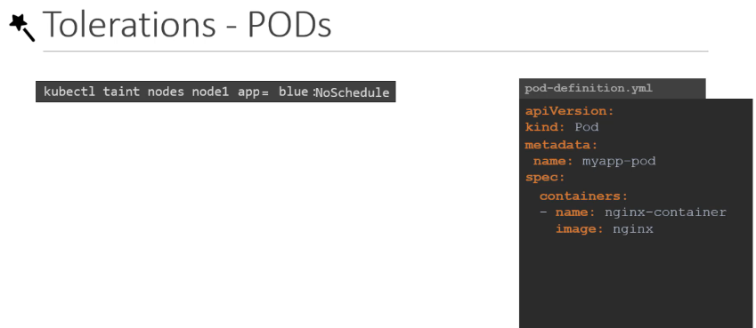

- Toleration is are added to Pods. 
- To add a toleration to a Pod, First pull up the pod-definition file in the spec section of the pod-definition file had a section called toleration move the same values used to while creating the taint under this section.

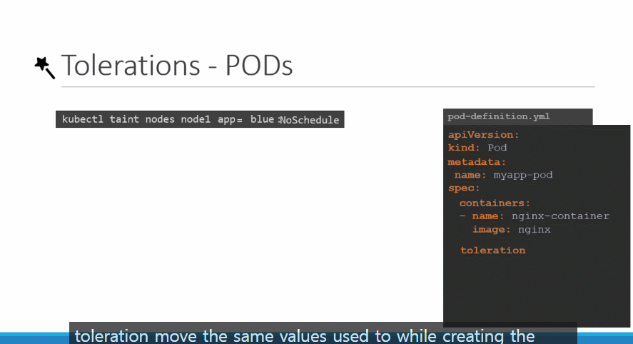

- The key is “app”, operator is “Equal”, value is “blue” and the effect is “NoSchedule”.

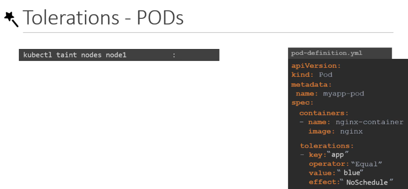

- Remember, all of these values need to be encoded in double codes. When the Pods are now created or updated with the new toleration they are either not scheduled on Nodes or evicted from the existing Nodes depending on the effect set.

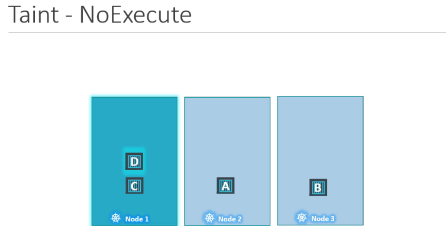

- Let us try to understand the “NoExecute” takes effect in a bit more depth. In this example, we have 3 Nodes running some workload. We do not have any taint or toleration at this point so they are scheduled this way. We then decided to dedicate Node 1 for a special application and as such we obtained the Node with the application name and add a toleration to the Pod that belongs to the application which happens to be Pod D.

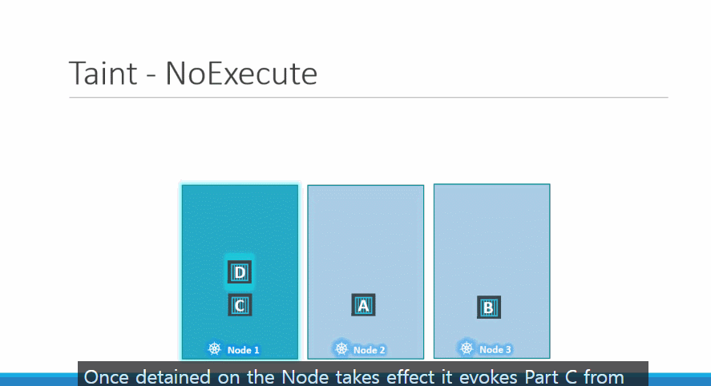

- In this case, while tending the Node we set the taint effect to NoExecute and as such once detained on the Node takes effect it evokes Pad C from the Node which simply means that the Pod is killed.

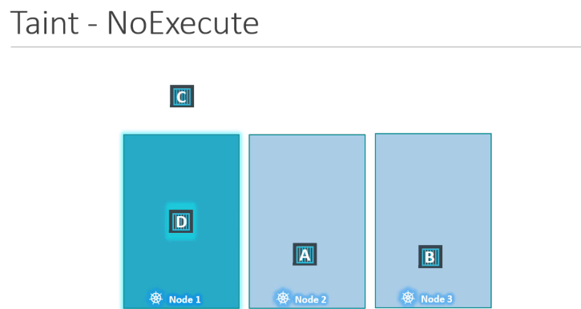

- The Pod D continues to run on the Node as it has a toleration to the taint below(?).
- Now going back to our original scenario where we have taint and toleration is configured.

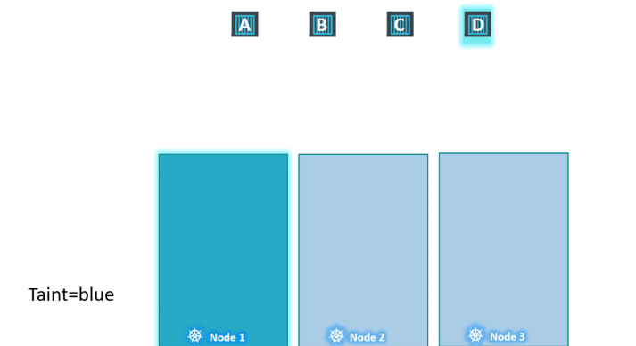

- Remember, taint and toleration are only meant to restrict nodes from accepting certain Pods. In this case no one can only accept Pod D but it does not guarantee that Pod D will always be placed on Node 1.

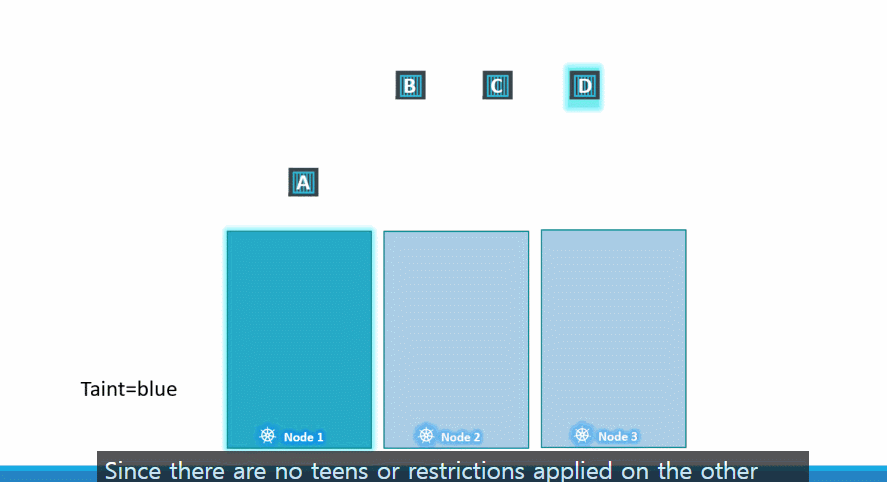

- Since there are no taint or restrictions applied on the other 2 Nodes, Pod D may very well be placed on any of the other 2 Nodes. So, Remember, taint and toleration does not tell the Pod to go to a particular Node. Instead, It tells the Node to only accept Pods with certain toleration. If your requirement is to restrict a Pod to certain Nodes It is achieved through another concept called ‘Ask Node Affinity’ which we will discuss in the next lecture.

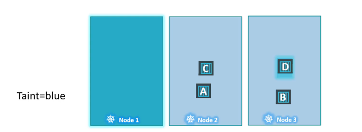

- So far, we have only been referring to the Worker Nodes. 

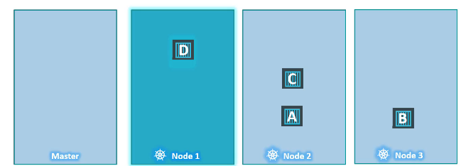

- But we also have master Nodes in the Cluster which is technically just another Node that has all the capabilities of hosting a Pod, plus, it runs all the management software.
- Now I’m not sure If you noticed the Scheduler does not schedule any Pod on the master Node. Why? When the Kubernetes Cluster first setup, It taint is set on the Master Node automatically that prevents any Pods from being schedule on this Node. You can see this as well as modified his behavior If required.

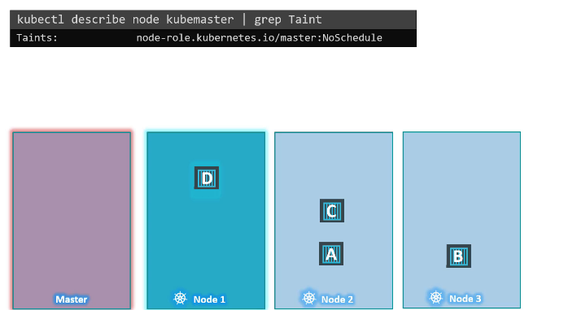

- However, a best practice is to not deploy application workloads on a Master Server to see this taint run `kubectl described node` command with kubemaster as the Node name and look for the taint section. You will see a taint set to not schedule any Pods on the Master Node.
# 58. Practice Test - Taints and Tolerations
Link to Practice Test: [https://uklabs.kodekloud.com/topic/practice-test-taints-and-tolerations-2/](https://uklabs.kodekloud.com/topic/practice-test-taints-and-tolerations-2/)
# 59. Solution - Taints and Tolerations(Optional)
1. Remove the taint on `controlplane`, which currently has the taint effect of `NoSchedule`.

	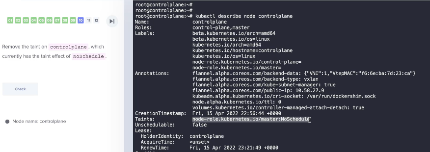

	- Copy Taint, and write command. You’ve got to put a dash or a minus for it to remove that.

	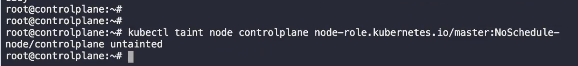

12. Which node is the Pod `mosquito` on now? ⇒ `controlplane`

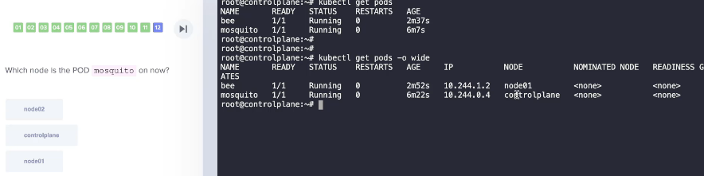

# 60. Node Selectors

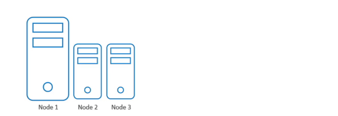

- Let us start with a simple example. You have a 3 Node Cluster of which 2 are smaller Nodes with lower hardware resources and one of them is a larger Node configured with higher resources.

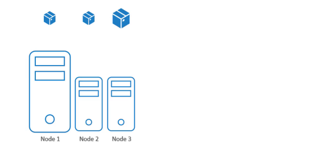

- You have different kinds of workloads running in your Cluster. You would like to dedicate the data processing workloads that require higher horsepower to the larger Node as that is the only Node that will not run out of resources in case the job demands extra resources.

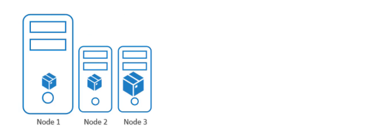

- However, in the current default setup, any Pods can go to any Nodes. So Pod C in this case may very well end up on Nodes 2 or 3 which is not desired. To solve this, we can set a limitation on the Pods so that they only run on particular Nodes.
### 🔰 2 ways to do this

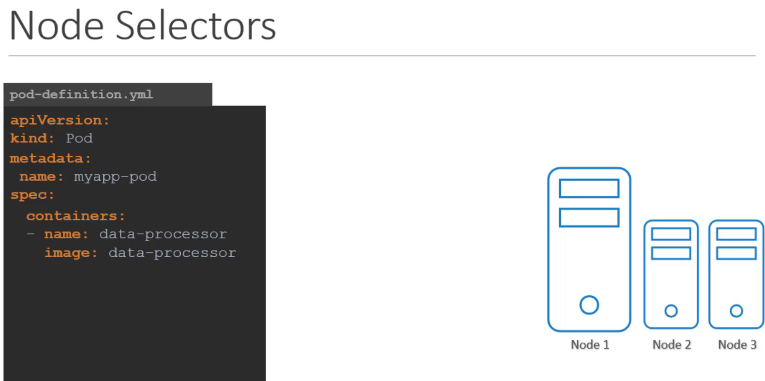

1. The First is using Node selectors which is the simple and easier method. For this we look at the pod-definition file we created earlier this file has a simple definition to create a Pod with a data processing image. 

	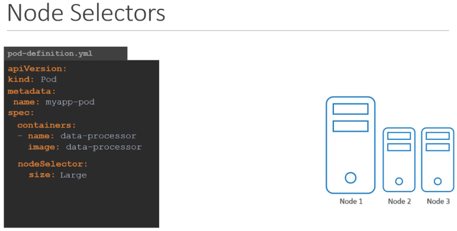

	- To limit this Pod to run on the larger Node, we add a new property called `nodeSelector` to the spec section and specify the size as ‘Large’.
	- But, Wait, Where did the size large come from and how does Kubernetes know which is the large Node? The key-value pair of size and large are in fact labels assigned to the Nodes the Scheduler uses these labels to match and identify the right Node to place the Pods on.

	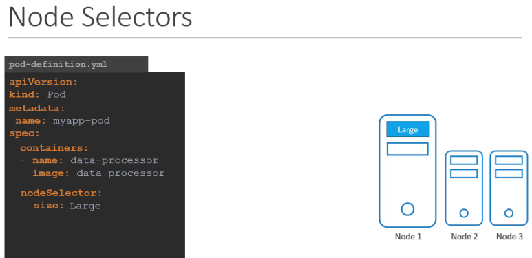

	- `labels` and `selectors` are a topic we have seen many times throughout this Kubernetes course, such as with Services, ReplicaSets, and Deployments. To use labels in a known selector like this, you must have first labelled your Nodes prior to creating this Pod.

	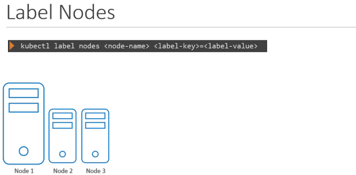

	- So let us go back and see how we can label the Nodes. To label a Node, use the `kubectl label nodes` command followed by the name of the Node and the label in a key-value pair format.

	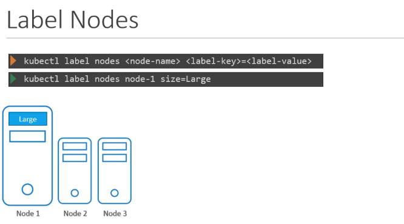

	- In this case, It would be `kubectl label nodes node-1` followed by the label in a key-value format such as `size=Large`.

	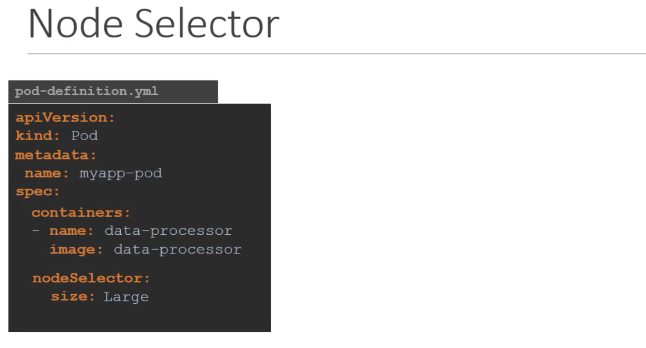

	- Now that we have labeled the Node we can get back to creating the Pod this time with the `nodeSelector` set to a size of ‘Large’.

	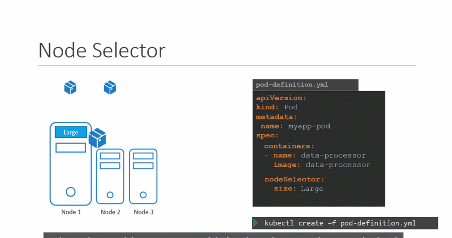

	- When the Pod is now created, It is placed on Node1 as desired.
	- `nodeSelector` served our purpose, but it has limitations.

	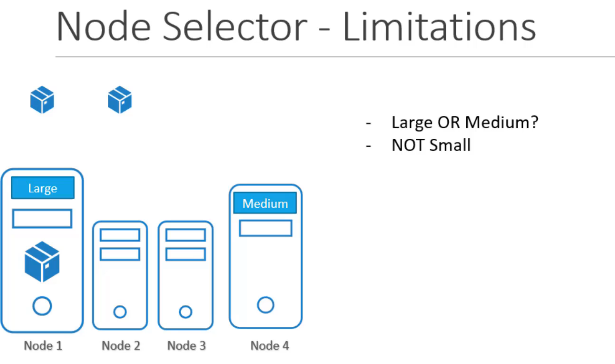

	- We used a single `label` and `selector` to achieve our goal here. But what if our requirement is mush more complex. For example, we would like to say something like place the Pod on a large or medium Node or something like place the Pod on any Nodes that are not small.

	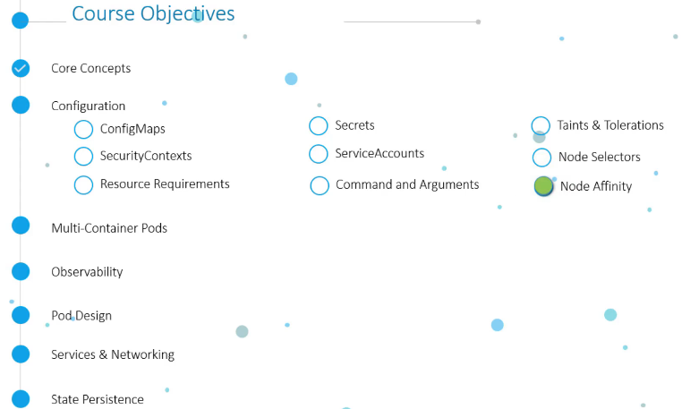

	- You cannot achieve this using `nodeSelector`. For this, Node affinity and anti affinity features were introduced and we will look at that next.
# 61. Node Affinity
- We will talk about known Node Affinity feature in Kubernetes.

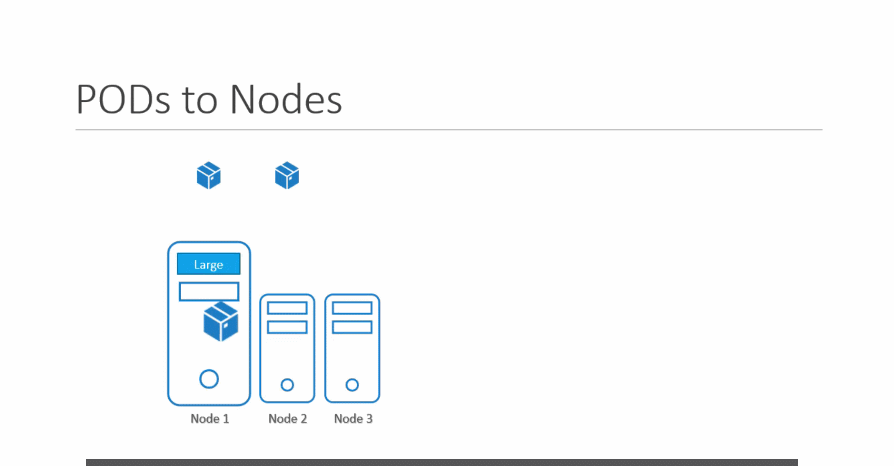

- The primary purpose of Node Affinity feature is to ensure that Pods are hosted on particular Nodes. In this case, to ensure the large data processing Pod ends up on Node1. 

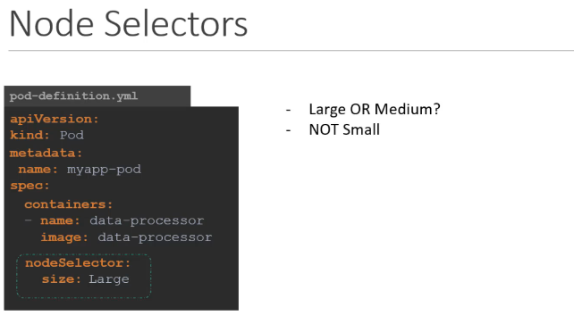

- In the previous lecture we did this easily using `nodeSelector`. We discussed that you cannot provide advanced expression like or, or not with `nodeSelector`.

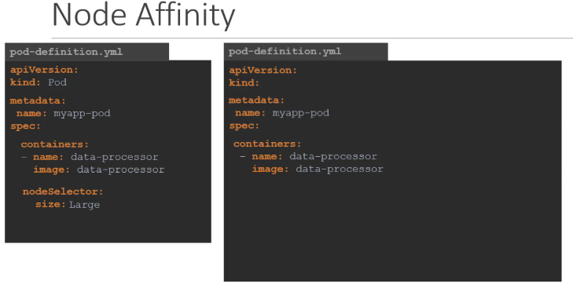

- The Node Affinity feature provides us with advanced capabilities to limit Pod placement to specific Nodes with great power comes great complexity.

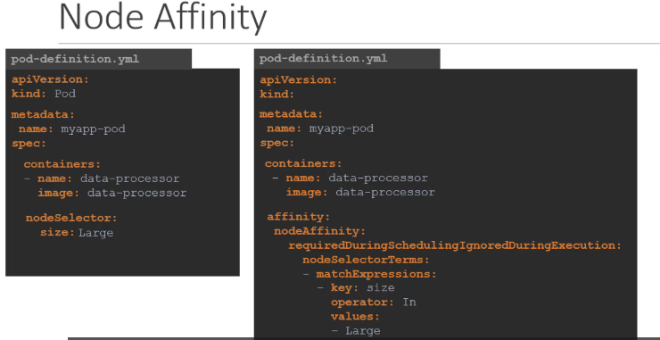

- So the simple `nodeSelector` specification will now look like this with Node Affinity although both does exactly the same thing, plays the Pod on the large Node.
- Let us look at it a bit closer. Under spec you have Affinity and then Node Affinity under that. And then you have a property that looks like a sentence called required during scheduling ignored during execution. No description needed for that. And then you have the `nodeSelector` terms that is an array and that is where you will specify the key-value pairs. The key-value pairs are in the form key operator and value where the operator is ‘In’. The operator ensures that the Pod will be placed on a Node whose label size has any value in the list of values specified here. In this case, It is just one called large.

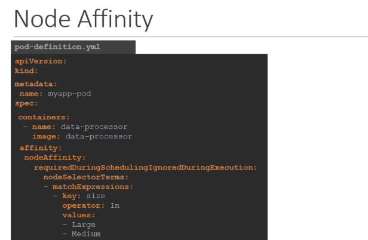

- If you think your Pod could be placed on a large or a medium Node, you could simply add the value to the list of values like this.

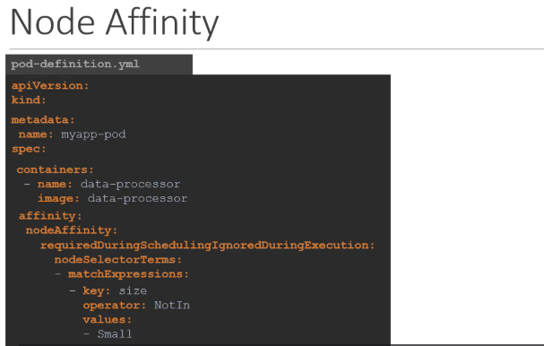

- You could use the ‘NotIn’ operator, to say something like size ‘NotIn’ small, where Node Affinity will match the Node with a size not set to ‘Small’.
- We know that we have only set the labels size 2, ‘Large’ and ‘medium’ Nodes. The smaller Nodes don’t even have the label set. So we don’t really have to even check the value of the label. 

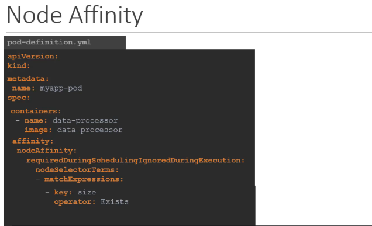

- As long as we are sure we don’t set a label size to the smaller Nodes, using the ‘Exists’ operator will give us the same result. The ‘Exists’ operator will simply check if the label size exists on the Nodes and you don’t need the values section for that as it does not compare the values.
- There are a number of other operator as well.
- Now, we understand all of this and we’re comfortable with creating a Pod with specific Affinity rules. When the Pods are created, these rules are considered and the Pods are placed onto the right Nodes. But what if Node Affinity could not match a Node with a given expression. In this case, what if there are no Nodes with a label called ‘size’.

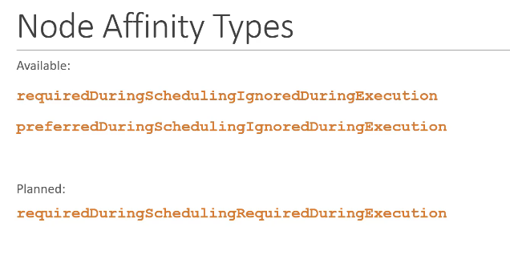

- Say we had the labels and the Pods are scheduled, what if someone changes the label on the Node at a future point in time. Will the Pod continue to stay on the Node? All of this is answered by the long sentence like property under Node Affinity which happens to be the type of Node Affinity. 
- The type of Node Affinity defines the behavior of the Scheduler with respect to  Node Affinity and the stages in the life cycle of the Pod. There are currently 2 types of Node Affinity available - required, scheduling, ignored, during execution, preferred during scheduling, ignored during execution. And there are additional types of Node Affinity planned as of this recording - required during scheduling, required during execution. We will now break this down to understand further.

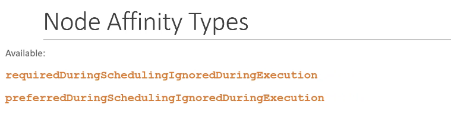

- We will start by looking at the 2 available Affinity types.

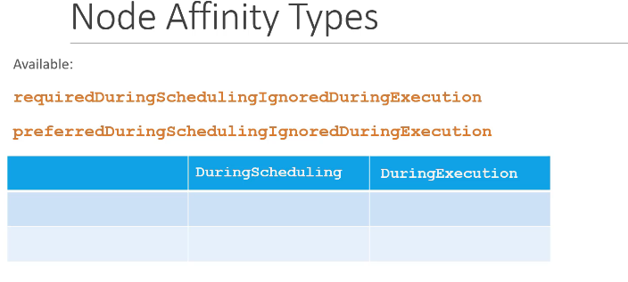

- There are 2 states in the life cycle of a Pod when considering Node Affinity `during scheduling` and `during execution`.
- `during scheduling` is the state where a Pod does not exist and is created for the first time. We have no doubt that when a Pod is first created, the Affinity rules specified are considered to place the Pods on the right Nodes.

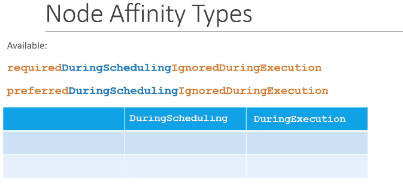

- Now, what if the Nodes with matching labels are not available. For example, we forgot to label the Node as ‘Large’. That is where the type of Node Affinity used comes into play.

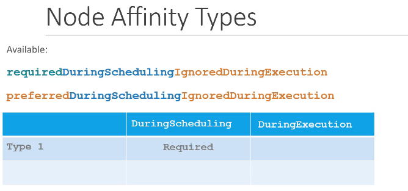

- If you select the required type which is the first one the scheduler will mandate that the Pod be placed on a Node with a given Affinity rules. If it cannot find one, the Pod will not be scheduled. This type will be used in cases where the placement of the Pod is crucial. If a matching Node does not exist, the Pod will not be scheduled.

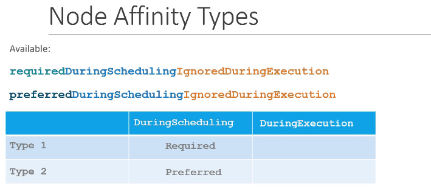

- But Let’s say the Pod placement is less important than running the workload itself. In that case, you could set it to preferred and in cases where a matching Node is not found, the scheduler will simply ignore Node Affinity rules and place the card on any available Node. This is a way of telling the scheduler, try your best to place the Pod on matching Node. But if you really cannot fine one, just plays it anywhere.
- The second part of the property or the other state is `during execution`. `during execution` is the state where a Pod has been running and a change is made in the environment that affects Node Affinity, such as a change in the label of a Node. 

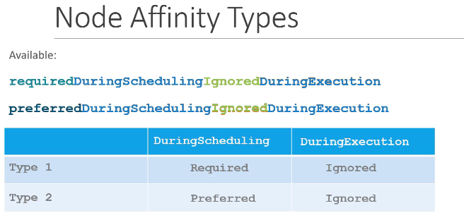

- For example, say an administrator removed the label we said earlier called ‘size=Large’ from the Node. Now what would happen to the Pods that are running on the Node? As you can see the 2 types of Node Affinity available today has this value set too ignored, which means Pods will continue to run and any changes in Node Affinity will not impact them once they are scheduled.

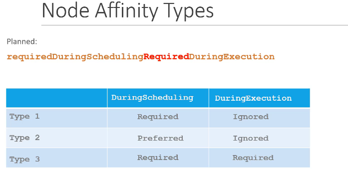

- The new types expected in the future only have a difference in the `during execution` phase. A new option called `required during execution` is introduced which will evict any Pods that are running on the Nodes that do not meet Affinity rules.

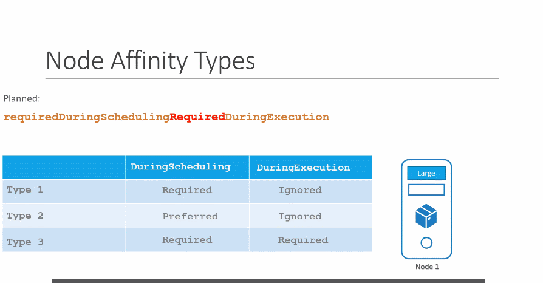

- In the earlier example, a Pod running on the ‘Large’ Node will be evicted or terminated If the label ‘Large\`’ is removed from the Node.
# 62. Practice Test - Node Affinity
Link to Practice Test: [https://uklabs.kodekloud.com/topic/practice-test-node-affinity-3/](https://uklabs.kodekloud.com/topic/practice-test-node-affinity-3/)
# 63. Solution - Node Affinity(Optional)
- 생략
# 64. Taints and Tolerations vs Node Affinity
- We have learned about Taints and Toleration and Node Affinity, Let us tie together the 2 concepts.

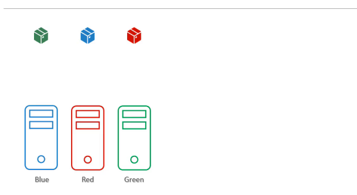

- We have 3 Nodes and 3 Pods, each in 3 color blue, red, green. The ultimate aim is to place the blue Pod in the blue Node, the red Pod in the red Node, and likewise for green. 

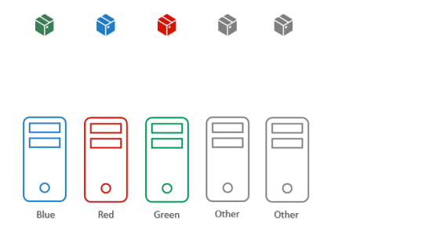

- We are sharing the same Kubernetes Cluster with other teams. So there are other Pods in the Cluster as well as other Nodes.

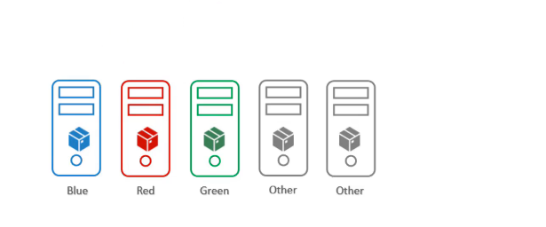

- We do not want any other Pod to be placed on our Node. Neither do we want our Pods to be placed on their Nodes.

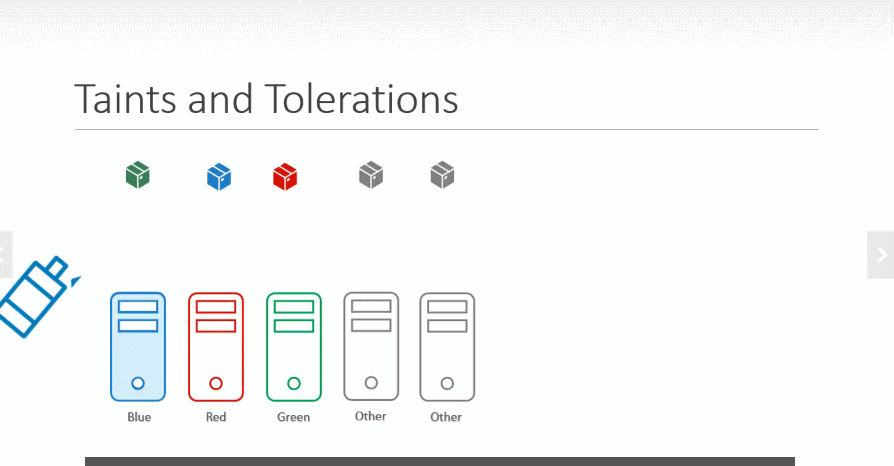

- Let us first try to solve this problem using taints and tolerations. We apply a taint to the Nodes marking  them with their colors - blue, red, green.

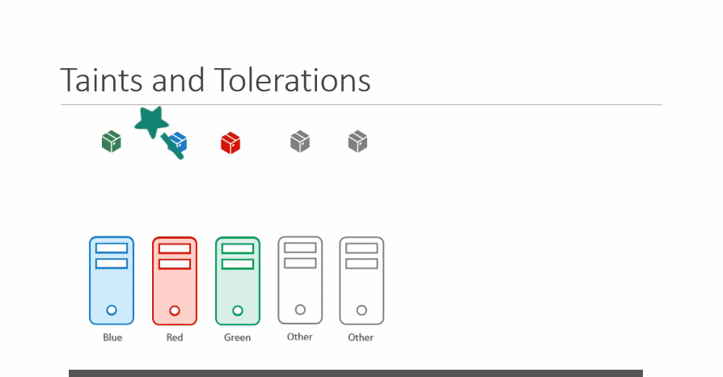

- And we then set a toleration on the Pods to tolerate the respective colors.
- When the Pods are now created, the Nodes ensure they only accept the Pods with the right toleration.

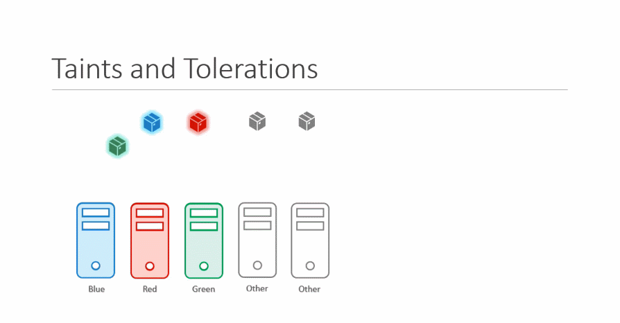

- So the green Pod ends up on the green Node and the blue Pod ends up on the blue Node.

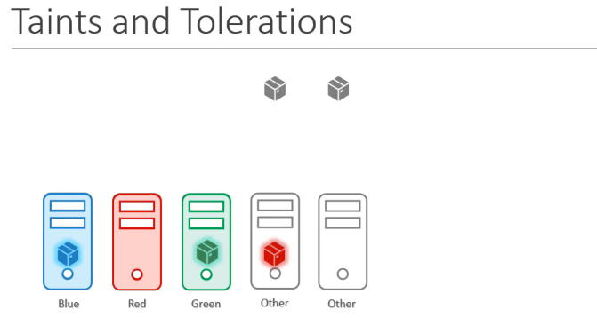

- However, taint and toleration does not guarantee that the Pods will only prefer these Nodes. So the red Node ends up on one of the other Nodes that do not have a taint or toleration set. This is not desired.

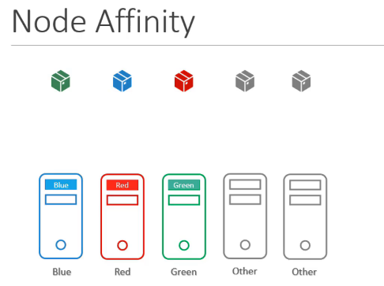

- Let us try to solve the same problem with no affinity. with no Affinity, we first label the Nodes with their respective color blue, red, green. 

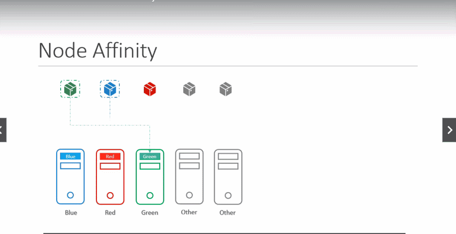

- We then set Node selectors on the Pods to tie the Pods to the Nodes. As such, the Pods end up on the right Nodes.

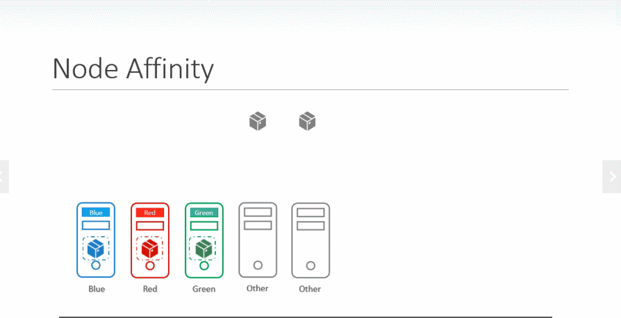

- However, that does not guarantee that other Pods are not placed on these Nodes. In this case, there is a chance that one of the other Pods may end up on our Nodes. This is not something we desire.
### 🔰 Combination of Taints/Tolerations/Node Affinity

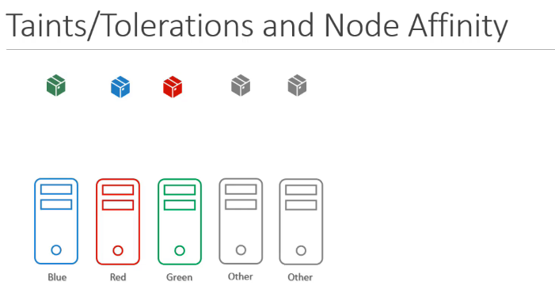

- As such, a combination of Taints and Tolerations and Node Affinity rules can be used together to completely dedicate Nodes for specific Pods.

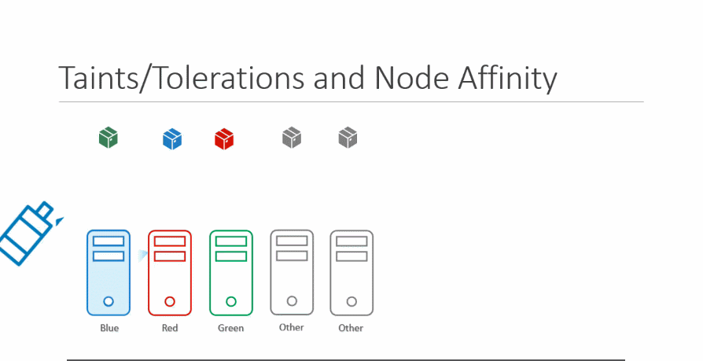

- We first use Taints and Tolerations to prevent other Pods from being placed on our Nodes, and then we use Node Affinity to prevent our Pods from being placed on their Nodes.
# 65. Resource Requirements and Limits

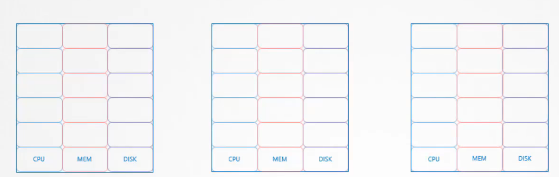

- Let us look at a 3 Node, Kubernetes Cluster. Each Node has a set of CPU memory and disk resources available. Every Pod consumes a set of resources, In this case 2 CPUs, one memory and some disk space.

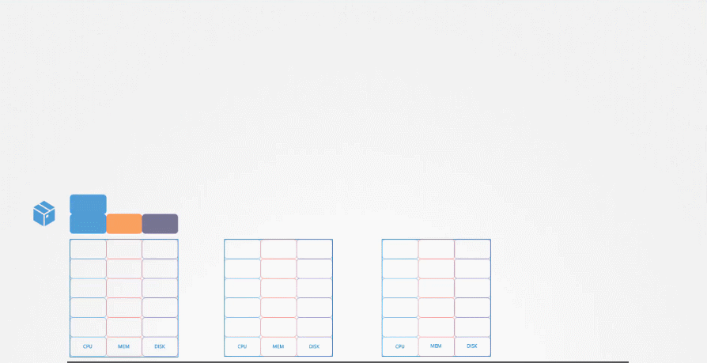

- Whenever a Pod is placed on a Node, It consumes resources available to that Node. As we have discussed before, It is the Kubernetes scheduler that decides which Node a Pod goes to.

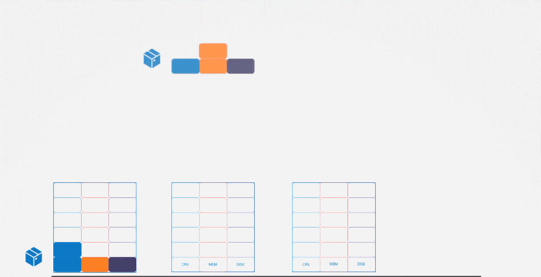

- The Scheduler takes into consideration the amount of resources required by a Pod and those available on the Nodes. In this case, the Scheduler should use a new Pod on Node2.

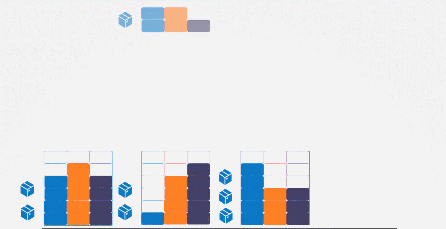

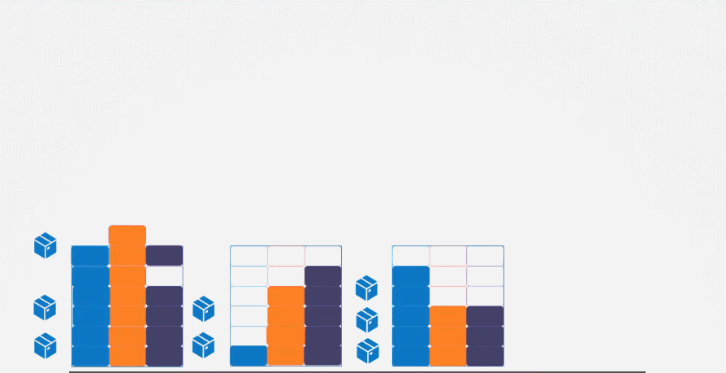

- If the Node has no sufficient resources, the Scheduler avoids placing the Pod on that Node instead places the Pod on one where sufficient resources are available.

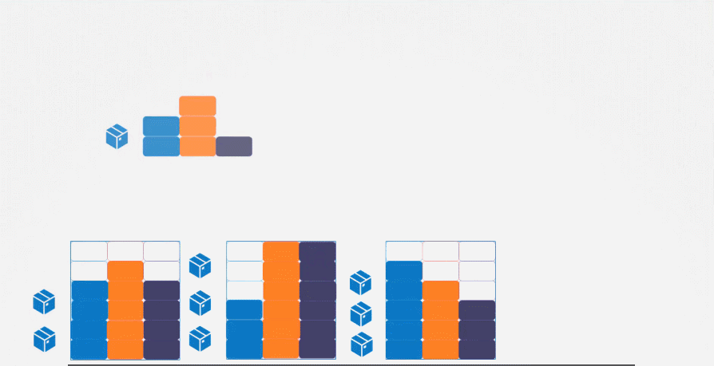

- But if there is no sufficient resources available on any of the Nodes, Kubernetes holds back scheduling the Pod. You will see the Pod in a pending state.

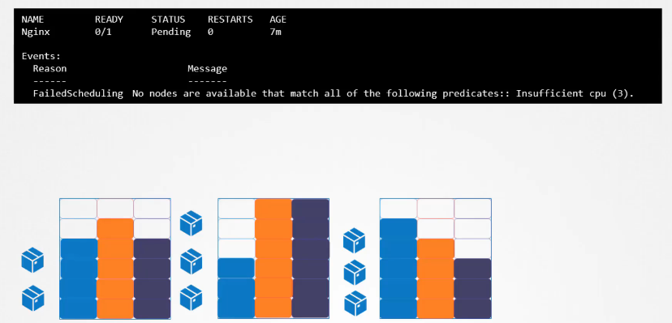

- If you look at the events, you will see the reason, insufficient CPU.
### 🔰 Focus on the requirements for each Pod

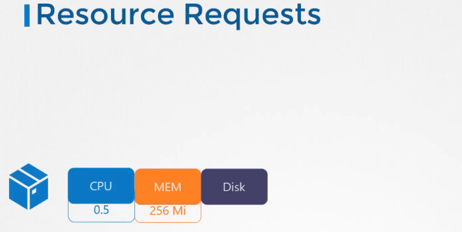

- What are these blocks and what are their values? By default, Kubernetes assumes that a Pod or a container within a Pod requires 0.5 CPU and 256 byte of memory. This is known as the resource request for a container. The minimum amount of CPU or memory requested by the container. When the Scheduler tries to place the Pod on a Node, It uses these number to identify a Node which has sufficient amount of resources available.

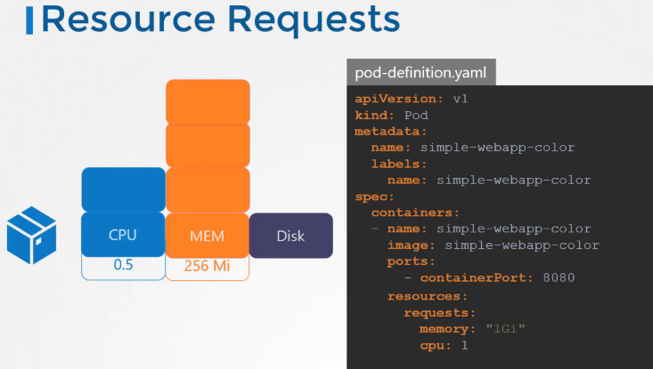

- Now, If you know that your application will need more than this, you can modify these values by specifying them in your Pod or Deployment definition files. In the simple pod-definition file, add a section called resources under which add requests and specify the new values for memory and CPU usage. In this case, I set it to one GB of memory and one count of CPU.
### 🔰 What does on count of CPU really mean?

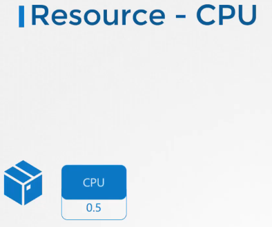

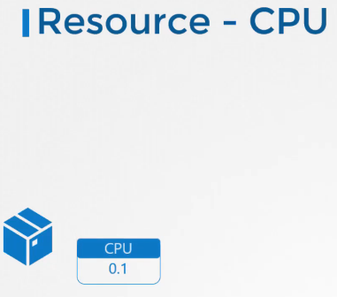

- Remember, these blocks are used for illustration purposes only. It doesn’t have to be in the increment of 0.5. You can specify any values as low as 0.1. 

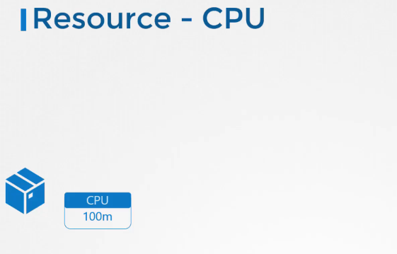

- 0.1 CPU can also be expressed as 100 m where ‘m’ stands for Milli.

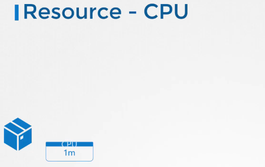

- You can go as low as 1 m, but not lower than that.

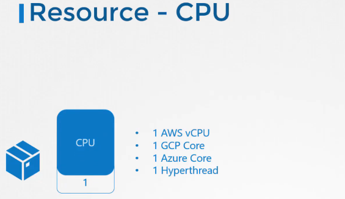

- 1 count of CPU is equal to 1 vCPU. That’s 1 vCPU in AWS or 1 core in GCP or Azure or 1 Hyperthread.

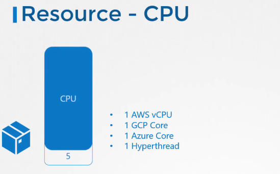

- You could request a higher number of CPUs for the container, provided your Nodes are sufficiently funded.

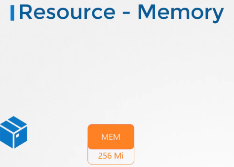


- Similar, with memory, you could specify 256 maybe by using the Mi suffix or specify the same value in memory like this.

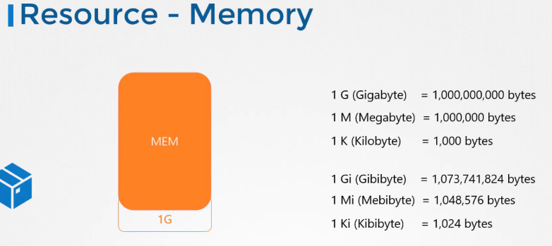

- Or use the suffix G for gigabyte. Note the difference between G and Gi. G is gigabyte and it refers to a 1000 megabytes, whereas Gi refers GB byte and refers to 1024 mebibyte. The same applies to megabyte and kilobyte.


- Let’s now look at a container running on a Node in the Docker World. A Docker container has no limit to the resources It can consume on a Node. Say a container starts with 1 vCPU on a Node. It can go up and consume as mush resource as It requires suffocating the native processes on the Node or other containers or resources.


- However, you can set a limit for the resource usage on these Pods. By default, Kubernetes sets a limit of 1 vCPU to containers, so If you do not specify explicitly, a container will be limited to consume only one vCPU from the Node.

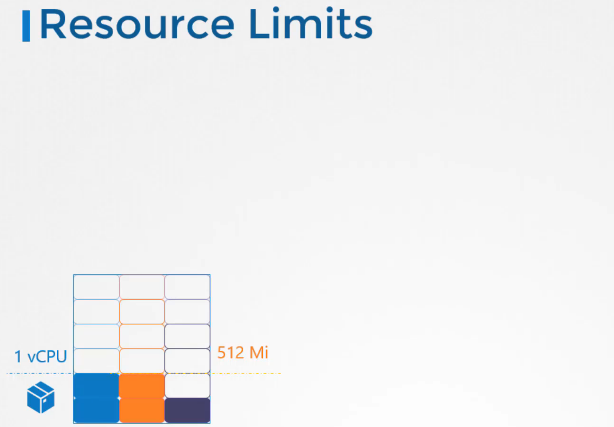

- The same goes with memory. By default, Kubernetes sets a limit of 512, maybe byte on containers.

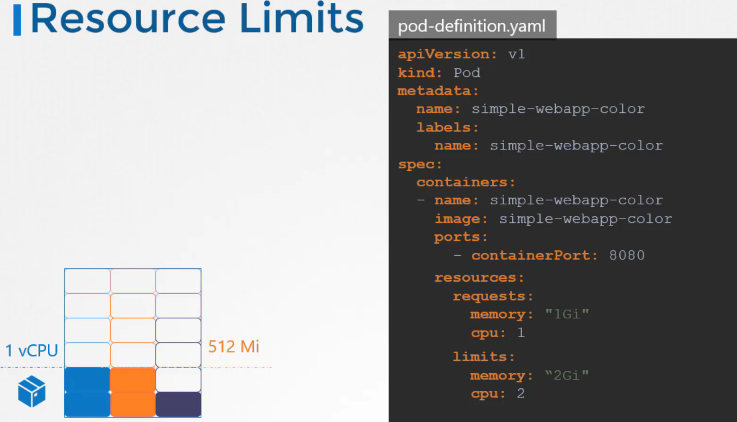

- If you don’t like the default limits, you can change them by adding a limit section under the resources section in your pod-definition file. Specify new limits for the memory and CPU like this.

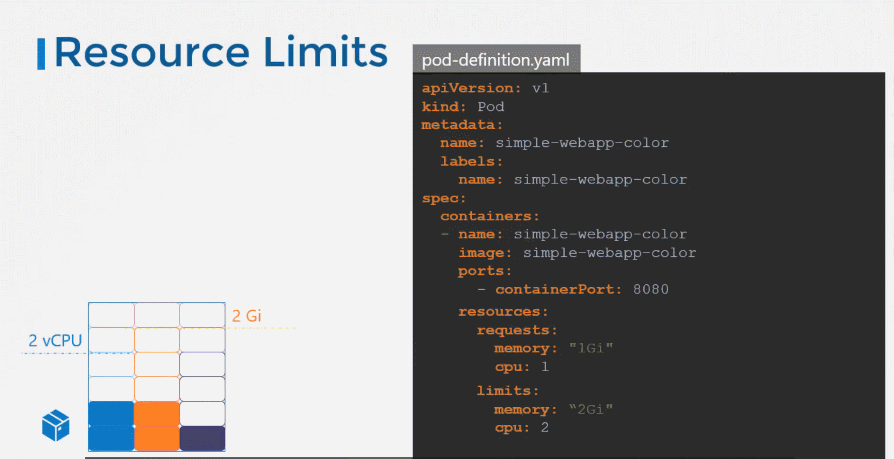

- When the Pod is created, Kubernetes sets new limits for the container. Remember, the limits and requests are set for each container within the Pod.


- So what happens when a Pod tries to exceed resources beyond Its specified limit? In case of CPU, Kubernetes throttles the CPU so that It does not go beyond the specified limit. A container cannot use more CPU resources than its limit.


- However, this is not the case with the memory. A container can use more memory resources than its limit.

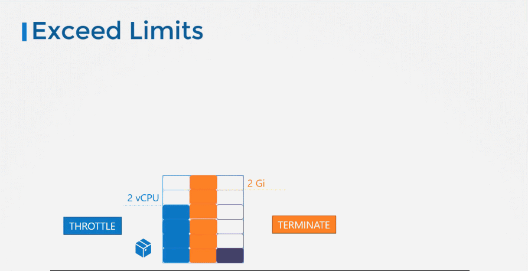

- So If a Pod tries to consume more memory than its limit constantly, the Pod will be terminated.
# 66. Note on default resource requirements and limits
In the previous lecture, I said - "When a pod is created the containers are assigned a default CPU request of .5 and memory of 256Mi". For the POD to pick up those defaults you must have first set those as default values for request and limit by creating a LimitRange in that namespace.`<br>1. apiVersion: v1<br>2. kind: LimitRange<br>3. metadata:<br>4.   name: mem-limit-range<br>5. spec:<br>6.   limits:<br>7.   - default:<br>8.       memory: 512Mi<br>9.     defaultRequest:<br>10.       memory: 256Mi<br>11.     type: Container`

[https://kubernetes.io/docs/tasks/administer-cluster/manage-resources/memory-default-namespace/](https://kubernetes.io/docs/tasks/administer-cluster/manage-resources/memory-default-namespace/)`<br>1. apiVersion: v1<br>2. kind: LimitRange<br>3. metadata:<br>4.   name: cpu-limit-range<br>5. spec:<br>6.   limits:<br>7.   - default:<br>8.       cpu: 1<br>9.     defaultRequest:<br>10.       cpu: 0.5<br>11.     type: Container`

[https://kubernetes.io/docs/tasks/administer-cluster/manage-resources/cpu-default-namespace/](https://kubernetes.io/docs/tasks/administer-cluster/manage-resources/cpu-default-namespace/)

**References:**

[https://kubernetes.io/docs/tasks/configure-pod-container/assign-memory-resource](https://kubernetes.io/docs/tasks/configure-pod-container/assign-memory-resource)
# 67. A quick note on editing PODs and Deployments
### Edit a POD
Remember, you CANNOT edit specifications of an existing POD other than the below.

- spec.containers\[\*\].image
- spec.initContainers\[\*\].image
- spec.activeDeadlineSeconds
- spec.tolerations

For example you cannot edit the environment variables, service accounts, resource limits (all of which we will discuss later) of a running pod. But if you really want to, you have 2 options:

1. Run the `kubectl edit pod <pod name>` command.  This will open the pod specification in an editor (vi editor). Then edit the required properties. When you try to save it, you will be denied. This is because you are attempting to edit a field on the pod that is not editable.


A copy of the file with your changes is saved in a temporary location as shown above.

You can then delete the existing pod by running the command:

`kubectl delete pod webapp`

Then create a new pod with your changes using the temporary file

`kubectl create -f /tmp/kubectl-edit-ccvrq.yaml`

2. The second option is to extract the pod definition in YAML format to a file using the command

`kubectl get pod webapp -o yaml > my-new-pod.yaml`

Then make the changes to the exported file using an editor (vi editor). Save the changes

`vi my-new-pod.yaml`

Then delete the existing pod

`kubectl delete pod webapp`

Then create a new pod with the edited file

`kubectl create -f my-new-pod.yaml`
# Edit Deployments
With Deployments you can easily edit any field/property of the POD template. Since the pod template is a child of the deployment specification,  with every change the deployment will automatically delete and create a new pod with the new changes. So if you are asked to edit a property of a POD part of a deployment you may do that simply by running the command

`kubectl edit deployment my-deployment`
# 68. Practice Test - Resource Requirements and Limits
Practice Test: [https://uklabs.kodekloud.com/topic/practice-test-resource-limits-2/](https://uklabs.kodekloud.com/topic/practice-test-resource-limits-2/)
# 69. Solution: Resource Limits:(Optional)
1. A pod called `rabbit` is deployed. Identify the CPU requirements set on the Pod(in the current(default) namespace) ⇒ **`1`**
```shell
controlplane ~ ➜  kubectl describe pod rabbit
Name:         rabbit
Namespace:    default
Priority:     0
Node:         controlplane/172.25.1.115
Start Time:   Tue, 23 Aug 2022 07:22:26 +0000
Labels:       <none>
Annotations:  <none>
Status:       Running
IP:           10.42.0.9
IPs:
  IP:  10.42.0.9
Containers:
  cpu-stress:
    Container ID:  containerd://a790949ea919a37f0e87ed57d61922c9a46099706cd5ff5bc015ae85cdda6abd
    Image:         ubuntu
    Image ID:      docker.io/library/ubuntu@sha256:34fea4f31bf187bc915536831fd0afc9d214755bf700b5cdb1336c82516d154e
    Port:          <none>
    Host Port:     <none>
    Args:
      sleep
      1000
    State:          Waiting
      Reason:       RunContainerError
    Last State:     Terminated
      Reason:       StartError
      Message:      failed to create containerd task: failed to create shim: OCI runtime create failed: container_linux.go:380: starting container process caused: process_linux.go:545: container init caused: process_linux.go:508: setting cgroup config for procHooks process caused: failed to write "200000": write /sys/fs/cgroup/cpu,cpuacct/kubepods/burstable/podbc033e6a-2581-4582-8293-784175f285f0/a790949ea919a37f0e87ed57d61922c9a46099706cd5ff5bc015ae85cdda6abd/cpu.cfs_quota_us: invalid argument: unknown
      Exit Code:    128
      Started:      Thu, 01 Jan 1970 00:00:00 +0000
      Finished:     Tue, 23 Aug 2022 07:24:01 +0000
    Ready:          False
    Restart Count:  4
    Limits:
      cpu:  2
    Requests:
      cpu:        1
    Environment:  <none>
    Mounts:
      /var/run/secrets/kubernetes.io/serviceaccount from kube-api-access-9vpml (ro)
Conditions:
  Type              Status
  Initialized       True 
  Ready             False 
  ContainersReady   False 
  PodScheduled      True 
Volumes:
  kube-api-access-9vpml:
    Type:                    Projected (a volume that contains injected data from multiple sources)
    TokenExpirationSeconds:  3607
    ConfigMapName:           kube-root-ca.crt
    ConfigMapOptional:       <nil>
    DownwardAPI:             true
QoS Class:                   Burstable
Node-Selectors:              <none>
Tolerations:                 node.kubernetes.io/not-ready:NoExecute op=Exists for 300s
                             node.kubernetes.io/unreachable:NoExecute op=Exists for 300s
Events:
  Type     Reason     Age                 From               Message
  ----     ------     ----                ----               -------
  Normal   Scheduled  104s                default-scheduler  Successfully assigned default/rabbit to controlplane
  Normal   Pulled     99s                 kubelet            Successfully pulled image "ubuntu" in 4.436386819s
  Normal   Pulled     97s                 kubelet            Successfully pulled image "ubuntu" in 522.404693ms
  Normal   Pulled     81s                 kubelet            Successfully pulled image "ubuntu" in 516.251146ms
  Normal   Pulled     54s                 kubelet            Successfully pulled image "ubuntu" in 772.027265ms
  Normal   Created    54s (x4 over 99s)   kubelet            Created container cpu-stress
  Warning  Failed     53s (x4 over 99s)   kubelet            Error: failed to create containerd task: failed to create shim: OCI runtime create failed: container_linux.go:380: starting container process caused: process_linux.go:545: container init caused: process_linux.go:508: setting cgroup config for procHooks process caused: failed to write "200000": write /sys/fs/cgroup/cpu,cpuacct/kubepods/burstable/podbc033e6a-2581-4582-8293-784175f285f0/cpu-stress/cpu.cfs_quota_us: invalid argument: unknown
  Warning  BackOff    23s (x7 over 97s)   kubelet            Back-off restarting failed container
  Normal   Pulling    11s (x5 over 103s)  kubelet            Pulling image "ubuntu"
  Normal   Pulled     10s                 kubelet            Successfully pulled image "ubuntu" in 615.468123ms
```

1. Delete the `rabbit` Pod. Once deleted, wait for the pod to fully terminate.
```shell
controlplane ~ ➜  kubectl delete pod rabbit 
pod "rabbit" deleted
```

1. Another pod called `elephant` has been deployed in the default namespace. It fails to get to a running state. Inspect this pod and identify the `Reason` why it is not running. ⇒ **`OOMKilled`**
2. The status `OOMKilled` indicates that it is failing because the pod ran out of memory. Identify the memory limit set on the POD. ⇒ **`OK`**
3. The `elephant` pod runs a process that consume 15Mi of memory. Increase the limit of the `elephant` pod to 20Mi. Delete and recreate the pod if required. Do not modify anything other than the required fields.
	- Pod Name: elephant
	- Image Name: polinux/stress
	- Memory Limit: 20Mi
	```shell
	controlplane ~ ➜  kubectl get pods
	NAME       READY   STATUS             RESTARTS        AGE
	elephant   0/1     CrashLoopBackOff   6 (3m51s ago)   9m37s

	controlplane ~ ➜  kubectl delete pod elephant 
	pod "elephant" deleted
	cat 
	controlplane ~ ➜  cat elephant.yml 
	apiVersion: v1
	kind: Pod
	metadata:
	  creationTimestamp: "2022-08-23T07:25:36Z"
	  name: elephant
	  namespace: default
	  resourceVersion: "932"
	  uid: 06f202e4-cc82-4474-82fd-0d7616694785
	spec:
	  containers:
	  - args:
	    - --vm
	    - "1"
	    - --vm-bytes
	    - 15M
	    - --vm-hang
	    - "1"
	    command:
	    - stress
	    image: polinux/stress
	    imagePullPolicy: Always
	    name: mem-stress
	    resources:
	      limits:
	        memory: 20Mi
	      requests:
	        memory: 5Mi

	controlplane ~ ➜  kubectl create -f elephant.yml 
	pod/elephant created
	```

4. Inspect the status of POD. Make sure it's running.
5. Delete the `elephant` Pod. Once deleted, wait for the pod to fully terminate.
# 70. DaemonSets

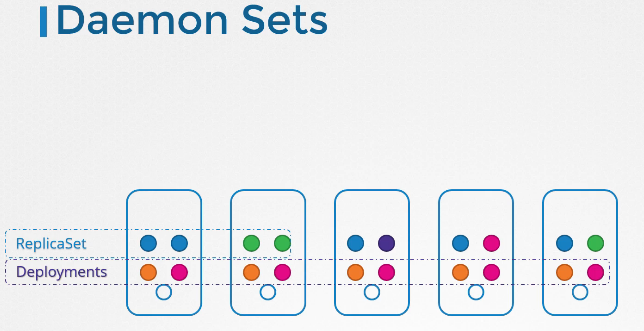

- So far, we have deployed various Pods on different Nodes in our Cluster with the help of ReplicaSets and Deployments. We made sure multiple copies of our applications are made available across various different Worker Nodes.

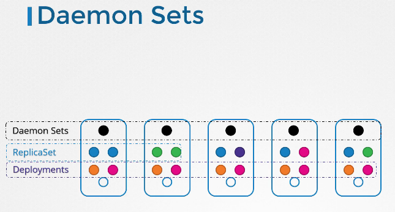

- Daemon Sets are like ReplicaSets, as in it helps you deploy multiple instances of Pods, but it runs one copy of your Pod on each Node in your Cluster.

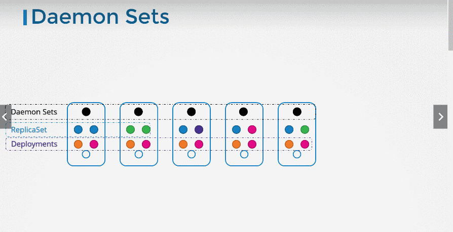

- Whenever a new Node is added to the Cluster, a Replica of the Pod is automatically added to that Node.

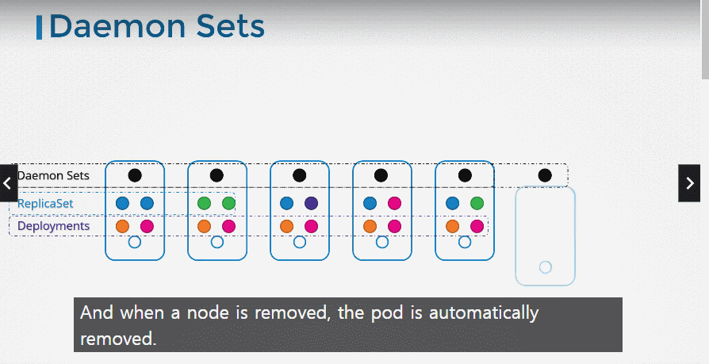

- And when a Node is removed, the Pod is automatically removed.
- The Daemon Set ensures that one copy of the Pod is always present in all Nodes in the Cluster.
### 🔰 What are some use cases of Daemon Sets?

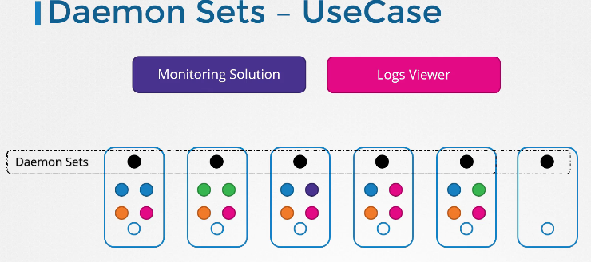

- Let’s say you would like to deploy a monitoring agent or log collector on each of your Nodes in the Cluster, so you can monitor your Cluster better. A Daemon Set is perfect for that as it can deploy your monitoring agent in the form of a Pod in all the Nodes in your Cluster.
- Then you don’y have to worry about adding or removing monitoring agents from these Nodes when there are changes in your Cluster as the Daemon Set will take care of that for you.

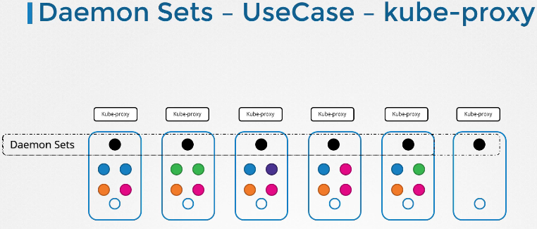

- Earlier, while discussing the Kubernetes architecture, we learned that one of the Worker Node components that is required on every Node in the Cluster is a `kube-proxy`. That is one good use case of Daemon Sets. The `kube-proxy` component can be deployed as a Daemon Set in the Cluster.

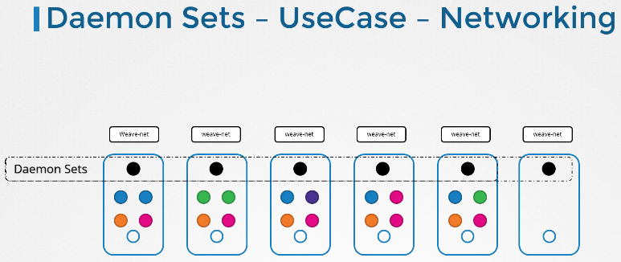

- Another use case if for networking. Networking solutions like `Weave-net` requires an agent to be deployed on each Node in the Cluster. 
### 🔰 Creating a Daemon Sets

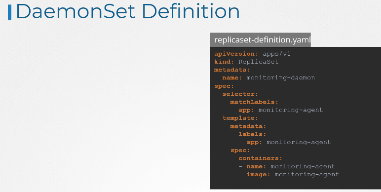

- Creating a Daemon Set is similar to the ReplicaSet creation process. It has nested Pod specification under the template section and selectors to link the Daemon Set to the Pods.

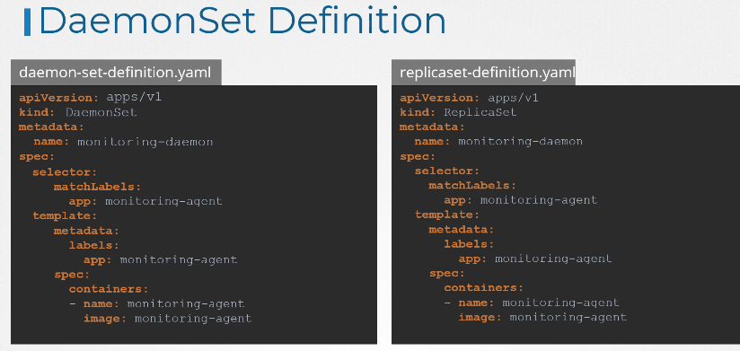

- A daemon-set-definition file has a similar structure. We start with the apiVersion, kind, metadata, spec. The apiVersion is ‘apps’ we want. kind is ‘DaemonSet’ insteat of ‘ReplicaSet’. We will set the name to monitoring Daemon under spec. You have a selector and a Pod specification template. It’s almost exactly like the ReplicaSet definition, except that the kind is a Daemon Set.

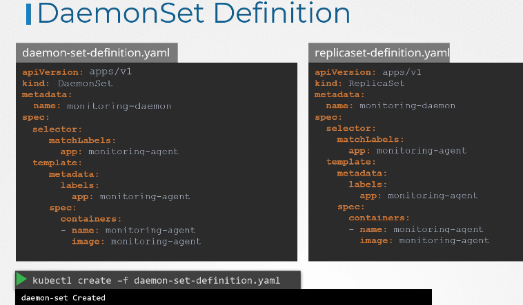

- Ensure that labels in the selector matches the ones in the Pod template. Once ready create the Daemon Set using the `kubectl create demon set` command.

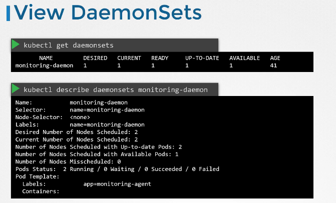

- To view the created Daemon Set, run the `kubectl get demonsets` command. And of course to view more details on the `kubecl describe demonsets` command.
### 🔰 How does a Daemon Set work?

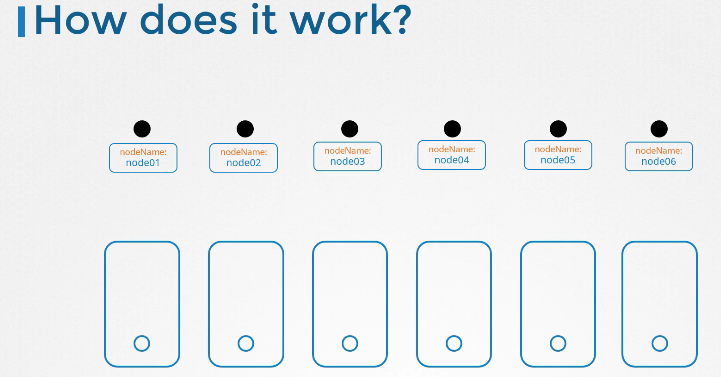

- How does it schedule Pod on each Node? And how does it ensure that every Node has a Pod? If you were asked to schedule a Pod on each Node in the Cluster, how would you do it? In one of the previous lectures in this section, we discussed that we could set the Node name properly on the Pod to bypass the scheduler and get the Pod placed on a Node directly. 

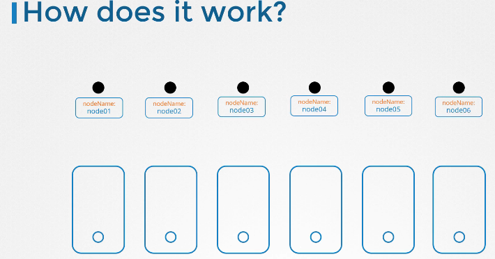

- So that’s one approach on each Pod, set the Node name, property and its specification before it is created.

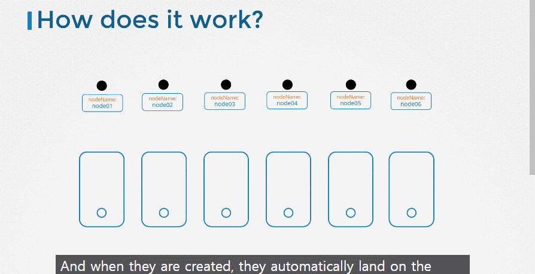

- And when they are created, they automatically land on the respective Nodes.

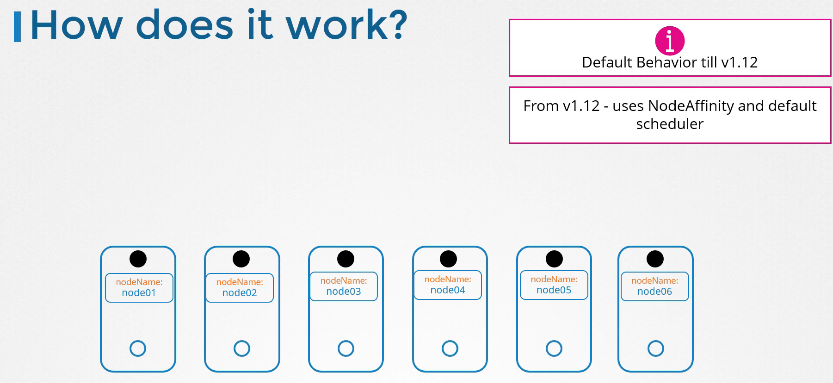

- So that’s how it used to be until Kubernetes version 1.12. From version 1.12 onwards, the Daemon Set uses the default Scheduler and Node Affinity rules that we learned on one of the previous lectures to schedule Pods on Nodes.
# 71. Practice Test - DaemonSets
Practice Test: [https://uklabs.kodekloud.com/topic/practice-test-daemonsets-2/](https://uklabs.kodekloud.com/topic/practice-test-daemonsets-2/)
# 72. Solution - DaemonSets(Optional)
1. How many `DaemonSets` are created in the cluster in all namespaces? Check all namespaces. ⇒ **`2`**
	```shell
	root@controlplane ~ ➜  kubectl get daemonsets --all-namespaces
	NAMESPACE     NAME              DESIRED   CURRENT   READY   UP-TO-DATE   AVAILABLE   NODE SELECTOR            AGE
	kube-system   kube-flannel-ds   1         1         1       1            1           <none>                   8m26s
	kube-system   kube-proxy        1         1         1       1            1           kubernetes.io/os=linux   8m31s
	```

2. Which namespace are the `DaemonSets` created in? ⇒ **`kube-system`**
3. Which of the below is a `DaemonSet`? ⇒ **`kube-flannel-ds`**
4. On how many nodes are the pods scheduled by the **DaemonSet **`kube-proxy`? ⇒ **`1`**
	```shell
	root@controlplane ~ ➜  kubectl describe daemonsets kube-proxy --namespace=kube-system
	Name:           kube-proxy
	Selector:       k8s-app=kube-proxy
	Node-Selector:  kubernetes.io/os=linux
	Labels:         k8s-app=kube-proxy
	Annotations:    deprecated.daemonset.template.generation: 1
	Desired Number of Nodes Scheduled: 1
	Current Number of Nodes Scheduled: 1
	Number of Nodes Scheduled with Up-to-date Pods: 1
	Number of Nodes Scheduled with Available Pods: 1
	Number of Nodes Misscheduled: 0
	Pods Status:  1 Running / 0 Waiting / 0 Succeeded / 0 Failed
	Pod Template:
	  Labels:           k8s-app=kube-proxy
	  Service Account:  kube-proxy
	  Containers:
	   kube-proxy:
	    Image:      k8s.gcr.io/kube-proxy:v1.23.0
	    Port:       <none>
	    Host Port:  <none>
	    Command:
	      /usr/local/bin/kube-proxy
	      --config=/var/lib/kube-proxy/config.conf
	      --hostname-override=$(NODE_NAME)
	    Environment:
	      NODE_NAME:   (v1:spec.nodeName)
	    Mounts:
	      /lib/modules from lib-modules (ro)
	      /run/xtables.lock from xtables-lock (rw)
	      /var/lib/kube-proxy from kube-proxy (rw)
	  Volumes:
	   kube-proxy:
	    Type:      ConfigMap (a volume populated by a ConfigMap)
	    Name:      kube-proxy
	    Optional:  false
	   xtables-lock:
	    Type:          HostPath (bare host directory volume)
	    Path:          /run/xtables.lock
	    HostPathType:  FileOrCreate
	   lib-modules:
	    Type:               HostPath (bare host directory volume)
	    Path:               /lib/modules
	    HostPathType:       
	  Priority Class Name:  system-node-critical
	Events:
	  Type    Reason            Age   From                  Message
	  ----    ------            ----  ----                  -------
	  Normal  SuccessfulCreate  12m   daemonset-controller  Created pod: kube-proxy-mrdmc
	```

5. What is the image used by the POD deployed by the `kube-flannel-ds` **DaemonSet**? ⇒ **`quay.io/coreos/flannel:v0.13.1-rc1`**
	```shell
	root@controlplane ~ ✖ kubectl describe ds kube-flannel-ds --namespace=kube-system
	Name:           kube-flannel-ds
	Selector:       app=flannel
	Node-Selector:  <none>
	Labels:         app=flannel
	                tier=node
	Annotations:    deprecated.daemonset.template.generation: 1
	Desired Number of Nodes Scheduled: 1
	Current Number of Nodes Scheduled: 1
	Number of Nodes Scheduled with Up-to-date Pods: 1
	Number of Nodes Scheduled with Available Pods: 1
	Number of Nodes Misscheduled: 0
	Pods Status:  1 Running / 0 Waiting / 0 Succeeded / 0 Failed
	Pod Template:
	  Labels:           app=flannel
	                    tier=node
	  Service Account:  flannel
	  Init Containers:
	   install-cni:
	    Image:      quay.io/coreos/flannel:v0.13.1-rc1
	    Port:       <none>
	    Host Port:  <none>
	    Command:
	      cp
	    Args:
	      -f
	      /etc/kube-flannel/cni-conf.json
	      /etc/cni/net.d/10-flannel.conflist
	    Environment:  <none>
	    Mounts:
	      /etc/cni/net.d from cni (rw)
	      /etc/kube-flannel/ from flannel-cfg (rw)
	  Containers:
	   kube-flannel:
	    Image:      quay.io/coreos/flannel:v0.13.1-rc1
	    Port:       <none>
	    Host Port:  <none>
	    Command:
	      /opt/bin/flanneld
	    Args:
	      --ip-masq
	      --kube-subnet-mgr
	      --iface=eth0
	    Limits:
	      cpu:     100m
	      memory:  300Mi
	    Requests:
	      cpu:     100m
	      memory:  50Mi
	    Environment:
	      POD_NAME:        (v1:metadata.name)
	      POD_NAMESPACE:   (v1:metadata.namespace)
	    Mounts:
	      /etc/kube-flannel/ from flannel-cfg (rw)
	      /run/flannel from run (rw)
	  Volumes:
	   run:
	    Type:          HostPath (bare host directory volume)
	    Path:          /run/flannel
	    HostPathType:  
	   cni:
	    Type:          HostPath (bare host directory volume)
	    Path:          /etc/cni/net.d
	    HostPathType:  
	   flannel-cfg:
	    Type:               ConfigMap (a volume populated by a ConfigMap)
	    Name:               kube-flannel-cfg
	    Optional:           false
	  Priority Class Name:  system-node-critical
	Events:
	  Type    Reason            Age   From                  Message
	  ----    ------            ----  ----                  -------
	  Normal  SuccessfulCreate  14m   daemonset-controller  Created pod: kube-flannel-ds-qdcgd
	```

6. Deploy a **DaemonSet** for `FluentD` Logging. Use the given specifications. ⇒ **`Check`**
	- Name: elasticsearch
	- Namespace: kube-system
	- Image: k8s.gcr.io/fluentd-elasticsearch:1.20
	```shell
	root@controlplane ~ ➜  cat daemonset.yaml 
	apiVersion: apps/v1
	kind: DaemonSet
	metadata:
	  name: elasticsearch
	  namespace: kube-system
	spec:
	  selector:
	  matchLabels:
	      app: elasticsearch
	  template:
	    metadata:
	     labels:
	       app: elasticsearch
	  spec:
	       containers:
	       - name: elasticsearch
	         image: k8s.gcr.io/fluentd-elasticsearch:1.20
	```
# 73. Static Pods

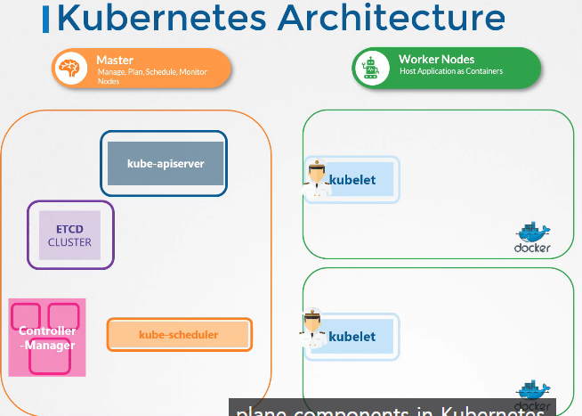

- Earlier in this course, we talked about the Architecture and how the `kubelet` functions as one of the many control plane components in Kubernetes. The `kubelet` relies on the `kube-apiserver` for instructions on what Pods to load on its Node, which was based on a decision made by the `kube-scheduler` which was stored in the `ETCD` datastore.

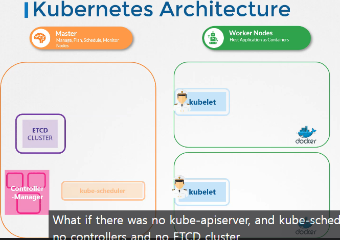

- What if there was no `kube-apiserver`, `kube-scheduler`, `controller`, `ETCD Cluster?`

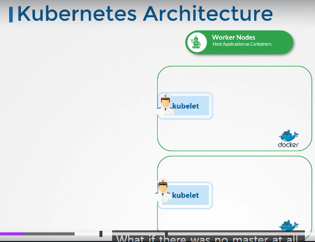

- What if there was no master at all?

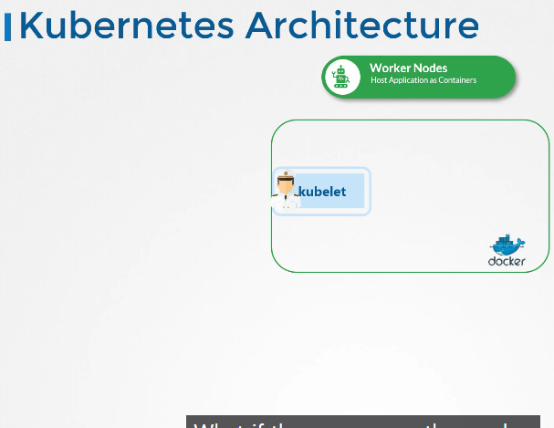

- What if there were no other Nodes? What if you’re all alone in the sea by yourself? Not part of any Cluster. Is there anything that the `kublet` can do as the captain on the ship? Can it operate as an independent Node? If so who would provide the instructions required to create Pods?

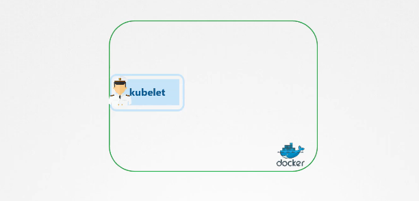

- The `kublet` can manage a Node independently. On this ship(host), we have the `kublet` installed. And of course we have Docker as well to run containers. There is no Kubernetes Cluster. So there are no `kube-apiserver` or anything like that. The one thing that the `kublet` knows to do is create Pods. But we don’t have an API server here to provide Pod details.

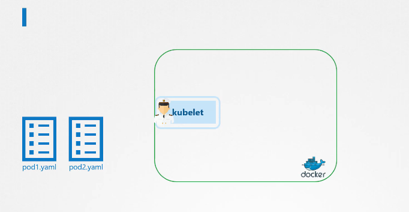

- By now, we know that to create a Pod, you need the details of the Pod in a pod-definition file. But how do you provide a pod-definition file to the `kublet` without a `kube-apiserver`?

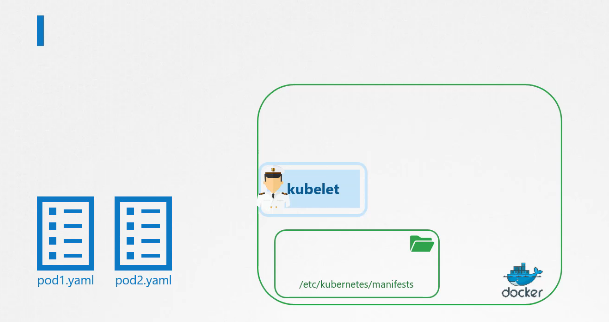

- You can configure the `kublet` to read the pod-definition files from a directory on the server designated to store information about Pods.

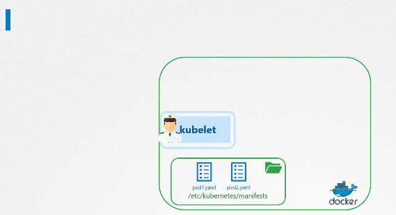

- Place the pod-definition files in this directory. 

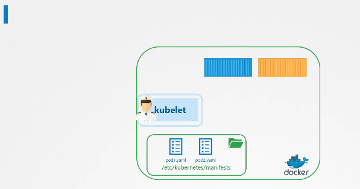

- The `kublet` periodically checks this directory for files reads these files and creates Pods on the host. Not only does it create the Pod it can ensure that the Pod stays alive. If the application crashed, the `kublet` attempts to restart it. If you make a change to any of the file within this directory, the `kublet` recreates the Pod for those changes to take effect. If you remove a file from this directory, the Pod is deleted automatically. 

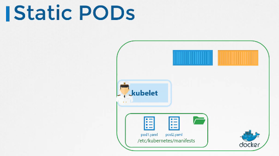

- So these Pods that are created by the `kublet` on its own without the intervention from the API Server or rest of the Kubernetes Cluster components are known as Static Pods.
- Remember you can only create Pods this way. You cannot create ReplicaSet or Deployments or Services by placing d definition file in the designated directory. They are all concepts part of the whole Kubernetes architecture, that requires other control plane components like the Replication and Deployment Controllers etc. The `kublet` works at a Pod level and can only understand Pods. Which is why it is able to create Static Pods this way.
- So what is that designated folder and how do you configure it? It could be any directory on the host. And the location of that directory is passed in the `kublet` as a option while running the service.

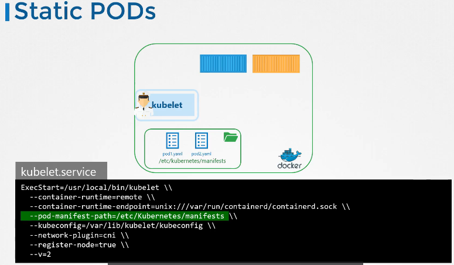

- The option is named ‘—pod-manifest-path’ and here it is set to ‘/etc/kubernetes/manifests’ folder. There is also another way to configure this.

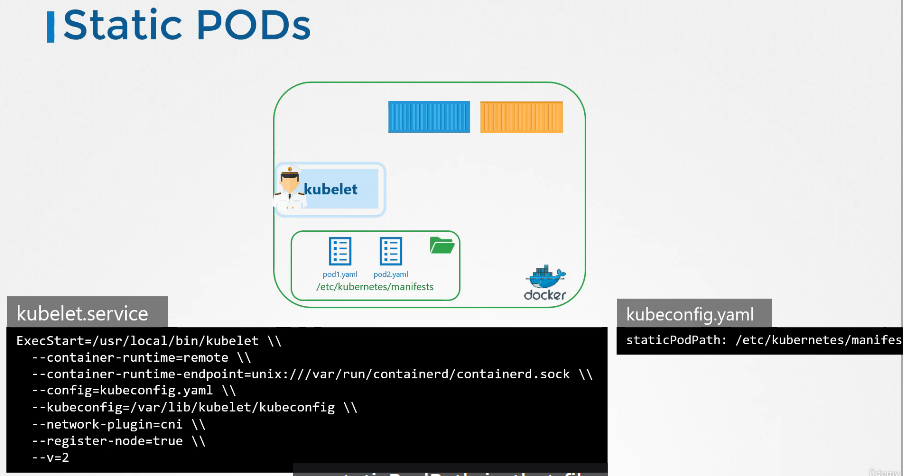

- Instead of specifying the option directly in the ‘kublet.service’ file, you could provide a path to another config file (’—config=kubeconfig.yaml’) using the config option, and define the directory path as Static Pod path in that file; kubeconfig.yaml. Cluster setup by the kubeadmin tool uses this approach. If you are inspecting an existing Cluster, you should inspect this option of the `kubelet` to identify the path to the directory. You will then know, where to place the definition file for your Static Pods.
- So keep this in mind when you go through the labs. You should know to view and configure this option irrespective of the method used to set up the Cluster. 
- First, check the option Pod manifest path in the `kubelet` service file, if it’s not there then look for the config option and identify the file used as the config file and then within the config file look for these Static Pod path option. Either of these should give you the right path.

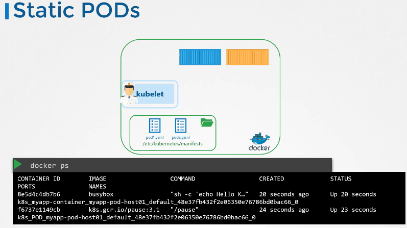

- Once the Static Pods are created, you can view them by running the `docker ps` command. So why not the `kubectl` command as we have been doing so far? Remember, we don’t have the rest of the Kubernetes Cluster yet. So, `kubectl` utility works with the `kube-apiserver`. Since we don’t have an API Server now, no `kubectl` utility. Which is why we’re using the docker command.

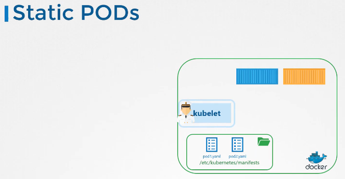

- So then how does it work when the Node is part of a Cluster? When there is an API Server requesting the `kubelet` to create Pods. Can the `kubelet` create both kinds of Pods at the same time? The way the `kubelet` works is it can take in requests for creating Pods from different inputs. The first, is through the pod-definition files from the static Pods folder, as we just saw.

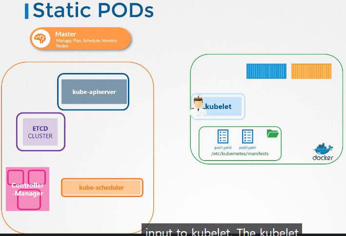

- The second, is through an HTTP API endpoint. And that is how the `kube-apiserver` provides input to `kubelet`. The `kubelet` can create both kind of Pods - the Static Pods and the ones from the API Server at the same time.

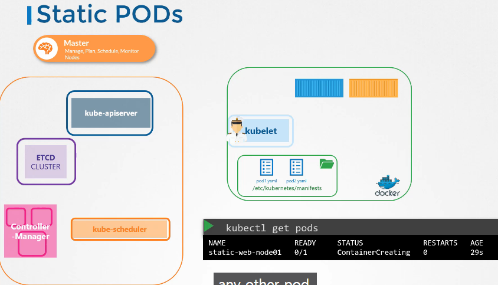

- In that case, is the API Server aware of the Static Pods created by the `kubelet`? Yes it is. If you run the `kubectl get pods` command on the Mater Node, the Static Pods will be listed as any other Pod.
- How is that happening? When the `kubelet` creates a Static Pod, if it is part of a Cluster, it also creates a mirror object in the `kube-apiserver`. What you see from the `kube-apiserver` is just a read only mirror of the Pod. You can view details about the Pod but you cannot edit or delete it like the usual Pods. You can only delete them by modifying the files from the Nodes manifest folder. Note that the name of the Pod is automatically appended with the Node name.

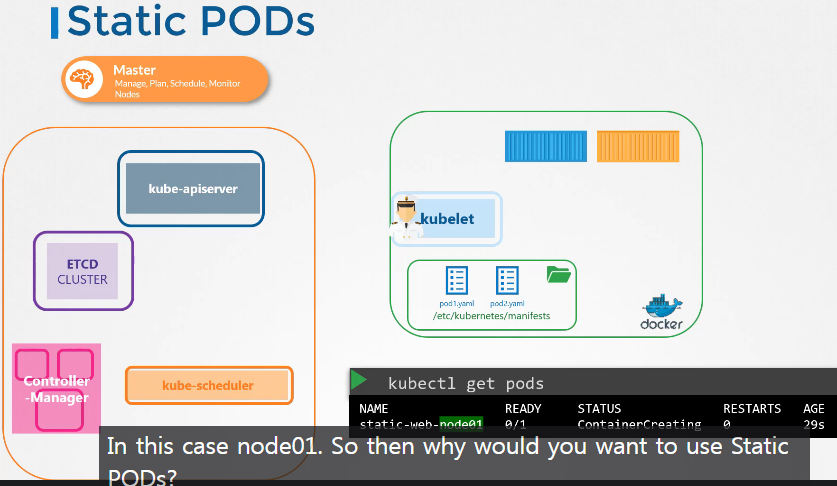

- In this case, ‘node01’. So then why would you want to use Static Pods? 

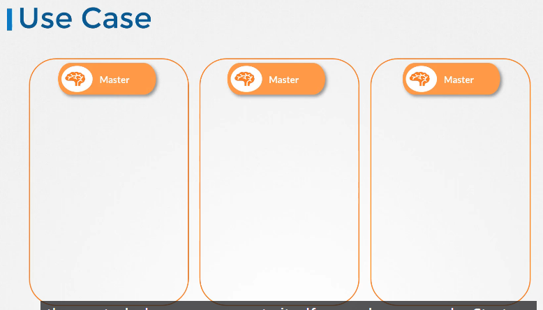

- Since static Pods are not dependent on the Kubernetes control plane, you can use Static Pods to deploy to control plane components itself as Pods on a Node. 

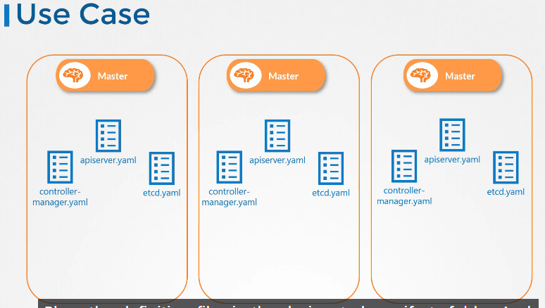

- Start by installing `kubelet` on all the Master Nodes. Then create pod-definition files that uses Docker images of the various control plane components such as the API Server, Controller, ETCD, etc.

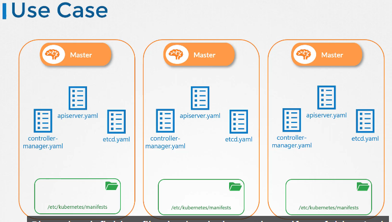

- Place the definition files in the designated manifests folder. 

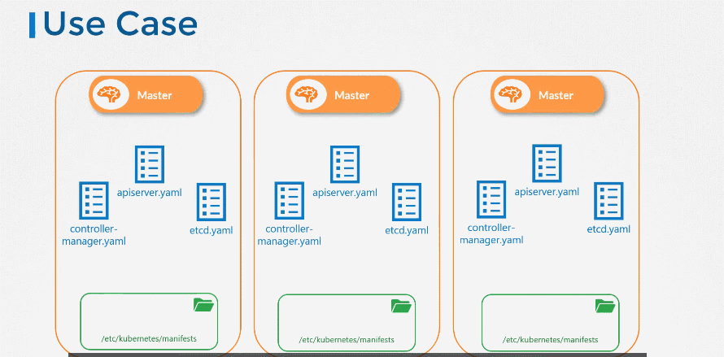

- And `kubelet` takes care of deploying the control plane components themselves as Pods on the Cluster. This way you don’t have to download the binaries configure services or worry about so the service is crashing. If any of these services were to crash since it’s a Static Pod it will automatically be restarted by the `kubelet`. Neat and simple. That’s how the kube admin tool set’s up a Kubernetes Cluster.
- Which is why when you list the Pods in the `kube-system` namespace, you see the control plane components as Pods in a Cluster setup by the kube admin tool.
### 🔰 Different between Static Pods and Daemon Sets

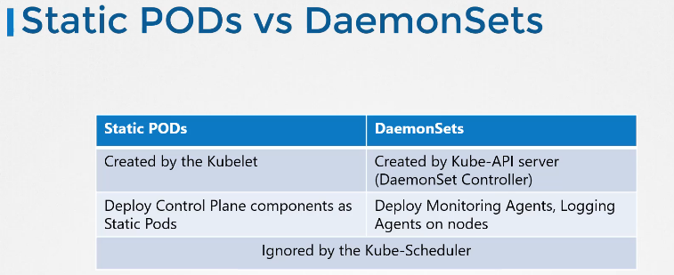

- Daemon Sets as we saw earlier are used to ensure on instance of an application is available on all Nodes in the Cluster. It is handled by a Deamon Set Controller through the `kube-apiserver`.
- Whereas Static Pods, as we saw in this lecture, are created directly b y the `kubelet` without any interference from the `kube-apiserver` or rest of the Kubernetes control plane components.
- Static Pods can be used to deploy the Kubernetes control plane components itself. Both Static Pods and Pods created by Daemon Sets are ignored by the `kube-scheduler`. The `kube-scheduler` has no affect on these Pods.
# 74. Practice Test - Static Pods
Practice Test Link: [https://uklabs.kodekloud.com/topic/practice-test-static-pods-2/](https://uklabs.kodekloud.com/topic/practice-test-static-pods-2/)
# 75. Solution - Static Pods(Optional)
1. How many static pods exist in this cluster in all namespaces? ⇒ **`4`**
	```shell
	root@controlplane ~ ➜  kubectl get pods --all-namespaces
	NAMESPACE     NAME                                   READY   STATUS    RESTARTS   AGE
	kube-system   coredns-64897985d-l829h                1/1     Running   0          6m23s
	kube-system   coredns-64897985d-t4fm6                1/1     Running   0          6m23s
	kube-system   etcd-controlplane                      1/1     Running   0          6m33s
	kube-system   kube-apiserver-controlplane            1/1     Running   0          6m33s
	kube-system   kube-controller-manager-controlplane   1/1     Running   0          6m37s
	kube-system   kube-flannel-ds-ksvfk                  1/1     Running   0          5m59s
	kube-system   kube-flannel-ds-wrz95                  1/1     Running   0          6m23s
	kube-system   kube-proxy-8qtdn                       1/1     Running   0          6m23s
	kube-system   kube-proxy-k5f5g                       1/1     Running   0          5m59s
	kube-system   kube-scheduler-controlplane            1/1     Running   0          6m33s
	```

2. Which of the below components is NOT deployed as a static pod? **`coredns`**
3. Which of the below components is NOT deployed as a static POD? **`kube-proxy`**
	```shell
	root@controlplane ~ ✖ kubectl get pods --all-namespaces
	NAMESPACE     NAME                                   READY   STATUS    RESTARTS   AGE
	kube-system   coredns-64897985d-l829h                1/1     Running   0          8m51s
	kube-system   coredns-64897985d-t4fm6                1/1     Running   0          8m51s
	kube-system   etcd-controlplane                      1/1     Running   0          9m1s
	kube-system   kube-apiserver-controlplane            1/1     Running   0          9m1s
	kube-system   kube-controller-manager-controlplane   1/1     Running   0          9m5s
	kube-system   kube-flannel-ds-ksvfk                  1/1     Running   0          8m27s
	kube-system   kube-flannel-ds-wrz95                  1/1     Running   0          8m51s
	kube-system   kube-proxy-8qtdn                       1/1     Running   0          8m51s
	kube-system   kube-proxy-k5f5g                       1/1     Running   0          8m27s
	kube-system   kube-scheduler-controlplane            1/1     Running   0          9m1s
	```

4. On which nodes are the static pods created currently? **`controlplane`**
	```shell
	root@controlplane ~ ➜  kubectl get pods --all-namespaces
	NAMESPACE     NAME                                   READY   STATUS    RESTARTS   AGE
	kube-system   coredns-64897985d-l829h                1/1     Running   0          9m29s
	kube-system   coredns-64897985d-t4fm6                1/1     Running   0          9m29s
	kube-system   etcd-controlplane                      1/1     Running   0          9m39s
	kube-system   kube-apiserver-controlplane            1/1     Running   0          9m39s
	kube-system   kube-controller-manager-controlplane   1/1     Running   0          9m43s
	kube-system   kube-flannel-ds-ksvfk                  1/1     Running   0          9m5s
	kube-system   kube-flannel-ds-wrz95                  1/1     Running   0          9m29s
	kube-system   kube-proxy-8qtdn                       1/1     Running   0          9m29s
	kube-system   kube-proxy-k5f5g                       1/1     Running   0          9m5s
	kube-system   kube-scheduler-controlplane            1/1     Running   0          9m39s
	```

5. What is the path of the directory holding the static pod definition files? ⇒ **`/etc/kubernetes/manifests`**
	```shell
	root@controlplane ~ ✖ ps -aux | grep kubelet
	root        3034  0.0  0.1 1117300 325248 ?      Ssl  01:29   0:34 kube-apiserver --advertise-address=10.0.213.3 --allow-privileged=true --authorization-mode=Node,RBAC --client-ca-file=/etc/kubernetes/pki/ca.crt --enable-admission-plugins=NodeRestriction --enable-bootstrap-token-auth=true --etcd-cafile=/etc/kubernetes/pki/etcd/ca.crt --etcd-certfile=/etc/kubernetes/pki/apiserver-etcd-client.crt --etcd-keyfile=/etc/kubernetes/pki/apiserver-etcd-client.key --etcd-servers=https://127.0.0.1:2379 --kubelet-client-certificate=/etc/kubernetes/pki/apiserver-kubelet-client.crt --kubelet-client-key=/etc/kubernetes/pki/apiserver-kubelet-client.key --kubelet-preferred-address-types=InternalIP,ExternalIP,Hostname --proxy-client-cert-file=/etc/kubernetes/pki/front-proxy-client.crt --proxy-client-key-file=/etc/kubernetes/pki/front-proxy-client.key --requestheader-allowed-names=front-proxy-client --requestheader-client-ca-file=/etc/kubernetes/pki/front-proxy-ca.crt --requestheader-extra-headers-prefix=X-Remote-Extra- --requestheader-group-headers=X-Remote-Group --requestheader-username-headers=X-Remote-User --secure-port=6443 --service-account-issuer=https://kubernetes.default.svc.cluster.local --service-account-key-file=/etc/kubernetes/pki/sa.pub --service-account-signing-key-file=/etc/kubernetes/pki/sa.key --service-cluster-ip-range=10.96.0.0/12 --tls-cert-file=/etc/kubernetes/pki/apiserver.crt --tls-private-key-file=/etc/kubernetes/pki/apiserver.key
	root        3674  0.0  0.0 4236164 100968 ?      Ssl  01:29   0:19 /usr/bin/kubelet --bootstrap-kubeconfig=/etc/kubernetes/bootstrap-kubelet.conf --kubeconfig=/etc/kubernetes/kubelet.conf --config=/var/lib/kubelet/config.yaml --network-plugin=cni --pod-infra-container-image=k8s.gcr.io/pause:3.6
	root       11549  0.0  0.0  13444  1052 pts/0    S+   01:41   0:00 grep --color=auto kubelet
	```

	```shell
	root@controlplane ~ ✖ grep -i staticpod /var/lib/kubelet/config.yaml
	staticPodPath: /etc/kubernetes/manifests
	```

6. How many pod definition files are present in the manifests folder? ⇒ **`4`**
	```shell
	root@controlplane ~ ✖ cd /etc/kubernetes/manifests

	root@controlplane /etc/kubernetes/manifests ➜  ls
	etcd.yaml            kube-controller-manager.yaml
	kube-apiserver.yaml  kube-scheduler.yaml
	```

7. What is the docker image used to deploy the kube-api server as a static pod? ⇒ **`k8s.gcr.io/kube-apiserver:v1.23.0`**
	```shell
	root@controlplane /etc/kubernetes/manifests ➜  cat kube-apiserver.yaml 
	apiVersion: v1
	kind: Pod
	metadata:
	  annotations:
	    kubeadm.kubernetes.io/kube-apiserver.advertise-address.endpoint: 10.0.213.3:6443
	  creationTimestamp: null
	  labels:
	    component: kube-apiserver
	    tier: control-plane
	  name: kube-apiserver
	  namespace: kube-system
	spec:
	  containers:
	  - command:
	    - kube-apiserver
	    - --advertise-address=10.0.213.3
	    - --allow-privileged=true
	    - --authorization-mode=Node,RBAC
	    - --client-ca-file=/etc/kubernetes/pki/ca.crt
	    - --enable-admission-plugins=NodeRestriction
	    - --enable-bootstrap-token-auth=true
	    - --etcd-cafile=/etc/kubernetes/pki/etcd/ca.crt
	    - --etcd-certfile=/etc/kubernetes/pki/apiserver-etcd-client.crt
	    - --etcd-keyfile=/etc/kubernetes/pki/apiserver-etcd-client.key
	    - --etcd-servers=https://127.0.0.1:2379
	    - --kubelet-client-certificate=/etc/kubernetes/pki/apiserver-kubelet-client.crt
	    - --kubelet-client-key=/etc/kubernetes/pki/apiserver-kubelet-client.key
	    - --kubelet-preferred-address-types=InternalIP,ExternalIP,Hostname
	    - --proxy-client-cert-file=/etc/kubernetes/pki/front-proxy-client.crt
	    - --proxy-client-key-file=/etc/kubernetes/pki/front-proxy-client.key
	    - --requestheader-allowed-names=front-proxy-client
	    - --requestheader-client-ca-file=/etc/kubernetes/pki/front-proxy-ca.crt
	    - --requestheader-extra-headers-prefix=X-Remote-Extra-
	    - --requestheader-group-headers=X-Remote-Group
	    - --requestheader-username-headers=X-Remote-User
	    - --secure-port=6443
	    - --service-account-issuer=https://kubernetes.default.svc.cluster.local
	    - --service-account-key-file=/etc/kubernetes/pki/sa.pub
	    - --service-account-signing-key-file=/etc/kubernetes/pki/sa.key
	    - --service-cluster-ip-range=10.96.0.0/12
	    - --tls-cert-file=/etc/kubernetes/pki/apiserver.crt
	    - --tls-private-key-file=/etc/kubernetes/pki/apiserver.key
	    image: k8s.gcr.io/kube-apiserver:v1.23.0
	    imagePullPolicy: IfNotPresent
	    livenessProbe:
	      failureThreshold: 8
	      httpGet:
	        host: 10.0.213.3
	        path: /livez
	        port: 6443
	        scheme: HTTPS
	      initialDelaySeconds: 10
	      periodSeconds: 10
	      timeoutSeconds: 15
	    name: kube-apiserver
	    readinessProbe:
	      failureThreshold: 3
	      httpGet:
	        host: 10.0.213.3
	        path: /readyz
	        port: 6443
	        scheme: HTTPS
	      periodSeconds: 1
	      timeoutSeconds: 15
	    resources:
	      requests:
	        cpu: 250m
	    startupProbe:
	      failureThreshold: 24
	      httpGet:
	        host: 10.0.213.3
	        path: /livez
	        port: 6443
	        scheme: HTTPS
	      initialDelaySeconds: 10
	      periodSeconds: 10
	      timeoutSeconds: 15
	    volumeMounts:
	    - mountPath: /etc/ssl/certs
	      name: ca-certs
	      readOnly: true
	    - mountPath: /etc/ca-certificates
	      name: etc-ca-certificates
	      readOnly: true
	    - mountPath: /etc/kubernetes/pki
	      name: k8s-certs
	      readOnly: true
	    - mountPath: /usr/local/share/ca-certificates
	      name: usr-local-share-ca-certificates
	      readOnly: true
	    - mountPath: /usr/share/ca-certificates
	      name: usr-share-ca-certificates
	      readOnly: true
	  hostNetwork: true
	  priorityClassName: system-node-critical
	  securityContext:
	    seccompProfile:
	      type: RuntimeDefault
	  volumes:
	  - hostPath:
	      path: /etc/ssl/certs
	      type: DirectoryOrCreate
	    name: ca-certs
	  - hostPath:
	      path: /etc/ca-certificates
	      type: DirectoryOrCreate
	    name: etc-ca-certificates
	  - hostPath:
	      path: /etc/kubernetes/pki
	      type: DirectoryOrCreate
	    name: k8s-certs
	  - hostPath:
	      path: /usr/local/share/ca-certificates
	      type: DirectoryOrCreate
	    name: usr-local-share-ca-certificates
	  - hostPath:
	      path: /usr/share/ca-certificates
	      type: DirectoryOrCreate
	    name: usr-share-ca-certificates
	status: {}
	```

8. Create a static pod named `static-busybox` that uses the `busybox`  image and the command `sleep 1000`.
	- Name: static-busybox
	- Image: busybox
	```shell
	kubectl run --restart=Never --image=busybox static-busybox --dry-run=client -o yaml --command -- sleep 1000 > /etc/kubernetes/manifests/static-busybox.yaml
	```

9. Edit the image on the static pod to use `busybox:1.28.4`.
	- Name: static-busybox
	- Image: busybox:1.28.4
	```shell
	root@controlplane ~ ✖ cd /etc/kubernetes/manifests

	root@controlplane /etc/kubernetes/manifests ➜  ls
	etcd.yaml                     kube-scheduler.yaml
	kube-apiserver.yaml           static-busybox.yaml
	kube-controller-manager.yaml  static-busybox.yaml.

	root@controlplane /etc/kubernetes/manifests ➜  cat static-busybox.yaml
	apiVersion: v1
	kind: Pod
	metadata:
	  creationTimestamp: null
	  labels:
	    run: static-busybox
	  name: static-busybox
	spec:
	  containers:
	  - command:
	    - sleep
	    - "1000"
	    image: busybox:1.28.4
	    name: static-busybox
	    resources: {}
	  dnsPolicy: ClusterFirst
	  restartPolicy: Never
	status: {}
	```

10. We just created a new static pod named **static-greenbox**. Find it and delete it. This question is a bit tricky. But if you use the knowledge you gained in the previous questions in this lab, you should be able to find the answer to it.
	```shell
	root@controlplane:~# kubectl get pods --all-namespaces -o wide  | grep static-greenbox
	default       static-greenbox-node01                 1/1     Running   0          19s     10.244.1.2   node01       <none>           <none>
	```

	```shell
	root@controlplane:~# ssh node01 
	root@node01:~# ps -ef |  grep /usr/bin/kubelet 
	root       752   654  0 00:30 pts/0    00:00:00 grep --color=auto /usr/bin/kubelet
	root     28567     1  0 00:22 ?        00:00:11 /usr/bin/kubelet --bootstrap-kubeconfig=/etc/kubernetes/bootstrap-kubelet.conf --kubeconfig=/etc/kubernetes/kubelet.conf --config=/var/lib/kubelet/config.yaml --network-plugin=cni --pod-infra-container-image=k8s.gcr.io/pause:3.2
	root@node01:~# grep -i staticpod /var/lib/kubelet/config.yaml
	staticPodPath: /etc/just-to-mess-with-you
	```

	```shell
	root@node01:/etc/just-to-mess-with-you# ls
	greenbox.yaml
	root@node01:/etc/just-to-mess-with-you# rm -rf greenbox.yaml 
	```

	```shell
	root@controlplane:~# kubectl get pods --all-namespaces -o wide  | grep static-greenbox
	```
# 76. Multiple Schedulers
- We have seen how the default Scheduler works in Kubernetes environment in the previous lectures. It has an algorithm that distributes Pods across Node evenly as well as takes into consideration the various conditions we specify through Taints and Tolerations and Node Affinity etc. But what if none of these satisfies your needs?

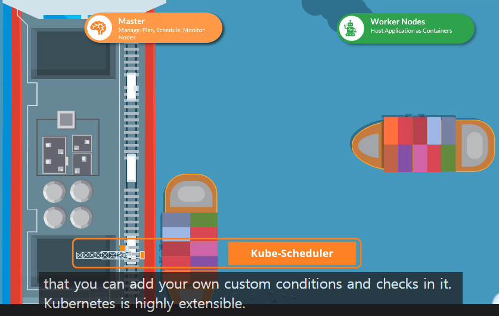

- Say you have a specific application that requires its components to be placed on Nodes after performing some additional checks. So you decide to have your own scheduling algorithm to place Pods on Nodes? So that you can add your own custom conditions and checks in it. Kubernetes is highly extensible. You can write your own Kubernetes Scheduler program, package it and deploy it as the default Scheduler or as an additional Scheduler in the Kuberenetes Cluster. 

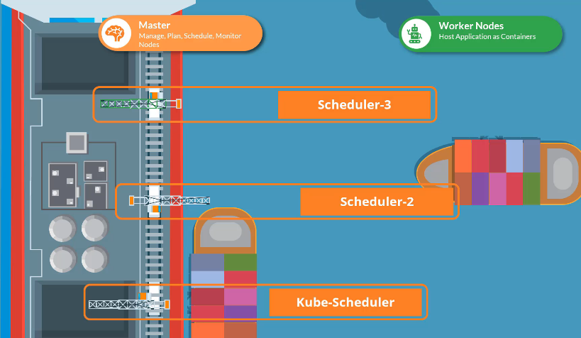

- That way all of the other applications can go through the default Scheduler, however, one specific application can use your custom Scheduler. Your Kubernetes Cluster can have multiple Schedulers at the same time.

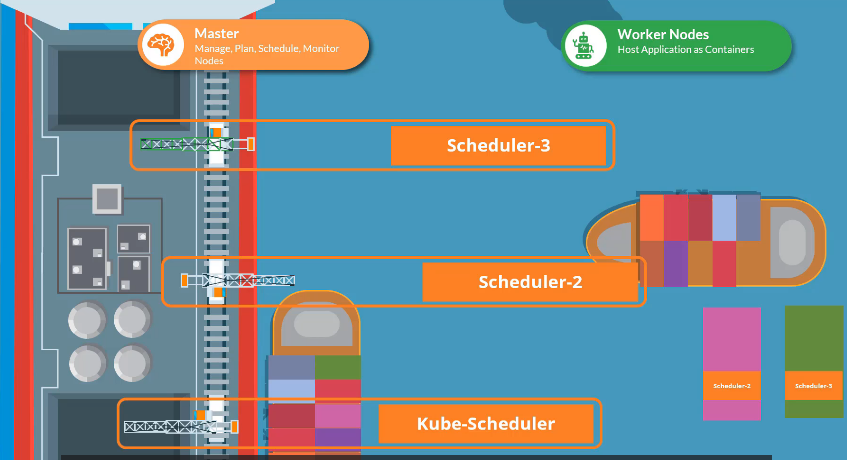

- When creating a Pod or a Deployment you can instruct Kubernetes to have the Pod scheduled by a specific Scheduler.

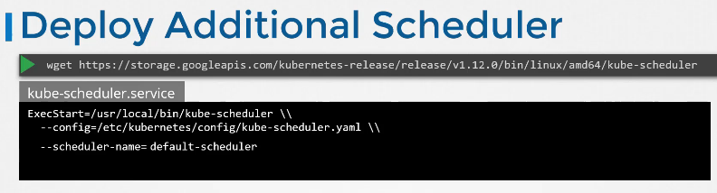

- Earlier we saw how to deploy the kube-scheduler. We download the kube-scheduler binary and run it as a service with a set of options. One of the option is Scheduler name. If not specified it assumes in name of default Scheduler.

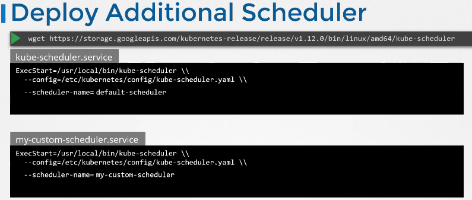

- This kube-scheduler is the default Scheduler. To deploy and additional Scheduler, you can use the same kube-scheduler binary or use one that you might have built for yourself, which makes more sense. In this case, we are going to use the same binary to deploy the additional Scheduler. This time, we set the Scheduler name to a custom name. This is important to differentiate the 2 Schedulers and this is the name that we will be specifying in the pod-definition file later on.
### 🔰 How it works with the kubeadm tool

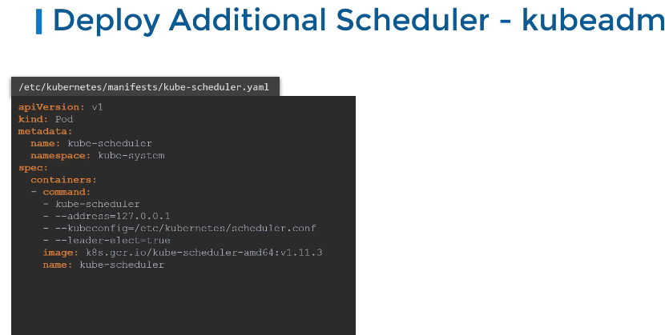

- The kubeadm deploys the Scheduler as a Pod. You can find the definition file it uses under the manifests folder. I have removed all the other details from the file so we can focus on the key parts. The command section has the command and associated options to start the Scheduler.

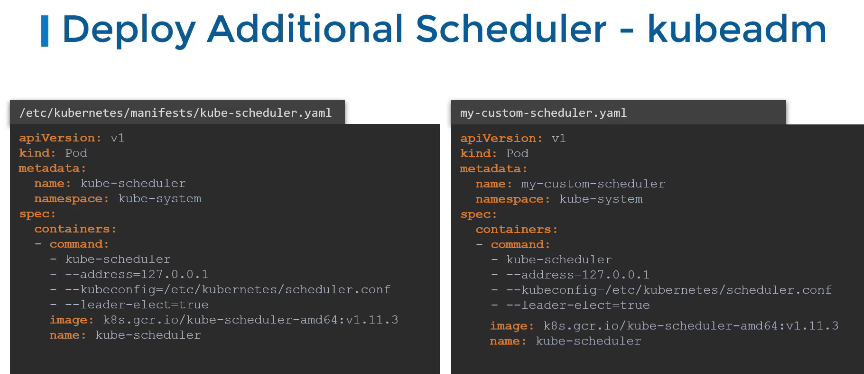

- We can create a custom Scheduler by making a copy of the same file, and by changing the name of the Scheduler.

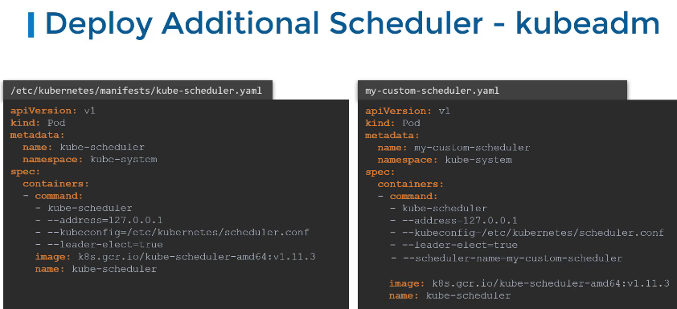

- We set the name of the Pod to ‘my-custom-scheduler’ and we add a new option to the Scheduler command to set a custom name for the Scheduler.
- Finally an important option to look here is the leader-elect option. The leader-elect option is used when you have multiple copies of the Scheduler running on different Master Nodes, in a high availability setup where you have multiple Master Nodes with the kube-scheduler process running on both of them. If multiple copies of the same Scheduler are running on different Nodes only one can be active at a time. That’s where the leader-elect option helps in choosing a leader who will lead scheduling activities. We will discuss more about HA setup in another section, but for now I wanted to point out that, to get multiple Schedulers working, you must either set the leader-elect option to false, in case where you don’t have multiple Masters. 

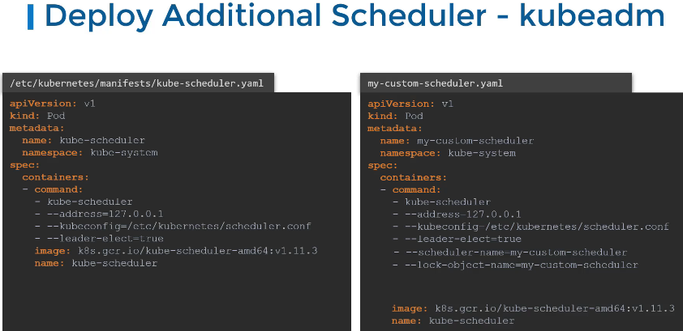

- In case you do have multiple Masters, you can pass in an additional parameter, to set a lock object name. This is to differentiate the new custom Scheduler from the default during the leader election process.

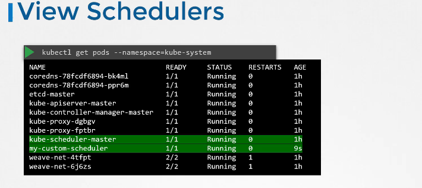

- Once done, create the Pod using the `kubectl create` command. Run the `get pods` command in the kube-system namespace and look for the new custom Scheduler. Make sure its in a running state.

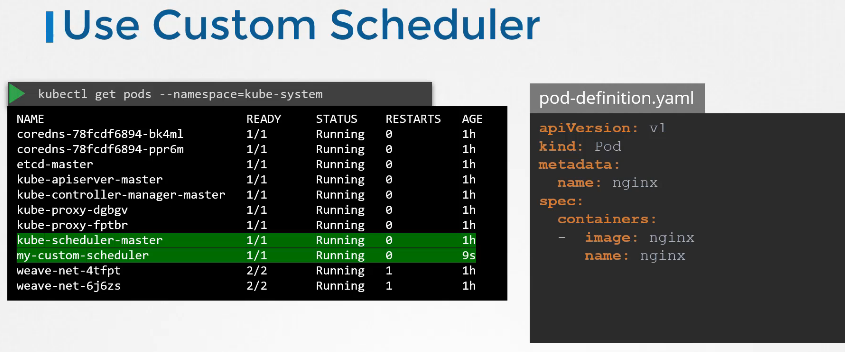

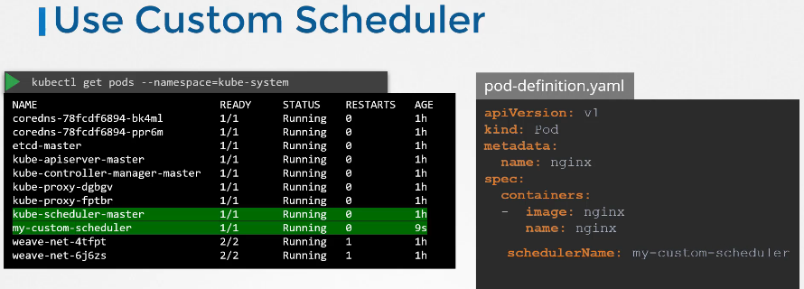

- The next step is to configure a new Pod or a Deployment to use the new Scheduler. In the Pod specification file, add a new field called Scheduler name and specify the name of the new Scheduler. This way when the Pod is created, the right Scheduler picks it up for Scheduling.

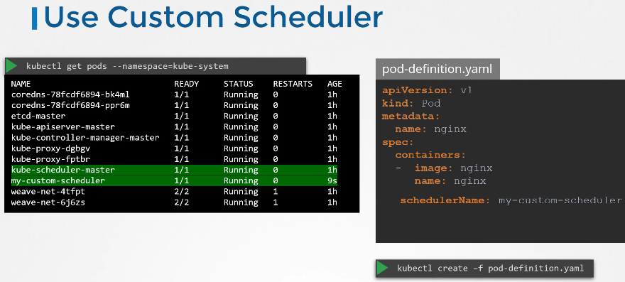

- Create the Pod using the `kubectl create` command. 

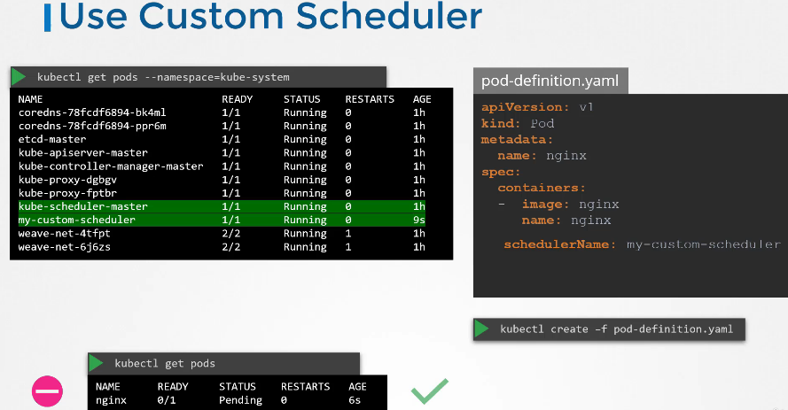

- If the Scheduler was not configured correctly, then the Pod will continue to remain in a pending state. 

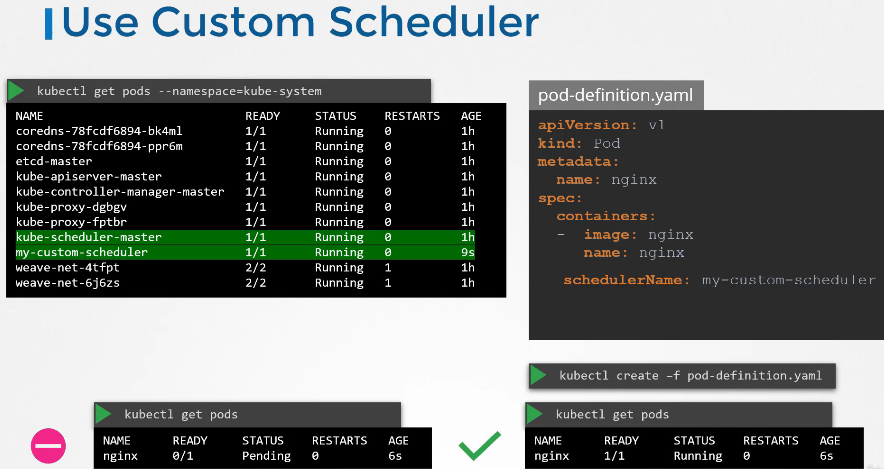

- If everything is good, then the  Pod will be in a Running state.
### 🔰 How to know which Scheduler picked it up?

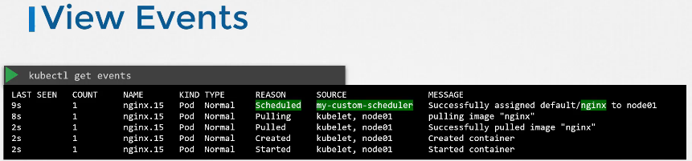

- View the events using the `kubectl get events` command. This lists all the events in the current namespace. Look for the scheduled events, as you can see the source of the event is the custom Scheduler we created. And the message says successfully assigned default/nginx image.

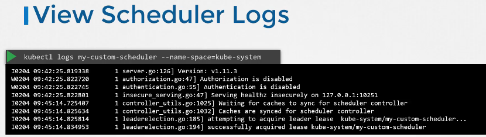

- To view the logs of the Scheduler, view the logs of the Pod using the `kubectl logs` command. Specify the name of the Scheduler and the correct namespace.
# 77. Practice Test - Multiple Schedulers
### Note: Solution to test in the following video
Practice Test: [https://uklabs.kodekloud.com/topic/practice-test-multiple-schedulers-2/](https://uklabs.kodekloud.com/topic/practice-test-multiple-schedulers-2/)
# 78. Solution - Practice Test - Multiple Schedulers:(Optional)
1. What is the name of the POD that deploys the default kubernetes scheduler in this environment? ⇒ **`kube-scheduler-controlplane`**
	```shell
	root@controlplane ~ ➜  kubectl get pods --namespace=kube-system
	NAME                                   READY   STATUS    RESTARTS   AGE
	coredns-64897985d-79bvl                1/1     Running   0          3m36s
	coredns-64897985d-v9dlp                1/1     Running   0          3m36s
	etcd-controlplane                      1/1     Running   0          3m47s
	kube-apiserver-controlplane            1/1     Running   0          3m47s
	kube-controller-manager-controlplane   1/1     Running   0          3m47s
	kube-flannel-ds-rqsft                  1/1     Running   0          3m36s
	kube-proxy-r8k2r                       1/1     Running   0          3m36s
	kube-scheduler-controlplane            1/1     Running   0          3m50s
	```

	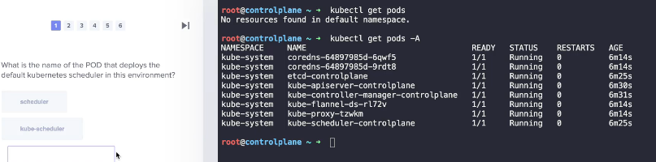

2. What is the image used to deploy the kubernetes scheduler? Inspect the kubernetes scheduler pod and identify the image. ⇒ **`k8s.gcr.io/kube-scheduler:v1.23.0`**
	```shell
	root@controlplane ~ ➜  kubectl describe pod kube-scheduler-controlplane --namespace=kube-system
	Name:                 kube-scheduler-controlplane
	Namespace:            kube-system
	Priority:             2000001000
	Priority Class Name:  system-node-critical
	Node:                 controlplane/10.17.41.9
	Start Time:           Thu, 25 Aug 2022 07:43:56 +0000
	Labels:               component=kube-scheduler
	                      tier=control-plane
	Annotations:          kubernetes.io/config.hash: 233effdc8fccb749f537f2acea5a7295
	                      kubernetes.io/config.mirror: 233effdc8fccb749f537f2acea5a7295
	                      kubernetes.io/config.seen: 2022-08-25T07:43:37.949541800Z
	                      kubernetes.io/config.source: file
	                      seccomp.security.alpha.kubernetes.io/pod: runtime/default
	Status:               Running
	IP:                   10.17.41.9
	IPs:
	  IP:           10.17.41.9
	Controlled By:  Node/controlplane
	Containers:
	  kube-scheduler:
	    Container ID:  docker://4594eb7d4d223c9657dc00dca2f5ebfdb2379e3bcea84898f9d2e87c3aec4a0b
	    Image:         k8s.gcr.io/kube-scheduler:v1.23.0
	    Image ID:      docker-pullable://k8s.gcr.io/kube-scheduler@sha256:af8166ce28baa7cb902a2c0d16da865d5d7c892fe1b41187fd4be78ec6291c23
	    Port:          <none>
	    Host Port:     <none>
	    Command:
	      kube-scheduler
	      --authentication-kubeconfig=/etc/kubernetes/scheduler.conf
	      --authorization-kubeconfig=/etc/kubernetes/scheduler.conf
	      --bind-address=127.0.0.1
	      --kubeconfig=/etc/kubernetes/scheduler.conf
	      --leader-elect=true
	    State:          Running
	      Started:      Thu, 25 Aug 2022 07:43:44 +0000
	    Ready:          True
	    Restart Count:  0
	    Requests:
	      cpu:        100m
	    Liveness:     http-get https://127.0.0.1:10259/healthz delay=10s timeout=15s period=10s #success=1 #failure=8
	    Startup:      http-get https://127.0.0.1:10259/healthz delay=10s timeout=15s period=10s #success=1 #failure=24
	    Environment:  <none>
	    Mounts:
	      /etc/kubernetes/scheduler.conf from kubeconfig (ro)
	Conditions:
	  Type              Status
	  Initialized       True 
	  Ready             True 
	  ContainersReady   True 
	  PodScheduled      True 
	Volumes:
	  kubeconfig:
	    Type:          HostPath (bare host directory volume)
	    Path:          /etc/kubernetes/scheduler.conf
	    HostPathType:  FileOrCreate
	QoS Class:         Burstable
	Node-Selectors:    <none>
	Tolerations:       :NoExecute op=Exists
	Events:            <none>
	```

3. We have already created the `ServiceAccount` and `ClusterRoleBinding` that our custom scheduler will make use of. Checkout the following Kubernetes objects:

	`ServiceAccount`: my-scheduler (kube-system namespace)

	`ClusterRoleBinding`: my-scheduler-as-kube-scheduler

	`ClusterRoleBinding`: my-scheduler-as-volume-scheduler

	Run the command: `kubectl get serviceaccount -n kube-system` & `kubectl get clusterrolebinding`

	**Note: -** Don't worry if you are not familiar with these resources. We will cover it later on.

	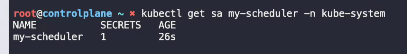

	```shell
	root@controlplane ~ ➜  kubectl get serviceaccount -n kube-system
	NAME                                 SECRETS   AGE
	attachdetach-controller              1         9m
	bootstrap-signer                     1         8m58s
	certificate-controller               1         9m1s
	clusterrole-aggregation-controller   1         9m1s
	coredns                              1         9m1s
	cronjob-controller                   1         8m58s
	daemon-set-controller                1         9m1s
	default                              1         8m47s
	deployment-controller                1         9m
	disruption-controller                1         8m59s
	endpoint-controller                  1         8m58s
	endpointslice-controller             1         9m1s
	endpointslicemirroring-controller    1         9m1s
	ephemeral-volume-controller          1         9m
	expand-controller                    1         8m59s
	flannel                              1         8m57s
	generic-garbage-collector            1         9m1s
	horizontal-pod-autoscaler            1         9m1s
	job-controller                       1         9m
	kube-proxy                           1         9m1s
	my-scheduler                         1         112s
	namespace-controller                 1         9m
	node-controller                      1         8m59s
	persistent-volume-binder             1         8m58s
	pod-garbage-collector                1         8m57s
	pv-protection-controller             1         9m
	pvc-protection-controller            1         9m1s
	replicaset-controller                1         8m57s
	replication-controller               1         8m59s
	resourcequota-controller             1         9m1s
	root-ca-cert-publisher               1         9m1s
	service-account-controller           1         8m58s
	service-controller                   1         8m59s
	statefulset-controller               1         8m58s
	token-cleaner                        1         8m59s
	ttl-after-finished-controller        1         9m1s
	ttl-controller                       1         9m1s

	root@controlplane ~ ➜  kubectl get clusterrolebinding
	NAME                                                   ROLE                                                                               AGE
	cluster-admin                                          ClusterRole/cluster-admin                                                          9m31s
	flannel                                                ClusterRole/flannel                                                                9m26s
	kubeadm:get-nodes                                      ClusterRole/kubeadm:get-nodes                                                      9m29s
	kubeadm:kubelet-bootstrap                              ClusterRole/system:node-bootstrapper                                               9m29s
	kubeadm:node-autoapprove-bootstrap                     ClusterRole/system:certificates.k8s.io:certificatesigningrequests:nodeclient       9m29s
	kubeadm:node-autoapprove-certificate-rotation          ClusterRole/system:certificates.k8s.io:certificatesigningrequests:selfnodeclient   9m29s
	kubeadm:node-proxier                                   ClusterRole/system:node-proxier                                                    9m29s
	my-scheduler-as-kube-scheduler                         ClusterRole/system:kube-scheduler                                                  2m20s
	my-scheduler-as-volume-scheduler                       ClusterRole/system:volume-scheduler                                                2m20s
	system:basic-user                                      ClusterRole/system:basic-user                                                      9m31s
	system:controller:attachdetach-controller              ClusterRole/system:controller:attachdetach-controller                              9m31s
	system:controller:certificate-controller               ClusterRole/system:controller:certificate-controller                               9m31s
	system:controller:clusterrole-aggregation-controller   ClusterRole/system:controller:clusterrole-aggregation-controller                   9m31s
	system:controller:cronjob-controller                   ClusterRole/system:controller:cronjob-controller                                   9m31s
	system:controller:daemon-set-controller                ClusterRole/system:controller:daemon-set-controller                                9m31s
	system:controller:deployment-controller                ClusterRole/system:controller:deployment-controller                                9m31s
	system:controller:disruption-controller                ClusterRole/system:controller:disruption-controller                                9m31s
	system:controller:endpoint-controller                  ClusterRole/system:controller:endpoint-controller                                  9m31s
	system:controller:endpointslice-controller             ClusterRole/system:controller:endpointslice-controller                             9m31s
	system:controller:endpointslicemirroring-controller    ClusterRole/system:controller:endpointslicemirroring-controller                    9m31s
	system:controller:ephemeral-volume-controller          ClusterRole/system:controller:ephemeral-volume-controller                          9m31s
	system:controller:expand-controller                    ClusterRole/system:controller:expand-controller                                    9m31s
	system:controller:generic-garbage-collector            ClusterRole/system:controller:generic-garbage-collector                            9m31s
	system:controller:horizontal-pod-autoscaler            ClusterRole/system:controller:horizontal-pod-autoscaler                            9m31s
	system:controller:job-controller                       ClusterRole/system:controller:job-controller                                       9m31s
	system:controller:namespace-controller                 ClusterRole/system:controller:namespace-controller                                 9m31s
	system:controller:node-controller                      ClusterRole/system:controller:node-controller                                      9m31s
	system:controller:persistent-volume-binder             ClusterRole/system:controller:persistent-volume-binder                             9m31s
	system:controller:pod-garbage-collector                ClusterRole/system:controller:pod-garbage-collector                                9m31s
	system:controller:pv-protection-controller             ClusterRole/system:controller:pv-protection-controller                             9m31s
	system:controller:pvc-protection-controller            ClusterRole/system:controller:pvc-protection-controller                            9m31s
	system:controller:replicaset-controller                ClusterRole/system:controller:replicaset-controller                                9m31s
	system:controller:replication-controller               ClusterRole/system:controller:replication-controller                               9m31s
	system:controller:resourcequota-controller             ClusterRole/system:controller:resourcequota-controller                             9m31s
	system:controller:root-ca-cert-publisher               ClusterRole/system:controller:root-ca-cert-publisher                               9m31s
	system:controller:route-controller                     ClusterRole/system:controller:route-controller                                     9m31s
	system:controller:service-account-controller           ClusterRole/system:controller:service-account-controller                           9m31s
	system:controller:service-controller                   ClusterRole/system:controller:service-controller                                   9m31s
	system:controller:statefulset-controller               ClusterRole/system:controller:statefulset-controller                               9m31s
	system:controller:ttl-after-finished-controller        ClusterRole/system:controller:ttl-after-finished-controller                        9m31s
	system:controller:ttl-controller                       ClusterRole/system:controller:ttl-controller                                       9m31s
	system:coredns                                         ClusterRole/system:coredns                                                         9m29s
	system:discovery                                       ClusterRole/system:discovery                                                       9m31s
	system:kube-controller-manager                         ClusterRole/system:kube-controller-manager                                         9m31s
	system:kube-dns                                        ClusterRole/system:kube-dns                                                        9m31s
	system:kube-scheduler                                  ClusterRole/system:kube-scheduler                                                  9m31s
	system:monitoring                                      ClusterRole/system:monitoring                                                      9m31s
	system:node                                            ClusterRole/system:node                                                            9m31s
	system:node-proxier                                    ClusterRole/system:node-proxier                                                    9m31s
	system:public-info-viewer                              ClusterRole/system:public-info-viewer                                              9m31s
	system:service-account-issuer-discovery                ClusterRole/system:service-account-issuer-discovery                                9m31s
	system:volume-scheduler                                ClusterRole/system:volume-scheduler                                                9m31s
	```

4. Let's create a configmap that the new scheduler will employ using the concept of `ConfigMap as a volume`. Create a configmap with name `my-scheduler-config` using the content of file `/root/my-scheduler-config.yaml`.
	```shell
	root@controlplane ~ ➜  kubectl create -n kube-system configmap my-scheduler-config --from-file=/root/my-scheduler-config.yaml
	configmap/my-scheduler-config created
	```

	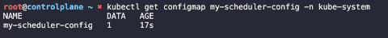

5. Deploy an additional scheduler to the cluster following the given specification. Use the manifest file provided at `/root/my-scheduler.yaml`. Use the same image as used by the default kubernetes scheduler.
	- Name: my-scheduler
	- Status: Running
	- Correct image used?
	```shell
	root@controlplane ~ ➜  cd /root

	root@controlplane ~ ➜  ls
	my-scheduler-config.yaml  my-scheduler.yaml  nginx-pod.yaml

	root@controlplane ~ ✖ cat my-scheduler.yaml
	apiVersion: v1
	kind: Pod
	metadata:
	  labels:
	    run: my-scheduler
	  name: my-scheduler
	  namespace: kube-system
	spec:
	  serviceAccountName: my-scheduler
	  containers:
	  - command:
	    - /usr/local/bin/kube-scheduler
	    - --config=/etc/kubernetes/my-scheduler/my-scheduler-config.yaml
	    image: k8s.gcr.io/kube-scheduler:v1.23.0 # changed
	    livenessProbe:
	      httpGet:
	        path: /healthz
	        port: 10259
	        scheme: HTTPS
	      initialDelaySeconds: 15
	    name: kube-second-scheduler
	    readinessProbe:
	      httpGet:
	        path: /healthz
	        port: 10259
	        scheme: HTTPS
	    resources:
	      requests:
	        cpu: '0.1'
	    securityContext:
	      privileged: false
	    volumeMounts:
	      - name: config-volume
	        mountPath: /etc/kubernetes/my-scheduler
	  hostNetwork: false
	  hostPID: false
	  volumes:
	    - name: config-volume
	      configMap:
	        name: my-scheduler-config

	root@controlplane ~ ➜  kubectl create -f my-scheduler.yaml
	pod/my-scheduler created
	```

	```shell
	root@controlplane ~ ➜  kubectl get pods --all-namespaces
	NAMESPACE     NAME                                   READY   STATUS    RESTARTS   AGE
	kube-system   coredns-64897985d-79bvl                1/1     Running   0          21m
	kube-system   coredns-64897985d-v9dlp                1/1     Running   0          21m
	kube-system   etcd-controlplane                      1/1     Running   0          21m
	kube-system   kube-apiserver-controlplane            1/1     Running   0          21m
	kube-system   kube-controller-manager-controlplane   1/1     Running   0          21m
	kube-system   kube-flannel-ds-rqsft                  1/1     Running   0          21m
	kube-system   kube-proxy-r8k2r                       1/1     Running   0          21m
	kube-system   kube-scheduler-controlplane            1/1     Running   0          21m
	kube-system   my-scheduler                           1/1     Running   0          14s
	```

6. A POD definition file is given. Use it to create a POD with the new custom scheduler. File is located at `/root/nginx-pod.yaml`.
	- Uses custom scheduler
	- Status: Running
	```shell
	root@controlplane ~ ➜  ls
	'~'                         my-scheduler.yaml
	 my-scheduler-config.yaml   nginx-pod.yaml

	root@controlplane ~ ➜  cat nginx-pod.yaml 
	apiVersion: v1 
	kind: Pod 
	metadata:
	  name: nginx 
	spec:
	  containers:
	  - image: nginx
	    name: nginx

	root@controlplane ~ ➜  vim nginx-pod.yaml 

	root@controlplane ~ ➜  cat nginx-pod.yaml 
	apiVersion: v1 
	kind: Pod 
	metadata:
	  name: nginx 
	spec: 
	  schedulerName: my-scheduler
	  containers:
	  - image: nginx
	    name: nginx

	root@controlplane ~ ➜  kubectl create -f nginx-pod.yaml 
	pod/nginx created
	```
# 79. Configuring Kubernetes Scheduler

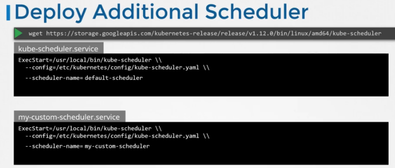

- In this lecture we discuss about configuring Kubernetes Scheduler. Throughout this section, we have seen different ways of configuring the Scheduler. We saw how to setup Scheduler manually and how kubeadm tool does it.

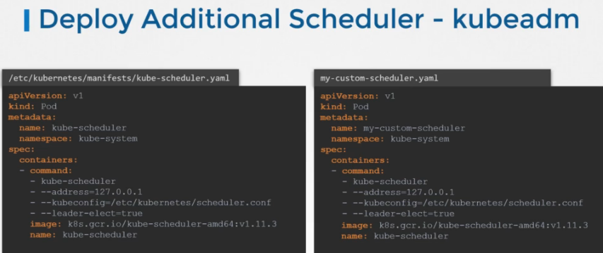

- We saw how to create additional Schedulers and have Pods pick the new Scheduler. We also looked at some of the options such as these Scheduler name and Pod name used while configuring the Scheduler. 
- That’s all there is about configuring Schedulers in a Kubernetes Cluster under the scope of this course and the exam. 
# 80. Connect with me!

> 💡 **Reference**
>
> [https://github.com/kubernetes/community/blob/master/contributors/devel/sig-scheduling/scheduling_code_hierarchy_overview.md](https://github.com/kubernetes/community/blob/master/contributors/devel/sig-scheduling/scheduling_code_hierarchy_overview.md)
>
> [https://kubernetes.io/blog/2017/03/advanced-scheduling-in-kubernetes/](https://kubernetes.io/blog/2017/03/advanced-scheduling-in-kubernetes/)
>
> [https://jvns.ca/blog/2017/07/27/how-does-the-kubernetes-scheduler-work/](https://jvns.ca/blog/2017/07/27/how-does-the-kubernetes-scheduler-work/)
>
> [https://stackoverflow.com/questions/28857993/how-does-kubernetes-scheduler-work](https://stackoverflow.com/questions/28857993/how-does-kubernetes-scheduler-work)

- If you are interested checkout the links and some of the interesting blog posts about advanced scheduling Kubernetes.
