<table_of_contents color="gray"/>
# 117. Cluster Maintenance - Section Introduction
- We discuss about Cluster maintenance related topics. We start by looking at operating system upgrades, we see the implications of losing a Node from the Cluster where we take a Node out of the Cluster on purpose like for applying patches or upgrades on the OS itself.
- We then look at the Cluster upgrade process. But before we do that, we need to know a little bit about Kubernetes releases and versions. And the best practices around upgrading, when to upgrade, what version to upgrade to etc.
- Once you learn the upgrade procedure, you are asked to upgrade a Cluster by yourself. You will perform an end to an upgrade of a Cluster yourself with live applications running on them.
- And finally, we look at some of the backup and restore methodologies. You will practice a disaster scenario where you take a backup of the Kubernetes Cluster, then go through a simulated disaster and then you’re asked to recover from that disaster and bring the Cluster back to the previous state.
# 118. Download Presentation Deck
Please note that some slides are animated so content may not have exported correctly. Kindly use the slides as a reference for commands.
이 강의 자료
<file src=""></file>
# 119. OS Upgrades
- We will discuss about scenarios where you might have to take down Node as part of your Cluster say for maintenance purposes like upgrading a base software or applying patches like security patches, etc, on your Cluster. 
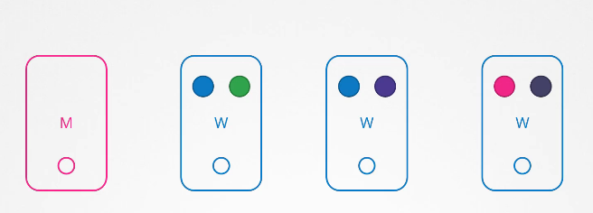
- In this lecture , we will see the options available to handle such cases. So you have a Cluster with a few Nodes and Pods serving Applications.
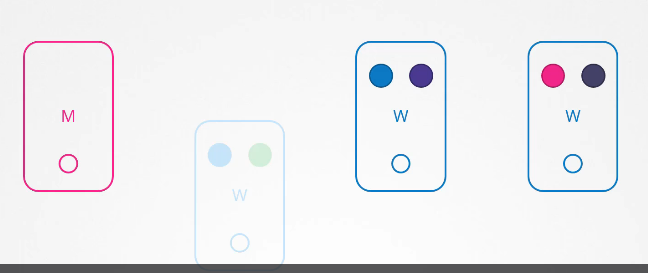
- What happens when one of these Nodes go down? Of course the Pod on them are not accessible. Now depending upon how you deployed those Pods your users may be impacted. For example, since you have multiple Replicas of the Blue Pod, the users accessing the Blue Application are not impacted. As they are being served through the other Blue Pod that’s on line. However users accessing the Green Pod, are impacted as that was the only Pod running the Green Application.
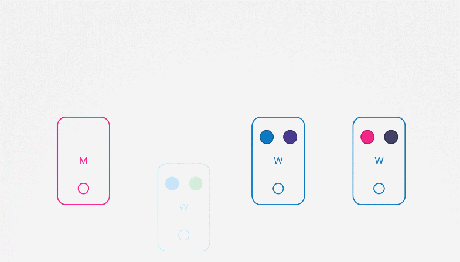
- Now, what does Kubernetes do in this case? If the Node came back online immediately, then the `kubelet` process starts and the Pods come back online.
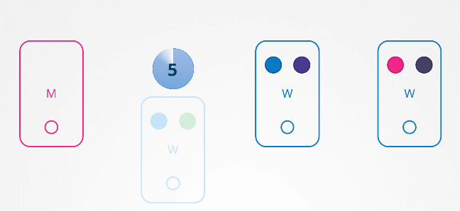
- However, If the Node was down for more than 5 minutes, then the Pods are terminated from that Node. Well, Kubernetes considers them as dead.
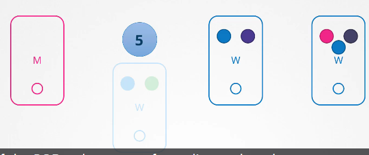
- If the Pods where part of a ReplicaSet then they are recreated on other Nodes.
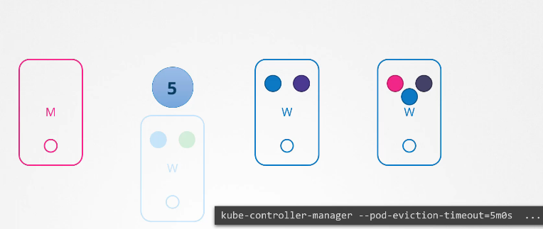
- The time it waits for a Pod to come back online is known as the Pod eviction timeout and is set on the Controller Manager with a default value of 5 minutes. So whenever a Node goes offline, the Master Node waits for up to 5 minutes before considering the Node dead.
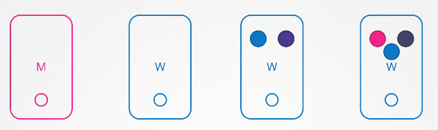
- When the Node comes back on line after the Pod eviction timeout, it comes up blank without any Pods scheduled on it. Since the Blue Pod was part of a ReplicaSet, it had a new Pod created on another Node. However since the Green Pod was not part of the ReplicaSet it’s just gone.
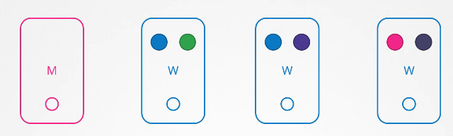
- Thus, If you have maintenance tasks to be performed on a Node, If you know that the workloads running on the Node have other Replicas and if it’s okay that they go down for a short period of time. And If you’re sure the Node will come back on line within 5 minutes you can make a quick upgrade and reboot. However, you do not for sure know if a Node is going to be back on line in five minutes. Well, you cannot for sure say it is going to be back at all. So there is a safer way to do it.
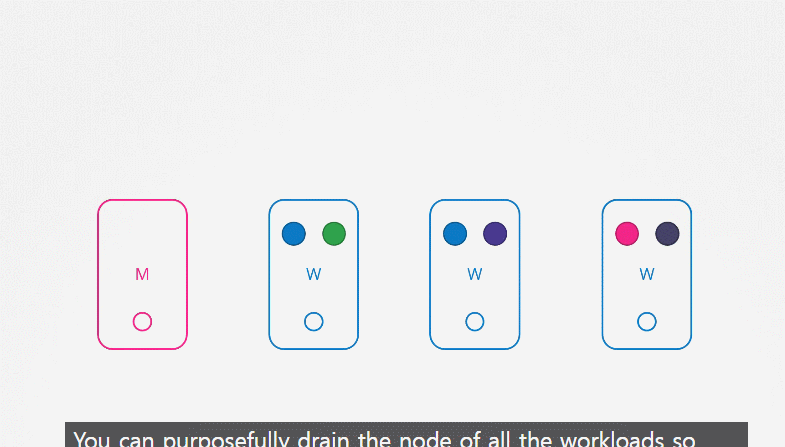
- you can purposefully drain the Node of all the workloads, so that the workloads are moved to other Nodes in the Cluster. Technically, they are not moved. When you drain the Node the Pods are gracefully terminated from the Node that they’re on and recreated on another.
- The Node is also cordoned or marked as unschedulable. Meaning no Pods can be scheduled on this Node until you specifically remove the restriction.
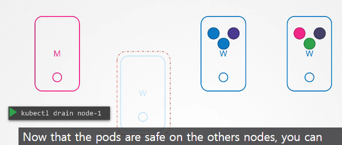
- Now that the Pods are safe on the others Nodes, you can reboot the first Node. 
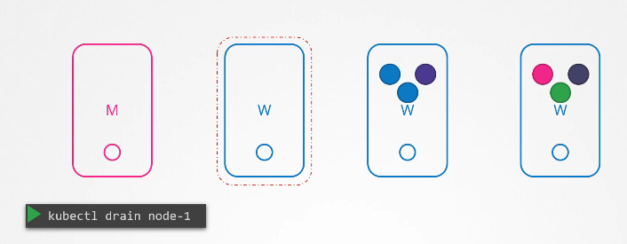
- When it comes back online , it is still unschedulable.
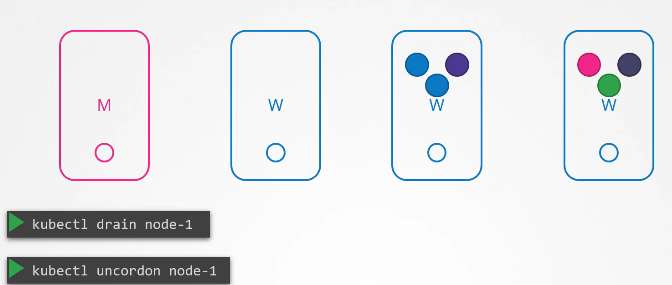
- You then need to uncordon it, so that Pods can be scheduled on it again. Remember, the Pods that were moved to the other Nodes, don’t automatically fall back. If any of those Pods where deleted or if new Pods were created in the Cluster, then they would be created on this Node.
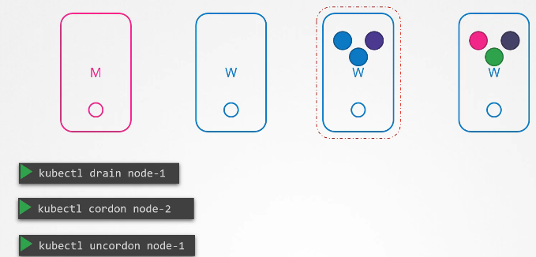
- Apart from drain and uncordon, there is also another command called cordon. Cordon simply marks a Node unschedulable. Unlike drain, it does not terminate or move the Pods on an existing Node. It simply makes sure that new Pods are not scheduled on that Node.
# 120. Practice Test - OS Upgrades
Practice Test: [https://uklabs.kodekloud.com/topic/practice-test-os-upgrades-2/](https://uklabs.kodekloud.com/topic/practice-test-os-upgrades-2/)
# 121. Solution - OS Upgrades (optional)
1. Let us explore the environment first. How many nodes do you see in the cluster? Including the controlplane and worker nodes. ⇒ **`2`**
	```javascript
root@controlplane ~ ➜  kubectl get nodes
NAME           STATUS   ROLES                  AGE     VERSION
controlplane   Ready    control-plane,master   4m3s    v1.23.0
node01         Ready    <none>                 3m14s   v1.23.0
	```
2. How many applications do you see hosted on the cluster? Check the number of deployments. ⇒ **`1`**
	```javascript
root@controlplane ~ ➜  kubectl get deploy
NAME   READY   UP-TO-DATE   AVAILABLE   AGE
blue   3/3     3            3           30s
	```
3. Which nodes are the applications hosted on? ⇒ **`controlplane,node01`**
	```javascript
root@controlplane ~ ➜  kubectl get pods -o wide
NAME                    READY   STATUS    RESTARTS   AGE   IP           NODE           NOMINATED NODE   READINESS GATES
blue-5d49cb47f4-2cwm6   1/1     Running   0          93s   10.244.0.4   controlplane   <none>           <none>
blue-5d49cb47f4-9vqt9   1/1     Running   0          93s   10.244.1.3   node01         <none>           <none>
blue-5d49cb47f4-hh44z   1/1     Running   0          93s   10.244.1.2   node01         <none>           <none>
	```
4. We need to take `node01` out for maintenance. Empty the node of all applications and mark it unschedulable.
	- Node node01 Unschedulable
	- Pods evicted from node01
	```javascript
root@controlplane ~ ➜  kubectl drain node01 --ignore-daemonsets
node/node01 cordoned
WARNING: ignoring DaemonSet-managed Pods: kube-system/kube-flannel-ds-wxtzj, kube-system/kube-proxy-jbxhh
evicting pod default/blue-5d49cb47f4-hh44z
evicting pod default/blue-5d49cb47f4-9vqt9
pod/blue-5d49cb47f4-9vqt9 evicted
pod/blue-5d49cb47f4-hh44z evicted
node/node01 drained
	```
5. What nodes are the apps on now? ⇒ **`controlplane`**
	```javascript
root@controlplane ~ ➜  kubectl get nodes
NAME           STATUS                     ROLES                  AGE     VERSION
controlplane   Ready                      control-plane,master   6m53s   v1.23.0
node01         Ready,SchedulingDisabled   <none>                 6m4s    v1.23.0
	```
6. The maintenance tasks have been completed. Configure the node `node01` to be schedulable again.
	- Node01 is Schedulable
	```javascript
root@controlplane ~ ➜  kubectl uncordon node01
node/node01 uncordoned
	```
7. How many pods are scheduled on `node01` now? ⇒ **`0`**
	```javascript
root@controlplane ~ ➜  kubectl get pods -o wide
NAME                    READY   STATUS    RESTARTS   AGE     IP           NODE           NOMINATED NODE   READINESS GATES
blue-5d49cb47f4-2cwm6   1/1     Running   0          4m29s   10.244.0.4   controlplane   <none>           <none>
blue-5d49cb47f4-4785s   1/1     Running   0          2m10s   10.244.0.6   controlplane   <none>           <none>
blue-5d49cb47f4-dxsms   1/1     Running   0          2m10s   10.244.0.5   controlplane   <none>           <none>
	```
8. Why are there no pods on `node01`? ⇒ **`Only when new pods are created they will be scheduled`**
9. Why are the pods placed on the `controlplane` node? Check the controlplane node details. ⇒ **`controlplane node does not have any taints`**
	```javascript
root@controlplane ~ ➜  kubectl describe node controlplane | grep -i  taint
Taints:             <none>

root@controlplane ~ ➜  kubectl describe node controlplane 
Name:               controlplane
Roles:              control-plane,master
Labels:             beta.kubernetes.io/arch=amd64
                    beta.kubernetes.io/os=linux
                    kubernetes.io/arch=amd64
                    kubernetes.io/hostname=controlplane
                    kubernetes.io/os=linux
                    node-role.kubernetes.io/control-plane=
                    node-role.kubernetes.io/master=
                    node.kubernetes.io/exclude-from-external-load-balancers=
Annotations:        flannel.alpha.coreos.com/backend-data: {"VNI":1,"VtepMAC":"da:94:9a:f1:b0:3d"}
                    flannel.alpha.coreos.com/backend-type: vxlan
                    flannel.alpha.coreos.com/kube-subnet-manager: true
                    flannel.alpha.coreos.com/public-ip: 10.18.5.12
                    kubeadm.alpha.kubernetes.io/cri-socket: /var/run/dockershim.sock
                    node.alpha.kubernetes.io/ttl: 0
                    volumes.kubernetes.io/controller-managed-attach-detach: true
CreationTimestamp:  Fri, 02 Sep 2022 08:20:02 +0000
Taints:             <none>
Unschedulable:      false
Lease:
  HolderIdentity:  controlplane
  AcquireTime:     <unset>
  RenewTime:       Fri, 02 Sep 2022 08:29:51 +0000
Conditions:
  Type                 Status  LastHeartbeatTime                 LastTransitionTime                Reason                       Message
  ----                 ------  -----------------                 ------------------                ------                       -------
  NetworkUnavailable   False   Fri, 02 Sep 2022 08:20:32 +0000   Fri, 02 Sep 2022 08:20:32 +0000   FlannelIsUp                  Flannel is running on this node
  MemoryPressure       False   Fri, 02 Sep 2022 08:25:50 +0000   Fri, 02 Sep 2022 08:19:53 +0000   KubeletHasSufficientMemory   kubelet has sufficient memory available
  DiskPressure         False   Fri, 02 Sep 2022 08:25:50 +0000   Fri, 02 Sep 2022 08:19:53 +0000   KubeletHasNoDiskPressure     kubelet has no disk pressure
  PIDPressure          False   Fri, 02 Sep 2022 08:25:50 +0000   Fri, 02 Sep 2022 08:19:53 +0000   KubeletHasSufficientPID      kubelet has sufficient PID available
  Ready                True    Fri, 02 Sep 2022 08:25:50 +0000   Fri, 02 Sep 2022 08:20:43 +0000   KubeletReady                 kubelet is posting ready status
Addresses:
  InternalIP:  10.18.5.12
  Hostname:    controlplane
Capacity:
  cpu:                36
  ephemeral-storage:  507930276Ki
  hugepages-1Gi:      0
  hugepages-2Mi:      0
  memory:             214587040Ki
  pods:               110
Allocatable:
  cpu:                36
  ephemeral-storage:  468108541587
  hugepages-1Gi:      0
  hugepages-2Mi:      0
  memory:             214484640Ki
  pods:               110
System Info:
  Machine ID:                 bf21b07b53f348ffbd3005be1a2ba679
  System UUID:                95d2b632-11ae-1d9d-f722-8ad7fbc406bb
  Boot ID:                    5a4906fc-9681-4620-9c5b-d8ccf97f40d3
  Kernel Version:             5.4.0-1086-gcp
  OS Image:                   Ubuntu 18.04.6 LTS
  Operating System:           linux
  Architecture:               amd64
  Container Runtime Version:  docker://19.3.0
  Kubelet Version:            v1.23.0
  Kube-Proxy Version:         v1.23.0
PodCIDR:                      10.244.0.0/24
PodCIDRs:                     10.244.0.0/24
Non-terminated Pods:          (11 in total)
  Namespace                   Name                                    CPU Requests  CPU Limits  Memory Requests  Memory Limits  Age
  ---------                   ----                                    ------------  ----------  ---------------  -------------  ---
  default                     blue-5d49cb47f4-2cwm6                   0 (0%)        0 (0%)      0 (0%)           0 (0%)         5m46s
  default                     blue-5d49cb47f4-4785s                   0 (0%)        0 (0%)      0 (0%)           0 (0%)         3m27s
  default                     blue-5d49cb47f4-dxsms                   0 (0%)        0 (0%)      0 (0%)           0 (0%)         3m27s
  kube-system                 coredns-64897985d-g99s4                 100m (0%)     0 (0%)      70Mi (0%)        170Mi (0%)     9m34s
  kube-system                 coredns-64897985d-kg5ts                 100m (0%)     0 (0%)      70Mi (0%)        170Mi (0%)     9m34s
  kube-system                 etcd-controlplane                       100m (0%)     0 (0%)      100Mi (0%)       0 (0%)         9m54s
  kube-system                 kube-apiserver-controlplane             250m (0%)     0 (0%)      0 (0%)           0 (0%)         9m44s
  kube-system                 kube-controller-manager-controlplane    200m (0%)     0 (0%)      0 (0%)           0 (0%)         9m54s
  kube-system                 kube-flannel-ds-wjdgj                   100m (0%)     100m (0%)   50Mi (0%)        300Mi (0%)     9m32s
  kube-system                 kube-proxy-vzft4                        0 (0%)        0 (0%)      0 (0%)           0 (0%)         9m34s
  kube-system                 kube-scheduler-controlplane             100m (0%)     0 (0%)      0 (0%)           0 (0%)         9m44s
Allocated resources:
  (Total limits may be over 100 percent, i.e., overcommitted.)
  Resource           Requests    Limits
  --------           --------    ------
  cpu                950m (2%)   100m (0%)
  memory             290Mi (0%)  640Mi (0%)
  ephemeral-storage  0 (0%)      0 (0%)
  hugepages-1Gi      0 (0%)      0 (0%)
  hugepages-2Mi      0 (0%)      0 (0%)
Events:
  Type    Reason                   Age                From        Message
  ----    ------                   ----               ----        -------
  Normal  Starting                 9m30s              kube-proxy  
  Normal  NodeHasSufficientMemory  10m (x7 over 10m)  kubelet     Node controlplane status is now: NodeHasSufficientMemory
  Normal  NodeHasNoDiskPressure    10m (x7 over 10m)  kubelet     Node controlplane status is now: NodeHasNoDiskPressure
  Normal  NodeHasSufficientPID     10m (x7 over 10m)  kubelet     Node controlplane status is now: NodeHasSufficientPID
  Normal  Starting                 9m46s              kubelet     Starting kubelet.
  Normal  NodeHasSufficientMemory  9m46s              kubelet     Node controlplane status is now: NodeHasSufficientMemory
  Normal  NodeHasNoDiskPressure    9m46s              kubelet     Node controlplane status is now: NodeHasNoDiskPressure
  Normal  NodeHasSufficientPID     9m46s              kubelet     Node controlplane status is now: NodeHasSufficientPID
  Normal  NodeAllocatableEnforced  9m45s              kubelet     Updated Node Allocatable limit across pods
  Normal  NodeReady                9m14s              kubelet     Node controlplane status is now: NodeReady
	```
10. Time travelling to the next maintenance window…
11. We need to carry out a maintenance activity on `node01` again. Try draining the node again using the same command as before: `kubectl drain node01 --ignore-daemonsets`. Did that work? ⇒ **`NO`**
12. Why did the drain command fail on `node01`? It worked the first time! ⇒ **`there is a pod in node01 which is not part of a replicaset`**
	```javascript
root@controlplane ~ ✖ kubectl get pods -o wide
NAME                    READY   STATUS    RESTARTS   AGE     IP           NODE           NOMINATED NODE   READINESS GATES
blue-5d49cb47f4-2cwm6   1/1     Running   0          8m3s    10.244.0.4   controlplane   <none>           <none>
blue-5d49cb47f4-4785s   1/1     Running   0          5m44s   10.244.0.6   controlplane   <none>           <none>
blue-5d49cb47f4-dxsms   1/1     Running   0          5m44s   10.244.0.5   controlplane   <none>           <none>
hr-app                  1/1     Running   0          71s     10.244.1.4   node01         <none>           <none>
	```
13. What is the name of the POD hosted on `node01` that is not part of a replicaset? ⇒ **`hr-app`**
	```javascript
root@controlplane ~ ➜  kubectl get pods -o wide
NAME                    READY   STATUS    RESTARTS   AGE     IP           NODE           NOMINATED NODE   READINESS GATES
blue-5d49cb47f4-2cwm6   1/1     Running   0          8m40s   10.244.0.4   controlplane   <none>           <none>
blue-5d49cb47f4-4785s   1/1     Running   0          6m21s   10.244.0.6   controlplane   <none>           <none>
blue-5d49cb47f4-dxsms   1/1     Running   0          6m21s   10.244.0.5   controlplane   <none>           <none>
hr-app                  1/1     Running   0          108s    10.244.1.4   node01         <none>           <none>
	```
14. What would happen to `hr-app` if `node01` is drained forcefully? Try it and see for yourself. ⇒ **`hr-app will be lost forever`**
15. Oops! We did not want to do that! `hr-app` is a critical application that should not be destroyed. We have now reverted back to the previous state and re-deployed `hr-app` as a deployment.
16. `hr-app` is a critical app and we do not want it to be removed and we do not want to schedule any more pods on `node01`. Mark `node01` as `unschedulable` so that no new pods are scheduled on this node. Make sure that `hr-app` is not affected.
	- Node01 Unschedulable
	- hr-app still running on node01?
	```javascript
root@controlplane ~ ➜  kubectl cordon node01
node/node01 cordoned
	```
# 122. Kubernetes Software Versions
- We will discuss about the various Kubernetes releases an versions.
- What do we know about API versions in Kubernetes so far? We know that when we install a Kubernetes Cluster, we install a specific version of Kubernetes.
- We can see that when we run the `kubectl get nodes` command. In this case its v1.11.3.
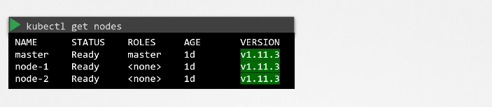
- In this lecture, we will see how Kubernetes project manages software releases.
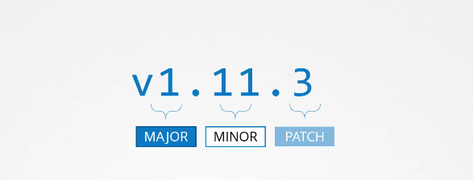
- Let’s take a closer look at that version number. The Kubernetes release versions consists of 3 parts. The first is the major version, followed by the minor version and then the patch version. 
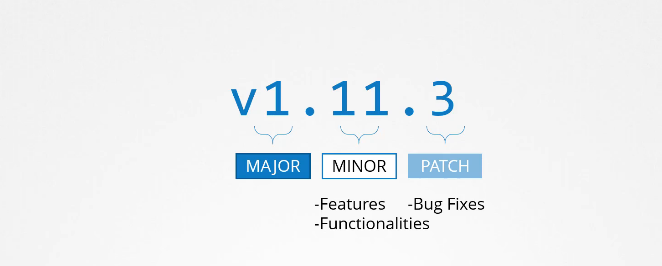
- One minor versions are released every few month with new features and functionalities, patches are released more often with critical bug fixes. 
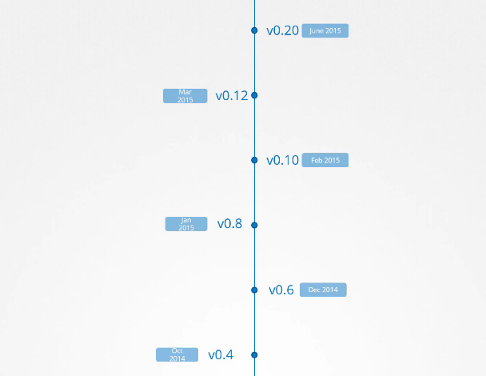
- Just like many other popular applications out there, Kubernetes follows a standard software release versioning procedure. Every few month It comes out with new features and functionalities through a minor release.
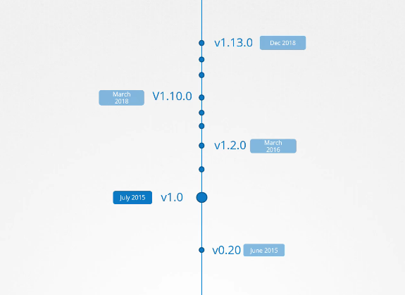
- The first major version 1.0 was released in July of 2015. As of this recording the latest stable version is 1.13.0. Whatever we have seen here are stable releases of Kubernetes.
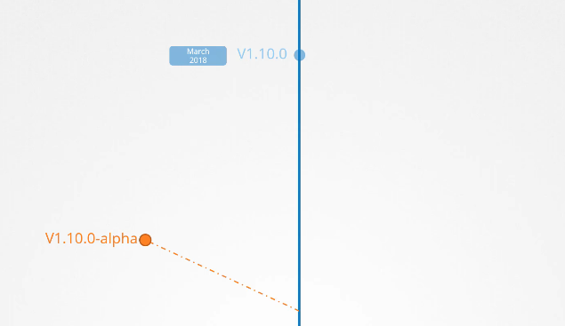
- Apart from this you will also see alpha and beta releases. All the bug fixes and improvements first go into an alpha release tagged alpha, in this release, the features are disabled by default and maybe buggy.
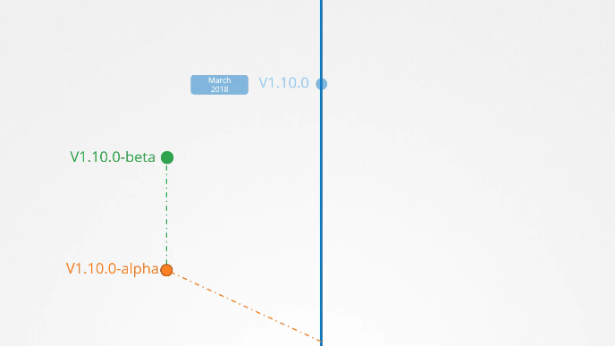
- Then from there they make their way to beta release, where the code is well tested, the new features are enabled by default.
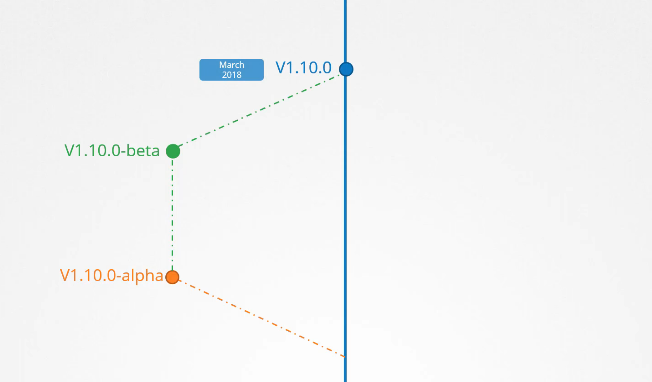
- And finally they make their way to the main stable release.
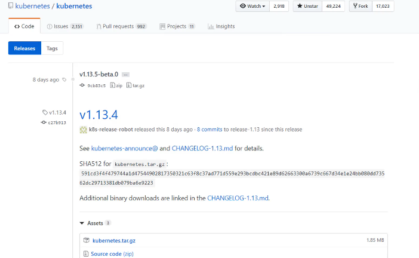
- You can find all the releases in the releases page of the Kubernetes Github repository. Download the Kubernetes.tar.gz file and extract it to find executables for all the Kubernetes components.
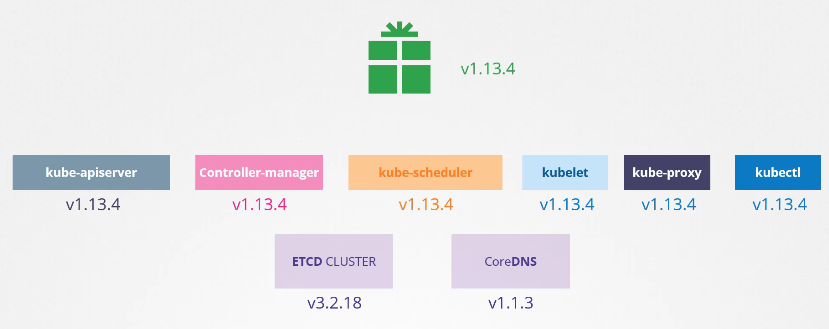
- The downloaded package when extracted has all the control plane components in it. All of them of the same version. Remember, that there are other components within the control plane that do not have the same version numbers.
- The ETCD Cluster and CoreDNS Servers have their own versions as they are separate projects. The release notes of each release provides information about the supported versions of externally dependent applications like ETCD and CoreDNS etc.
# 123. References
[https://kubernetes.io/docs/concepts/overview/kubernetes-api/](https://kubernetes.io/docs/concepts/overview/kubernetes-api/)
Here is a link to kubernetes documentation if you want to learn more about this topic (You don't need it for the exam though):
[https://github.com/kubernetes/community/blob/master/contributors/devel/sig-architecture/api-conventions.md](https://github.com/kubernetes/community/blob/master/contributors/devel/sig-architecture/api-conventions.md)
[https://github.com/kubernetes/community/blob/master/contributors/devel/sig-architecture/api_changes.md](https://github.com/kubernetes/community/blob/master/contributors/devel/sig-architecture/api_changes.md)
# 124. Cluster Upgrade Process
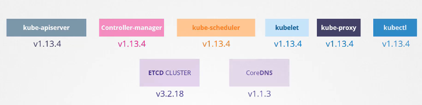
- In this lecture we discuss about Cluster Upgrade process in Kubernetes. In the previous lecture, we saw how Kubernetes manages its software releases and how different components have their versions. 
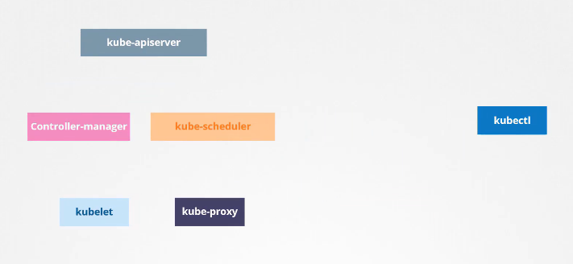
- We will keep dependency on external component like ETCD and CoreDNS aside for now, and focus on the core control plane components. Is t mandatory for all of these to have the same version? ⇒ No. The components can be at different release versions since the Kube API Server is the primary component in the control plane and that is the component that all other components talk to. None of the other components should ever be at a version higher than the Kube API Server. 
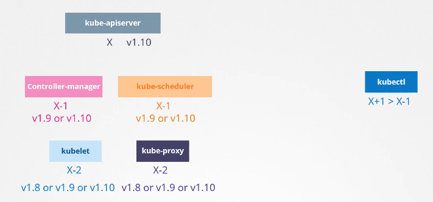
- The Controller, manager and scheduler can be at one version lower, so if API Server was at X, Controller Manager and Kube Schedulers can be at X-1 and the Kubelet and Kube-Proxy compoenets can be 2 versions lower X-2. So If Kube API Server was at 1.10, the Controller Manager and scheduler could be at 1.10 or 1.9, and the Kubelet and Kube-Proxy could be at 1.8. None of them could be at a version higher than the API Server like 1.11. 
- Now this is not the case with Kubectl. The Kubectl utility could be at 1.11 a version higher than the API Server, 1.10 the same version as the API Server or at 1.9 a version than the API Server. Now this permissible skew in versions allows us to carry out live upgrades. We can upgrade component by component if required.
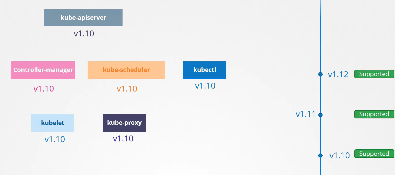
- So when should you upgrade? So you were at 1.10 and Kubernetes releases versions 1.11 and 1.12, at any time, Kubernetes supports only up to the recent 3 minor versions. So with 1.12 being the latest release, Kubernetes supports versions 1.12, 1.11, and 1.10.
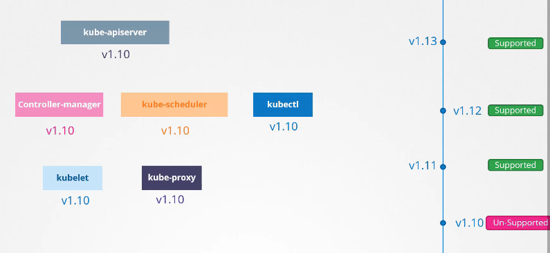
- So when 1.13 is released, only versions 1.13, 1.12 and 1.11 are supported. Before the release of 1.13 would be a good time to upgrade your Cluster to the next release.
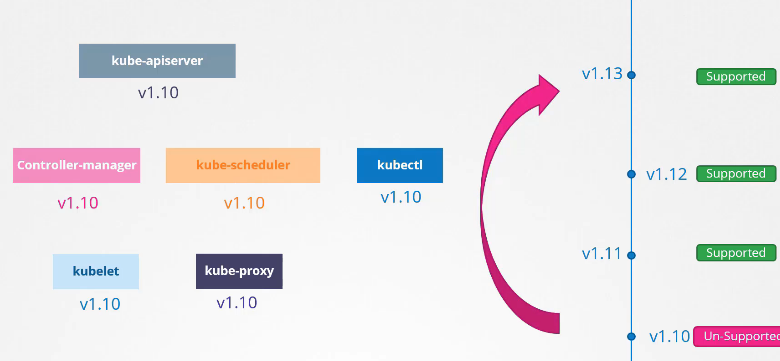
- So how do we upgrade? Do we upgrade directly from 1.10 to 1.13? ⇒ No. 
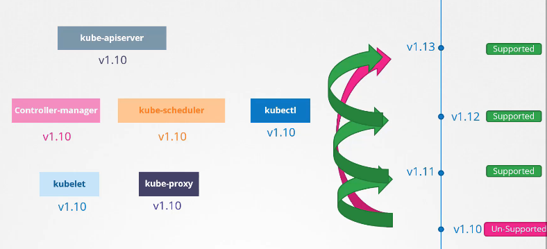
- The recommended approach is to upgrade one minor version at a time version 1.10 to 1.11, then 1.11 to 1.12 and then 1.12 to 1.13.
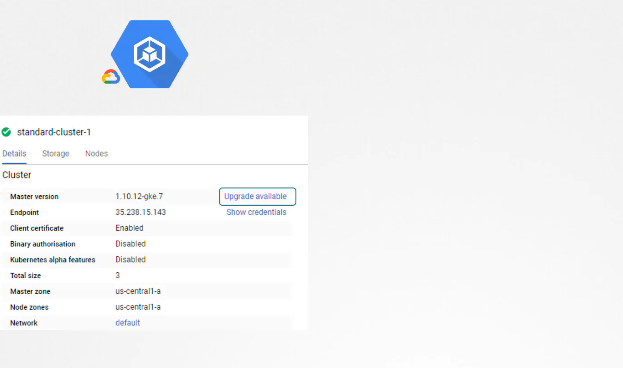
- The upgrade process depends on how your Cluster is set up. For example, If your Cluster is a managed Kubernetes Cluster deployed on cloud service providers like Google, for instance, Google Kubernetes engine lets you upgrade your Cluster easily with just a few clicks.
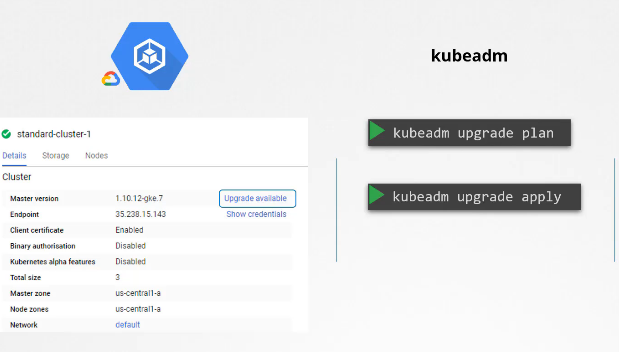
- If you deploy your Cluster using tools like `kubeadm`, then the tool can help you plan and upgrade the Cluster.
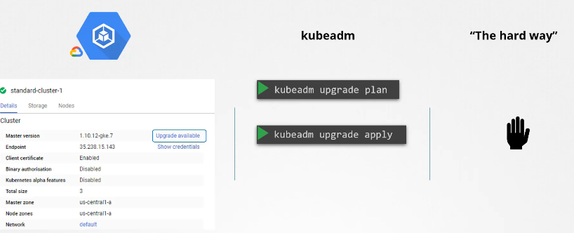
- If you deploy your Cluster from scratch, then you manually upgrade the different components of the Cluster yourself.
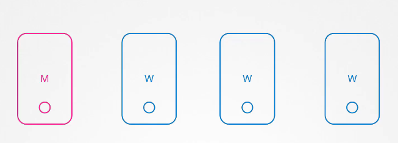
- In this lecture, we will look at the options by `kubeadm`. So you have a Cluster with Master and Worker Nodes running in production, hosting Pods, serving users.
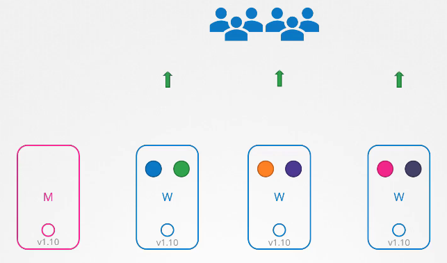
- The Nodes and Components are at version 1.10. Upgrading a Cluster involves 2 major steps. First, you upgrade your Master Nodes and then upgrade to Worker Nodes. While the Master is being upgraded. 
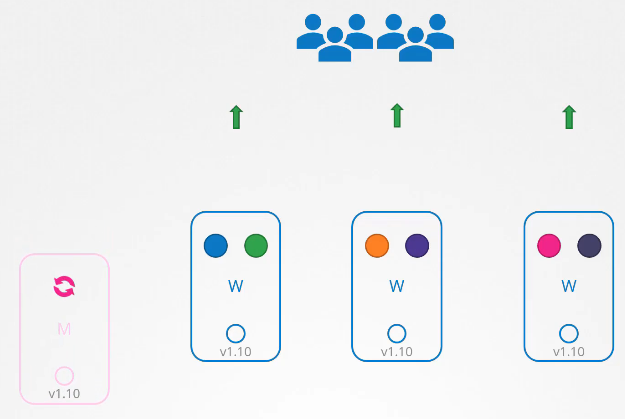
- The control plane components such as the API Server, Scheduler and Controller Managers go down briefly.
- The Master going down does not mean your Worker Nodes and applications on the Cluster are impacted. All workloads hosted on the Worker Nodes continue to serve users as normal since the Master is down, all management functions are down. You cannot access the Cluster using Kubectl or other Kubernetes API. You cannot deploy new applications or delete or modify existing ones. The Controller Managers don’t function either. If a Pod was to fail, a new Pod won’t be automatically created. But as long as the Nodes and the Pod are up, your applications should be up and users will not be impacted.
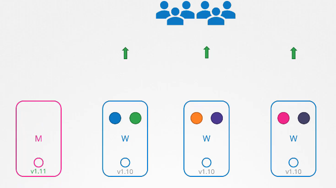
- Once the upgrade is compete and the Cluster is back up, it should function normally. We now have the Master and the Master component at version 1.11 and the Worker Nodes at version 1.10. As we saw earlier, this is a supported configuration. It is now time to upgrade the Worker Nodes. 
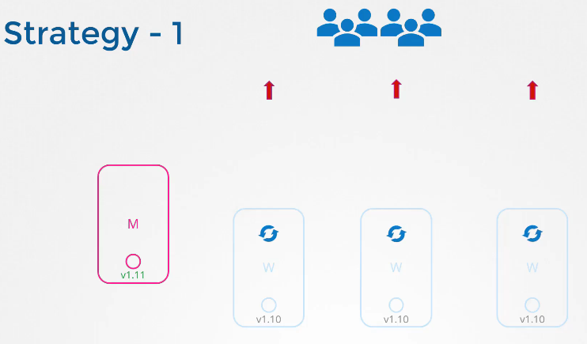
- There are different strategies available to upgrade the Worker Nodes. One is to upgrade all of them at once, but then your Pods are down and users are no longer able to access the applications.
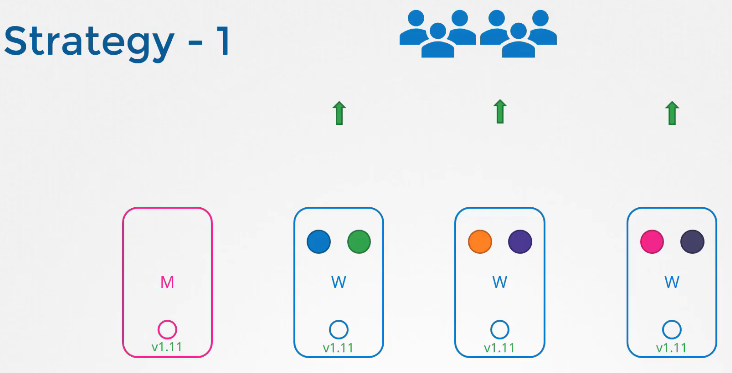
- Once the upgrade is complete, the Nodes are back up. New Pods are scheduled and users can resume access. That’s one strategy that requires downtime.
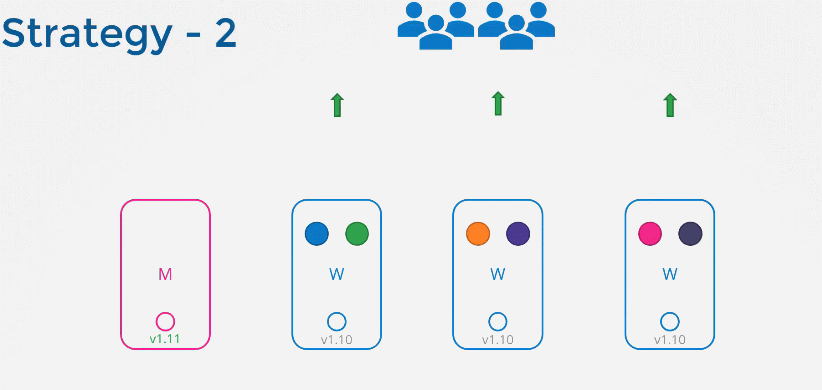
- The second strategy is to upgrade one Node at a time. So going back to the state where we have our Master upgraded and Nodes waiting to be upgraded, we first upgrade the first Node where the workloads move to the second and third Node and users are served from there. 
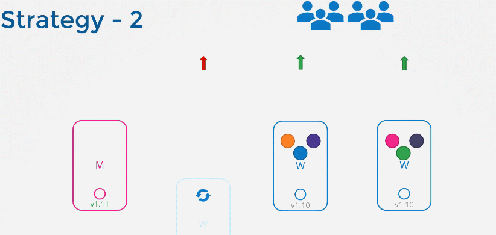
- Once the first Node is upgraded and back up, we then update the second Node where the workloads move to the first and third Nodes.
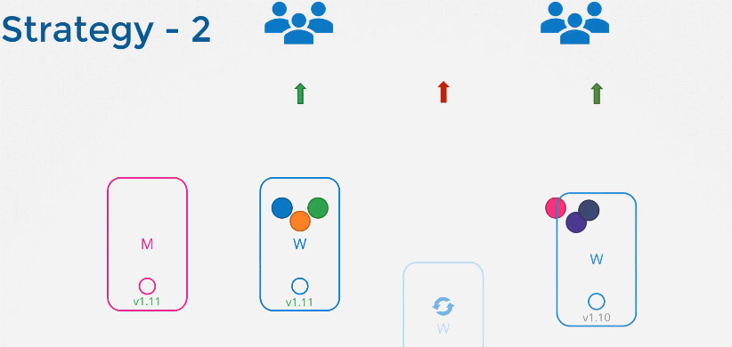
- And finally, the third Node where the workloads are shared between the first two.
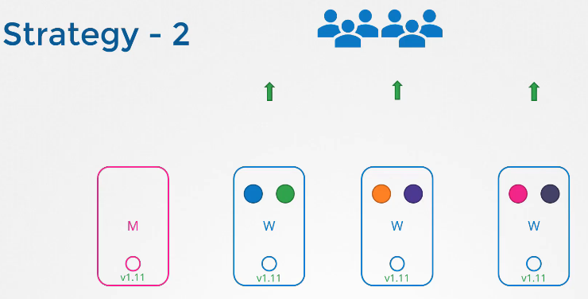
- Until we have all Nodes upgraded to a newer version, we then follow the same procedure to upgrade the Nodes from 1.11 to 1.12 and then 1.13.
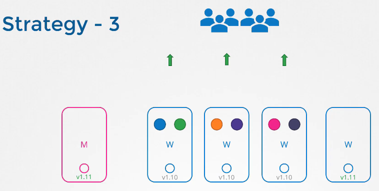
- A third strategy would be to add new Nodes to the Cluster. Nodes with newer software version. This is especially convenient if you’re on a Cloud Environment where you can easily provision new Nodes and decommission old ones. 
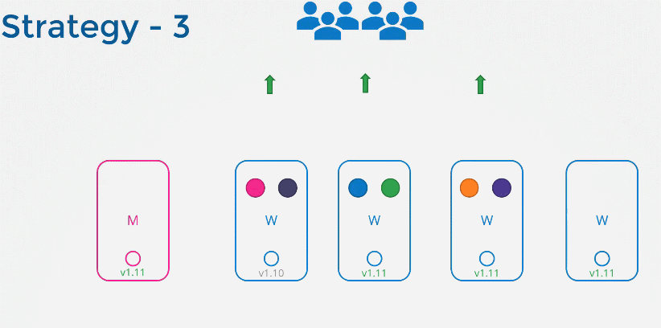
- Nodes with the newer software version can be added to the Cluster, move the workload over to the new, and remove the old Node.
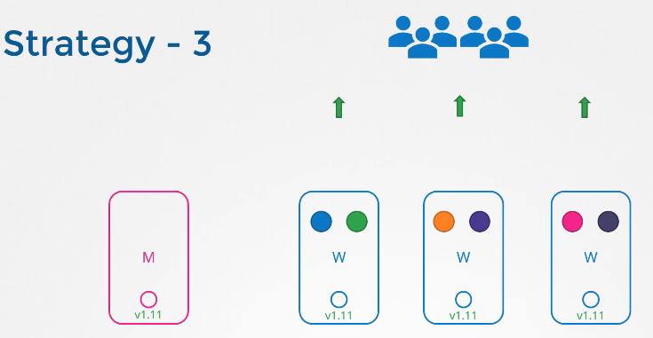
- Until you finally have all new Nodes with the new software version. 
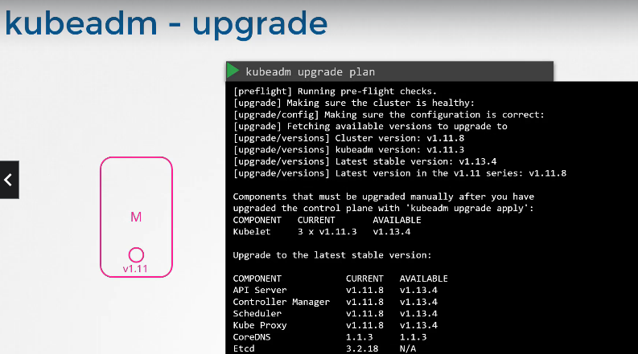
- Let us new see how it is done. So if we were to upgrade this Cluster from 1.11 to 1.13. `kubeadm` has an upgrade command that helps in upgrading Cluster. With `kubeadm` run the `kubeadm upgrade plan` command and will give you a lot of good information. 
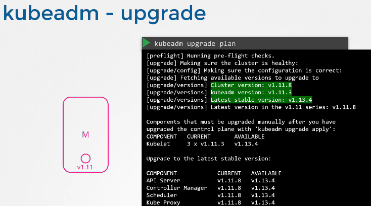
- The current Cluster version, the `kubeadm` tool version, the latest stable version of Kubernetes. 
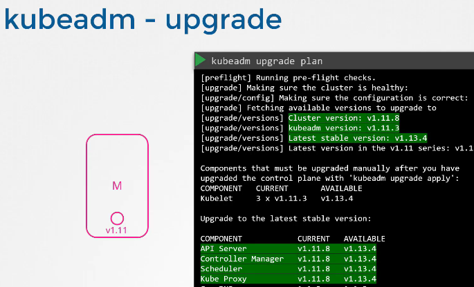
- Then it lists all the Control Plane Components and their versions and what version these can be upgraded to. 
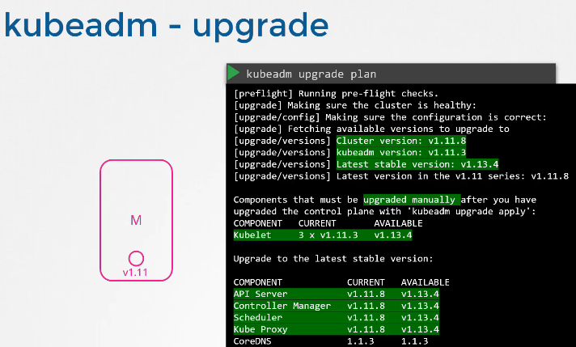
- It also tells you that after we upgrade the Control Plane Components, you must manually upgrade the Kubelet versions on each Node. Remember, Kubeadm does not install or upgrade Kubelets.
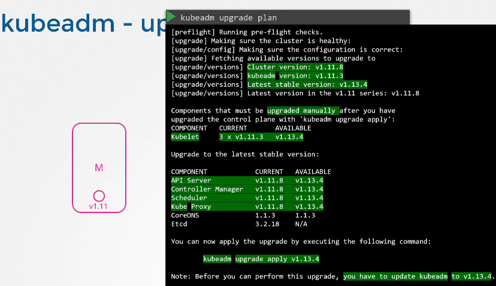
- Finally, it gives you the command to upgrade the Cluster, also note that you must upgrade the `kubeadm` tool itself before you can upgrade the Cluster. The `kubeadm` tool also follows the same software version as Kubernetes. So we are at 1.11 and we want to go to 1.13. 
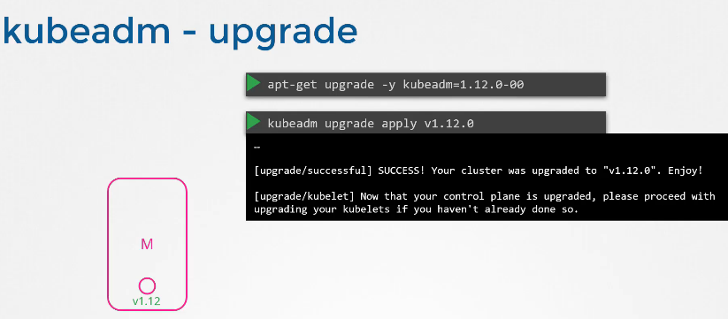
- But remember, we can only go one minor version at a time. So we first go to 1.12, first upgrade the `kubeadm` tool itself to version 1.12, then upgrade the Cluster using the command from the upgrade plan output `kubeadm upgrade apply`. It pulls the necessary images and upgrades the Cluster Components. Once complete your Control Plane Components are now at 1.12.
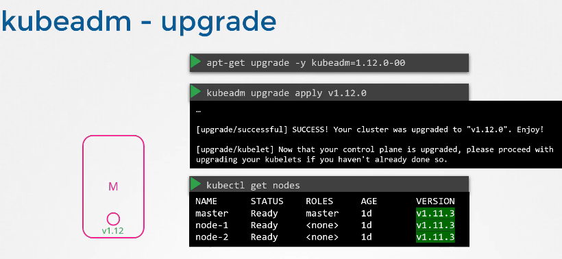
- If you run the `kubectl et nodes` command, you will still see the Master Node at 1.11. This is because in the output of this command it is showing the versions of Kubelet on each of these Nodes registered with the API Server. And not the version of the API Server itself.
- The next step is to upgrade the Kubelet. remember, depending on your setup, you may or may not have Kubernetes running on your master Node. In this case, the Cluster deployed with Kubeadm has Kubelets on the Master Node which are used to run the Control Plane Components as part of the Master Nodes.
- When we set up a Kubernetes Cluster from scratch later during this course, we did not install Kubelet on the Master Nodes. You will not see the Master Node in the output of this command in that case.
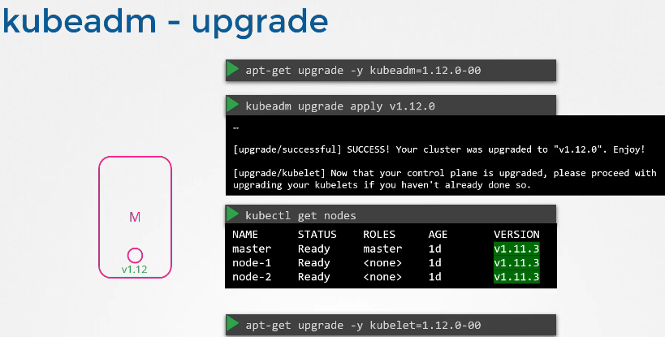
- So the next step is to upgrade Kubelet on the Master Node. If you have Kubelets on them, run the `apt-get` Kubelet command for this.
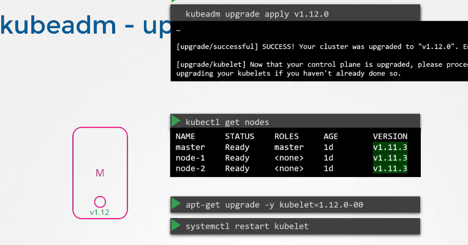
- Once the package is upgraded, restart the Kubelet Service.
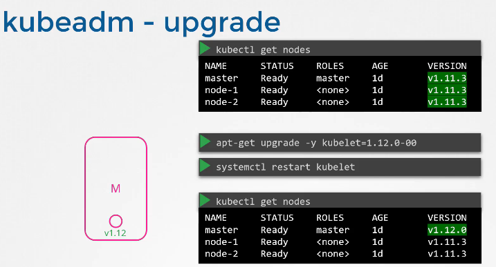
- Running the `kubectl get nodes` command now shows that the Master has been upgraded to 1.12. The Worker Nodes are still at 1.11.
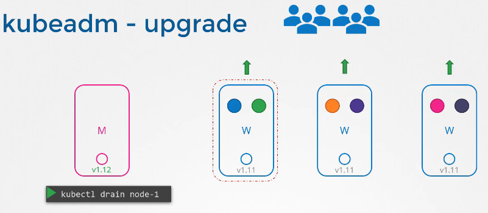
- So next, the Worker Nodes, let us start one at a time. We need to first move the workload from the first Worker Node to the other Nodes. The `kubectl drain` command lets you safely terminate all the Pods from a Node and reduce them on the other Nodes.
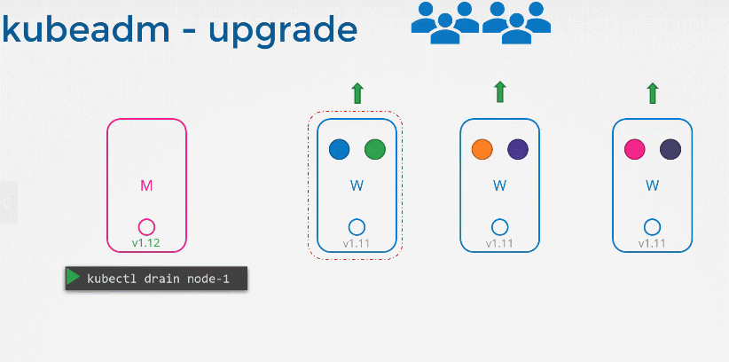
- It also cordons the Node and marks it unpredictable. That way, no new Pods are scheduled on it.
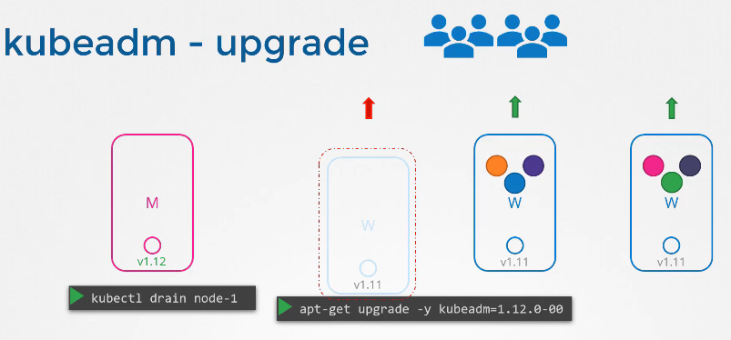
- Then upgrade the `kubeadm` and Kubelet pachages on the Worker Nodes, as we did on the Master Node.
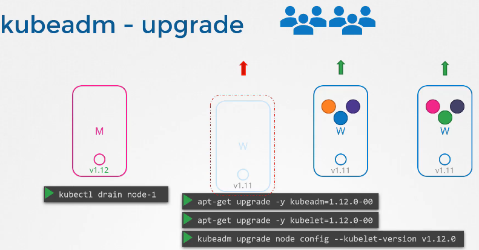
- Then using the kubeadm tool upgrade command, update the node configuration for the new kubelet version.
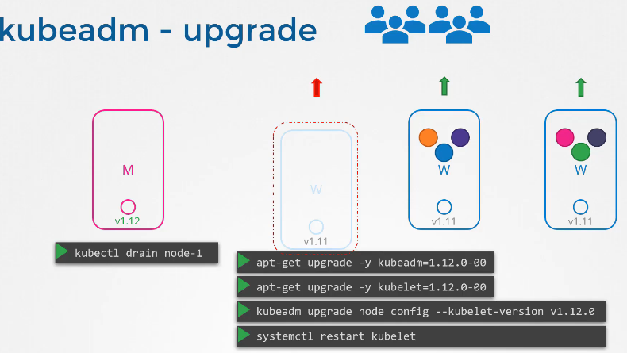
- then restart the Kubelet Service.
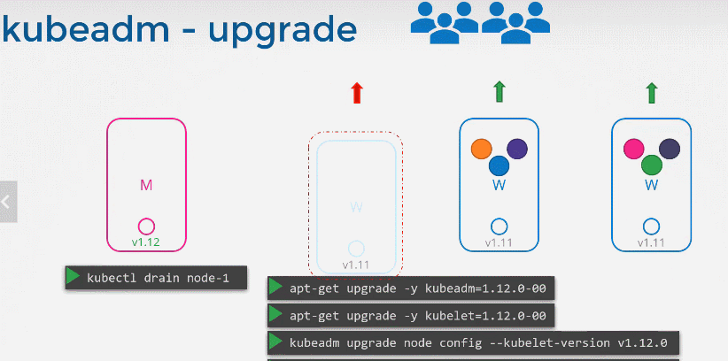
- The Node should now be up with the new software version. However, when we frain the Node, we actually marked it on unschedulable. 
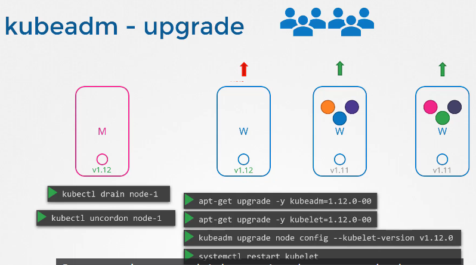
- So we need to unmark it by running the command `kubectl uncordon node-1`.
- The Node is now schedulable, but remember that it is not necessary that the Pods come right back to this Node. It is only marked as schedulable only when the Pods are deleted from the other Nodes or when new Pods are scheduled, do they really come back to this first Node? 
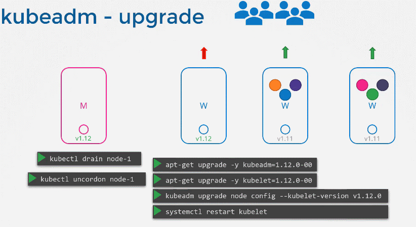
- Well, it will soon come when we take down the second Node to perform the same steps to upgrade it.
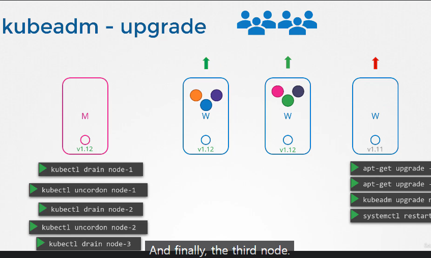
- And finally, the third Node.
- We now have all Nodes upgraded.
- Head over to the practice test where you will practice upgrading a live Cluster with applications running on it without taking the applications down.
# 125. Demo - Cluster upgrade
# 126. Practice Test - Cluster Upgrade
Practice Test: [https://uklabs.kodekloud.com/topic/practice-test-cluster-upgrade-process-2/](https://uklabs.kodekloud.com/topic/practice-test-cluster-upgrade-process-2/)
# 127. Solution: Cluster Upgrade
1. This lab tests your skills on **upgrading a kubernetes cluster**. We have a production cluster with applications running on it. Let us explore the setup first. What is the current version of the cluster? ⇒ **`v1.19.0`**
	```javascript
root@controlplane:~# kubectl get nodes
NAME           STATUS   ROLES    AGE   VERSION
controlplane   Ready    master   58m   v1.19.0
node01         Ready    <none>   57m   v1.19.0
	```
2. How many nodes are part of this cluster? Including master and worker nodes. ⇒ **`2`**
3. How many nodes can host workloads in this cluster? Inspect the applications and taints set on the nodes. ⇒ **`2`**
4. How many applications are hosted on the cluster? Count the number of deployments. ⇒ **`1`**
	```javascript
root@controlplane:~# kubectl get deployments.apps
NAME   READY   UP-TO-DATE   AVAILABLE   AGE
blue   5/5     5            5           3m32s
	```
5. What nodes are the pods hosted on? ⇒ **`controlplane,node01`**
	```javascript
root@controlplane:~# kubectl get pods -o wide
NAME                    READY   STATUS    RESTARTS   AGE    IP           NODE           NOMINATED NODE   READINESS GATES
blue-746c87566d-j6vmf   1/1     Running   0          4m8s   10.244.1.2   node01         <none>           <none>
blue-746c87566d-mv6rv   1/1     Running   0          4m7s   10.244.0.5   controlplane   <none>           <none>
blue-746c87566d-q5fnr   1/1     Running   0          4m7s   10.244.1.4   node01         <none>           <none>
blue-746c87566d-xr7bt   1/1     Running   0          4m7s   10.244.1.3   node01         <none>           <none>
blue-746c87566d-z2n4x   1/1     Running   0          4m7s   10.244.0.4   controlplane   <none>           <none>
	```
6. You are tasked to upgrade the cluster. User's accessing the applications must not be impacted. And you cannot provision new VMs. What strategy would you use to upgrade the cluster? ⇒ **`Upgrade one node at a time while moving the workloads to the other`**
7. What is the latest stable version available for upgrade? Use the `kubeadm` tool. ⇒ **`v1.19.16`**
	```javascript
root@controlplane:~# kubeadm upgrade plan
[upgrade/config] Making sure the configuration is correct:
[upgrade/config] Reading configuration from the cluster...
[upgrade/config] FYI: You can look at this config file with 'kubectl -n kube-system get cm kubeadm-config -oyaml'
[preflight] Running pre-flight checks.
[upgrade] Running cluster health checks
[upgrade] Fetching available versions to upgrade to
[upgrade/versions] Cluster version: v1.19.0
[upgrade/versions] kubeadm version: v1.19.0
I0905 07:52:08.464053   34348 version.go:252] remote version is much newer: v1.25.0; falling back to: stable-1.19
[upgrade/versions] Latest stable version: v1.19.16
[upgrade/versions] Latest stable version: v1.19.16
[upgrade/versions] Latest version in the v1.19 series: v1.19.16
[upgrade/versions] Latest version in the v1.19 series: v1.19.16

Components that must be upgraded manually after you have upgraded the control plane with 'kubeadm upgrade apply':
COMPONENT   CURRENT       AVAILABLE
kubelet     2 x v1.19.0   v1.19.16

Upgrade to the latest version in the v1.19 series:

COMPONENT                 CURRENT   AVAILABLE
kube-apiserver            v1.19.0   v1.19.16
kube-controller-manager   v1.19.0   v1.19.16
kube-scheduler            v1.19.0   v1.19.16
kube-proxy                v1.19.0   v1.19.16
CoreDNS                   1.7.0     1.7.0
etcd                      3.4.9-1   3.4.9-1

You can now apply the upgrade by executing the following command:

        kubeadm upgrade apply v1.19.16

Note: Before you can perform this upgrade, you have to update kubeadm to v1.19.16.

_____________________________________________________________________


The table below shows the current state of component configs as understood by this version of kubeadm.
Configs that have a "yes" mark in the "MANUAL UPGRADE REQUIRED" column require manual config upgrade or
resetting to kubeadm defaults before a successful upgrade can be performed. The version to manually
upgrade to is denoted in the "PREFERRED VERSION" column.

API GROUP                 CURRENT VERSION   PREFERRED VERSION   MANUAL UPGRADE REQUIRED
kubeproxy.config.k8s.io   v1alpha1          v1alpha1            no
kubelet.config.k8s.io     v1beta1           v1beta1             no
_____________________________________________________________________
	```
8. We will be upgrading the master node first. Drain the master node of workloads and mark it `UnSchedulable`.
	• Master Node: SchedulingDisabled
	```javascript
root@controlplane:~# kubectl drain controlplane --ignore-daemonsets
node/controlplane cordoned
WARNING: ignoring DaemonSet-managed Pods: kube-system/kube-flannel-ds-f68km, kube-system/kube-proxy-6rzht
evicting pod default/blue-746c87566d-z2n4x
evicting pod kube-system/coredns-f9fd979d6-bzmrr
evicting pod default/blue-746c87566d-mv6rv
evicting pod kube-system/coredns-f9fd979d6-knfvc
pod/blue-746c87566d-z2n4x evicted
pod/coredns-f9fd979d6-bzmrr evicted
pod/coredns-f9fd979d6-knfvc evicted
pod/blue-746c87566d-mv6rv evicted
node/controlplane evicted
	```
9. Upgrade the `controlplane` components to exact version `v1.20.0`. Upgrade kubeadm tool (if not already), then the master components, and finally the kubelet. Practice referring to the kubernetes documentation page. Note: While upgrading kubelet, if you hit dependency issue while running the `apt-get upgrade kubelet` command, use the `apt install kubelet=1.20.0-00` command instead.
	- controlplane Upgraded to v1.20.0
	- controlplane Kubelet Upgraded to v1.20.0
	(Hint) 
	On the controlplane node, run the following commands:
	1. `apt update`This will update the package lists from the software repository.
	2. `apt install kubeadm=1.20.0-00`This will install the kubeadm version 1.20
	3. `kubeadm upgrade apply v1.20.0`This will upgrade kubernetes controlplane. Note that this can take a few minutes.
	4. `apt install kubelet=1.20.0-00` This will update the kubelet with the version 1.20.
	5. You may need to restart kubelet after it has been upgraded.Run: `systemctl restart kubelet`
	```javascript
root@controlplane:~# apt update
Hit:2 https://download.docker.com/linux/ubuntu bionic InRelease
Hit:3 http://archive.ubuntu.com/ubuntu bionic InRelease      
Hit:1 https://packages.cloud.google.com/apt kubernetes-xenial InRelease
Hit:4 http://archive.ubuntu.com/ubuntu bionic-updates InRelease
Hit:5 http://archive.ubuntu.com/ubuntu bionic-backports InRelease
Hit:6 http://security.ubuntu.com/ubuntu bionic-security InRelease
Reading package lists... Done                     
Building dependency tree       
Reading state information... Done
87 packages can be upgraded. Run 'apt list --upgradable' to see them.
root@controlplane:~# apt install kubeadm=1.20.0-00
Reading package lists... Done
Building dependency tree       
Reading state information... Done
The following held packages will be changed:
  kubeadm
The following packages will be upgraded:
  kubeadm
1 upgraded, 0 newly installed, 0 to remove and 86 not upgraded.
Need to get 7707 kB of archives.
After this operation, 111 kB of additional disk space will be used.
Do you want to continue? [Y/n] y
Get:1 https://packages.cloud.google.com/apt kubernetes-xenial/main amd64 kubeadm amd64 1.20.0-00 [7707 kB]
Fetched 7707 kB in 0s (48.0 MB/s)
debconf: delaying package configuration, since apt-utils is not installed
(Reading database ... 15149 files and directories currently installed.)
Preparing to unpack .../kubeadm_1.20.0-00_amd64.deb ...
Unpacking kubeadm (1.20.0-00) over (1.19.0-00) ...
Setting up kubeadm (1.20.0-00) ...
root@controlplane:~# kubeadm upgrade apply v1.20.0
[upgrade/config] Making sure the configuration is correct:
[upgrade/config] Reading configuration from the cluster...
[upgrade/config] FYI: You can look at this config file with 'kubectl -n kube-system get cm kubeadm-config -o yaml'
[preflight] Running pre-flight checks.
[upgrade] Running cluster health checks
[upgrade/version] You have chosen to change the cluster version to "v1.20.0"
[upgrade/versions] Cluster version: v1.19.0
[upgrade/versions] kubeadm version: v1.20.0
[upgrade/confirm] Are you sure you want to proceed with the upgrade? [y/N]: y
[upgrade/prepull] Pulling images required for setting up a Kubernetes cluster
[upgrade/prepull] This might take a minute or two, depending on the speed of your internet connection
[upgrade/prepull] You can also perform this action in beforehand using 'kubeadm config images pull'

[upgrade/apply] Upgrading your Static Pod-hosted control plane to version "v1.20.0"...
Static pod: kube-apiserver-controlplane hash: f1eda5fdade5bfa86734fa3cbeb79c7e
Static pod: kube-controller-manager-controlplane hash: f6a9bf2865b2fe580f39f07ed872106b
Static pod: kube-scheduler-controlplane hash: 5146743ebb284c11f03dc85146799d8b
[upgrade/etcd] Upgrading to TLS for etcd
Static pod: etcd-controlplane hash: 6eca5d4b7f484728114744a0f4bdbc0a
[upgrade/staticpods] Preparing for "etcd" upgrade
[upgrade/staticpods] Renewing etcd-server certificate
[upgrade/staticpods] Renewing etcd-peer certificate
[upgrade/staticpods] Renewing etcd-healthcheck-client certificate
[upgrade/staticpods] Moved new manifest to "/etc/kubernetes/manifests/etcd.yaml" and backed up old manifest to "/etc/kubernetes/tmp/kubeadm-backup-manifests-2022-09-05-07-55-56/etcd.yaml"
[upgrade/staticpods] Waiting for the kubelet to restart the component
[upgrade/staticpods] This might take a minute or longer depending on the component/version gap (timeout 5m0s)
Static pod: etcd-controlplane hash: 6eca5d4b7f484728114744a0f4bdbc0a
Static pod: etcd-controlplane hash: 6eca5d4b7f484728114744a0f4bdbc0a
Static pod: etcd-controlplane hash: 70b918eef53479c78c2446a3c1d05f8a
[apiclient] Found 1 Pods for label selector component=etcd
[upgrade/staticpods] Component "etcd" upgraded successfully!
[upgrade/etcd] Waiting for etcd to become available
[upgrade/staticpods] Writing new Static Pod manifests to "/etc/kubernetes/tmp/kubeadm-upgraded-manifests311847357"
[upgrade/staticpods] Preparing for "kube-apiserver" upgrade
[upgrade/staticpods] Renewing apiserver certificate
[upgrade/staticpods] Renewing apiserver-kubelet-client certificate
[upgrade/staticpods] Renewing front-proxy-client certificate
[upgrade/staticpods] Renewing apiserver-etcd-client certificate
[upgrade/staticpods] Moved new manifest to "/etc/kubernetes/manifests/kube-apiserver.yaml" and backed up old manifest to "/etc/kubernetes/tmp/kubeadm-backup-manifests-2022-09-05-07-55-56/kube-apiserver.yaml"
[upgrade/staticpods] Waiting for the kubelet to restart the component
[upgrade/staticpods] This might take a minute or longer depending on the component/version gap (timeout 5m0s)
Static pod: kube-apiserver-controlplane hash: f1eda5fdade5bfa86734fa3cbeb79c7e
Static pod: kube-apiserver-controlplane hash: 8ee24f39a050d3295f160c152979f192
[apiclient] Found 1 Pods for label selector component=kube-apiserver
[upgrade/staticpods] Component "kube-apiserver" upgraded successfully!
[upgrade/staticpods] Preparing for "kube-controller-manager" upgrade
[upgrade/staticpods] Renewing controller-manager.conf certificate
[upgrade/staticpods] Moved new manifest to "/etc/kubernetes/manifests/kube-controller-manager.yaml" and backed up old manifest to "/etc/kubernetes/tmp/kubeadm-backup-manifests-2022-09-05-07-55-56/kube-controller-manager.yaml"
[upgrade/staticpods] Waiting for the kubelet to restart the component
[upgrade/staticpods] This might take a minute or longer depending on the component/version gap (timeout 5m0s)
Static pod: kube-controller-manager-controlplane hash: f6a9bf2865b2fe580f39f07ed872106b
Static pod: kube-controller-manager-controlplane hash: a875134e700993a22f67999011829566
[apiclient] Found 1 Pods for label selector component=kube-controller-manager
[upgrade/staticpods] Component "kube-controller-manager" upgraded successfully!
[upgrade/staticpods] Preparing for "kube-scheduler" upgrade
[upgrade/staticpods] Renewing scheduler.conf certificate
[upgrade/staticpods] Moved new manifest to "/etc/kubernetes/manifests/kube-scheduler.yaml" and backed up old manifest to "/etc/kubernetes/tmp/kubeadm-backup-manifests-2022-09-05-07-55-56/kube-scheduler.yaml"
[upgrade/staticpods] Waiting for the kubelet to restart the component
[upgrade/staticpods] This might take a minute or longer depending on the component/version gap (timeout 5m0s)
Static pod: kube-scheduler-controlplane hash: 5146743ebb284c11f03dc85146799d8b
Static pod: kube-scheduler-controlplane hash: 81d2d21449d64d5e6d5e9069a7ca99ed
[apiclient] Found 1 Pods for label selector component=kube-scheduler
[upgrade/staticpods] Component "kube-scheduler" upgraded successfully!
[upgrade/postupgrade] Applying label node-role.kubernetes.io/control-plane='' to Nodes with label node-role.kubernetes.io/master='' (deprecated)
[upload-config] Storing the configuration used in ConfigMap "kubeadm-config" in the "kube-system" Namespace
[kubelet] Creating a ConfigMap "kubelet-config-1.20" in namespace kube-system with the configuration for the kubelets in the cluster
[kubelet-start] Writing kubelet configuration to file "/var/lib/kubelet/config.yaml"
[bootstrap-token] configured RBAC rules to allow Node Bootstrap tokens to get nodes
[bootstrap-token] configured RBAC rules to allow Node Bootstrap tokens to post CSRs in order for nodes to get long term certificate credentials
[bootstrap-token] configured RBAC rules to allow the csrapprover controller automatically approve CSRs from a Node Bootstrap Token
[bootstrap-token] configured RBAC rules to allow certificate rotation for all node client certificates in the cluster
[addons] Applied essential addon: CoreDNS
[addons] Applied essential addon: kube-proxy

[upgrade/successful] SUCCESS! Your cluster was upgraded to "v1.20.0". Enjoy!

[upgrade/kubelet] Now that your control plane is upgraded, please proceed with upgrading your kubelets if you haven't already done so.
root@controlplane:~# 
root@controlplane:~# apt install kubelet=1.20.0-00
Reading package lists... Done
Building dependency tree       
Reading state information... Done
The following held packages will be changed:
  kubelet
The following packages will be upgraded:
  kubelet
1 upgraded, 0 newly installed, 0 to remove and 86 not upgraded.
Need to get 18.8 MB of archives.
After this operation, 4000 kB of additional disk space will be used.
Do you want to continue? [Y/n] y
Get:1 https://packages.cloud.google.com/apt kubernetes-xenial/main amd64 kubelet amd64 1.20.0-00 [18.8 MB]
Fetched 18.8 MB in 0s (57.9 MB/s)
debconf: delaying package configuration, since apt-utils is not installed
(Reading database ... 15149 files and directories currently installed.)
Preparing to unpack .../kubelet_1.20.0-00_amd64.deb ...
/usr/sbin/policy-rc.d returned 101, not running 'stop kubelet.service'
Unpacking kubelet (1.20.0-00) over (1.19.0-00) ...
Setting up kubelet (1.20.0-00) ...
/usr/sbin/policy-rc.d returned 101, not running 'start kubelet.service'
root@controlplane:~# systemctl restart kubelet
	```
10. Mark the `controlplane` node as "Schedulable" again.
	• Master Node: Ready & Schedulable
	```javascript
root@controlplane:~# kubectl uncordon controlplane
node/controlplane uncordoned
	```
11. Next is the worker node. `Drain` the worker node of the workloads and mark it `UnSchedulable`.
	• Worker node: Unschedulable
	```javascript
root@controlplane:~# kubectl drain node01 --ignore-daemonsets
node/node01 cordoned
WARNING: ignoring DaemonSet-managed Pods: kube-system/kube-flannel-ds-5vgdv, kube-system/kube-proxy-wbpjp
evicting pod default/blue-746c87566d-j6vmf
evicting pod default/blue-746c87566d-q5fnr
evicting pod kube-system/coredns-74ff55c5b-779r7
evicting pod default/blue-746c87566d-xr7bt
evicting pod default/blue-746c87566d-6kqw5
evicting pod kube-system/coredns-74ff55c5b-sxw6h
evicting pod default/blue-746c87566d-knntd
I0905 08:00:18.228190   43749 request.go:645] Throttling request took 1.114361122s, request: GET:https://controlplane:6443/api/v1/namespaces/kube-system/pods/coredns-74ff55c5b-sxw6h
pod/blue-746c87566d-6kqw5 evicted
pod/coredns-74ff55c5b-779r7 evicted
I0905 08:00:29.227895   43749 request.go:645] Throttling request took 1.114783777s, request: GET:https://controlplane:6443/api/v1/namespaces/default/pods/blue-746c87566d-knntd
pod/blue-746c87566d-knntd evicted
pod/blue-746c87566d-xr7bt evicted
pod/coredns-74ff55c5b-sxw6h evicted
pod/blue-746c87566d-j6vmf evicted
pod/blue-746c87566d-q5fnr evicted
node/node01 evicted
	```
12. Upgrade the worker node to the exact version `v1.20.0`.
	- Worker Node Upgraded to v1.20.0
	- Worker Node Read
	(Hint) On the node01 node, run the command run the following commands:
	1. If you are on the master node, run `ssh node01` to go to `node01`
	2. `apt update`This will update the package lists from the software repository.
	3. `apt install kubeadm=1.20.0-00`This will install the kubeadm version 1.20
	4. `kubeadm upgrade node`This will upgrade the node01 configuration.
	5. `apt install kubelet=1.20.0-00` This will update the kubelet with the version 1.20.
	6. You may need to restart kubelet after it has been upgraded.Run: `systemctl restart kubelet`
	7. Type `exit` or enter `CTL + d` to go back to the controlplane node.
13. Remove the restriction and mark the worker node as schedulable again.
	- Worker Node: Schedulable
	```javascript
root@controlplane:~# kubectl uncordon node01
node/node01 uncordoned
	```
# 128. Backup and Restore Methods
# 129. Working with ETCDCTL
-
### 🔰
### 🔰
### 🔰
### 🔰
### 🔰
# 130. Practice Test - Backup and Restore Methods
# 131. Solution - Backup and Restore
# 132. Certification Exam Tip!
# 133. References
