<table_of_contents color="gray"/>
# \[Section 4\]: Kubernetes Concepts
# 12. PODs
## 쿠버네티스 클러스터가 세팅되고, 가동된다고 가정함
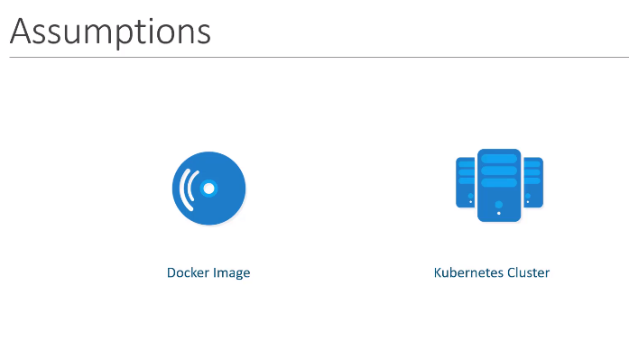
- 싱글 노드, 멀티 노드 상관없이 서비스가 실행되고 있다는 것을 가정
## POD
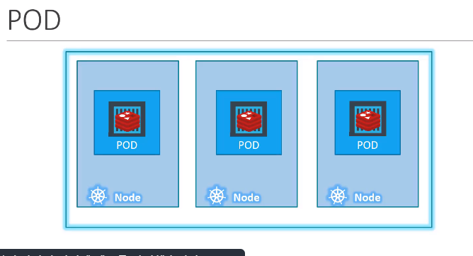
### 🔰 클러스터의 워커 노드로 구성된 세팅 머신에 어플리케이션 컨테이너를 배치하는 게 목표
- 그러나, 쿠버네티스는 컨테이너를 워커 노드에 직접적으로 배치하지 않음.
- ⇒ POD 라는 쿠버네티스 객체 안에 컨테이너가 캡슐화 됨.
- POD는 어플리케이션의 single instance임. 쿠버네티스에서 만들 수 있는 가장 작은 객체.
### 🔰 간단한 예 : single node cluster + single instance + single docker(또는 pod로 캡슐화된 컨테이너)
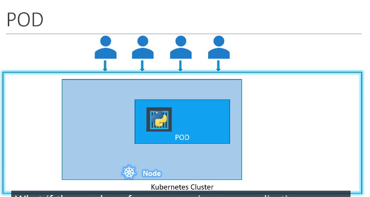
- 사용자가 늘어났을 때, 어플리케이션을 scale 시킬 필요가 있음 ⇒ 로드 공유를 위한 웹 어플리케이션 인스턴스를 늘임.
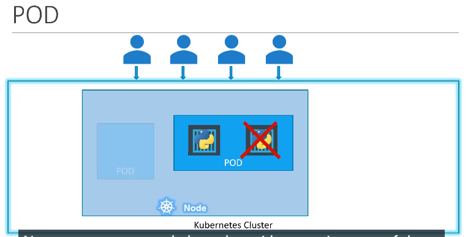
- 새로운 컨테이너 인스턴스는 pod 안에 추가하는 게 아닌, 새로운 파드를 하나 더 만듬.
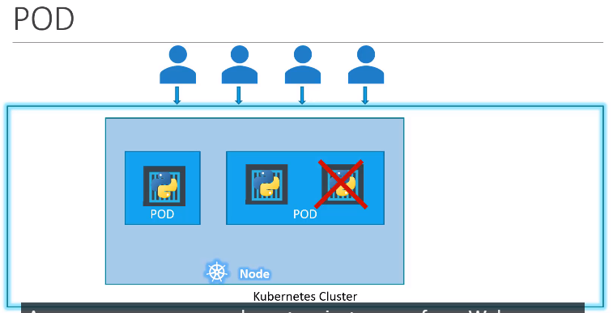
- 두 개의 웹 애플리케이션 인스턴스가 서로 다른 파드에서 동작함. (같은 시스템 또는 노드의 쿠버네티스에서)
### 🔰 사용자가 더 늘어나는데, 가용한 공간이 없다면?
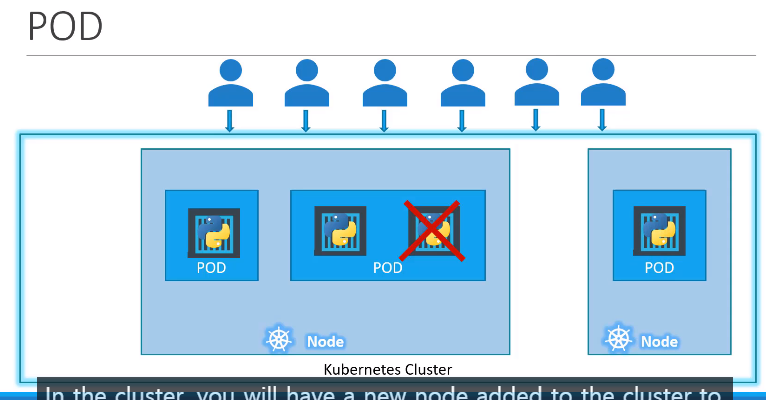
- 새로운 노드에 파드를 추가할 수 있음. (물리적으로 확장가능한 클러스터 노드 추가됨)
- 파드는 하나의 컨테이너와 관계를 가짐 ⇒ 어플리케이션 확장을 위함.
- 어플리케이션을 확장하기 위해 파드를 만들고, 축소하기 위해 파드를 지움 ⇒ 이미 존재하는 파드에 추가적인 컨테이너를 더해서 어플리케이션을 확장하는 게 아니라.
### 🔰 MultiContainer PODs
- 파드는 하나의 컨테이너와 관계를 가진다고 했는데, 그럼 단일 컨테이너 단위로 제한되는 것일까? ⇒ NO
- 싱글 파드는 여러 개의 컨테이너를 가질 수 있음. (보통 같은 종류의 컨테이너들이 아닌 경우)
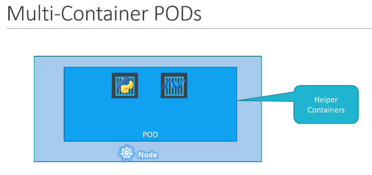
- 웹 어플리케이션 task를 서포트해야 하는 helper container가 있을 때, (사용자나, 데이터 입력, 사용자가 파일을 업로드하는 과정 등) helper container를 어플리케이션 컨테이너와 나란히 둘 수 있음.
- 이 경우, 같은 파드에 두 컨테이너를 배치시킬 수 있음. 새로운 컨테이너가 생성됐을 때 helper 또한 생성되고, 죽으면 helper도 죽음.
- 같은 파드의 한 부분이며, 두 개의 컨테이너 또한 서로와 직접적으로 소통함. (같은 네트워크에서 공유되는 동안 localhost로 참조됨)
- 또한, 같은 저장소 공간을 쉽게 공유할 수 있음.
### 🔰 docker host에 어플리케이션을 배치하기 위해 process 또는 script를 개발했다고 가정해보자
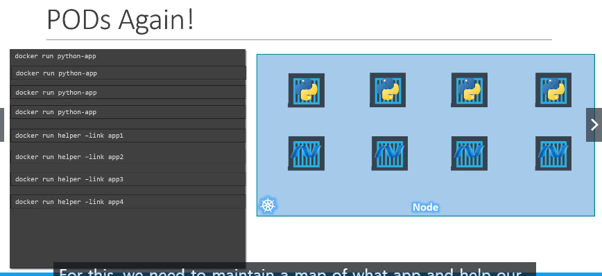
```bash
// simple token python을 사용해 어플리케이션 배치, 실행, 사용자 접근 가능하도록 함
docker run python-app

// 같은 명령어를 입력해서 여러 개의 인스턴스 생성
docker run python-app
docker run python-app
...
```
```bash
// helper container를 만듬.
// 각각에서 프로세싱 또는 데이터 fatch를 함으로써 웹 어플리케이션을 서포트하는 역할.
docker run helper -link app1..4
```
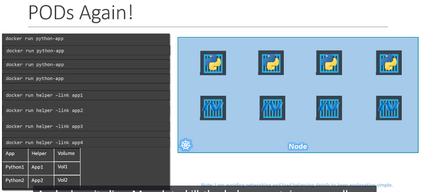
- 이 helper container는 어플리케이션 컨테이너와 1:1 관계를 유지함.
- 그러므로, 어플리케이션 컨테이너와 직접적으로 커뮤니케이션하고 컨테이너 데이터에 접근할 수 있어야 함.
- 이를 위해, 앱과 컨테이너가 서로 연결되도록 도울 맵이 필요하며, 링크와 커스텀 네트워크를 사용하는 컨테이너들 간 네트워크 연결성을 구축해야 할 필요가 있음.
- 가장 중요한 건, 어플리케이션 컨테이너 상태를 모니터링 할 수 있어야 함.
- 그리고 어플리케이션 컨테이너가 죽었을 때, helper container가 더 이상 필요하지 않으므로 이것도 죽여야 함.
- 새로운 컨테이너가 배치됐을 때, 새로운 helper container를 배치시킬 필요가 있음.
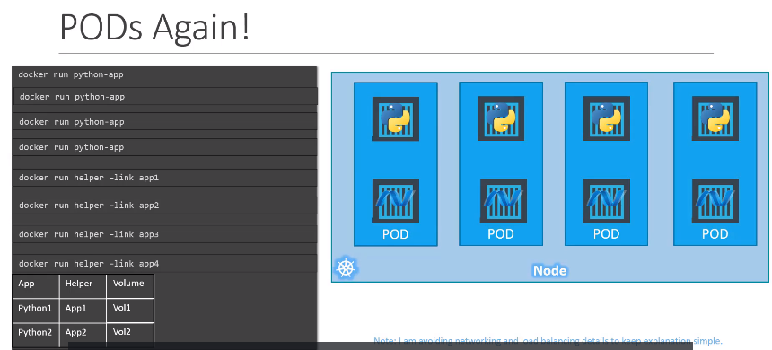
- 쿠버네티스와 파드는 어떤 컨테이너와 파드가 구성되어 있는지, 기본적 컨테이너가 동일한 저장소나 동일한 namespace에 접근할 건지 등등 정의가 필요한 것을 자동적으로 제공함.
- 파드는 함께 생성되고 함께 제거됨.
- 심지어 어플리케이션이 복잡하지 않고 하나의 컨테이너만 있더라도, 쿠버네티스는 여전히 파드 생성을 필요로 함.
- 구조적 변화와 확장에 대한 준비를 갖춘 어플리케이션이 장기적으로 좋음.
- 그러나, multiple 컨테이너는 드문 경우이며, 이 강의에서는 파드 당 하나의 컨테이너만 다룰 예정임.
## 어떻게 POD를 배치하는가?
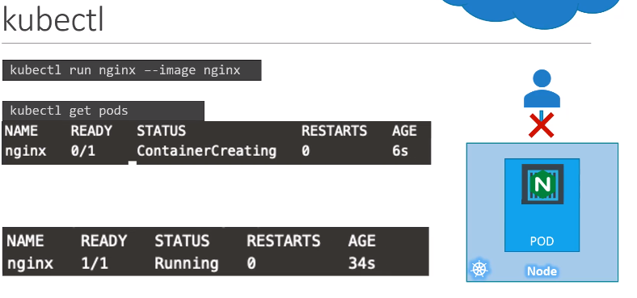
### 1. 파드 생성
```bash
kubectl run nginx
```
- 먼저, 자동적으로 파드를 생성하고, Nginx 도커 이미지의 인스턴스를 배치시킴.
```bash
kubectl run nginx --image nginx
```
- 그렇다면 어디서 어플리케이션 이미지를 얻을 수 있는가? 이미지 parameter에 특정 이미지 이름을 사용할 수 있음. (이 경우 사용된 nginx 이미지는 도커 허브 리포지토리에서 다운 가능)
- 이미지를 pull 받음으로써 쿠버네티스를 구성할 수 있음.
### 2. 파드 생성 후 목록 보기
```bash
kubectl get pods // 클러스터 내 파드 목록 보기
```
- 현재 상태에서, 외부 사용자가 접근가능한 웹 서버를 만들지는 않음.
- 접근하려면 노드에서 내부적으로 접근 가능함.
# 13. Demo - PODs
- 생략
# 14. Reference - PODs
- 생략
# 15. Your reviews are important to me!
- 생략
