# \[Section 6\]: Kubernetes Concepts - PODs, ReplicaSets, Deployments
# 19. PODs with YAML
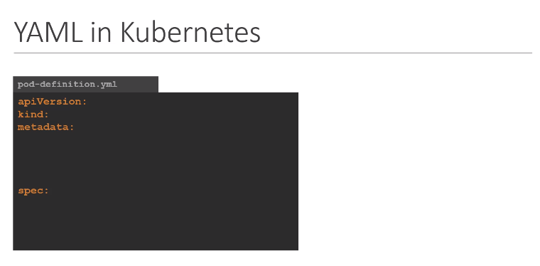
- top 또는 root 레벨 프로퍼티
	1. `apiVersion` : 생성해서 사용할 객체의 쿠버네티스 api 버전. 만들고자 하는 것에 따라 올바른 api version을 사용해야 함. 
	2. `kind` : 만드려고 하는 객체의 참조 타입. 여기선 pod.
	3. `metadata` : name, labels 같은 객체의 데이터.
	4. `spec` : 만들고자 하는 객체에 대한 설명서. 객체와 관련된 쿠버네티스에 대한 추가적 정보를 제공. dictionary 형태.
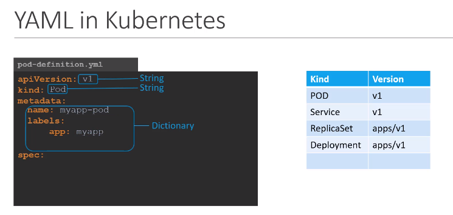
- matadata는 name, label과 같은 속성을 가지는 dictionary 형식으로 되어 있음. name과 labels는 형제 관계이므로 들여쓰기 잘 지킬 것.
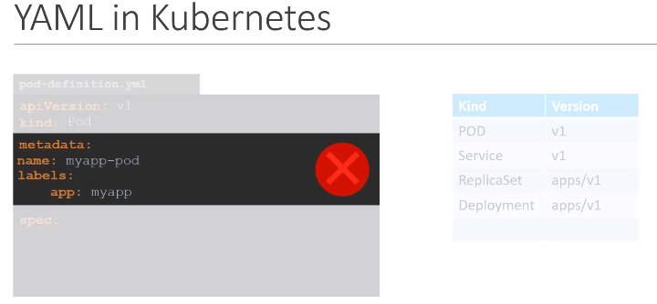
- labels는 metadata의 dictionary이며, 키-밸류 값을 가짐. 나중에 이 값을 보고 이 객체들을 식별할 수 있음.
### 🔰 수백개의 파드가 프론트엔드, 백엔드, 데이터베이스에서 실행된다면?
- 배치된 후엔 이것들을 그룹화하기 어려움. ⇒ 프론트엔드, 백엔드, 데이터베이스로 라벨링하면 필터가 용이.
- metadata 아래에는 name, labels, 쿠버네티스가 메타데이터 아래에 있을 것으로 예상하는 기타 항목 등과 같은 것들만 지정할 수 있음.
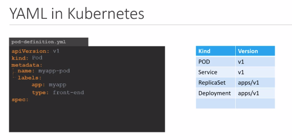
- 다른 프로퍼티나 임의 프로퍼티는 추가할 수 없으나, 라벨 밑에는 키-밸류 같은 것들을 쓸 수 있음.
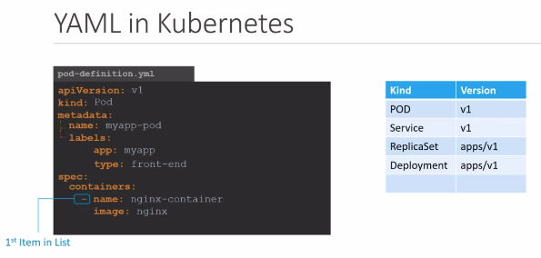
- container는 list 또는 array. ⇒ 파드가 여러 컨테이너를 포함할 수 있기 때문.
- -(dash)는 첫번째 아이템을 나타냄. name과 image 속성을 추가할 수 있음.
```bash
// 파드 파일 생성 명령어
kubectl create -f pod-definition.yml
```
### 🔰 파드를 생성했다면, 확인 방법은?
```bash
kubectl get pods // 파드 목록 확인
kubectl describe pod myapp-pod // 특정 파드 상세 확인
// 어떤 컨테너가 들어있는지, 이벤트가 결합되어 있는지 등
```
# 20. Demo - PODs with YAML
- pod.yaml 파일 만들기
```bash
vim pod.yaml
```
- 편집 내용
```bash
apiVersion: v1
kind: Pod
metadata:
  name: nginx
  labels:
    app: nginx
    tier: frontend
spec:
  containers:
  - name: nginx
    image: nginx
```
- 파드 만들기
```bash
kubectl apply -f pod.yaml
```
- 리스트 출력 및 상세확인
```bash
kubectl get pod
kubectl describe pod nginx
```
# 21. Tips & Tricks - Developing Kubernetes Manifest files with Visual Studio Code
- visual studio YAML 확장프로그램 깔기
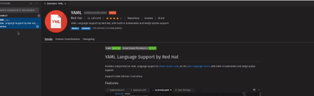
# 22. Demo - How to Access the Labs?
- Introduction: Set an environment variable for the docker container. `POSTGRES_PASSWORD` with a value `mysecretpassword`. I know we haven't discussed this in the lecture, but it is easy. To pass in an environment variable add a new property `env` to the container object. It is a sibling of image and name. `env` is an array/list. So add a new item under it. The item will have properties `name` and `value`. `name` should be the name of the environment variable - `POSTGRES_PASSWORD`. And `value` should be the password - `mysecretpassword`.
```bash
apiVersion: v1
kind: Pod
metadata:
  name: postgres
  labels:
    tier: db-tier
spec:
  containers:
    - name: postgres
      image: postgres
      env:
        - name: POSTGRES_PASSWORD
          value: mysecretpassword
```
# 23. Accessing the Labs
- Kode Kloud
# 24. Hands-On Labs
- [https://kodekloud.com/purchase?product_id=2392114&coupon_code=UDEMYSTUDENT560005](https://kodekloud.com/purchase?product_id=2392114&coupon_code=UDEMYSTUDENT560005)
- [https://kodekloud.com/courses/1120660/lectures/24008572](https://kodekloud.com/courses/1120660/lectures/24008572)
# 25. Solution: Pods with YAML Lab
- Create a new pod with the nginx image.
```bash
# kubectl run nginx --image=nginx
```
- What is the image used to create the new pods? You must look at one of the new pods in detail to figure this out. ⇒ `busybox`
```shell
# kubectl get pod
-------------------------
NAME            READY   STATUS              RESTARTS   AGE
newpods-6vths   0/1     ContainerCreating   0          10s
newpods-7l5bk   0/1     ContainerCreating   0          10s
newpods-qqhs2   0/1     ContainerCreating   0          10s
nginx           0/1     ContainerCreating   0          19s
```
```shell
# kubectl describe pod newpods-6vths 
------------------------------
Name:         newpods-6vths
Namespace:    default
Priority:     0
Node:         controlplane/10.211.24.9
Start Time:   Mon, 03 May 2021 14:32:33 +0000
Labels:       tier=busybox
Annotations:  <none>
Status:       Running
IP:           10.244.0.7
IPs:
  IP:           10.244.0.7
Controlled By:  ReplicaSet/newpods
Containers:
  busybox:
    Container ID:  docker://5367f406f49d1650eb2d6d64e98c6346c1d897dbcdcfa76d0751eae16c2ffd2a
    Image:         busybox
    Image ID:      docker-pullable://busybox@sha256:ae39a6f5c07297d7ab64dbd4f82c77c874cc6a94cea29fdec309d0992574b4f7
    Port:          <none>
    Host Port:     <none>
    Command:
      sleep
      1000
    State:          Running
      Started:      Mon, 03 May 2021 14:33:04 +0000
    Ready:          True
    Restart Count:  0
    Environment:    <none>
    Mounts:
      /var/run/secrets/kubernetes.io/serviceaccount from default-token-bnlq2 (ro)
Conditions:
  Type              Status
  Initialized       True 
  Ready             True 
  ContainersReady   True 
  PodScheduled      True 
Volumes:
  default-token-bnlq2:
    Type:        Secret (a volume populated by a Secret)
    SecretName:  default-token-bnlq2
    Optional:    false
QoS Class:       BestEffort
Node-Selectors:  <none>
Tolerations:     node.kubernetes.io/not-ready:NoExecute op=Exists for 300s
                 node.kubernetes.io/unreachable:NoExecute op=Exists for 300s
Events:
  Type    Reason     Age    From               Message
  ----    ------     ----   ----               -------
  Normal  Scheduled  2m22s  default-scheduler  Successfully assigned default/newpods-6vths to controlplane
  Normal  Pulling    2m13s  kubelet            Pulling image "busybox"
  Normal  Pulled     114s   kubelet            Successfully pulled image "busybox" in 18.993137317s
  Normal  Created    113s   kubelet            Created container busybox
  Normal  Started    111s   kubelet            Started container busybox
```
- Which nodes are these pods placed on? You must look at all the pods in detail to figure this out. ⇒ `controlplane`
```shell
# kubectl get pods -o wide
--------------------------------
NAME            READY   STATUS    RESTARTS   AGE     IP           NODE           NOMINATED NODE   READINESS GATES
newpods-6vths   1/1     Running   0          5m11s   10.244.0.7   controlplane   <none>           <none>
newpods-7l5bk   1/1     Running   0          5m11s   10.244.0.6   controlplane   <none>           <none>
newpods-qqhs2   1/1     Running   0          5m11s   10.244.0.5   controlplane   <none>           <none>
nginx           1/1     Running   0          5m20s   10.244.0.4   controlplane   <none>           <none>
```
- How many containers are part of the pod `webapp`? Note: We just created a new POD. Ignore the state of the POD for now. ⇒ `READY가 1/2이므로 2`
```shell
# kubectl get pod webapp
--------------------------------
NAME     READY   STATUS             RESTARTS   AGE
webapp   1/2     ImagePullBackOff   0          2m24s
```
- What images are used in the new `webapp` pod? You must look at all the pods in detail to figure this out. ⇒ `nginx & agentx`
- What is the state of the container `agentx` in the pod `webapp`? Wait for it to finish the `ContainerCreating` state. ⇒ `waiting`
- Why do you think the container `agentx` in pod `webapp` is in error? Try to figure it out from the events section of the pod. ⇒ `Error: ImagePullBackOff, A Docker image with this name doesn't exit on Docker HUb`
```shell
# kubectl describe pod webapp
--------------------------------
root@controlplane:~# 
Name:         webapp
Namespace:    default
Priority:     0
Node:         controlplane/10.211.24.9
Start Time:   Mon, 03 May 2021 14:38:28 +0000
Labels:       <none>
Annotations:  <none>
Status:       Pending
IP:           10.244.0.8
IPs:
  IP:  10.244.0.8
Containers:
  nginx:
    Container ID:   docker://6750f11156a369b871126ca13840765c6bb39a3cd45df629689aae14888c7479
    Image:          nginx
    Image ID:       docker-pullable://nginx@sha256:75a55d33ecc73c2a242450a9f1cc858499d468f077ea942867e662c247b5e412
    Port:           <none>
    Host Port:      <none>
    State:          Running
      Started:      Mon, 03 May 2021 14:38:33 +0000
    Ready:          True
    Restart Count:  0
    Environment:    <none>
    Mounts:
      /var/run/secrets/kubernetes.io/serviceaccount from default-token-bnlq2 (ro)
  agentx:
    Container ID:   
    Image:          agentx
    Image ID:       
    Port:           <none>
    Host Port:      <none>
    State:          Waiting
      Reason:       ImagePullBackOff
    Ready:          False
    Restart Count:  0
    Environment:    <none>
    Mounts:
      /var/run/secrets/kubernetes.io/serviceaccount from default-token-bnlq2 (ro)
Conditions:
  Type              Status
  Initialized       True 
  Ready             False 
  ContainersReady   False 
  PodScheduled      True 
Volumes:
  default-token-bnlq2:
    Type:        Secret (a volume populated by a Secret)
    SecretName:  default-token-bnlq2
    Optional:    false
QoS Class:       BestEffort
Node-Selectors:  <none>
Tolerations:     node.kubernetes.io/not-ready:NoExecute op=Exists for 300s
                 node.kubernetes.io/unreachable:NoExecute op=Exists for 300s
Events:
  Type     Reason     Age                   From               Message
  ----     ------     ----                  ----               -------
  Normal   Scheduled  4m13s                 default-scheduler  Successfully assigned default/webapp to controlplane
  Normal   Pulling    4m10s                 kubelet            Pulling image "nginx"
  Normal   Pulled     4m10s                 kubelet            Successfully pulled image "nginx" in 364.705949ms
  Normal   Created    4m9s                  kubelet            Created container nginx
  Normal   Started    4m8s                  kubelet            Started container nginx
  Normal   Pulling    3m26s (x3 over 4m8s)  kubelet            Pulling image "agentx"
  Warning  Failed     3m26s (x3 over 4m7s)  kubelet            Failed to pull image "agentx": rpc error: code = Unknown desc = Error response from daemon: pull access denied for agentx, repository does not exist or may require 'docker login': denied: requested access to the resource is denied
  Warning  Failed     3m26s (x3 over 4m7s)  kubelet            Error: ErrImagePull
  Normal   BackOff    2m48s (x6 over 4m7s)  kubelet            Back-off pulling image "agentx"
  Warning  Failed     2m48s (x6 over 4m7s)  kubelet            Error: ImagePullBackOff
```
- What does the READY column in the output of the `kubectl get pods` command indicate? ⇒ `Running Containers in POD/Total Containers in POD`
```shell
# kubectl get pods webapp
---------------------------
NAME     READY   STATUS             RESTARTS   AGE
webapp   1/2     ImagePullBackOff   0          14m
```
- Delete the `webapp` Pod. Once deleted, wait for the pod to fully terminate.
```shell
# kubectl delete pod webapp
---------------------------
pod "webapp" deleted
```
- Create a new pod with the name `redis` and with the image `redis123`. Use a pod-definition YAML file. And yes the image name is wrong!
```shell
# kubectl run redis --image=redis123
---------------------------
pod/redis created

# kubectl run redis --image=redis123 --dry-run=client -o yaml > pod.yaml
# vi pod.yaml 
---------------------------
apiVersion: v1
kind: Pod
metadata:
  creationTimestamp: null
  labels:
    run: redis
  name: redis
spec:
  containers:
  - image: redis123
    name: redis
    resources: {}
  dnsPolicy: ClusterFirst
  restartPolicy: Always
status: {}

# kubectl apply -f pod.yaml
---------------------------
pod/redis configured
```
- Now change the image on this pod to `redis`. Once done, the pod should be in a `running` state. ⇒ `- image: redis 부분 변경`
```shell

# kubectl edit pod redis
---------------------------
...
  containers:
  - image: redis123
...
```
# 26. Replication Controllers and ReplicaSets
## 쿠버네티스 컨트롤러
- 쿠버네티스 컨트롤러 : 쿠버네티스의 두뇌
- 쿠버네티스를 모니터하는 프로세스(객체, 반응형)
### 🔰 Replica 그리고 왜 Replication Controller가 필요한가?
- 싱글 파드 어플리케이션이 구동되는 시나리오로 돌아가 보자.
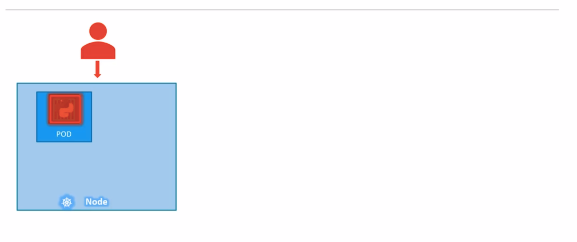
- 어떠한 이유로 어플리케이션이 망가졌을 때, 사용자는 더 이상 접근할 수 없음.
- 고객 접근이 실패하는 것을 막기 위해, 동시간에 작동하는 인스턴스나 파드가 더 필요하게 됨. ⇒ 하나가 망가지더라도 다른 하나로 구동 가능.
- 레플리케이션 컨트롤러는 클러스터 내 다수의 인스턴스(single pod)를 구동할 수 있도록 도와 줌.
- 그러므로, 이는 높은 유용성을 지님.
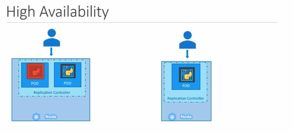
- 그렇다면, 싱글 파드는 레플리케이션 컨트롤러를 적용할 수 없을까? ⇒ 아님.
- 싱글 파드 구조라도, 어플리케이션이 망가졌을 때 레플리케이션 컨트롤러는 자동적으로 새로운 파드를 불러 옴.
- 레플리케이션 컨트롤러는 항상 특정 수의 파드가 실행되게 하며, 파드가 하나든 100개든 레플리케이션 컨트롤러가 필요한 이유는 다수의 파드가 서로 노드를 공유해야 하기 때문. 
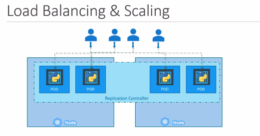
- 사용자가 늘어날 때, 두 개의 파드 간 로드 밸런싱을 위해 추가적인 파드를 배치시킴. 혹은 첫번째 노드의 자원이 초과됐을 때, 클러스터 내 다른 노드에 추가적으로 파드를 배치시킴.
- 그림과 같이, 레플리케이션 컨트롤러는 클러스터 내 다수의 노드를 가로지르며 사용함.
- 이는 어플리케이션 확장을 위한 다른 노드의 다수 파드의 로드 밸런싱을 도움.
### 🔰 Replication Controller / Replica Set
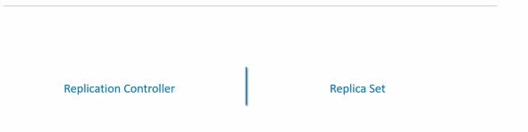
- Replication Controller : Older Technology. 레플리카 셋으로 바뀜.
- Replica Set : 레플리케이션을 구성하는 새로운 방법.
### 🔰 Replication Controller 만들기
- apiVersion은 무엇을 만들건지를 구체화함.
```shell
apiVersion: v1
kind: ReplicationController
metadata:
  name: myapp-rc
  labels:
    app: myapp
    type: front-end
spec:
```
- 이 경우, 레플리케이션 컨트롤러는 다수의 인스턴스 파드를 생성함. spec의 template 부분에 레플리케이션 컨트롤러에서 사용할 파드 템플릿을 적음. (레플리카를 생성하기 위해)
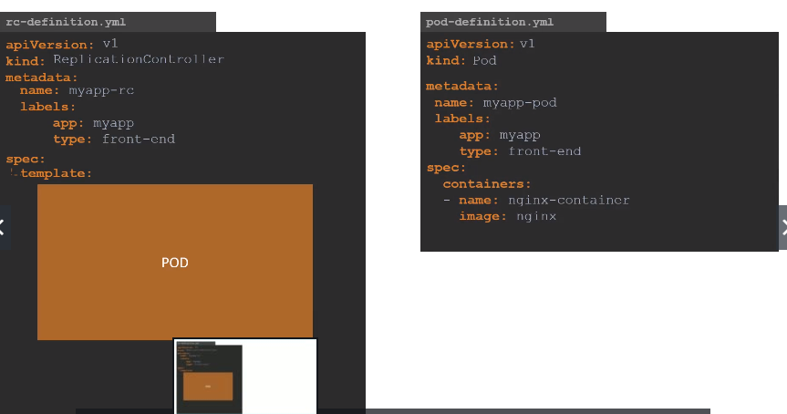
- POD 템플릿은 어떻게 정의할 것인가? ⇒ 파드에 작성했던 내용을 template 아래 옮기면 됨.
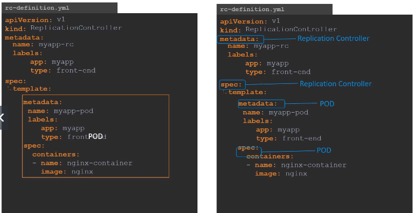
- 레플리카의 갯수를 레플리케이션 컨트롤러에 기재하는 것이 필요함.
- replicas 프로퍼티는 template 프로퍼티와 동일한 칸에 옴.
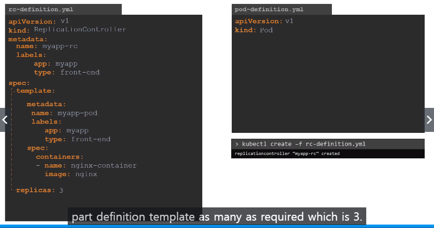
```shell
kubectl create -f rc-definition.yml // 레플리케이션 컨트롤러 생성
kubectl get replicationcontroller // 레플리케이션 컨트롤러 목록 조회
kubectl get pods // 레플리케이션 컨트롤러에 의해 생성된 파드 목록 조회
```
### 🔰 Replica Set 만들기
- Replication Controller와 유사함
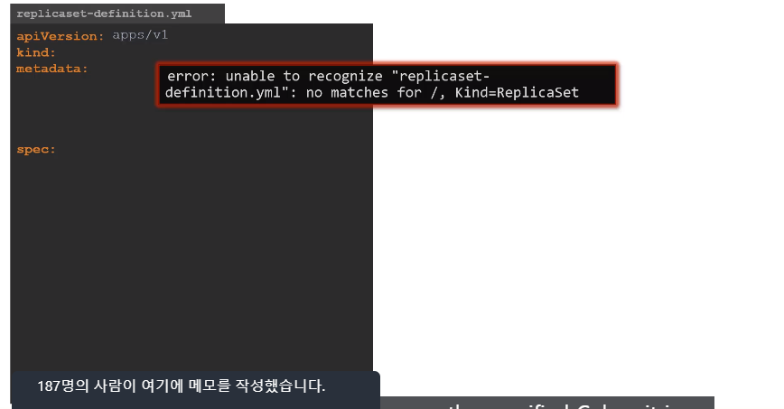
- apiVersion에는 v1이 아닌 apps/v1이 옴. 그냥 v1을 쓰게 되면 오류가 뜸.
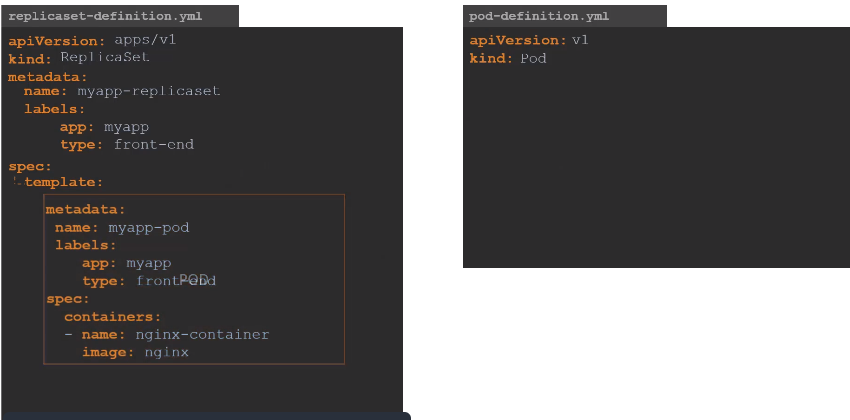
- 레플리케이션 컨트롤러와 다른 점 : selector가 있음.
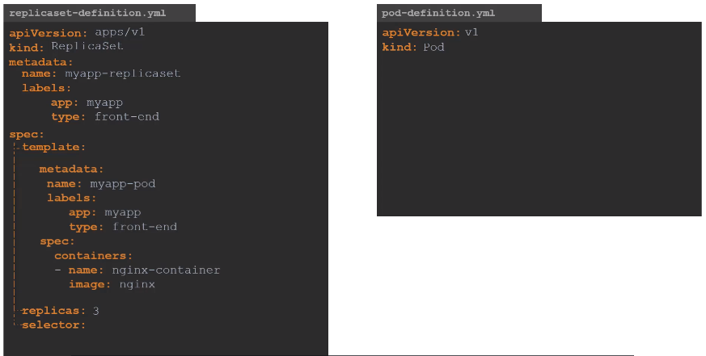
- selector: 어떤 파드가 아래 위치하는지.
- 레플리카 셋은 생성 시 레플리카의 파드로 생성되지 않은 파드도 관리함.
- selector의 labels와 일치하고, 레플리카 셋이 생성되기 전 생성된 파드를 예를 들면, 레플리카 셋은 생성될 때 이 파드들 또한 고려함.
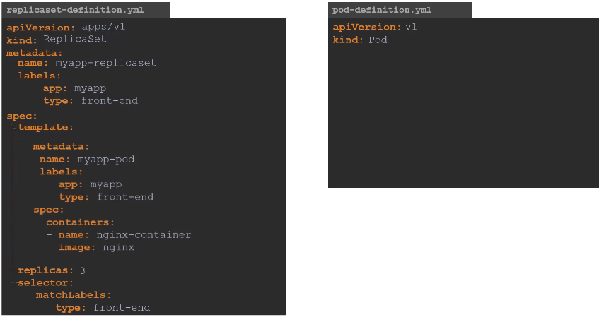
- matchLabels는 간단히 파드의 labels를 명시된 labels에 매칭시킴. 
- 또한, labels 매칭에 대한 많은 옵션을 제공함.
```shell
kubectl create -f replicaset-definition.yml // 레플리카 셋 생성
kubectl get replicaset // 레플리카 셋 목록 조회
kubectl get pods // 레플리카 셋에 의해 생성된 파드 목록 조회
```
## Lables and Selector
### 🔰 왜 파드와 쿠버네티스 객체에 라벨을 붙이는가?
- 세 개의 파드를 보증하는 레플리케이션 컨트롤러 또는 레플리카 셋을 만들었다고 가정함.
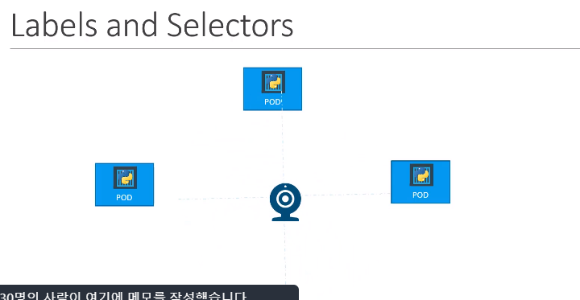
- 레플리케 셋 use case : 존재하는 파드를 모니터링 하는 데 사용할 수 있음.
- 이 사례에서 이미 파드를 생성했다면, 이들은 추후 생성될 레플리카 셋으로부터 만들어진 게 아님.
- 레플리카 셋의 역할은 파드를 모니터하고, 만약 이들이 망가졌을 때 새로운 것을 배치하는 것.
- 레플리카 셋은 파드를 모니터링하는 process 임.
### 🔰 어떻게 레플리카 셋이 어떤 파드를 모니터링하는지 알까?
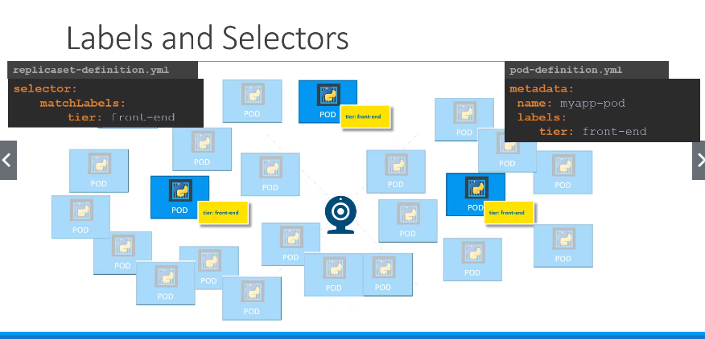
- 서로 다른 애플리케이션에서 수백 개의 다른 클러스터 내 파드가 실행된다고 생각해 보자.
- 생성할 때 지정한 라벨(selector)이 필터링 역할을 해 줌. 
- selector에 지정한 라벨 이름과, 파드에 지정한 라벨이 일치하는지 확인.
- 이 경우, 레플리카 셋은 어떤 파드가 같은 컨셉의 labels와 selector를 가지고 있는지, 모니터링 할건지 알 수 있음. 
### 🔰 같은 시나리오 : 3개의 파드가 있고, 항상 최소 3개의 파드를 모니터링할 것을 보장하는 레플리카 셋을 만들 예정
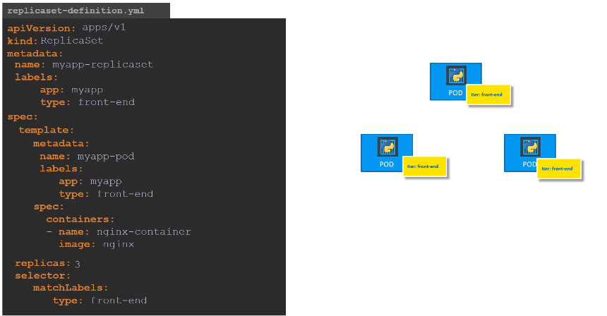
- 레플리카 컨트롤러가 만들어졌을 때, 이는 새로운 인스턴스 파드(labels가 매칭된 세 개의 파드)를 배치시키지 않음.
- 이 경우, 레플리카 셋 설명서의 template session을 제공하는 것이 필요함.
- 레플리카 셋이 배치에 새로운 파드를 생성하는 것을 예상하지 않기 때문에, 파드들 중 하나가 망가지게 되면, 레플리카 셋은 파드의 수를 충족하기 위해 새로운 파드를 생성하고 유지하는 것이 필요하게 됨.
- For `Replica Set` to create a new `pod`, the template definition section is required.
### 🔰 Let's now look at how we scaled the `Replica Set`
- Say we stared with three replicas in the future we decided to scale to six.
- How do we update our `Replica Set` to scale to six replicas?
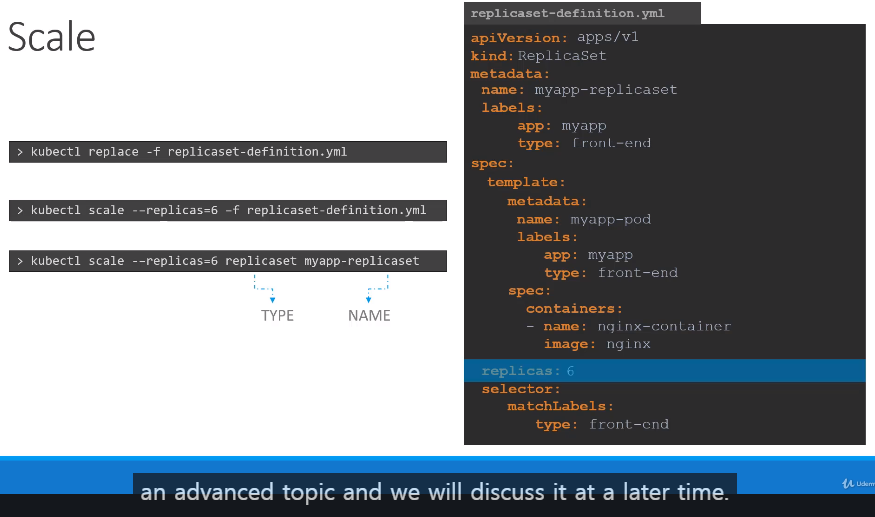
1. First: To update the number of `Replicas` in the definition file to 6.
```shell
// sclale replicas
kubectl replace -f replicaset-definition.yml
```
2. Second: To do it is to run the `kubectl` scale command.
```shell
// use the replicas parameter to provide the new number of replicas and specify the same file as input
# kubectl scal --replicas=[number] [type] [name]
kubectl scale --replicas=6 replicaset-definition.yml
```
- However, Remember that using the file name as input will not result in the number of replicas being updated automatically in the file.
- In other words, the number of `Replicas` on the `Replica Set` definition file will still be three even though you scaled you Replica Set to have six replicas using the `kubectl` scale command and the file as input.
- There are also options available for automatically scaling the Replica Set based on load. (But not this lecture)
### 🔰 Command Review
- This is used to create a `Replica Set` or basically any object in Kuburnetes.
- It is depending on the file we are providing as input.
- You must provide the input file using the -(dash)f parameter.
```shell
kubectl create -f replicaset-definition.yml
```
- Use the `kubectl` get command to see List.
```shell
kubectl get replciaset
```
- Delete `Replica Set` command followed by the name of the Replica Set to delete the Replica Set. (`*Also, deletes all underying PODs`)
```shell
kubectl delete replicaset myapp-replicaset
```
- `kubectl replace command` to replace or update the `Replica Set`.
```shell
kubectl replace -f replciaset-definition.yml
```
- `kubectl scale command` scale Replica Set simply from the command.
```shell
kubectl scale --replicas=6 -f replicaset-definition.yml
```
# 27. Demo - ReplicaSets
- Instruction: The spec section for ReplicaSet has 3 fields: `replicas`, `template`, and `selector`. Simply add these properties. Do not add any values yet.
```yaml
apiVersion: apps/v1
kind: ReplicaSet
metadata:
  name: frontend
  labels:
    app: mywebsite
    tier: frontend
spec:
  replicas:
  template:
  selector:
```
- Let us update the number of `replicas` to `4`.
```yaml
apiVersion: apps/v1
kind: ReplicaSet
metadata:
  name: frontend
  labels:
    app: mywebsite
    tier: frontend
spec:
  replicas: 4
  template:
  selector:
```
- **Introduction:** The template section expects a Pod definition. Luckily, we have the one we created in the precious set of exercises. Next to the replicaset-definition.yml you will now find the same `pod-definition.yml` file that you created before.** Instruction:** Let us now `copy the contents of the pod-definition.yml` file, except for the apiVersion and kind and place it under the `template` section. Take extra care on moving the contents to the right so it falls under template.
```yaml
// pod-definition.yml
apiVersion: v1
kind: Pod
metadata:
  name: myapp-pod
  labels:
    app: myapp
spec:
  containers:
    - name: nginx
      image: nginx
```
```yaml
// replicaset-definition.yml (answer)
apiVersion: apps/v1
kind: ReplicaSet
metadata:
  name: frontend
  labels:
    app: mywebsite
    tier: frontend
spec:
  replicas: 4
  template:
    metadata:
      name: myapp-pod
      labels:
        app: myapp
    spec:
      containers:
        - name: nginx
          image: nginx
  selector:
```
- **Introduction:** Let us now link the pods to the ReplicaSet by updating selectors.** Instruction: **Add a property `matchLables` under selector and copy the labels defined in the pod-definition under it.** Note:** This may not work in play-with-k8s as it runs on 1.8 version of kubernetes. ReplicaSets moved to apps/v1 in 1.9 version of kubernetes.
```yaml
// pod-definition.yml
apiVersion: v1
kind: Pod
metadata:
  name: myapp-pod
  labels:
    app: myapp
spec:
  containers:
    - name: nginx
      image: nginx
```
```yaml
// replicaset-definition.yml
apiVersion: apps/v1
kind: ReplicaSet
metadata:
  name: frontend
  labels:
    app: mywebsite
    tier: frontend
spec:
  replicas: 4
  template:
    metadata:
      name: myapp-pod
      labels:
        app: myapp
    spec:
      containers:
        - name: nginx
          image: nginx
  selector:
    matchLabels:
      app: myapp
```
# 28. Hands-On Labs
- [https://kodekloud.com/courses/1120660/lectures/24008576](https://kodekloud.com/courses/1120660/lectures/24008576)
# 29. Solution - ReplicaSets
- How many ReplicaSets exist on the system? In the current(default) namespace.
```yaml
# kubectl get replicasets.apps 
-------------------------------
No resources found in default namespace.
```
- How about now? How many ReplicaSets do you see? We just made a few changes!
```yaml
# kubectl get replicasets.apps 
-------------------------------
NAME              DESIRED   CURRENT   READY   AGE
new-replica-set   4         4         0       6s
```
- How many PODs are DESIRED in the `new-replica-set`? ⇒ `4`
```yaml
# kubectl get pods
-------------------------------
NAME                    READY   STATUS         RESTARTS   AGE
new-replica-set-6b4gc   0/1     ErrImagePull   0          70s
new-replica-set-hz4j9   0/1     ErrImagePull   0          70s
new-replica-set-qjd56   0/1     ErrImagePull   0          70s
new-replica-set-wfgpl   0/1     ErrImagePull   0          70s
```
- What is the image used to create the pods in the `new-replica-set`? ⇒ `busybox777`
- How many PODs are READY in the `new-replica-set`? ⇒ `0 Running / 4 Waiting / 0 Succeeded / 0 Failed`
```yaml
# kubectl describe replicasets.apps new-replica-set 
-------------------------------
Name:         new-replica-set
Namespace:    default
Selector:     name=busybox-pod
Labels:       <none>
Annotations:  <none>
Replicas:     4 current / 4 desired
Pods Status:  0 Running / 4 Waiting / 0 Succeeded / 0 Failed
Pod Template:
  Labels:  name=busybox-pod
  Containers:
   busybox-container:
    Image:      busybox777
    Port:       <none>
    Host Port:  <none>
    Command:
      sh
      -c
      echo Hello Kubernetes! && sleep 3600
    Environment:  <none>
    Mounts:       <none>
  Volumes:        <none>
Events:
  Type    Reason            Age   From                   Message
  ----    ------            ----  ----                   -------
  Normal  SuccessfulCreate  19m   replicaset-controller  Created pod: new-replica-set-hz4j9
  Normal  SuccessfulCreate  19m   replicaset-controller  Created pod: new-replica-set-6b4gc
  Normal  SuccessfulCreate  19m   replicaset-controller  Created pod: new-replica-set-wfgpl
  Normal  SuccessfulCreate  19m   replicaset-controller  Created pod: new-replica-set-qjd56
```
- Why do you think the PODs are not ready? ⇒ `image busybox777 doen't exist / Failed to pull image "busybox777"`
```yaml
# kubectl describe pod new-replica-set-6b4gc 
-------------------------------
Name:         new-replica-set-6b4gc
Namespace:    default
Priority:     0
Node:         controlplane/10.222.207.8
Start Time:   Tue, 04 May 2021 06:30:08 +0000
Labels:       name=busybox-pod
Annotations:  <none>
Status:       Pending
IP:           10.244.0.6
IPs:
  IP:           10.244.0.6
Controlled By:  ReplicaSet/new-replica-set
Containers:
  busybox-container:
    Container ID:  
    Image:         busybox777
    Image ID:      
    Port:          <none>
    Host Port:     <none>
    Command:
      sh
      -c
      echo Hello Kubernetes! && sleep 3600
    State:          Waiting
      Reason:       ImagePullBackOff
    Ready:          False
    Restart Count:  0
    Environment:    <none>
    Mounts:
      /var/run/secrets/kubernetes.io/serviceaccount from default-token-7w7gp (ro)
Conditions:
  Type              Status
  Initialized       True 
  Ready             False 
  ContainersReady   False 
  PodScheduled      True 
Volumes:
  default-token-7w7gp:
    Type:        Secret (a volume populated by a Secret)
    SecretName:  default-token-7w7gp
    Optional:    false
QoS Class:       BestEffort
Node-Selectors:  <none>
Tolerations:     node.kubernetes.io/not-ready:NoExecute op=Exists for 300s
                 node.kubernetes.io/unreachable:NoExecute op=Exists for 300s
Events:
  Type     Reason     Age                 From               Message
  ----     ------     ----                ----               -------
  Normal   Scheduled  21m                 default-scheduler  Successfully assigned default/new-replica-set-6b4gc to controlplane
  Normal   Pulling    19m (x4 over 21m)   kubelet            Pulling image "busybox777"
  Warning  Failed     19m (x4 over 21m)   kubelet            Failed to pull image "busybox777": rpc error: code = Unknown desc = Error response from daemon: pull access denied for busybox777, repository does not exist or may require 'docker login': denied: requested access to the resource is denied
  Warning  Failed     19m (x4 over 21m)   kubelet            Error: ErrImagePull
  Warning  Failed     10m (x42 over 20m)  kubelet            Error: ImagePullBackOff
  Normal   BackOff    58s (x87 over 20m)  kubelet            Back-off pulling image "busybox777"
```
- Delete any one of the 4 PODs. How many PODs exist now? ⇒ `(After deleted, it has created new pods)4`
```yaml
# kubectl get pods
-------------------------------
NAME                    READY   STATUS             RESTARTS   AGE
new-replica-set-dcx57   0/1     ImagePullBackOff   0          79s
new-replica-set-qr9rr   0/1     ImagePullBackOff   0          56s
new-replica-set-rdxhr   0/1     ImagePullBackOff   0          20s
new-replica-set-wfgpl   0/1     ImagePullBackOff   0          25m
```
- Why are there still 4 PODs, even after you deleted one? ⇒ `ReplicaSet ensures that desired number of PODs always run`
- Create a ReplicaSet using the `replicaset-definition-1.yaml` file located at `/root/`. There is an issue with the file, so try to fix it. ⇒ v1에 해당하는 버전이 없기 때문에 에러가 남.
```yaml
# kubectl apply -f replicaset-definition-1.yaml
-------------------------------
error: unable to recognize "replicaset-definition-1.yaml": no matches for kind "ReplicaSet" in version "v1"

# vi replicaset-definition-1.yaml
-------------------------------
apiVersion: apps/v1
kind: ReplicaSet
metadata:
  name: replicaset-1
spec:
  replicas: 2
  selector:
    matchLabels:
      tier: frontend
  template:
    metadata:
      labels:
        tier: frontend
    spec:
      containers:
      - name: nginx
        image: nginx

# kubectl apply -f replicaset-definition-1.yaml 
-------------------------------
replicaset.apps/replicaset-1 created
```
- Fix the issue in the `replicaset-definition-2.yaml` file and create a `ReplicaSet` using it. This file is located at `/root/`.
```yaml
# vi replicaset-definition-2.yaml
-------------------------------
apiVersion: apps/v1
kind: ReplicaSet
metadata:
  name: replicaset-2
spec:
  replicas: 2
  selector:
    matchLabels:
      tier: frontend
  template:
    metadata:
      labels:
        tier: frontend
    spec:
      containers:
      - name: nginx
        image: nginx

# kubectl apply -f replicaset-definition-2.yaml 
-------------------------------
replicaset.apps/replicaset-2 created

kubectl get replicasets.apps 
-------------------------------
NAME              DESIRED   CURRENT   READY   AGE
new-replica-set   4         4         0       36m
replicaset-1      2         2         2       4m4s
replicaset-2      2         2         2       43s
```
- Delete the two newly created ReplicaSets - `replicaset-1` and `replicaset-2`
```yaml
# kubectl delete replicasets.apps replicaset-1
replicaset.apps "replicaset-1" deleted
# kubectl delete replicasets.apps replicaset-2
replicaset.apps "replicaset-2" deleted
```
- Fix the original replica set `new-replica-set` to use the correct `busybox` image. Either delete and recreate the ReplicaSet or Update the existing ReplicaSet and then delete all PODs, so new ones with the correct image will be created.
```yaml
# kubectl get replicasets.apps 
-------------------------------
NAME              DESIRED   CURRENT   READY   AGE
new-replica-set   4         4         0       38m

# kubectl edit replicasets.apps new-replica-set 
-------------------------------
replicaset.apps/new-replica-set edited

# Please edit the object below. Lines beginning with a '#' will be ignored,
# and an empty file will abort the edit. If an error occurs while saving this file will be
# reopened with the relevant failures.
#
apiVersion: apps/v1
kind: ReplicaSet
metadata:
  creationTimestamp: "2021-05-04T06:30:08Z"
  generation: 1
  name: new-replica-set
  namespace: default
  resourceVersion: "3007"
  uid: 783f9059-d127-4f4a-9fa0-15ba1c2a5916
spec:
  replicas: 4
  selector:
    matchLabels:
      name: busybox-pod
  template:
    metadata:
      creationTimestamp: null
      labels:
        name: busybox-pod
    spec:
      containers:
      - command:
        - sh
        - -c
        - echo Hello Kubernetes! && sleep 3600
        image: busybox
        imagePullPolicy: Always
        name: busybox-container
        resources: {}
        terminationMessagePath: /dev/termination-log
        terminationMessagePolicy: File
      dnsPolicy: ClusterFirst
      restartPolicy: Always
      schedulerName: default-scheduler
      securityContext: {}
      terminationGracePeriodSeconds: 30
status:
  fullyLabeledReplicas: 4
  observedGeneration: 1
  replicas: 4
```
- Scale the ReplicaSet to 5 PODs. Use `kubectl scale` command or edit the replicaset using `kubectl edit replicaset`.
```yaml
# kubectl scale replicaset --replicas=5 new-replica-set 
-------------------------------
replicaset.apps/new-replica-set scaled
```
- Now scale the ReplicaSet down to 2 PODs. Use the `kubectl scale` command or edit the replicaset using `kubectl edit replicaset`.
```yaml
# kubectl scale replicaset --replicas=2 new-replica-set 
-------------------------------
replicaset.apps/new-replica-set scaled

root@controlplane:~# kubectl get pods
-------------------------------
NAME                    READY   STATUS        RESTARTS   AGE
new-replica-set-5hhb8   1/1     Terminating   0          91s
new-replica-set-6zzsw   1/1     Running       0          5m14s
new-replica-set-9cn74   1/1     Terminating   0          4m47s
new-replica-set-b5tns   1/1     Terminating   0          4m58s
new-replica-set-jlnxp   1/1     Running       0          5m6s
```
# 30. Deployments
### 🔰 How you might want to deploy your application in a production envrionment?
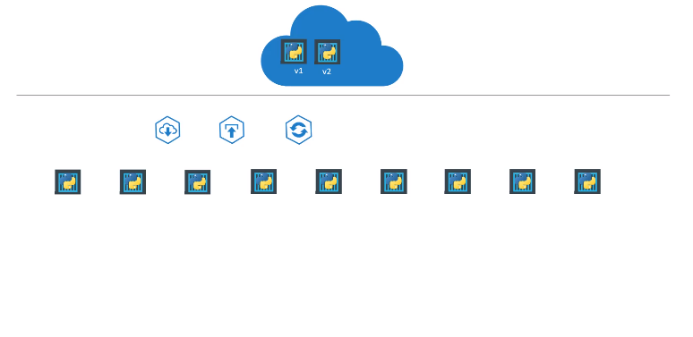
- For example, you have a web server that needs to be deployed in a production environment.
	1. You need not one, but many such instances of the web server running.
	2. Whenever newer versions of application builds become available on the docker registry, you would like to upgrade your docker instances seamlessly.
	3. However, when you upgrade your instances you do not want to upgrade all of them at once as we just did. This my impact users accessing your applications so you might want to upgrade them one after the other and that kind of upgrade is known as `rolling updates`.
	4. Suppose one of the upgrades you performed resulted in an unexpected error and you're asked to undo the recent change, you would like to be able to roll back the changes that were recently carried out.
	5. Finally, For example you would like to make multiple changes to your environment such as upgrading the underlying Web Server version as well as scaling your environment and also modifying the resource allocations etc.
	6. You don't want to apply each change immediately after the command is run, instead you like to apply a pause to your environment.
	7. Make the changes and then resumes so that all the changes are rolled out together.
	8. All of these capabilities are available with the Kubernetes deployments.
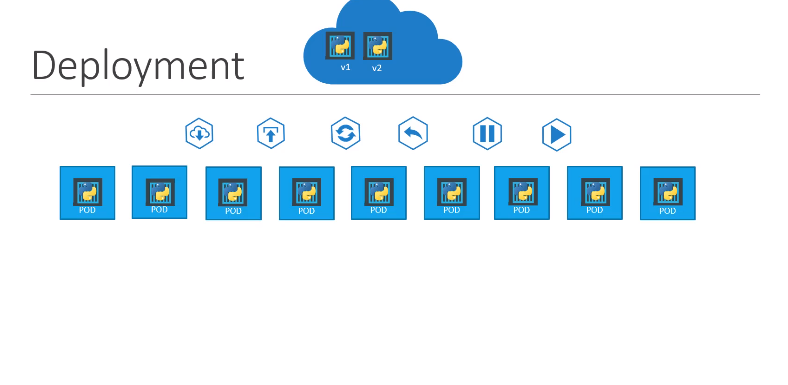
- We discussed about pods which deploy single instances of our application such as the web application in this case. Each container is encapsulated in pods.
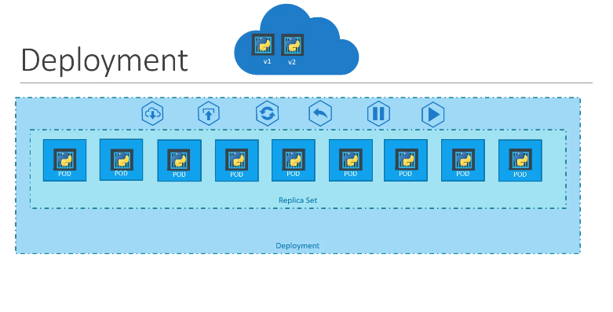
- Multiple such pods are deployed using replication controllers or Replica Set and then comes deployment which is a Kubernetes object that comes higher in the hierarchy.
- The deployment provides us with the capability to upgrade the underlying instances seamlessly using rolling updates, undo changes and pause and resume changes as required.
### 🔰 How do we create a deployment?
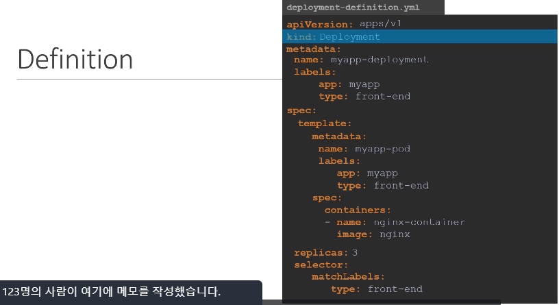
- As with the previous components we first create the deployment definition file, the contents of the deployment definition file are exactly similar to the Replica Set definition file, except for the kink which is now going to be deployment.
```yaml
kubectl create -f deployment-definition.yml
```
- The template has a pod definition inside it once the file is ready run the `kubectl` create command. And, specify the deployment definition file.
```yaml
kubectl get deployments
```
- Then run the `kubectl` get deployments command to see the newly created deployment. The deployment automatically creates a Replica Set.
```yaml
kubectl get replicaset
```
- So, if you run the `kubectl` get Replica Set command you will be able to see a new Replica Set in the name of the deployment.
```yaml
kubectl get pods
```
- The replica Set ultimately create pods. So if you run the `kubectl` get pods command. You will be able to see the pod with the name of the deployment and the Replica Set.
- So far pods hasn't been much of a difference between replica set and deployments, except for the fact that deployment created a new Kubernetes object called deployments. 
- We will see how to take advantage of the deployment using the use cases we discussed in the previous slide in the upcoming lectures.
### 🔰 Commands
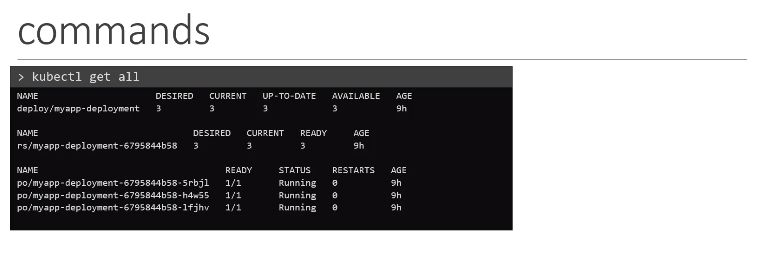
```yaml
kubectl get all
```
- In this case, we can see that the deployment was created and then we have the Replica Set followed by three pods that were created as part of the deployment.
# 31. Demo - Deployments
- **Introduction:** Let us now add values for metadata. **Instruction:** Name the Deployment frontend. And add labels **app ⇒ mywebsite** and **tier ⇒ frontend**.
```yaml
apiVersion: apps/v1
kind: Deployment
metadata:
  name: frontend
  labels:
    app: mywebsite
    tier: frontend
spec:
```
- **Introduction:** The template section expects a Pod definition. Luckily, we have the one we created in the previous set of exercises. Next to the deployment-defifnition.yml you will now find the same pod-definition.yml file that you created before. **Instruction:** Let us now **copy the contents of the pod-definition.yml** file, except for the apiVersion and kind and **place it under the template** section. Take extra care on moving the contents to the right so it falls under template.
```yaml
// pod-definition.yml
apiVersion: v1
kind: Pod
metadata:
  name: myapp-pod
  labels:
    app: myapp
spec:
  containers:
    - name: nginx
      image: nginx
```
```yaml
// deployment-definition.yml
apiVersion: apps/v1
kind: Deployment
metadata:
  name: frontend
  labels:
    app: mywebsite
    tier: frontend
spec:
  replicas: 4
  template:
    metadata:
      name: myapp-pod
      labels:
        app: myapp
    spec:
      containers:
        - name: nginx
          image: nginx
  selector:
```
- **Introduction: **Let us now link the pods to the pods to the Deployment by updating selectors. Instruction: Add a property **"matchLabels"** under** selector** and copy the labels defined in the pod-definition under it. **Note: **this may not work in play-with-k8s as it runs on 1.8 version of kubernetes.
```yaml
// pod-definition.yml
apiVersion: v1
kind: Pod
metadata:
  name: myapp-pod
  labels:
    app: myapp
spec:
  containers:
    - name: nginx
      image: nginx
```
```yaml
// deployment-definition.yml
apiVersion: apps/v1
kind: Deployment
metadata:
  name: frontend
  labels:
    app: mywebsite
    tier: frontend
spec:
  replicas: 4
  template:
    metadata:
      name: myapp-pod
      labels:
        app: myapp
    spec:
      containers:
        - name: nginx
          image: nginx
  selector:
    matchLabels:
      app: myapp
```
# 32. Hands-On Labs
- [https://kodekloud.com/courses/1120660/lectures/24008580](https://kodekloud.com/courses/1120660/lectures/24008580)
# 33. Solution - Deployments
- How many Deployments exist on the system now? We just created a Deployment! Check again! ⇒ `1`
```shell
# kubectl get deployments.apps 
------------------------------
NAME                  READY   UP-TO-DATE   AVAILABLE   AGE
frontend-deployment   0/4     4            0           5s
```
- What is the image used to create the pods in the new deployment? ⇒ `busybox888`
```shell
# kubectl describe deployments.apps frontend-deployment 
------------------------------
Name:                   frontend-deployment
Namespace:              default
CreationTimestamp:      Tue, 04 May 2021 08:13:10 +0000
Labels:                 <none>
Annotations:            deployment.kubernetes.io/revision: 1
Selector:               name=busybox-pod
Replicas:               4 desired | 4 updated | 4 total | 0 available | 4 unavailable
StrategyType:           RollingUpdate
MinReadySeconds:        0
RollingUpdateStrategy:  25% max unavailable, 25% max surge
Pod Template:
  Labels:  name=busybox-pod
  Containers:
   busybox-container:
    Image:      busybox888
    Port:       <none>
    Host Port:  <none>
    Command:
      sh
      -c
      echo Hello Kubernetes! && sleep 3600
    Environment:  <none>
    Mounts:       <none>
  Volumes:        <none>
Conditions:
  Type           Status  Reason
  ----           ------  ------
  Available      False   MinimumReplicasUnavailable
  Progressing    True    ReplicaSetUpdated
OldReplicaSets:  <none>
NewReplicaSet:   frontend-deployment-56d8ff5458 (4/4 replicas created)
Events:
  Type    Reason             Age    From                   Message
  ----    ------             ----   ----                   -------
  Normal  ScalingReplicaSet  3m32s  deployment-controller  Scaled up replica set frontend-deployment-56d8ff5458 to 4
```
- Why do you think the deployment is not ready? ⇒ `image doesn't exist`
```shell
# kubectl get pods
------------------------------
NAME                                   READY   STATUS             RESTARTS   AGE
frontend-deployment-56d8ff5458-8cpdg   0/1     ImagePullBackOff   0          5m51s
frontend-deployment-56d8ff5458-8fg4d   0/1     ImagePullBackOff   0          5m51s
frontend-deployment-56d8ff5458-mfzjd   0/1     ImagePullBackOff   0          5m51s
frontend-deployment-56d8ff5458-p98zc   0/1     ImagePullBackOff   0          5m51s

root@controlplane:~# kubectl describe pod frontend-deployment-56d8ff5458-mfzjd 
------------------------------
Name:         frontend-deployment-56d8ff5458-mfzjd
Namespace:    default
Priority:     0
Node:         controlplane/10.224.93.6
Start Time:   Tue, 04 May 2021 08:13:11 +0000
Labels:       name=busybox-pod
              pod-template-hash=56d8ff5458
Annotations:  <none>
Status:       Pending
IP:           10.244.0.4
IPs:
  IP:           10.244.0.4
Controlled By:  ReplicaSet/frontend-deployment-56d8ff5458
Containers:
  busybox-container:
    Container ID:  
    Image:         busybox888
    Image ID:      
    Port:          <none>
    Host Port:     <none>
    Command:
      sh
      -c
      echo Hello Kubernetes! && sleep 3600
    State:          Waiting
      Reason:       ImagePullBackOff
    Ready:          False
    Restart Count:  0
    Environment:    <none>
    Mounts:
      /var/run/secrets/kubernetes.io/serviceaccount from default-token-sk25p (ro)
Conditions:
  Type              Status
  Initialized       True 
  Ready             False 
  ContainersReady   False 
  PodScheduled      True 
Volumes:
  default-token-sk25p:
    Type:        Secret (a volume populated by a Secret)
    SecretName:  default-token-sk25p
    Optional:    false
QoS Class:       BestEffort
Node-Selectors:  <none>
Tolerations:     node.kubernetes.io/not-ready:NoExecute op=Exists for 300s
                 node.kubernetes.io/unreachable:NoExecute op=Exists for 300s
Events:
  Type     Reason     Age                    From               Message
  ----     ------     ----                   ----               -------
  Normal   Scheduled  6m3s                   default-scheduler  Successfully assigned default/frontend-deployment-56d8ff5458-mfzjd to controlplane
  Normal   Pulling    4m23s (x4 over 5m59s)  kubelet            Pulling image "busybox888"
  Warning  Failed     4m22s (x4 over 5m58s)  kubelet            Failed to pull image "busybox888": rpc error: code = Unknown desc = Error response from daemon: pull access denied for busybox888, repository does not exist or may require 'docker login': denied: requested access to the resource is denied
  Warning  Failed     4m22s (x4 over 5m58s)  kubelet            Error: ErrImagePull
  Normal   BackOff    4m12s (x6 over 5m57s)  kubelet            Back-off pulling image "busybox888"
  Warning  Failed     48s (x21 over 5m57s)   kubelet            Error: ImagePullBackOff
```
- Create a new Deployment using the `deployment-definition-1.yaml` file located at `/root/`. There is an issue with the file, so try to fix it.
```shell
# kubectl apply -f deployment-definition-1.yaml 
------------------------------
Error from server (BadRequest): error when creating "deployment-definition-1.yaml": deployment in version "v1" cannot be handled as a Deployment: no kind "deployment" is registered for version "apps/v1" in scheme "k8s.io/kubernetes/pkg/api/legacyscheme/scheme.go:30"

# vi deployment-definition-1.yaml
------------------------------
apiVersion: apps/v1
kind: Deployment
metadata:
  name: deployment-1
spec:
  replicas: 2
  selector:
    matchLabels:
      name: busybox-pod
  template:
    metadata:
      labels:
        name: busybox-pod
    spec:
      containers:
      - name: busybox-container
        image: busybox888
        command:
        - sh
        - "-c"
        - echo Hello Kubernetes! && sleep 3600

# kubectl apply -f deployment-definition-1.yaml 
------------------------------
deployment.apps/deployment-1 created
```
- Create a new Deployment with the below attributes using your own deployment definition file.
Name: `httpd-frontend`; Replicas: `3`; Image: `httpd:2.4-alpine`.
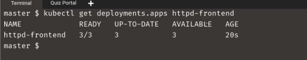
```shell
# kubectl create deployment httpd-frontend --image=httpd:2.4-alpine
------------------------------
deployment.apps/httpd-frontend created

# kubectl scale deployment --replicas=3 httpd-frontend 
------------------------------
deployment.apps/httpd-frontend scaled
```
# 34. Deployments - Update and Rollback
### 🔰 Rollout and Versioning
- Before we look at how we upgrade our application, let's try to understand rollouts and versioning in a deployment.
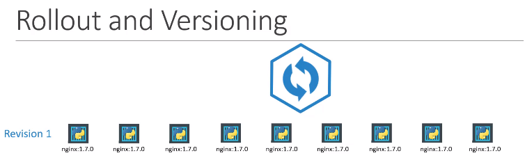
- When you first create a deployment, it triggers a rollout, a new rollout creates a new deployment revision(`Revision 1`).
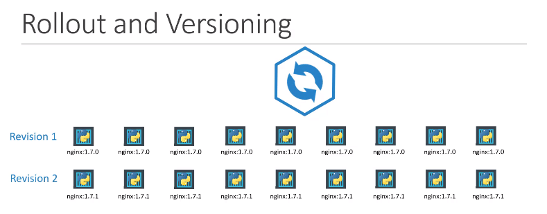
- In the future, when the application is upgraded, meaning when the container version is updated to a new one.
- A new rollout is triggered and a new deployment revision is created named `Revision 2`.
- This helps us keep track of the changes made to our deployment and enables us to roll back to a previous version of deployment if necessary.
### 🔰 Rollout Command
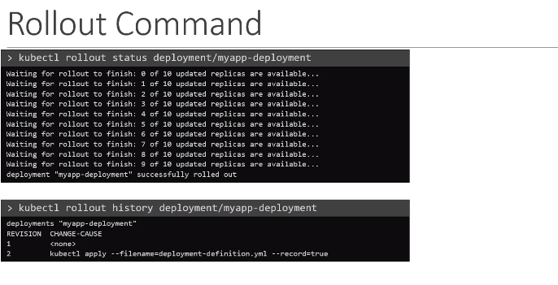
```shell
kubectl rollout status deployment/myapp-deploym
```
- You can see the status of your rollout by running the command `kubectl` rollout status, followed by the name of the deployment to see the revisions and history of rollout from the `kubectl` rollout history command, followed by the deployment name.
```shell
kybectl rollout history deployment/myapp-deployment
```
- And this will show you the revisions and history of our deployment.
### 🔰 Deployment Strategy
- For example, you have five replicas of your Web application instance deployed.
	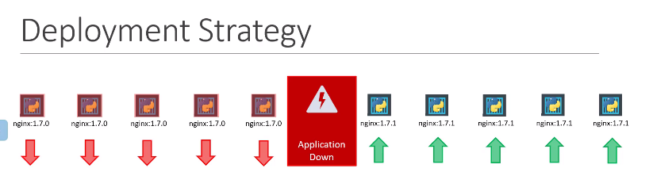
	1. First Strategy: To upgrade these to a newer version is to destroy all of these and then create newer version of application instances, meaning first destroy the five running instances and then deploy five new instances of the new application version.
		- The problem with this, as you can imagine, is that during the period after the older versions are down and before any newer version is up, the application is down and inaccessible to users.
		- This strategy is known as the recreate strategy and thankfully this is not the default deployment strategy.
	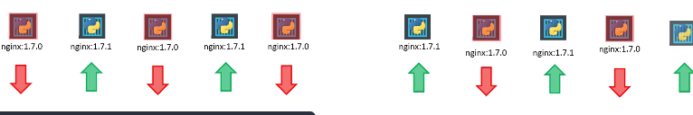
	2.  Second Strategy: Where we did not destroy all of them at once.
		Instead, we take down the older version and bring up a newer version, one by one.
		- This way, the application never goes down and the upgrade is seamless.
		- Remember, if you do not specify a strategy while creating the deployment, it will assume it to be rolling update.
		- In other words, rolling update is the default deployment strategy.
### 🔰kubectl apply
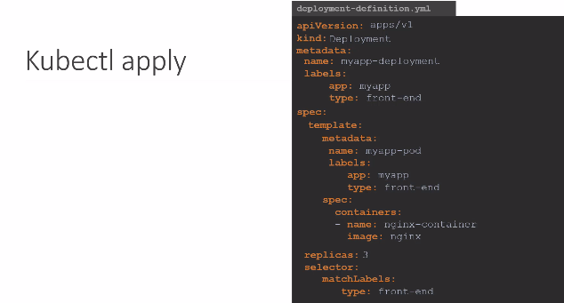
- How exactly do you update your deployment when I say update, it could be different things, such as updating your application version by updating the version of docker containers used, updating their labels or updating the number of replicas, etc.
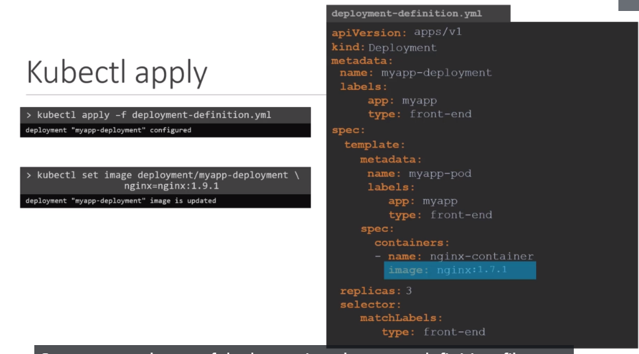
- Since we already have a deployment definition file, it is easy for us to modify this file.
```shell
kybectl apply -f deployment-definition.yml
```
- Once we make the necessary changes, we run the kubectl apply command to apply the changes.
- A new rollout is triggered and a new revision of the deployment is created, but there is another way to do the same thing.
```shell
kubectl set image deployment/myapp-deployment \
	nginx=nginx:1.9.1
```
- You could use to `kubectl set image` command to update the image of your application.
- But remember, doing it this way will result in the deployment definition file having a different configuration.
- So, you must be careful when using the same definition file to make changes in the future.
### 🔰 Recreate vs RollingUpdate
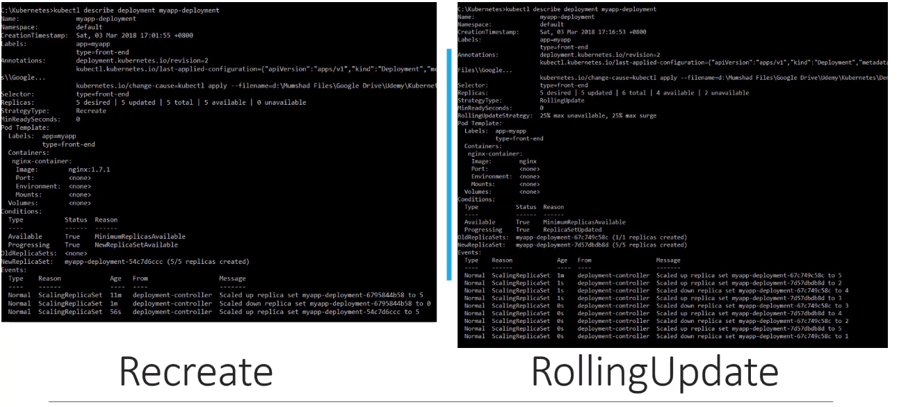
- The difference between the recreate and rolling update strategies can also be seen when you view the deployments in detail.
- From the `kubectl`, describe deployment command to see the detailed information regarding the deployments.
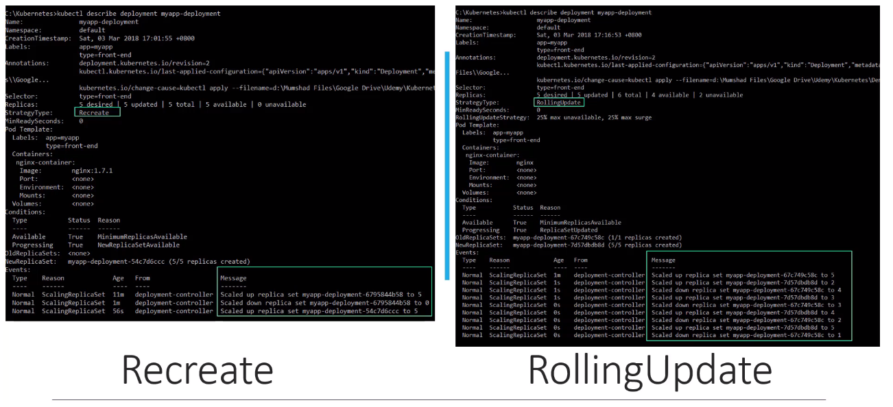
- You will notice when the recreated strategy was used, the events indicate that the old Replica Set scaled down to zero first and then the new Replica Sets scaled up to five.
- However, when the rolling update strategy was used, the old Replica Set was scaled down one at a time, simultaneously scaling up the new Replica Set, on at a time.
## How a deployment performs an upgrade under the hood?
### 🔰 Upgrades
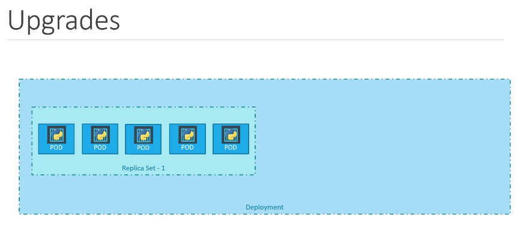
- When a new deployment is created, to deploy five replicas, it first created a Replica Set automatically, which in turn creates the number of pods required to meet the number of replicas.
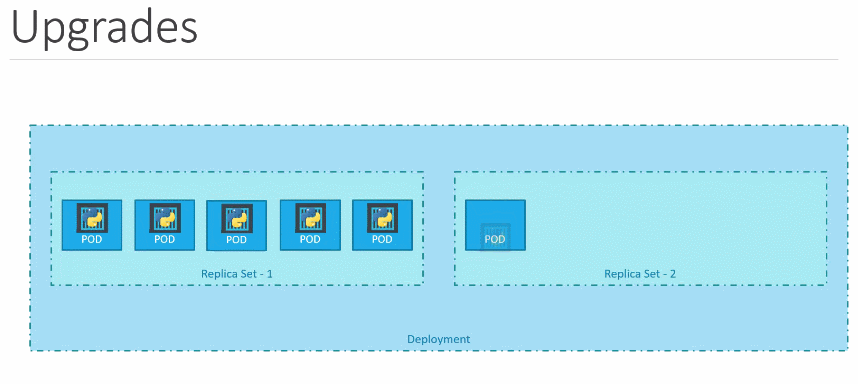
- When you upgrade your application, as we saw in the previous slide, the kubernetes deployment object creates a new Replica Set under the hood and starts deploying the containers there.
- At the same time, taking down the pods(Red Color) int the old Replica Set following a rolling update strategy.
```javascript
kubectl get replicasets
```
- This can be seen when you try to list the Replica Sets using the `kubectl get replicasets` Command. 
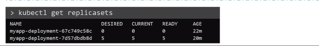
- Here we see the `old Replica Set` with `zero pod` and the `new Replica Set` with `five pods`.
### 🔰 Rollback
- For instance, once you upgrade your application, you realize something isn't very right. Something's wrong with the new version of build you used to upgrade.
- So, you would like to roll back your update.
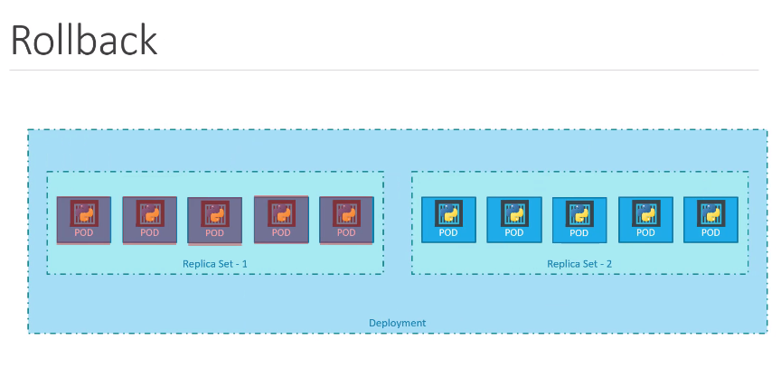
```javascript
kubectl rollout undo deployment/myapp-deployment
```
- Kubernetes deployments allow you to roll back to a previous revision to undo a change, run the `kubectl rollout undo` Command followed by the deployment name.
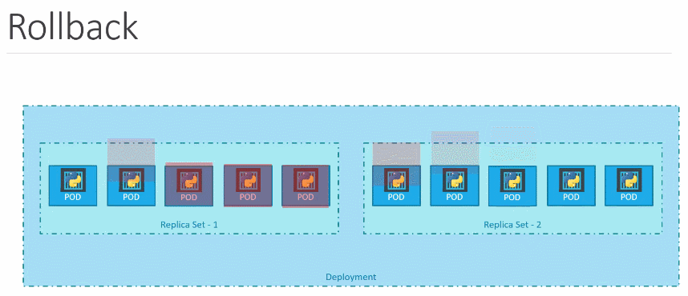
- The deployment will then destroy the pod in the new Replica Set and bring the older ones up in the old Replica Set.
- When you compare the output of the `kubectl get replicaset` Command, before and after the roll back, you will be able to notice the difference.
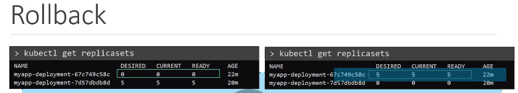
- Before the roll back, the first Replica Set had zero pod, and new Replica Set had fice pods. And this is reversed after the rollback is finished.
## Summerize Commands
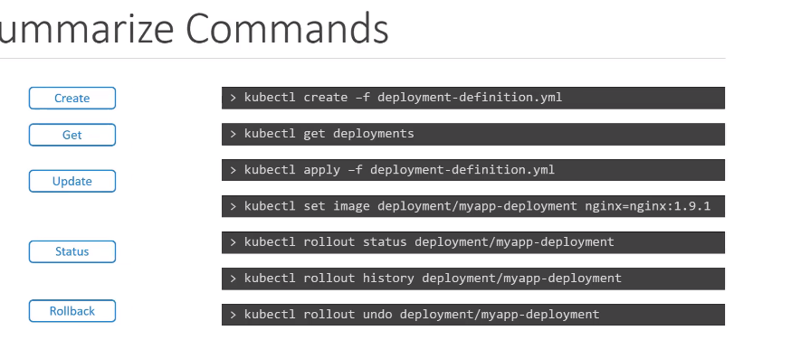
- `kubectl create`: to create the deployment
- `kubectl get deployments`: to list the deployments
- `kubectl apply`, `kubectl set image`: to update the deployments
- `kubectl rollout status`: to see the status of rollout
- `kubectl rollout undo`: to rollback a deployment operation
# 35. Demo - Deployments - Update and Rollback
-  생략
# 36. Connect with Me!
- 생략
