<table_of_contents color="gray"/>
# \[Section 7\]: Networking in Kubernetes
# 37. Basics of Networking in Kubernetes
## Basics of networking in Kubernetes
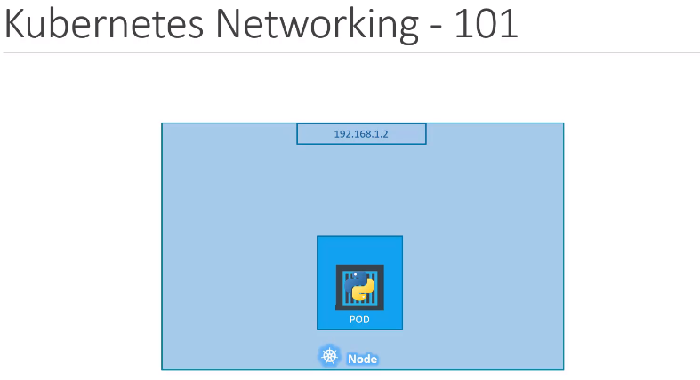
- We will start with a single node, kubernetes cluster.
- The node has an IP address, say it is 192.168.1.2
- In this case, this is the IP address we use to access the Kubernetes node SSH into it, etc.
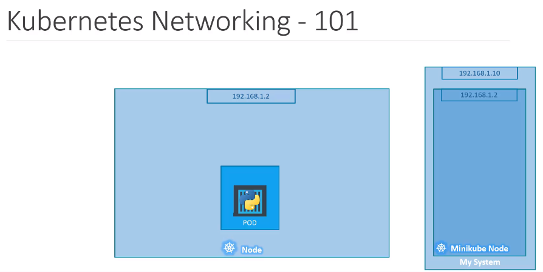
- On a side node, remember, if you're using a `minikube` setup that I'm talking about, the IP address of the `minikube` virtual machine inside your hypervisor, your laptop may be having a different IP like 192.168.1.10
- So it's important to understand how your volumes are setup.
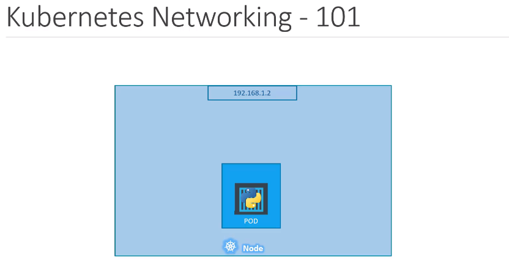
- So on the single node, kubernetes cluster. We have created a single pod, as you know.
- A pod hosts a container, unlike in the Docker world, where an IP address is always assigned to a Docker container in the kubernetes world.
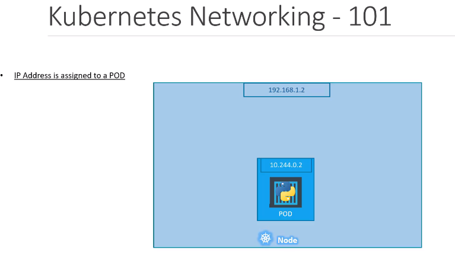
- The IP address is assigned to a pod.
- Each pod in the kubernetes gets its own internal IP address.
- In this case, it's in the range 10.244 series, And the IP assigned to the pod is 10.244.0.2
### 🔰 So, How it is getting this IP address when Kubernetes is initially configured?
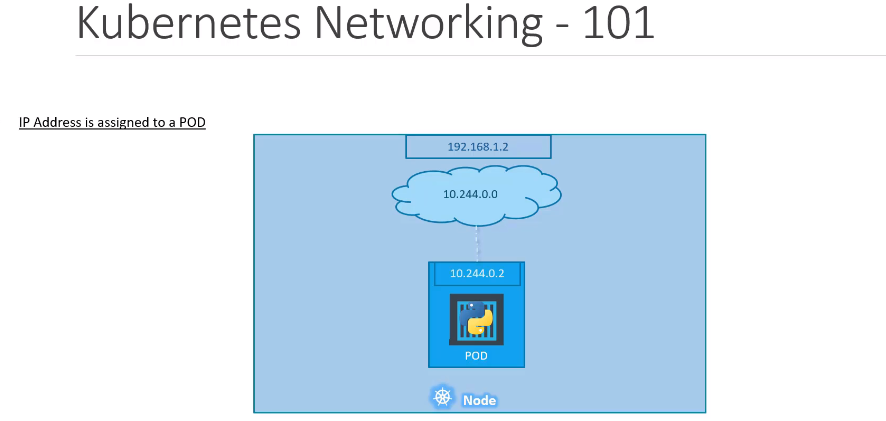
- We create an internal private network with the address 10.244.0.0. and all the pods are attached to it.
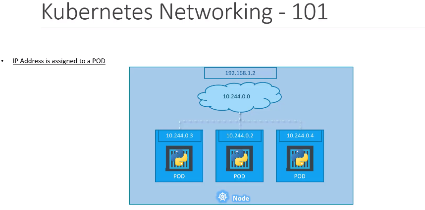
- When you deploy multiple pods, they all get a separate IP assigned from this network.
- The pods can communicate to each other through this IP, but accessing the other pods using this internal IP address may not be a good idea as it's subject to change when pods are recreated.
- We will see better ways to establish communication between pods in a while. (For now, it's important to understand how the internal networking works in Kubernetes)
### 🔰 How does it work when you multiple nodes in your cluster?
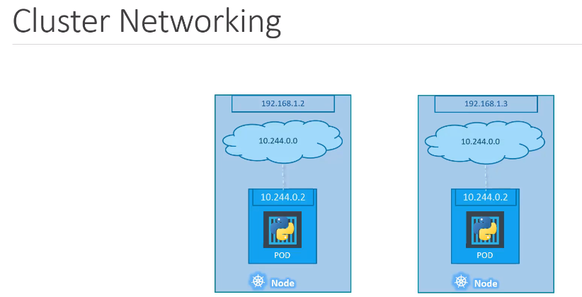
- In this case, we have two nodes running Kubernetes and they have IP addresses 192.168.1.2(3) assigned to them. (Note that they are not part of the cluster yet)
- Each of them has a single pod deployed, has discussed in the previous slide, These pods are attached to an internal network and they have their own IP addresses assigned.
- However, if you look at the internal network addresses, you can see that they are the same.
- The tow network have an address 10.244.0.0, and the pods deployed have the same address too.
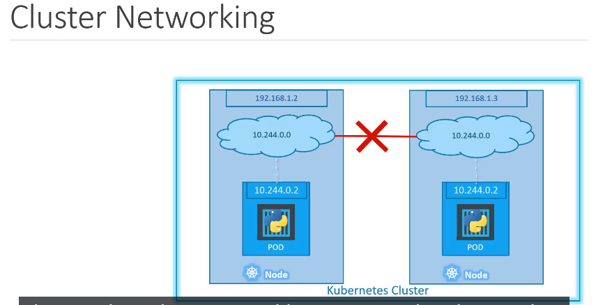
- This is not going to work well when the nodes are part of the same cluster.
- The pods have the same IP addresses assigned the them, and that will lead to IP conflicts in the network.
- Now, that's one problem when a Kubernetes cluster is set up. Kubernetes does not automatically set up any kind of networking to handle these issues.
- As a matter of fact, Kubernetes expects us to set up networking to meet certain fundamental requirements.
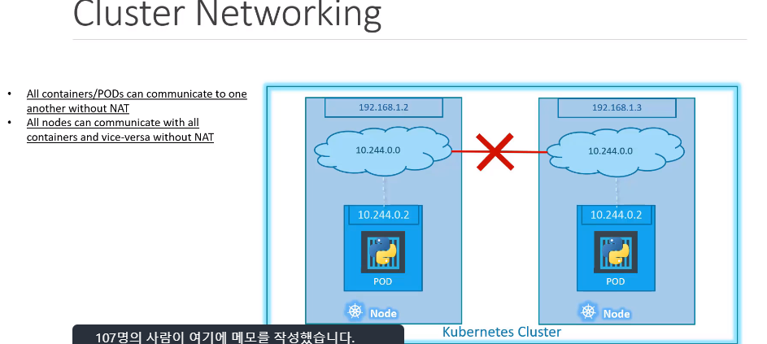
- Some of these are that all the containers or pods in a Kubernetes cluster must be able to communicate with one another without having to configure net.
- All nodes must be able to communicate with containers and all containers must be able to communicate with the nodes in the cluster.
- Kubernetes expects us to set up a networking solution that meets these criteria.
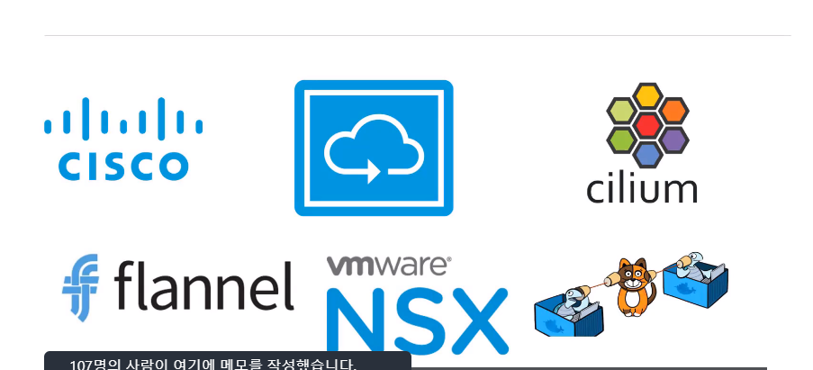
- Fortunately, we don't have to set it up all on our own as there are multiple pre-built solutions available.
- Some of them are the CISCO, FLANNEL, etc. Depending on the platform you're deploying your Kubernetes cluster on, you may use one of these solutions.
- For example, if you were setting up a Kubernetes cluster from scratch on your own systems, you may use any of the solutions like Kalikow or flannel, etc.
- If your were deploying on VM ware environment, NSX may be a good option.
- If you look at the play with KS labs, they use Weave net as their networking solution.
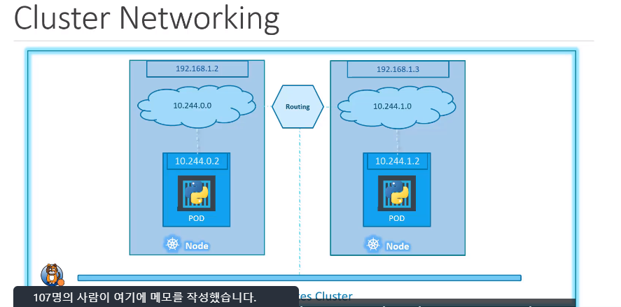
- Back to our cluster with the custom networking, either Flannel or Calico setup.
- It now manages the networks and IP in my nodes and assigns a different network address for each network in the nodes.
- This creates a virtual network of all pods and nodes where they are all assigned a unique IP address.
- And by using simple routing techniques, the cluster networking enables communication between the different pods or nodes to meet the networking requirements of Kubernetes.
- That's all the pods. Now can communicate to each other using the assigned IP address.
