# \[Section 8\]: Services
# 38. Services - NodePort
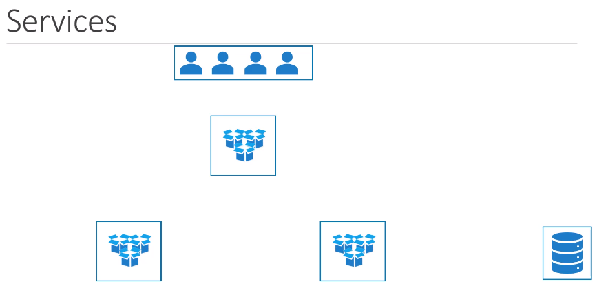
- Kubernetes services enable communication between various components within and outside of the application.
- Kubernetes services helps us connect applications together with other applications or users.
- For example our application has groups of pods running various sections such as a group for serving our frontend, load to users and other group for running backend processes and a third group connecting to an external data source.
- It is services that enabvle connectivity between these groups of pods.
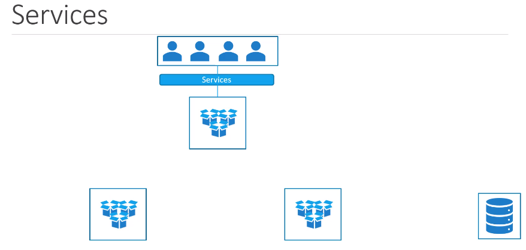
- Services enable the frontend application to be made available to enter users.
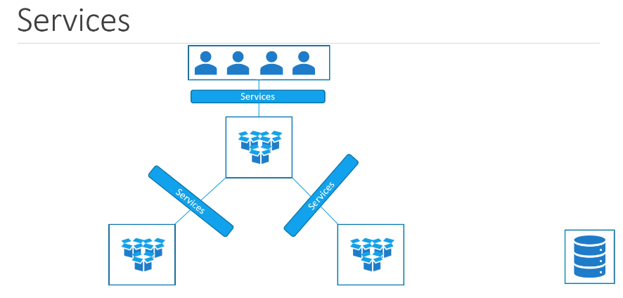
- It helps communication between backend and frontend pods.
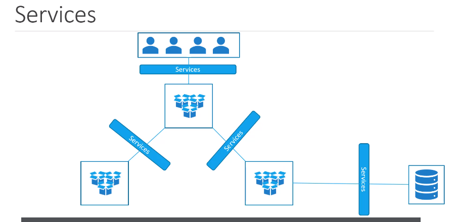
- And helps in establishing connectivity to an external data source.
- Thus, Services enable loose coupling between Microservices in our application.
## One use case of Services
- So far we talked about how pods communicate with each other through internal networking. Let's look at some other aspects of networking.
### 🔰 Let's start with external communication
- So we deployed our pod having a Web Application running on it. How do we as an external user access the Web page.
	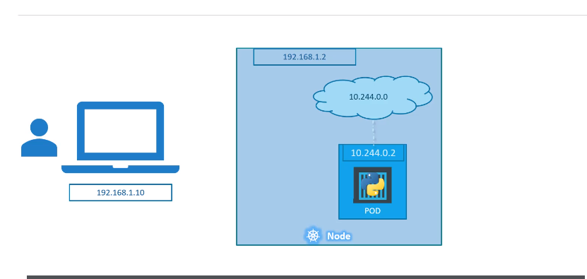
	- First of all, let's look at the existing setup, the Kubernetes node has an IP address and that is 192.168.1.2, my laptop is on the same network as well. So it has IP address 192.168.1.10.
	- The internal pod network is in the range 10.244.0.0 and pod has IP 10.244.0.2
	- Clearly, I cannot pong or access the pod at address 10.244.0.2 as it's in a separate network. So what are the options to see the web page?
	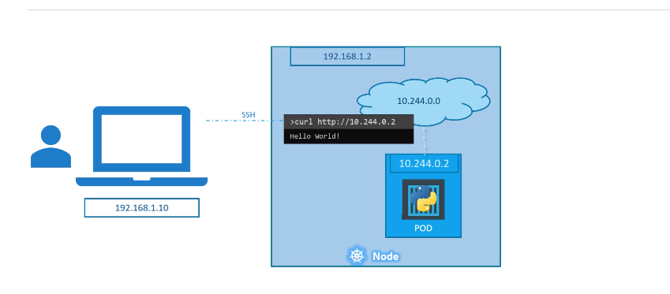
	- If we were to SSH into the Kubernetes node at 102.1689.1.2 from the node we would be able to access the pods web page by doing a CURL or the node has a GUI. we would fire up a browser and see the web page in a browser following the address http://10.244.0.2.
	- ⇒ But, this is from inside the Kubernetes node, that's not what I really want.
	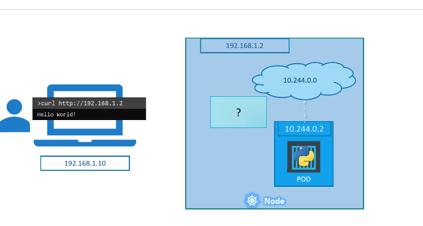
	- ⇒ I want to be able to access the web server from my own laptop without having to SSH into the node and simply by accessing the IP of the Kubernetes node.
- ⇒ So, we need something in the middle to help us map request to the node from our laptop through the node to the pod running the web container.
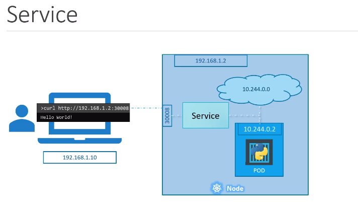
- This is where the Kubernetes service comes into play.
- the Kubernetes service is an object just like pods, Replica Sets or Deployments that we worked with before.
- One of its use case is to listen to a port on the node and forward request on that port to a port on the pod running the Web Application.
- This type of service is known as a node port service because the service listens to port on the node and forward requests to the pods.
## Service Types
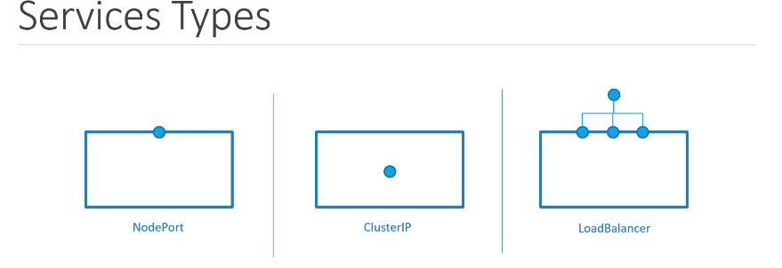
1. The first one is what we discussed already. `Node port`, when the service makes an internal pod accessible on a port on the node.
2. `ClusterIP`, in this case the service creates a virtual IP inside the cluster to enable communication between different services such as a set of frontend servers to a set of backend servers.
3. `LoadBalacer` where it provisions a load balancer for our application in supported cloud providers.
- A good example of that will be to distribute load across to different web servers in your frontend tier.

> 💡 We will now look at each of these in a bit more detail along with some demos. In this lecture, we will discuss about the node port Kubernetes service. Getting back to Node port few slide back.

## Node port
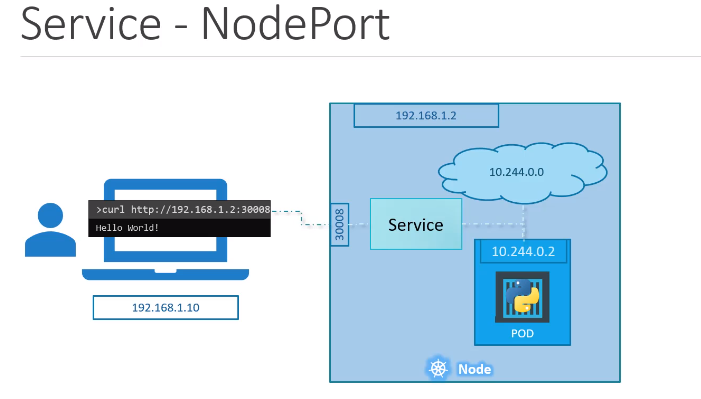
- We discussed about external access to the application. We said that a service can help us by mapping a port on the node to a port on the pod.
### 🔰 Let's take a closer look at the service
- If you look at it here are three port involved.
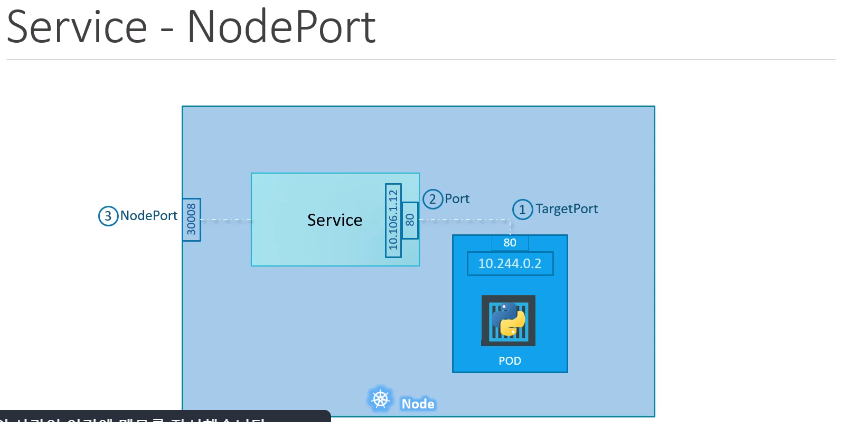
1. The `port on the pod` where the actual Web Server is running is 80. It is referred to as the `target port`. Because that is where the service forwards the request too.
2. The second port is the `port on the service` itself. It is simply referred to as the `port`. Remember, these terms are from the viewpoint of the service. The service is in fact like a virtual server inside the node. Inside the cluster, It has its own IP address and that IP address is called the cluster IP of the service.
3. Finally we have the `port on the node` itself which we use to access the Web Server externally and that is known as the `node port`(30008). That is because node ports can only be in a valid range which by default is from 30000 to 32767.
### 🔰 How to create service?
- We will use a definition file to create a service the high level structure of the file remains the same.
- The API version is going to be v1, the kind is of course service, the metadata will have a name and that will be the name of the service. (It can have labels but we don't need that for now)
- `spec`: This is the most crucial part of the file and that's where we will be defining the actual services, And this is the part of a definition file that differs between different objects.
	- `type`: refers to the type of service we are creating. As discussed before it could be cluster IP, Node port, LoadBalancer. In this case since we are creating a Node port we will said it has Node port.
	- `ports`: This is where we input information regarding what we discussed on the left side of the screen. Also ports is an array, So -(dash) under the ports section that indicates the first element in the array you can have multiple such port mappings within a single service.
		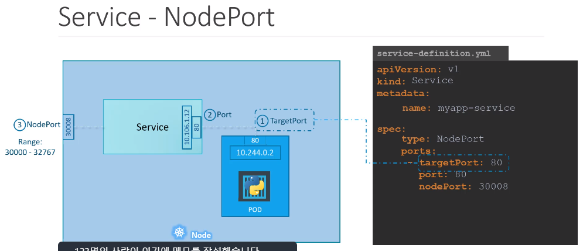
		- `targetPort`: Which we will set to 80
		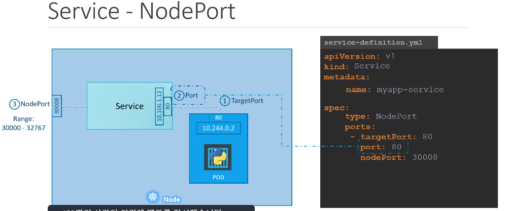
		- `port`: Simply port, which is a port on the service object, And we will set that to 80 as well.
		
		- `nodePort`: Which we will set to 30008 or any number in the valid range.

> 💡 **Remember, that out of these the only mandatory field is ****`port`.<br>**If you don't provide a target port it is assumed to be the same as port. And If you don't provide Node port, a free port in the valid range between 30000\~32767 is automatically allocated.

### 🔰 Something missing
- There is nothing here in the definition file that connects the service to the pod.
- We have simply specified the target port but we didn't mention the target port on which pod.
- There could be hundreds of other pods with Web Services running on port 80.
- So how do we do that? As we did with the Replica Sets previously and a technique that you will see very often in Kubernetes, We will use labels and selectors too link these together.
- We know that the pod was created with a label, We need to bring that label into the service definition file.
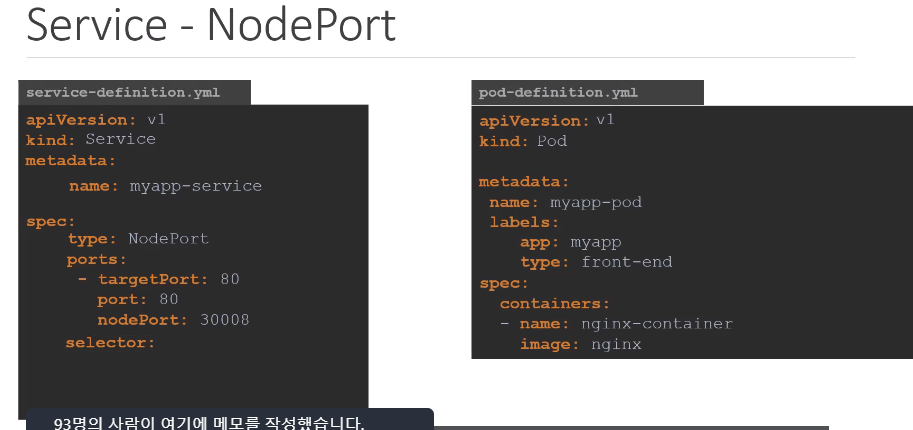
- So we have a new property in the specs section and that is called `selector`, just like in a Replica Set and deployment definition files.
- Under the selector, provide a list of labels to identify the pod, for this referred to the pod-definition file used to create the pod.
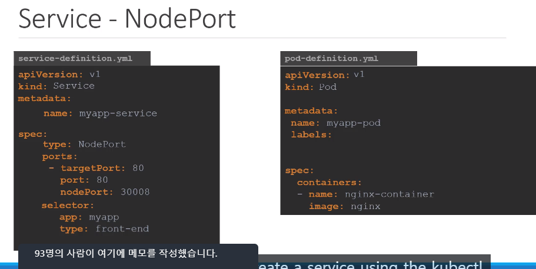
- Pull the lables from the pod-definition file and place it under the selector section.
- This links the service to the pod.
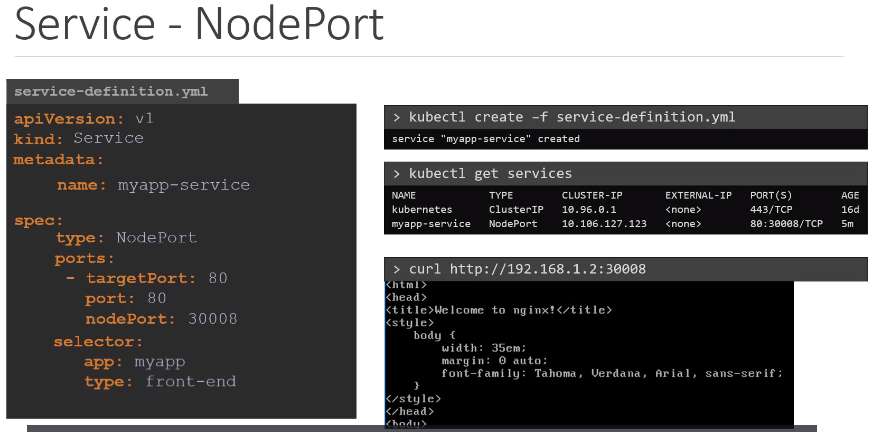
```shell
kubectl create -f service-definition.yml
```
- Once done, create a service using the `kubectl create` command and input the service-definition file. And threre you have the service created.
```shell
kubectl get services
```
- To see the created service run `kubectl get services` command that list the service the cluster IP and the map ports. The type is node port as we created. And the port on the node is set to 30008 because that's the port that we specified in the definition file.
```shell
curl http://192.168.1.2:30008
```
- We can now use this port to access the web service using CURL or a Web browser. So CURL to 192.168.1.2 which is the IP of the node and then I use the port 30008 to access the web server.
### 🔰 What do you do when you have multiple pods?
- So far, we talked about a service mapped to a single pod. But that's not the case all the time.
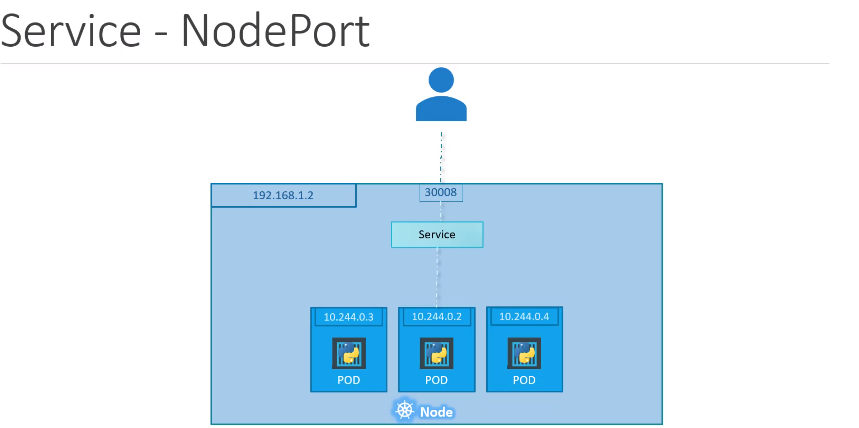
- In the production environment, you have multiple instances of your web application running for higher availability and load balancing purposes.
- In this case, we have multiple similar pods running our application.
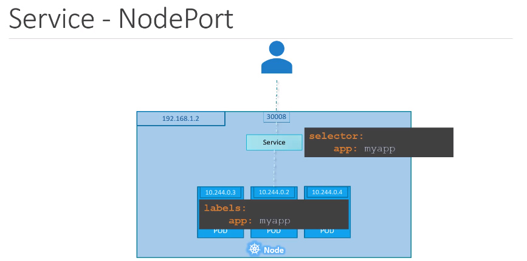
- They all have the same labels with a key app and a set to a value of myapp the same label is used as a selector during the creation of the service.
- So when the service is created it looks for a matching pod with the label and finds three of them.
- Then service then automatically selects all the three pods as endpoints to forward the external requests coming from the user.
- You don't have to do any additional configuration to make this happen.
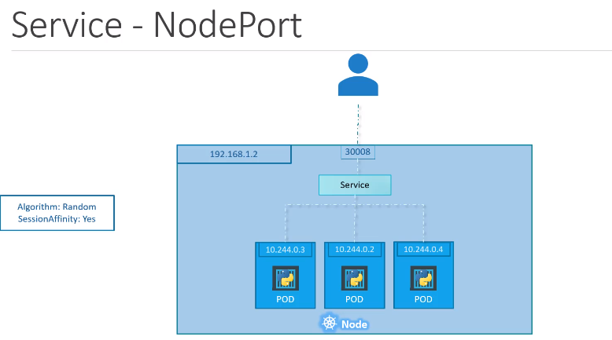
- And If you're wondering what algorithm it uses to balance the load across the three different pods, it uses a random algorithm.
- Thus, the service acts as a build in LoadBalancer to distribute load across different pods.
### 🔰 Let's look at what happens when the pods are distributed across multiple nodes
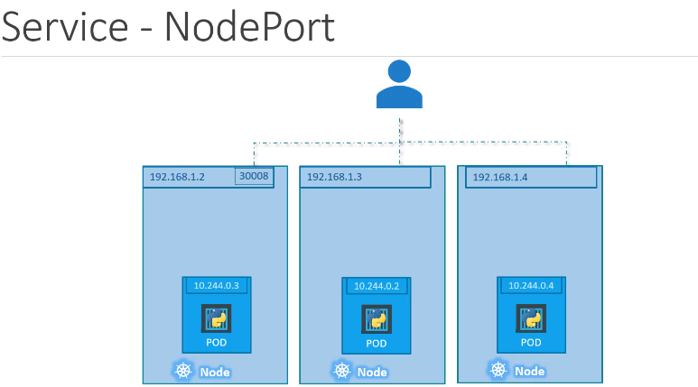
- In this case, We have the web application on pods on separate nodes in the cluster.
	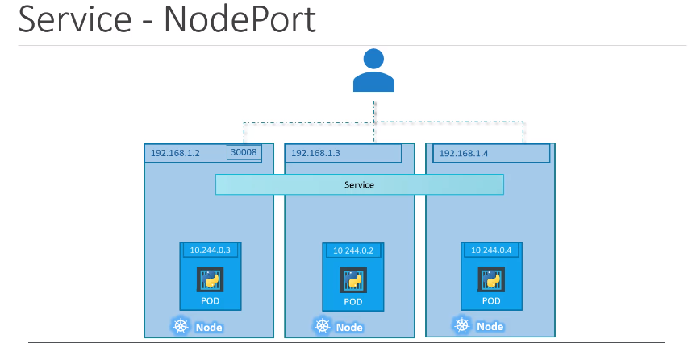
- When we create a service without us having to do any additional configuration, Kubernetes automatically creates a service that spans across all the nodes in the cluster and maps that target port to the same Node port on all the nodes in the cluster.
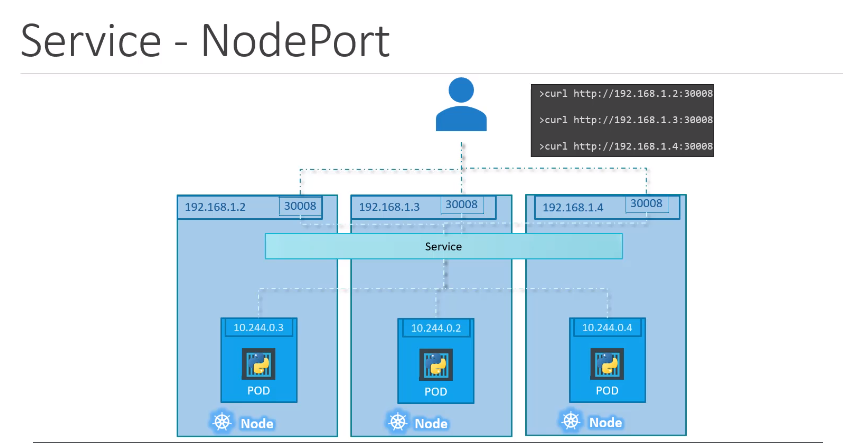
- This way you can access your application using the IP of any node in the cluster and using the same port number which in this case is 30008 as you can see using the IP of any of these. 
- To summarize, in any case whether it be a single pod on a single node, multiple pods on a single node, or multiple pods on multiple nodes. The service is created exactly the same without you having to do any additional steps during the service creation.
- When pods are removed or added, The service is automatically updated making its highly flexible and adaptive.
- Once created, you won't typically have to make any additional configuration changes.
# 39. Demo - Services
- 생략
# 40. Services - ClusterIP
## Kubernetes ClusterIP
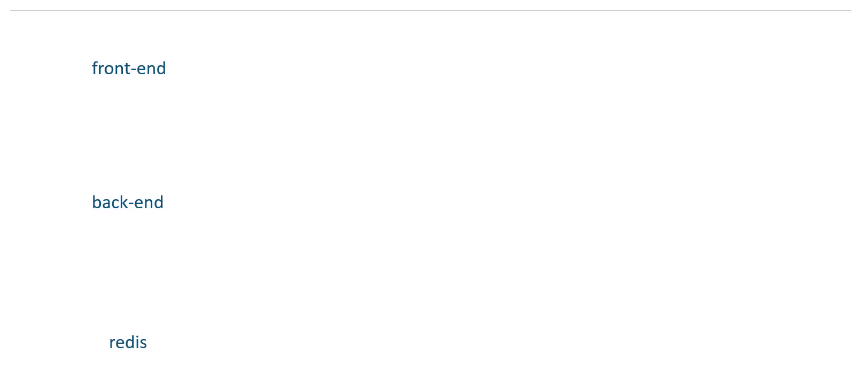
- A full stack Web application typically has different kinds of pods hosting different parts of an application.
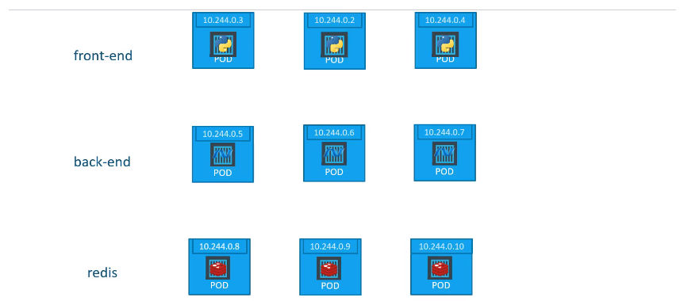
- You may have a number of pads running a frontend Web server.
- Another set of pods running a back in server, a set of pods running a key value store like Redis and another set of pods. Maybe running a persistent Database like MySQL.
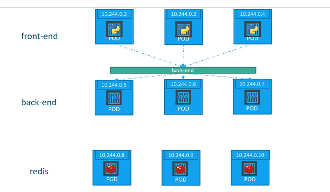
- The Web frontend server needs to communicate to the backend servers and the backend servers need to communicate to the database as well as the Redis services, etc.
- So what is the right way to establish connectivity between these services or tiers of my application?
- The pods all have an IP address assigned to them, as we can see on the screen. But, these IP, as we know, are not static.
- These pods can go down anytime and new pods are created all the time.
- And so you cannot rely on these IP addresses for internal communication between the application.
- Also, what if the first frontend pod at 10.244.0.3 need to connect to a backend service.
### 🔰 Which of the three would it go to and who makes that decision?
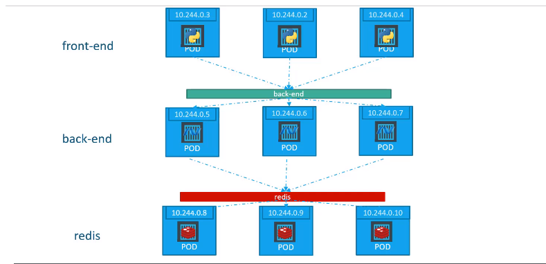
- A Kubernetes service can help us group the pods together and provide a single interface to access pods in a group.
- For example, a service created for the Backend pods will help group all the Backend pods together and provide a single interface for other pods to access to service.
- The requests are forwarded to one of the pods under the service randomly.
- Similarly, create additional services for Redis and allow the Backend pods to access the Redis systems through the service.
- This enables us to easily and effectively deploy a Microservices based application on Kubernetes Cluster.
- Each layer can now scale or move as required without impacting communication between the various services.
- Each service gets an IP, name assigned to it inside the cluster, and that is the name that should be used by other pods to access the service.
- This type of service is known as ClusterIP.
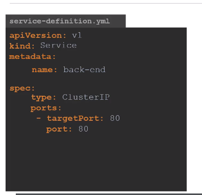
- To create such a service, as always, use a definition file in the service definition file first used to default template which has API version, kind, metadata, spec.
- `spec: type`: ClusterIP is the default type. So even if you didn't specify it , it will automatically assume the type to be ClusterIP.
- `ports: targetPort`: The port where the Backend is exposed, which in this case is 80.
- `ports: port`: Where the service is exposed, which is 80 as well
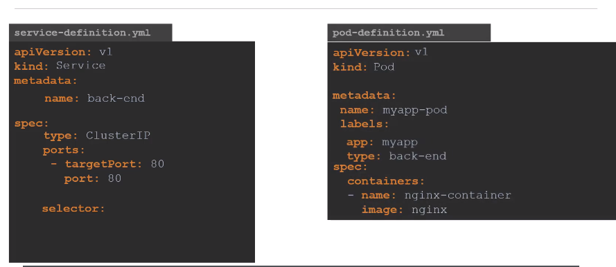
- To link the service to a set of pods, we use `Selector`.
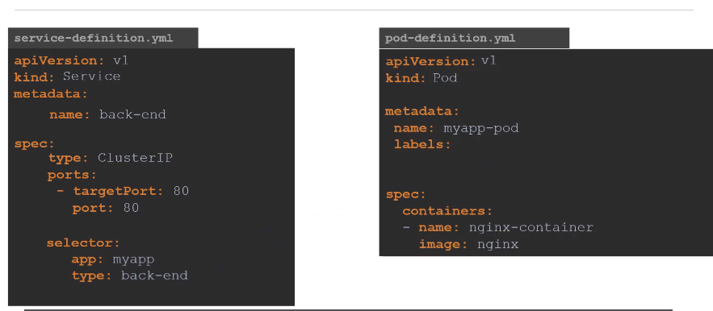
- We will refer to the pod-definition file and copy the Labels from it and move it under Selector.
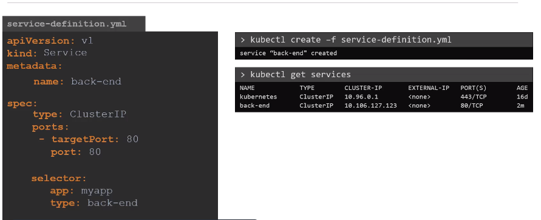
```shell
kubectl create -f service-definition.yml

kubectl get services
```
- We can now create the service using the `kubectl` control, `create` command and then check its status using `kubectl get services` command.
- The service can be accessed by other pods using the ClusterIP or the service name.
# 41. Services - Load Balancer
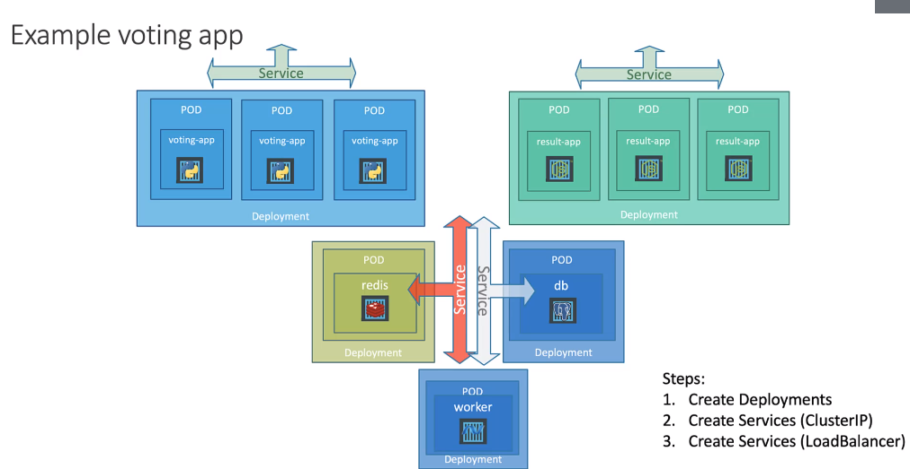
- So we have seen the NodePort service that helps us make an external facing application available on a port on the worker nodes.
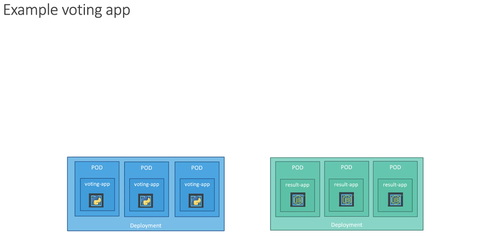
- So, let's turn out focus to the Frontend application, which are the voting-app and the result-app.
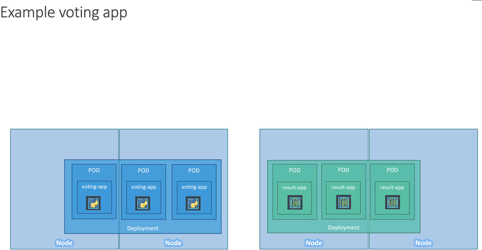
- Now, we know that these pods are hosted on the worker nodes in a cluster. Let's say we have a four node cluster.
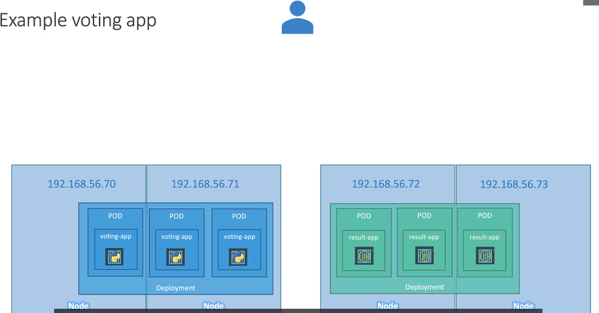
- And to make the applications accessible to external users, we create these services of type NodePort.
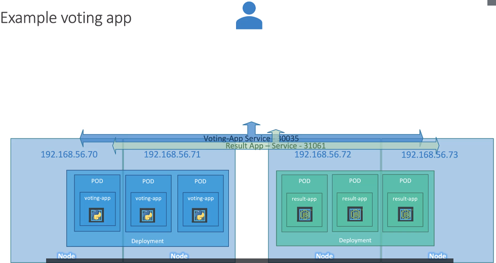
- Now, the services with type NodePort help in receiving traffic on the ports on the nodes, and routing the traffic to the respoective pods.
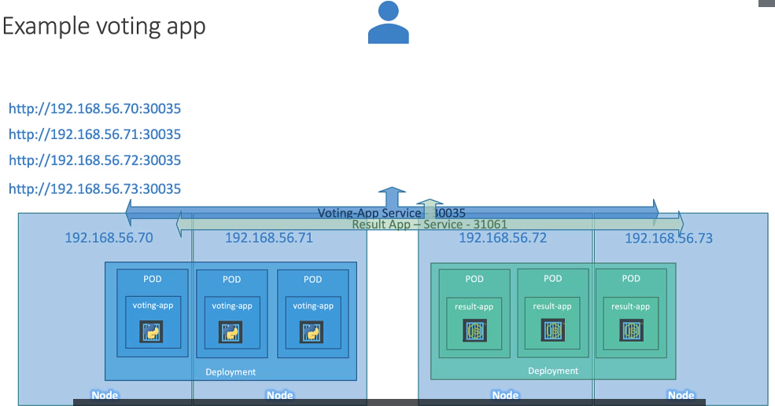
- But what URL would you give yours and users to access the applications, and you could access any of these two applications using IP of any of the nodes and the high port.
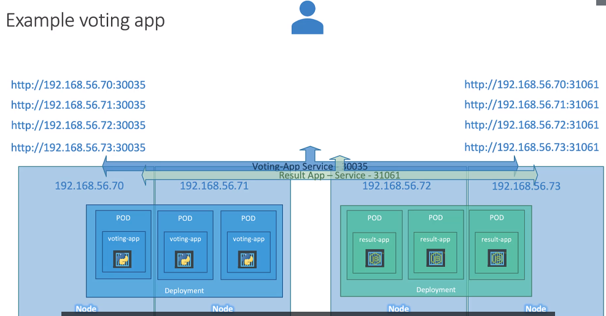
- The services exposed on, so that would be 4 IP and port combinations for the voting-app and 4 IP and port combination for the result-app.
- So note that, even if your pods are only hosted on two of the nodes, there will still be accessible on the IP of all the nodes in the cluster.
- Say the pods for the voting-app are only deployed on the nodes with IP 70 and 71. There would still be accessible on the ports of all the nodes in the cluster. So that's how our service is configured.
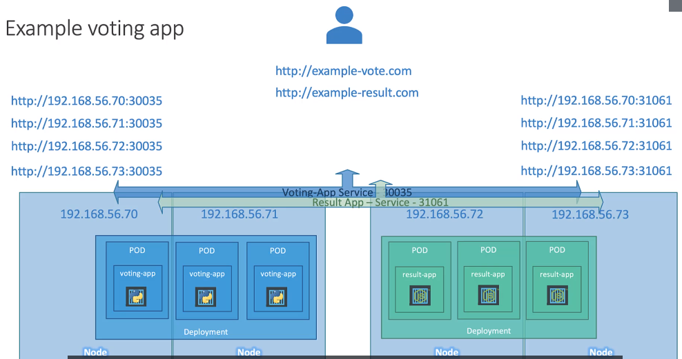
- So you would share these URLs to your users to access the application. But that's not what the end users want.
- They need a single URL like example, [voting-app.com](http://voting-app.com) or the example a [result-app.com](http://result-app.com) to access the application.
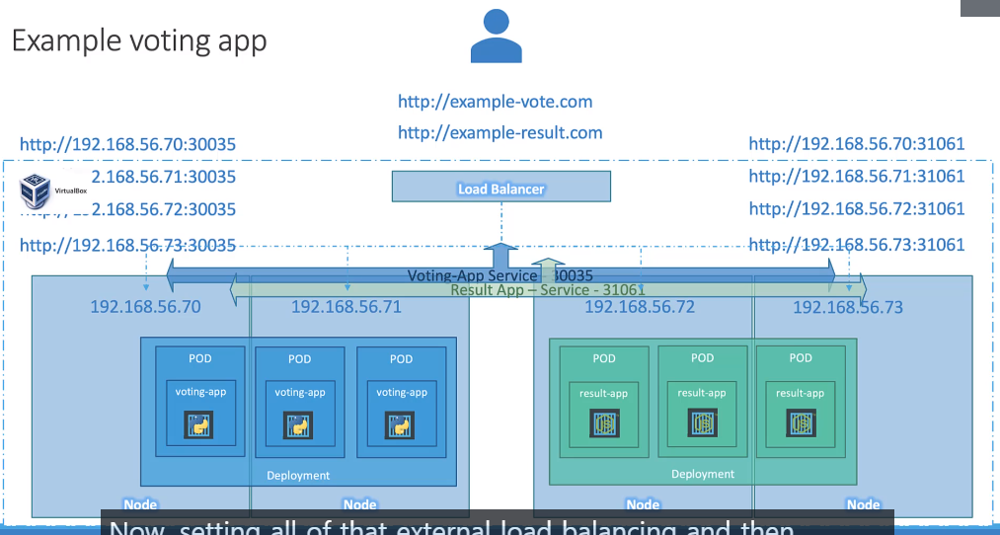
- So how do you achieve that?
	1. To achieve this is to create a new VM for a LoadBalancer purpose and install and configure a suitable LoadBalancer on it like a proxy or Nginx, etc.
	2. Then, configure the LoadBalancer to route traffic to the underlying nodes.
Now, setting all of that external load balancing and then maintaining and managing that can be a tedious task.
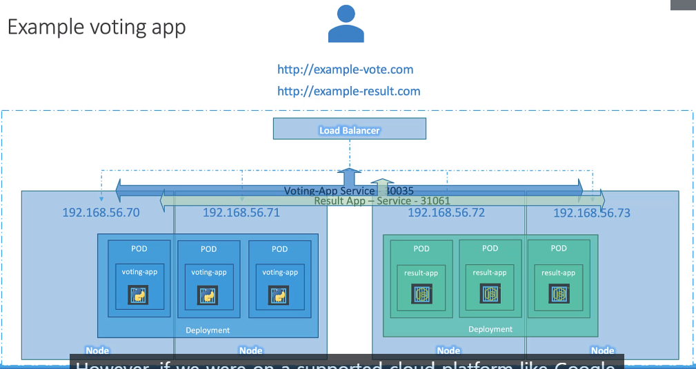
- However, if we were on a supported Cloud Platform like Google Cloud or AWS or Azure, I could leverage the native LoadBalancer off that Cloud Platform.
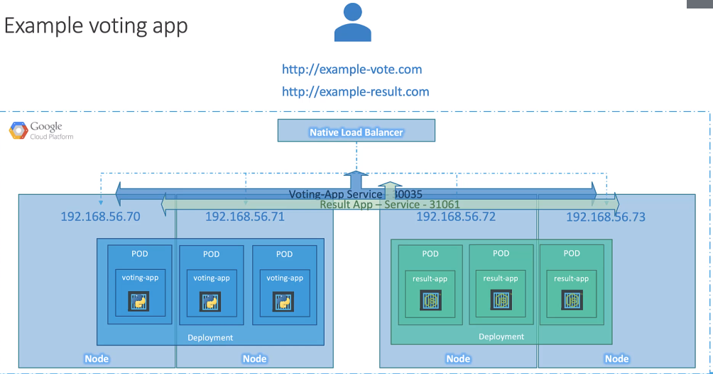
- Kubernetes has support for integrating with the native LoadBalancer of certain Cloud Providers and configuring and configuring that for us.
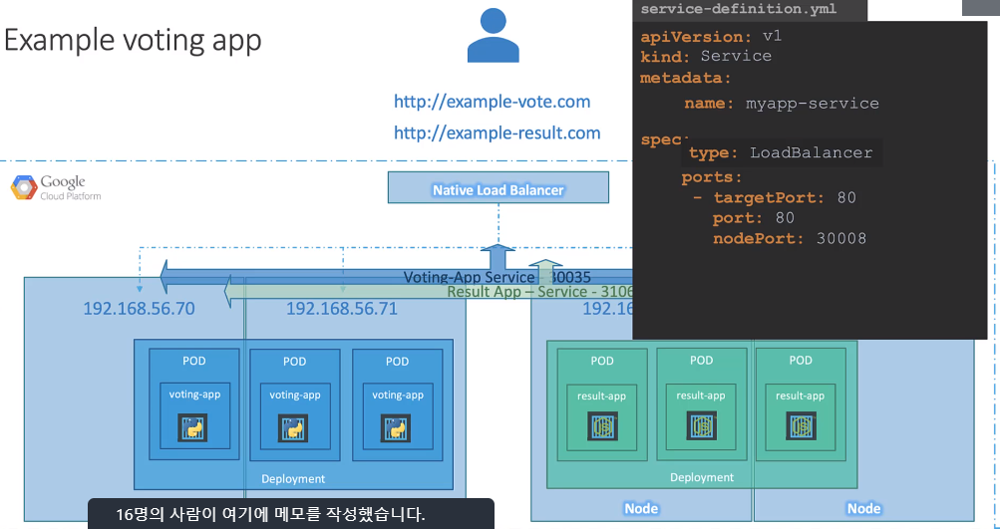
- So all you need to do is set the service type for the Frontend services to LoadBalancer instead of NodePort.

> 💡 Now remember that this only works with support Cloud Platforms. So GCP, AWS or AZURE are definitely supported.

- So If you set the type of service to LoadBalancer, In an unsupportive environment like a virtual box, or you know, any other environment, then it would have the same effect as setting a two NodePort, where you know, the services are exposed on a high end port on the nodes. It just won't do any kind of external LoadBalancer configuration.
- So later on, when we walked through the demos of deploying our application on Cloud Platforms, we will see this in action.
# 42. Hands-On Labs
- **Introduction:** Let us now add values for selector. We need to link the Service to the PODs created by the deployment.** Instruction: **Given the `deployment-definition.yml` file we created in the previous Section. Copy the appropriate** labels **and paste it under **selector** section of `service-definition.yml` file.
```yaml
// deployment-definition.yml
apiVersion: apps/v1
kind: Deployment
metadata:
  name: frontend
  labels:
    app: mywebsite
    tier: frontend
spec:
  replicas: 4
  template:
    metadata:
      name: myapp-pod
      labels:
        app: myapp
    spec:
      containers:
        - name: nginx
          image: nginx
  selector:
    matchLabels:
      app: myapp
```
```yaml
// service-definition.yml
apiVersion: v1
kind: Service
metadata:
  name: frontend
  labels:
    app: myapp
spec:
  type: NodePort
  ports:
    - port: 80
      targetPort: 80
  selector:
    app: myapp
```
- **Introduction:** Let us now try to create a `service-definition.yml` file from scratch. This time all in one go. You are tasked to create a service to enable the Frontend pods to access a Backend set of Pods. **Instruction: **User the information provided in the below table to create a Backend service definition file. Refer to the provided deployment-definition file for information regarding the PODs.
	- service Name: image-processing
	- labels: app ⇒ myapp
	- type: ClusterIP
	- Port on the service: 80
	- Port exposed by image processing container: 8080
```yaml
// deployment-definition.yml
apiVersion: apps/v1
kind: Deployment
metadata:
  name: image-processing-deployment
  labels:
    tier: backend
spec:
  replicas: 4
  template:
    metadata:
      name: image-processing-pod
      labels:
        tier: backend
    spec:
      containers:
        - name: mycustom-image-processing
          image: someorg/mycustom-image-processing
  selector:
    matchLabels:
      tier: backend
```
```yaml
// service-definition.yml
apiVersion: v1
kind: Service
metadata:
  name: image-processing
  labels:
    app: myapp
spec:
  # type: ClusterIP
  ports:
    - port: 80
      targetPort: 8080
  selector:
    tier: backend
```
# 43. Solution - Services
- [https://kodekloud.com/courses/1120660/lectures/24008540](https://kodekloud.com/courses/1120660/lectures/24008540)
# 44. Stay Updated!
- What is the type of the default kubernetes service? ⇒ `ClusterIP`
```shell
# kubectl get svc
--------------------------------
NAME         TYPE        CLUSTER-IP   EXTERNAL-IP   PORT(S)   AGE
kubernetes   ClusterIP   10.96.0.1    <none>        443/TCP   12m
```
- What is the targetPort configured on the kubernetes service? ⇒ `6443`
- How many labels are configured on the kubernetes service? ⇒ `2`
- How many Endpoints are attached on the kubernetes service? ⇒ `1`
```shell
# kubectl describe svc kubernetes 
--------------------------------
Name:              kubernetes
Namespace:         default
Labels:            component=apiserver
                   provider=kubernetes
Annotations:       <none>
Selector:          <none>
Type:              ClusterIP
IP Families:       <none>
IP:                10.96.0.1
IPs:               10.96.0.1
Port:              https  443/TCP
TargetPort:        6443/TCP
Endpoints:         10.245.128.8:6443
Session Affinity:  None
Events:            <none>
```
- How many Deployments exist on the system now? in the current(default) namespace ⇒ `1`
```shell
# kubectl get deployments.apps      
--------------------------------                    
NAME                       READY   UP-TO-DATE   AVAILABLE   AGE
simple-webapp-deployment   4/4     4            4           76s
```
- What is the image used to create the pods in the deployment? ⇒ `kodekloud/simple-webapp:red`
```shell
# kubectl describe deployments.apps simple-webapp-deployment  
--------------------------------   
Name:                   simple-webapp-deployment
Namespace:              default
CreationTimestamp:      Wed, 05 May 2021 09:11:49 +0000
Labels:                 <none>
Annotations:            deployment.kubernetes.io/revision: 1
Selector:               name=simple-webapp
Replicas:               4 desired | 4 updated | 4 total | 4 available | 0 unavailable
StrategyType:           RollingUpdate
MinReadySeconds:        0
RollingUpdateStrategy:  25% max unavailable, 25% max surge
Pod Template:
  Labels:  name=simple-webapp
  Containers:
   simple-webapp:
    Image:        kodekloud/simple-webapp:red
    Port:         8080/TCP
    Host Port:    0/TCP
    Environment:  <none>
    Mounts:       <none>
  Volumes:        <none>
Conditions:
  Type           Status  Reason
  ----           ------  ------
  Available      True    MinimumReplicasAvailable
  Progressing    True    NewReplicaSetAvailable
OldReplicaSets:  <none>
NewReplicaSet:   simple-webapp-deployment-b56f88b77 (4/4 replicas created)
Events:
  Type    Reason             Age   From                   Message
  ----    ------             ----  ----                   -------
  Normal  ScalingReplicaSet  116s  deployment-controller  Scaled up replica set simple-webapp-deployment-b56f88b77 to 4
```
```shell
// another way
# kubectl describe deployments.apps simple-webapp-deployment  | grep -i image 
--------------------------------   
    Image:        kodekloud/simple-webapp:red
```
- Are you able to accesss the Web App UI? Try to access the Web Application UI using the tab simple-webapp-ui above the terminal. ⇒ `NO`
]()
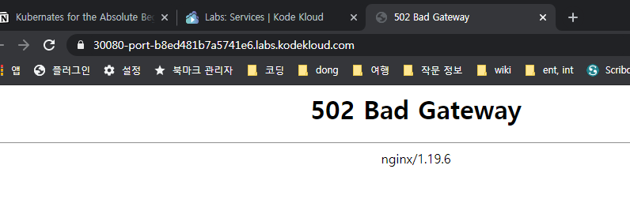

> 💡 ⇒ Now we have to create a new service to access the Web Application, so the reason we are not able to access is because we do not have a proper service configured for the deployment. So, Let's create a new deployment with these specs provided below.

- Create a new service to access the web application using the `service-definition-1.yaml` file
	- `Name:` webapp-service / `Type:` NodePort / `targetPort:` 8080 / `port:` 8080 / `nodePort:` 30080 / `selector:` simple-webapp
```shell
# kubectl expose deployment simple-webapp-deployment --name=webapp-service --target-port=8080 --type=NodePort --port=8080 --dry-run=client -o yaml > svc.yaml
--------------------------------   

# vi svc.yaml
--------------------------------   
apiVersion: v1
kind: Service
metadata:
  creationTimestamp: null
  name: webapp-service
spec:
  ports:
  - port: 8080
    protocol: TCP
    targetPort: 8080
    nodePort: 30080
  selector:
    name: simple-webapp
  type: NodePort
status:
  loadBalancer: {}

# kubectl apply -f svc.yaml 
-------------------------------- 
service/webapp-service created
```
- Access the web application using the tab 'simple-webapp-ui' above the terminal window.
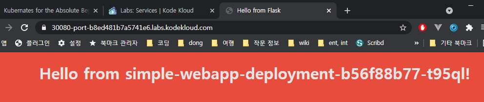
