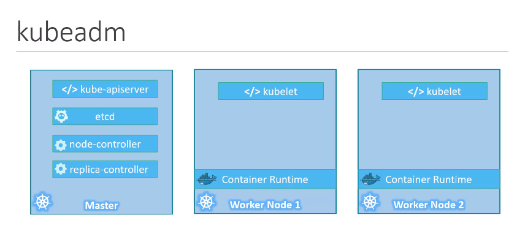
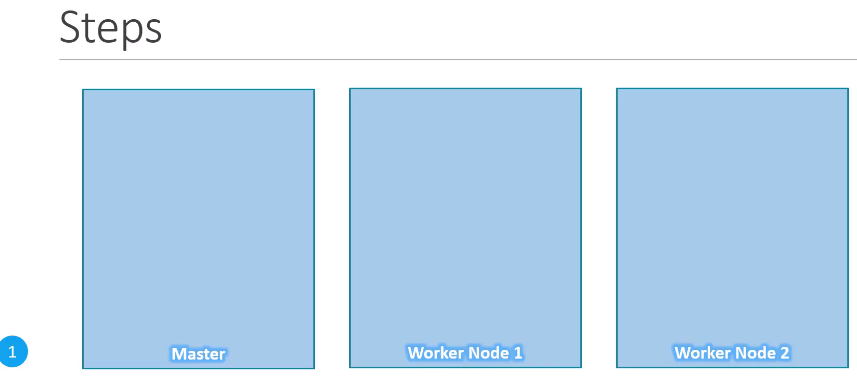
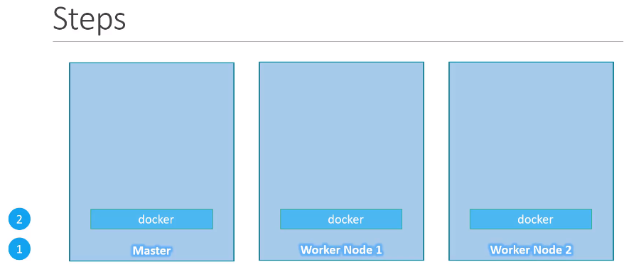
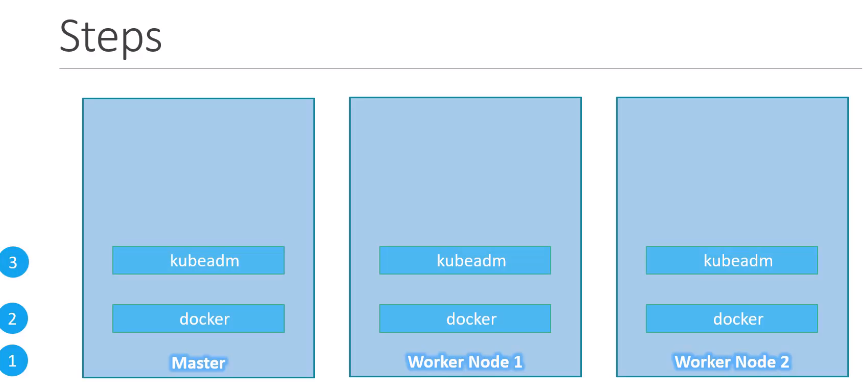
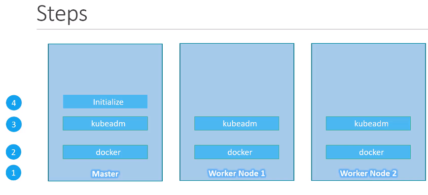
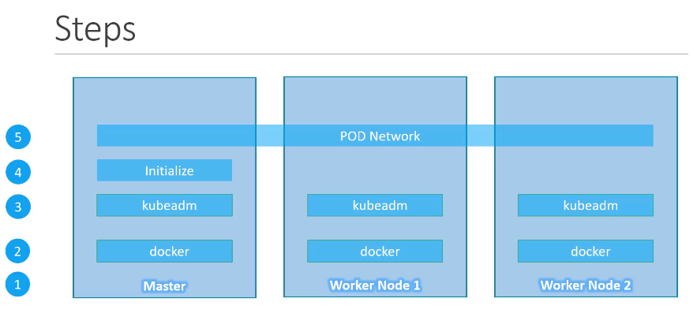
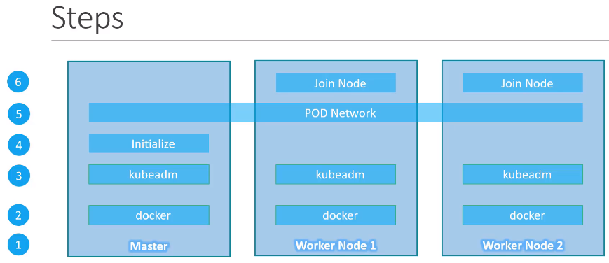

<table_of_contents color="gray"/>
# \[Section 12\]: Appendix - Setup Multi Node cluster using Kubeadm
# 57. Reference
- Oracle VirtualBox:  [https://www.virtualbox.org/](https://www.virtualbox.org/)
- Vagrant: [https://www.vagrantup.com/](https://www.vagrantup.com/)
- Link to download VM images: [http://osboxes.org/](http://osboxes.org/)
- Link to kubeadm installation instructions: [https://kubernetes.io/docs/setup/independent/install-kubeadm/](https://kubernetes.io/docs/setup/independent/install-kubeadm/)
- The link to Vagrant file:[https://github.com/kodekloudhub/certified-kubernetes-administrator-course](https://github.com/kodekloudhub/certified-kubernetes-administrator-course)
- If you are new to VirtualBox or Vagrant, please follow this pre-requisites course to learn about it: [https://www.youtube.com/watch?v=Wvf0mBNGjXY](https://www.youtube.com/watch?v=Wvf0mBNGjXY)
# 58. Kubernetes Setup - Kubeadm
- In this lecture, we will look at the `kubeadm` tool, which can be used to bootstrap a Kubernetes Cluster.
- The `kubeadm` tool helps us set up a multi node cluster following the Kubenetes best practices.

- The Kubernetes cluster consist of various components, such as the kube-apiServer, ETCD, controller, etc.
- And we've seen some of the requirements are on security and certificates to enable communication between these components, installing all of these various components individually on different nodes and modifying the configuration files to make sure these components point to each other. And setting up certificates to make it work is a tedious task. 
- The `kubeadm` tool helps us by taking care of all of those tasks.
- Let's go through the steps to set up a Kubernetes Cluster, using the `kubeadm` tool at a high level.
	
	1. First you must have multiple systems or virtual machines provisioned for configuring a cluster. We will see how to set up your laptop to do just that. That's if you're not familiar with it.
		- Once the systems are created, designate one node as master and others as worker nodes.
			
	2. The next step is to install a container runtime on the hosts. We will be using Docker. So we must install Docker on all the nodes.
		
	3. The next step is to install `kubeadm` tool on all the nodes, the `kubeadm` tool helps us bootstrap the Kubernetes solution by installing and configuring all the required components in the right nodes in the right order.
		
	4. The Next step is to initialize the master server during this process. All the required components are installed and configured on the master server.
		- Once the master is initialized and before joining the worker nodes to the master, you must ensure that the network prerequisitites are met.
		- And normal network connectivity between the systems is not sufficient for this.
		
	5. Kubernetes requires a special networking solution between the master and worker nodes, which is called as the Pod network.
		
	6. The last step is to join the worker nodes to the master node. Then all set to launch our application in the Kubernetes environment.
# 59. Demo - Setup Lab - VirtualBox
<callout icon="💡" color="gray_bg">
	- vagrant오류 : Stderr: VBoxManage.exe: error: Could not rename the directory   - [https://github.com/hashicorp/vagrant/issues/2813](https://github.com/hashicorp/vagrant/issues/2813) - vagrant timeout 오류   - [https://stackoverflow.com/questions/23293071/timed-out-while-waiting-for-the-machine-to-boot-when-vagrant-up](https://stackoverflow.com/questions/23293071/timed-out-while-waiting-for-the-machine-to-boot-when-vagrant-up) - 바이오스 vm 설정   - [https://lng1982.tistory.com/257](https://lng1982.tistory.com/257)
</callout>
# 60. Demo - Provision cluster using Kubeadm
